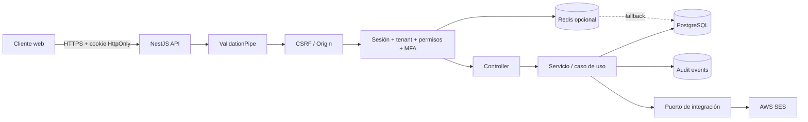
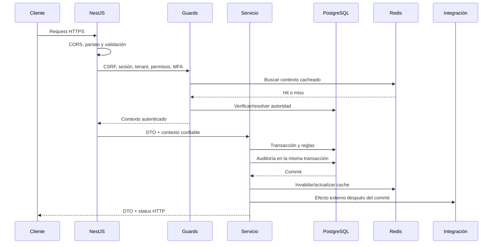

# Arquitectura y reglas del backend

> Guía obligatoria para desarrollar y revisar `apps/api`.
>
> Este documento parte del código existente a agosto de 2026. Distingue entre la
> arquitectura vigente, las reglas que deben conservarse y las brechas que aún
> deben corregirse. Si el código y este documento difieren, se debe revisar la
> intención del cambio y actualizar ambos en el mismo pull request.

## 1. Objetivo

El backend debe ser:

- seguro por defecto;
- multi-tenant sin fugas entre organizaciones;
- predecible en contratos HTTP y errores;
- consistente ante concurrencia y fallos parciales;
- observable y auditable;
- sencillo de modificar, probar y operar.

La arquitectura preferida es un monolito modular NestJS. No se deben introducir
microservicios, CQRS, buses internos, repositorios genéricos ni capas adicionales
sin un problema medido que el diseño actual no pueda resolver.

## 2. Estado actual

### Stack

- NestJS 11 y Express.
- TypeScript.
- TypeORM y PostgreSQL como persistencia durable.
- Redis opcional para cache de sesión y autorización.
- `class-validator` y `class-transformer` para validar entradas.
- Sesiones opacas mediante cookie `HttpOnly`.
- RBAC por permisos y contexto de organización.
- TOTP como segundo factor.
- HashiCorp Vault mediante `@hemia/secrets`, con variables locales para
  desarrollo.
- AWS SESv2 detrás de un puerto de entrega de correo.
- Jest y Supertest.

### Módulos existentes

| Área              | Responsabilidad                                            |
| ----------------- | ---------------------------------------------------------- |
| `auth`            | Registro, verificación de correo, login, MFA y logout.     |
| `sessions`        | Crear, resolver, rotar, expirar y revocar sesiones.        |
| `users`           | Identidad global y administración de miembros por tenant.  |
| `organizations`   | Organización o tenant.                                     |
| `memberships`     | Relación usuario-organización, rol y estado.               |
| `permissions`     | Catálogo de permisos, roles y asignaciones.                |
| `subscriptions`   | Estado inicial de suscripción y trial.                     |
| `audit`           | Registro durable de decisiones y acciones sensibles.       |
| `redis`           | Cliente opcional y cache de sesión/autorización.           |
| `email`           | Casos de envío y adaptador SES.                            |
| `secrets`         | Resolución de secretos locales o desde Vault.              |
| `client-accounts` | Cuentas cliente, RFC, asignaciones, ejercicios y períodos. |

### Diagrama de alto nivel



### Fuente de verdad

- PostgreSQL es la fuente durable de usuarios, tenants, membresías, roles,
  permisos, sesiones, MFA, límites y auditoría.
- Redis es una optimización prescindible. Una caída de Redis no debe invalidar
  datos ni impedir el fallback a PostgreSQL.
- Nunca se debe considerar un dato cacheado como autoridad para una escritura.
- Los secretos provienen de Vault en ambientes configurados para ello. No deben
  persistirse en base de datos, Redis, logs o respuestas.

## 3. Estructura que debe seguir cada módulo

La unidad principal es el módulo funcional, no una carpeta global por tipo.

```text
src/modules/<feature>/
  <feature>.module.ts
  <feature>.controller.ts       # sólo si expone HTTP
  <feature>.service.ts          # orquestación y reglas del caso de uso
  dtos/                         # entrada y salida del contrato HTTP
  entities/                     # entidades propiedad del módulo
  mappers/                      # sólo si evita exponer entidades
  ports/                        # sólo para una frontera externa real
  adapters/                     # implementación de un puerto real
  types/                        # tipos compartidos dentro del módulo
```

No todas las carpetas son obligatorias. Se crean cuando existe contenido real.
Un módulo pequeño puede tener únicamente módulo, controlador, servicio y
entidad. Se debe reutilizar primero una convención existente.

### Responsabilidad por capa

#### Controller

Debe:

- declarar ruta, verbo, status HTTP, DTOs y guards;
- obtener la sesión o el tenant mediante decoradores;
- delegar inmediatamente al servicio;
- devolver un DTO o un objeto de respuesta explícito.

No debe:

- consultar repositorios;
- contener reglas de negocio;
- decidir permisos con `if` manuales;
- confiar en un `organizationId` enviado por el cliente;
- devolver entidades TypeORM;
- capturar errores sólo para volver a lanzarlos.

#### Service o caso de uso

Debe:

- aplicar reglas del negocio;
- delimitar transacciones;
- obtener repositorios mediante inyección o `EntityManager`;
- lanzar excepciones NestJS con significado funcional;
- coordinar auditoría, invalidación de cache e integraciones.

Un servicio puede usar directamente repositorios TypeORM. No se debe crear una
capa de repositorio propia que sólo copie los métodos de TypeORM.

Cuando un servicio acumule casos de uso independientes y deje de ser fácil de
probar o revisar, se divide por flujo, no por abstracciones técnicas. Por
ejemplo: registro, login, MFA y cambio de tenant pueden ser servicios separados
que sigan perteneciendo a `AuthModule`.

#### Entity

Debe representar persistencia, restricciones e índices. No es el contrato
HTTP. Todo dato sensible debe marcarse con `select: false` cuando sea posible.

#### DTO y mapper

- Todo `body`, `query` y `param` debe validarse.
- Las entradas usan DTOs con límites explícitos.
- Los parámetros UUID usan `ParseUUIDPipe`.
- La salida se construye explícitamente con DTOs o mappers.
- Nunca usar `{ ...entity }` para construir una respuesta.

#### Port y adapter

Se usa sólo en fronteras con proveedores que realmente pueden cambiar o que se
deben sustituir en tests, como SES. Una interfaz con una única implementación
interna y sin frontera externa es complejidad innecesaria.

## 4. Flujo ideal de una petición



Orden obligatorio para una ruta privada de tenant:

1. El prefijo global versiona la ruta (`/api/v1`).
2. `ValidationPipe` transforma y rechaza campos no declarados.
3. El control CSRF valida peticiones inseguras basadas en cookie.
4. `SessionGuard` resuelve la cookie, sesión y autorización.
5. `TenantAccessGuard` exige un tenant activo.
6. `PermissionsGuard` exige todos los permisos declarados y, para permisos
   sensibles, una política MFA válida.
7. El controller pasa el DTO y `CurrentTenant` al servicio.
8. El servicio aplica reglas y transacciones.
9. El mapper crea la respuesta pública.
10. El filtro global normaliza cualquier error.

Ejemplo de controller:

```ts
@Controller("resources")
@UseGuards(SessionGuard, TenantAccessGuard, PermissionsGuard)
export class ResourcesController {
  constructor(private readonly resources: ResourcesService) {}

  @Post()
  @Permissions("resources.manage")
  create(
    @Body() input: CreateResourceDto,
    @CurrentTenant() tenant: SessionAuthorizationContext,
  ): Promise<ResourceResponseDto> {
    return this.resources.create(input, tenant.organizationId!);
  }
}
```

La clave de permiso del ejemplo debe existir primero en el catálogo y en el
seed. No se permiten strings de permisos inventados únicamente en un
controller.

## 5. Diseño del contrato HTTP

### Rutas y verbos

- Usar sustantivos plurales: `/users`, `/organizations`, `/invoices`.
- Usar rutas anidadas sólo cuando expresen pertenencia real.
- `GET`: lectura sin efectos observables.
- `POST`: creación o comando no idempotente.
- `PUT`: reemplazo completo de un recurso.
- `PATCH`: actualización parcial o transición parcial.
- `DELETE`: eliminación o revocación idempotente.
- Evitar verbos en URLs salvo comandos que no representan CRUD, por ejemplo
  `/auth/login` o `/periods/:id/close`.

Los cambios incompatibles se publican en una nueva versión. No se cambia el
significado de un campo o status existente silenciosamente.

### Status codes

| Caso                                       | Status                      |
| ------------------------------------------ | --------------------------- |
| Lectura o actualización exitosa            | `200`                       |
| Creación exitosa                           | `201`                       |
| Aceptado para proceso asíncrono            | `202`                       |
| Eliminación/revocación sin cuerpo          | `204`                       |
| DTO, estado o transición inválida          | `400`                       |
| Sin sesión o autenticación incompleta      | `401`                       |
| Sesión válida sin autorización             | `403`                       |
| Recurso inexistente o fuera del tenant     | `404`                       |
| Conflicto de unicidad o estado concurrente | `409`                       |
| Límite excedido                            | `429`                       |
| Error inesperado                           | `500` sin detalles internos |

Para evitar enumeración y fugas entre tenants, un recurso que no pertenece al
tenant activo normalmente responde `404`, no `403`.

### Respuestas

- Las fechas públicas usan ISO 8601 en UTC.
- Las listas de cardinalidad no acotada deben paginarse desde el inicio.
- El patrón actual de paginación es:

```json
{
  "items": [],
  "meta": {
    "page": 1,
    "limit": 20,
    "total": 0,
    "totalPages": 0
  }
}
```

- El límite máximo actual es 100.
- Los períodos son una excepción explícita: cada ejercicio contiene exactamente 12. Los ejercicios fiscales también están acotados por la regla 2000–año
  siguiente y pueden devolverse completos por entidad.
- No devolver `null`, campo ausente y string vacío indistintamente; el contrato
  debe escoger una semántica.
- No devolver hashes, tokens, secretos MFA, credenciales de proveedor ni datos
  internos de auditoría.

### Errores

El filtro global produce:

```json
{
  "statusCode": 400,
  "message": "Revisa los campos señalados e intenta de nuevo.",
  "error": "ValidationError",
  "code": "VALIDATION_ERROR",
  "fieldErrors": {
    "legalEntity.rfc": [
      "Ingresa un RFC válido de 12 o 13 caracteres, sin espacios ni guiones."
    ]
  },
  "path": "/api/v1/resource",
  "timestamp": "2026-08-26T00:00:00.000Z",
  "correlationId": "550e8400-e29b-41d4-a716-446655440000"
}
```

Reglas:

- `message` es legible y no expone implementación.
- `code` es estable y se usa cuando el frontend necesita decidir comportamiento.
- No hacer que el frontend dependa del texto de `message`.
- Los errores `5xx` se registran con stack en el servidor, pero el stack y el
  mensaje interno no salen al cliente.
- Validación, dominio y persistencia deben traducirse a status conocidos. No se
  debe convertir todo en `400`.

## 6. Multi-tenancy y autorización

Ésta es una regla de seguridad, no una conveniencia de filtrado.

### Identidad y tenant

- `User` es una identidad global.
- `Organization` es el tenant.
- `Membership` enlaza usuario, organización, rol y estado.
- La sesión contiene el tenant activo y la membresía activa.
- Los permisos se resuelven desde el rol de esa membresía.

### Reglas obligatorias

- El `organizationId` autorizado proviene de `request.tenantContext`.
- Si una ruta recibe un `organizationId`, se valida contra el contexto; no se
  usa directamente como autoridad.
- Toda consulta de datos tenant debe incluir `organizationId` en su condición o
  partir de una relación ya restringida por tenant.
- `id` por sí solo nunca es suficiente para leer, actualizar o eliminar un
  recurso tenant.
- Una escritura debe volver a comprobar pertenencia dentro de la transacción.
- No confiar en filtros del frontend.
- No reutilizar una entidad obtenida para un tenant en el contexto de otro.
- Cambiar de organización debe verificar membresía activa, rotar o actualizar
  el contexto de sesión e invalidar cache.

Ejemplo correcto:

```ts
await repository.findOne({
  where: { id: resourceId, organizationId },
});
```

Ejemplo incorrecto:

```ts
await repository.findOneBy({ id: resourceId });
```

### Permisos

- Los endpoints privados declaran `@Permissions(...)`.
- El catálogo vive en `common/auth/permission-catalog.ts`.
- Los roles agrupan permisos; el controller no comprueba nombres de rol.
- Todos los permisos declarados son requeridos.
- Agregar un permiso exige actualizar catálogo, metadatos, roles, seed y tests.
- Los permisos sensibles deben permanecer centralizados en
  `MFA_SENSITIVE_PERMISSION_KEYS`.

No usar `role === 'owner'` para autorizar una operación. El rol puede cambiar;
el permiso expresa la capacidad real.

## 7. Autenticación, sesión y MFA

### Estrategia vigente

La autenticación HTTP actual usa sesiones opacas, no JWT:

1. Se generan 32 bytes aleatorios.
2. El token crudo se entrega sólo en una cookie `HttpOnly`.
3. PostgreSQL almacena únicamente SHA-256 del token.
4. Redis puede cachear el contexto usando el hash como llave.
5. La sesión tiene expiración absoluta y por inactividad.
6. Acciones como completar o deshabilitar MFA rotan el token.
7. Logout, suspensión y revocación invalidan sesiones y cache.

El intervalo de persistencia de actividad siempre debe ser menor que el TTL de
inactividad. Redis mantiene la marca viva entre escrituras; si se pierde su
contenido, PostgreSQL admite únicamente una gracia igual al intervalo máximo de
persistencia para reconstruir el cache sin cerrar prematuramente una sesión. La
gracia nunca extiende la expiración absoluta.

La configuración JWT existente no debe usarse para crear un segundo sistema de
autenticación. Debe retirarse si se confirma que ningún consumidor la necesita,
o documentarse como un flujo independiente antes de implementarlo.

### Cookies

En producción:

- `HttpOnly=true` siempre;
- `Secure=true` siempre;
- preferir prefijo `__Host-`, `Path=/` y sin `Domain` cuando el despliegue lo
  permita;
- `SameSite=strict` o `lax` por defecto;
- `SameSite=none` sólo para una necesidad cross-site confirmada y siempre con
  `Secure`;
- el frontend usa `credentials: 'include'`;
- el borrado usa exactamente nombre, dominio, path, secure y same-site de la
  cookie original.

Nunca colocar tokens de sesión en query params, fragmentos de URL, localStorage,
logs o cuerpos de respuesta normales.

### Contraseñas

- Se validan y hashean únicamente en `PasswordService`.
- Bcrypt tiene un máximo práctico de 72 bytes; el servicio ya lo comprueba.
- `passwordHash` permanece con `select: false` y sólo se selecciona de forma
  explícita para verificar credenciales.
- Login devuelve el mismo error para usuario inexistente, inactivo, no
  verificado o contraseña incorrecta.
- Nunca registrar contraseña, hash o resultado detallado de autenticación.

### MFA

- El secreto TOTP se cifra con AES-256-GCM antes de persistirse.
- La llave proviene del sistema de secretos; una variable local es sólo fallback
  de desarrollo.
- La verificación debe impedir reutilizar el mismo contador TOTP.
- Setup, verificación y desactivación tienen rate limit y auditoría.
- Activar o desactivar MFA rota la sesión y revoca las otras sesiones.
- El secreto y `otpauthUri` se devuelven únicamente durante setup con
  `Cache-Control: no-store`.
- Los permisos sensibles exigen MFA configurado y verificado.

No registrar el secreto, código TOTP, URI de enrolamiento ni material cifrado.

### Rate limiting

- Auth debe conservar el throttling general.
- Login, registro, reenvío, confirmación y MFA requieren además límites por una
  combinación adecuada de IP, identidad, token o sesión.
- Las llaves de rate limit sensibles se almacenan hasheadas.
- Un límite no debe permitir enumerar si existe un correo.
- Debe definirse explícitamente `trust proxy` según la infraestructura. Sin ello,
  `request.ip` puede representar al balanceador o aceptar headers no confiables.
- Rutas costosas o expuestas públicamente fuera de auth deben tener límites
  propios.

## 8. CSRF, CORS y seguridad HTTP

### CSRF

Como la autenticación usa cookies, toda operación insegura (`POST`, `PUT`,
`PATCH`, `DELETE`) requiere protección CSRF.

La defensa actual valida `Origin` contra `APP_CORS_ORIGINS`. La política objetivo
en producción es:

- aceptar únicamente origins exactos configurados;
- canonicalizar cada entrada de `APP_CORS_ORIGINS` y rechazar protocolos no
  HTTP(S), credenciales, paths significativos, query o fragment;
- rechazar un `Origin` no permitido;
- para peticiones de navegador sin `Origin`, validar `Referer` o rechazar;
- si se habilita un flujo cross-site, incorporar token CSRF explícito además de
  `SameSite` y la validación de origin;
- no exentar rutas privadas individualmente sin justificarlo y probarlo.

`SameSite` y CORS ayudan, pero no sustituyen una política CSRF completa.

### CORS

- En producción, la lista de origins es obligatoria.
- No usar `*` con credenciales.
- Comparar origins completos, no sufijos ni expresiones permisivas.
- Mantener `credentials: true` sólo porque la autenticación usa cookie.
- Desarrollo puede ser más flexible; esa configuración no llega a producción.

### Headers y transporte

- TLS termina en un proxy confiable o en la aplicación; el tráfico público nunca
  usa HTTP plano.
- Agregar headers equivalentes a Helmet: HSTS, `X-Content-Type-Options`, política
  de framing y una política de referrer apropiada.
- Las respuestas con secretos temporales o datos de sesión usan
  `Cache-Control: no-store`.
- Definir límites explícitos de body y de archivos; no aceptar payloads sin
  límite.
- Validar tipo, tamaño y contenido de uploads; el MIME declarado no es prueba.

## 9. Validación y manejo de datos

El `ValidationPipe` global debe conservar:

```ts
new ValidationPipe({
  whitelist: true,
  forbidNonWhitelisted: true,
  transform: true,
});
```

Cada DTO debe considerar:

- tipo;
- requerido u opcional;
- mínimo y máximo;
- enum o formato;
- normalización (`trim`, lowercase) cuando tenga una semántica clara;
- conversión explícita de query strings numéricos;
- validación cruzada en el servicio si depende de más de un campo o del estado
  persistido.

No usar DTOs como única defensa. La base de datos también debe proteger
unicidad, nulabilidad, relaciones y estados que no pueden romperse.

Evitar regex complejas para formatos con validadores estándar disponibles. No
intentar “sanitizar SQL” manualmente: usar parámetros y APIs TypeORM.

## 10. Persistencia, transacciones y concurrencia

### Reglas de esquema

- `synchronize` permanece en `false` en todos los ambientes.
- Todo cambio de entidad que altere esquema incluye una migración revisada.
- Las migraciones son append-only después de ser aplicadas en un ambiente
  compartido.
- Cada FK lógica debe tener una FK real salvo una excepción documentada.
- Agregar índices para claves foráneas y patrones de consulta comprobados.
- Las restricciones únicas viven en PostgreSQL; el servicio traduce el conflicto
  a `409`.
- Usar `timestamptz` para instantes.
- Los seeds deben ser idempotentes.

No ejecutar migraciones destructivas sin una estrategia de compatibilidad y
respaldo. Para cambios grandes: expandir, desplegar código compatible, migrar
datos y finalmente contraer.

### Transacciones

Usar una transacción cuando una regla requiere que varias escrituras sucedan
todas o ninguna, por ejemplo:

- usuario + organización + membresía + suscripción + token de verificación;
- cambio de estado + auditoría;
- verificación MFA + rotación de sesión;
- revocación del último owner.

Dentro de una transacción se usa siempre el `EntityManager` recibido. No mezclar
repositorios globales con repositorios del manager.

No hacer llamadas HTTP, SES ni otros efectos remotos dentro de la transacción.
Primero commit; después cache e integración. Si el efecto externo es obligatorio
o debe reintentarse, usar un outbox transaccional antes de responder.

### Concurrencia

- Usar locks pesimistas en transiciones que pueden competir.
- Conservar restricciones de base de datos como última defensa.
- Diseñar comandos reintentables cuando sea posible.
- Verificación de tokens, cambio de owner, MFA y consumos únicos deben ser
  atómicos.
- No implementar “consultar y luego insertar” sin constraint o lock.

### Eliminación

Definir por recurso si se usa soft delete, revocación o borrado físico. No
mezclar las tres semánticas. En identidad y acceso se prefiere revocar para
conservar trazabilidad.

## 11. Cache y consistencia

- Redis no es obligatorio para la corrección.
- Cada key lleva prefijo por sistema y ambiente.
- El TTL de autorización nunca supera el TTL absoluto ni el TTL de inactividad
  de sesión.
- Un cambio de membresía, permisos, tenant, MFA o sesión invalida las keys
  afectadas.
- Un cache hit inválido se elimina y continúa por la fuente de verdad.
- No hacer `KEYS`; para limpiezas acotadas usar índices de keys o `SCAN`.
- No cachear secretos ni cuerpos con datos altamente sensibles.
- Versionar el shape cacheado, como ya hace `CachedSessionEntry.version`.

La implementación actual aún consulta PostgreSQL para comprobar que una sesión
cacheada siga activa. Por lo tanto, Redis reduce el costo de reconstruir el
contexto de autorización, pero no elimina una lectura de base de datos por
request. Cualquier cambio de este compromiso requiere pruebas de revocación y
consistencia.

## 12. Integraciones y efectos externos

- Una integración externa se encapsula detrás de un puerto sólo si es una
  frontera real.
- El adaptador traduce configuración y errores del proveedor.
- El servicio de aplicación decide si un fallo es fatal, reintentable o
  best-effort.
- Configurar timeouts; no esperar indefinidamente.
- Los reintentos deben tener backoff, límite e idempotencia.
- No registrar payloads con PII o secretos.

Para correo:

- no enviar antes del commit;
- verificación y avisos de seguridad necesitan una política explícita de
  entrega;
- si perder el correo no es aceptable, persistir un outbox y procesarlo con un
  worker;
- no usar `void send(...)` como garantía de entrega: el proceso puede terminar.

## 13. Auditoría, logs y observabilidad

### Auditoría

Auditar como mínimo:

- login y logout;
- creación, rotación y revocación de sesión;
- registro y verificación de identidad;
- alta, verificación y baja de MFA;
- cambio de tenant;
- cambios de rol, membresía, owner o permisos;
- acceso o modificación de credenciales y datos fiscales;
- exportaciones y acciones administrativas.

Cuando la auditoría forma parte de la regla, se escribe en la misma transacción
que el cambio. El evento incluye actor, tenant, acción, objeto, decisión,
correlation ID y metadata versionada. Metadata nunca contiene tokens,
contraseñas, secretos, CFDI completos ni PII innecesaria.

### Logs técnicos

- Usar logs estructurados en producción.
- Propagar un request/correlation ID desde el borde hasta logs, auditoría e
  integraciones.
- Registrar status, duración, ruta normalizada y resultado; no bodies por
  defecto.
- Redactar `cookie`, `authorization`, password, tokens y secretos.
- No registrar un `404` o `401` esperado como error con stack.
- Alertar por tasa de `5xx`, latencia, saturación de DB, fallos de Redis, fallos
  de correo y picos de `401/403/429`.

### Salud

La API debe exponer probes separados:

- liveness: el proceso responde;
- readiness: dependencias necesarias para aceptar tráfico están disponibles.

Redis no debe hacer fallar readiness mientras sea una dependencia opcional.
PostgreSQL sí. Un `Hello World` no es un health check de producción.

## 14. Pruebas y definición de terminado

### Qué probar

- DTOs: límites, transformaciones y campos extra.
- Servicios: reglas, transiciones, conflictos y mapeo de salida.
- Guards: ausencia de sesión, tenant inactivo, permiso faltante y MFA.
- Persistencia: constraints, transacciones, locks y aislamiento tenant.
- E2E: flujo feliz y al menos los fallos de seguridad relevantes.
- Cache: hit, miss, datos inválidos, expiración, revocación y fallback.
- Integraciones: adapter mockeado y política ante fallo.

Toda ruta tenant necesita una prueba que intente acceder al mismo `id` desde
otra organización. Toda mutación concurrente sensible necesita una prueba que
demuestre la invariante.

### Pirámide práctica

- Tests unitarios pequeños para lógica pura, DTOs, guards y servicios.
- Tests de integración con PostgreSQL para queries y transacciones relevantes.
- Pocos E2E para recorridos críticos: registro, login, MFA, cambio de tenant,
  permisos y revocación.

No se deben mockear tanto los tests de persistencia que dejen de comprobar el
query tenant o la transacción real.

### Comandos mínimos antes de integrar

```bash
bun run --cwd apps/api format
bun run --cwd apps/api lint
bun run --cwd apps/api test
bun run --cwd apps/api test:e2e
bun run --cwd apps/api build
```

Los E2E que requieren servicios deben ejecutarse con PostgreSQL y la
configuración de test correspondiente.

## 15. Configuración y secretos

- Toda variable se valida al arrancar con Joi.
- Producción falla rápido si falta una configuración requerida.
- La configuración se consume desde namespaces de `ConfigService`, no con
  lecturas dispersas de `process.env` en servicios.
- `.env` y `.env.local` no se versionan.
- Variables locales no sustituyen Vault en producción.
- Rotar secretos sin imprimir el valor anterior o nuevo.
- Separar feature flags de credenciales.
- Documentar unidad y rango de TTLs, límites y timeouts.

No agregar defaults inseguros para producción. Un default útil en desarrollo no
debe abrir CORS, desactivar TLS ni habilitar credenciales débiles en producción.

## 16. Rendimiento y escalabilidad

Optimizar después de medir, conservando estas reglas básicas:

- toda lista se pagina;
- documentar las excepciones cuya cardinalidad tenga una cota rígida de dominio;
- evitar N+1;
- seleccionar sólo columnas necesarias;
- indexar filtros y joins frecuentes;
- no cargar todos los IDs de un tenant para después usar un `IN` grande;
- usar joins o subqueries cuando el volumen lo requiera;
- mantener transacciones cortas;
- aplicar límites a búsquedas, exportaciones y archivos;
- mover trabajos largos a un worker cuando excedan el tiempo razonable de una
  request.

No agregar cache para ocultar un query incorrecto. Primero corregir el query e
índice; después medir si Redis aporta valor.

La búsqueda `contains` de cuentas usa índices GIN sobre `lower(name)` y
`lower(code)` con `pg_trgm`. El índice B-tree por tenant se conserva para filtros
y ordenamientos normales; todo cambio de estrategia debe comprobarse con
`EXPLAIN (ANALYZE, BUFFERS)` a volumen representativo.

## 17. Qué se debe hacer al agregar una API

1. Definir recurso, actor, tenant y permiso requerido.
2. Definir contrato, status codes, errores funcionales e idempotencia.
3. Crear o reutilizar el módulo funcional.
4. Crear DTOs con límites y normalización.
5. Declarar guards en el orden correcto.
6. Obtener el tenant desde el contexto autenticado.
7. Implementar la regla en el servicio.
8. Agregar constraint, índice y migración si cambia persistencia.
9. Usar transacción y lock cuando exista una invariante concurrente.
10. Registrar auditoría si la acción es sensible.
11. Invalidar cache después del commit.
12. Ejecutar integraciones fuera de la transacción; usar outbox si no se pueden
    perder.
13. Mapear la salida sin exponer la entidad.
14. Agregar tests unitarios, de aislamiento tenant y E2E según el riesgo.
15. Actualizar documentación de endpoints y configuración.

## 18. Qué está mal hacer

| Anti-patrón                                         | Por qué está mal                              | Alternativa                                 |
| --------------------------------------------------- | --------------------------------------------- | ------------------------------------------- |
| Confiar en `organizationId` del body/query          | Permite fuga entre tenants.                   | Usar `CurrentTenant` y filtrar cada query.  |
| Autorizar por nombre de rol                         | Acopla negocio y omite capacidades reales.    | Declarar `@Permissions`.                    |
| Consultar DB desde el controller                    | Mezcla HTTP y negocio, dificulta tests.       | Delegar a un servicio.                      |
| Devolver entidades TypeORM                          | Puede filtrar columnas presentes o futuras.   | DTO/map explícito.                          |
| Guardar token de sesión crudo                       | Una fuga de DB permite secuestrar sesiones.   | Guardar sólo hash.                          |
| Guardar sesión en localStorage                      | Amplía impacto de XSS.                        | Cookie `HttpOnly`, `Secure`, `SameSite`.    |
| Usar CORS como única defensa CSRF                   | CORS no autentica intención.                  | Origin/Referer, SameSite y token si aplica. |
| Capturar un error y devolver `200`                  | Rompe semántica y observabilidad.             | Excepción/status correcto.                  |
| Enviar stack o SQL al cliente                       | Filtra implementación y datos.                | Error normalizado y log interno.            |
| Enviar correo dentro de la transacción              | Mantiene locks y mezcla fallos remotos.       | Commit y luego envío/outbox.                |
| Usar repositorio global dentro de transacción       | La operación puede salir del commit/rollback. | `manager.getRepository`.                    |
| Activar `synchronize`                               | Cambia esquema sin control.                   | Migraciones.                                |
| Resolver unicidad sólo con un `find` previo         | Tiene carrera.                                | Constraint único + manejo `409`.            |
| Borrar identidades para retirar acceso              | Pierde trazabilidad y afecta otros tenants.   | Revocar membresía y sesiones.               |
| Loguear bodies/cookies indiscriminadamente          | Expone PII y secretos.                        | Metadatos mínimos y redacción.              |
| `void` para un efecto que no se puede perder        | No garantiza ejecución ni retry.              | Await controlado u outbox.                  |
| Crear helpers/repositorios genéricos “por si acaso” | Añade capas sin resolver un problema.         | Código directo y reutilización real.        |
| Agregar dependencias para lógica trivial            | Aumenta superficie y mantenimiento.           | Node, NestJS o dependencia ya instalada.    |
| Hacer una lista sin paginación                      | Degrada memoria, DB y contrato.               | Paginación con límite máximo.               |
| Editar una migración ya aplicada                    | Hace ambientes irreproducibles.               | Nueva migración.                            |

## 19. Brechas detectadas en el código actual

Estas brechas no invalidan la arquitectura base, pero no deben copiarse en
nuevos módulos.

### Prioridad alta

1. **Actividad de sesión — resuelta en código y pruebas (2026-08-26):** cada
   request válido actualiza la actividad en Redis y PostgreSQL se persiste como
   máximo cada `AUTH_SESSION_ACTIVITY_PERSIST_INTERVAL_SECONDS`, sin extender el
   vencimiento absoluto. La configuración exige que el intervalo sea menor que
   el idle y el fallback usa una gracia durable acotada. Hay pruebas de cache
   hit/miss, pérdida de cache, idle y expiración.
2. **CSRF sin Origin — resuelta en código y E2E (2026-08-26):** las mutaciones
   exigen `Origin` exacto o un `Referer` HTTP(S) del que se obtiene un origin
   exacto. Ausencia, URL inválida y host no permitido fallan cerrado.
3. **Integridad referencial — resuelta para identidad y clientes
   (2026-08-26):** `IdentityIntegrity1787690000000` agregó preflight, FKs,
   uniques compuestas y check de sesión; `ClientAccountsDomain1787690100000`
   protege toda la cadena tenant del nuevo dominio. El lifecycle efímero y las
   consultas de huérfanos pasan.
4. **IP confiable — resuelta en código; configuración operativa por ambiente:**
   `TRUST_PROXY_HOPS` está validado y Express sólo habilita `trust proxy` con un
   entero positivo. Operaciones debe definir el valor real en cada topología.

### Prioridad media

1. **`AuthService` demasiado amplio:** contiene más de mil líneas y concentra
   registro, verificación, login, onboarding, MFA, sesión y tenant. No agregar
   nuevos flujos ahí; separar por caso de uso al tocar esas áreas, conservando
   una única política de sesión, auditoría y errores.
2. **Entrega de correo best-effort:** `EmailService` captura errores y algunos
   envíos se disparan con `void`. Esto puede dejar una cuenta creada sin correo
   recuperable. Definir qué correos son obligatorios y usar outbox para los que
   no se pueden perder.
3. **Health check:** `/` responde `Hello World!`; no demuestra readiness ni
   liveness útil.
4. **Headers de seguridad:** no hay configuración explícita equivalente a
   Helmet/HSTS en el bootstrap. Debe definirse en API o documentarse como
   responsabilidad verificable del proxy.
5. **Correlación de requests — resuelta para request/respuesta/auditoría
   (2026-08-26):** el middleware acepta un UUID válido o genera uno, responde
   `x-correlation-id`, lo propaga por `AsyncLocalStorage`, errores y eventos de
   auditoría. El logging HTTP estructurado completo sigue como mejora futura.
6. **Contrato documentado:** no existe OpenAPI generado o un contrato equivalente
   verificable. Debe añadirse antes de que el número de consumidores crezca.

### Prioridad baja o dependiente de volumen

1. `UsersService.findAll` primero carga todas las membresías y después usa un
   `IN` de IDs. Debe convertirse en join/subquery cuando el tamaño de tenants lo
   justifique o antes de admitir tenants grandes.
2. `PUT /users/:id` modifica sólo el estado, por lo que semánticamente sería
   `PATCH`. No romper el endpoint existente sin versionar; los nuevos updates
   parciales usan `PATCH`.
3. **README de base de datos — resuelto (2026-08-26):** la documentación declara
   PostgreSQL activo, el DataSource Vault, migraciones, seeds y el lifecycle QA.
4. Configuración y tipos JWT permanecen aunque la autenticación vigente usa
   sesión opaca. Retirarlos después de confirmar que no existe consumidor.

## 20. Checklist de revisión

### Contrato

- [ ] Ruta, verbo, status y versión son correctos.
- [ ] Body, query y params tienen DTO/pipe y límites.
- [ ] La salida no expone entidades ni secretos.
- [ ] Errores funcionales tienen status y `code` estables cuando aplica.
- [ ] Listas tienen paginación y orden determinista.

### Seguridad

- [ ] Sesión requerida donde corresponde.
- [ ] Tenant obtenido del contexto, no confiado desde el cliente.
- [ ] Toda query tenant incluye el tenant.
- [ ] Permiso declarado y existente en catálogo/seed.
- [ ] MFA aplicado si el permiso es sensible.
- [ ] CSRF, CORS, cookie y cache headers considerados.
- [ ] Rate limit considerado para rutas públicas o costosas.
- [ ] Logs, auditoría y respuestas no contienen secretos ni PII innecesaria.

### Datos y consistencia

- [ ] Migración incluida y `synchronize` sigue desactivado.
- [ ] FKs, uniques, checks e índices protegen la regla.
- [ ] Operaciones relacionadas usan una transacción.
- [ ] Se usa el manager de la transacción.
- [ ] Concurrencia y reintentos están considerados.
- [ ] Cache se invalida después del commit.
- [ ] Efectos externos están fuera de la transacción.

### Calidad y operación

- [ ] Tests cubren regla, fallo e aislamiento entre tenants.
- [ ] Build, lint, unitarios y E2E relevantes pasan.
- [ ] Configuración nueva está validada y documentada.
- [ ] Métricas, logs, auditoría y alertas son suficientes para operar el flujo.
- [ ] No se agregó una capa o dependencia que el problema no necesita.

## 21. Decisiones resumidas

- Monolito modular NestJS.
- Organización por feature.
- Controllers delgados y servicios con reglas.
- TypeORM directo; sin repositorio genérico.
- PostgreSQL como fuente de verdad; Redis como cache opcional.
- Sesión opaca en cookie `HttpOnly`; no JWT para el flujo web actual.
- Tenant derivado de sesión y aplicado en todas las consultas.
- RBAC por permisos; MFA para permisos sensibles.
- DTOs de entrada y salida explícitos.
- Migraciones, constraints y transacciones para consistencia.
- Auditoría dentro de la transacción; integraciones después del commit.
- Seguridad, aislamiento tenant y pruebas no se simplifican.
- La solución más sencilla que preserve estas invariantes es la preferida.
