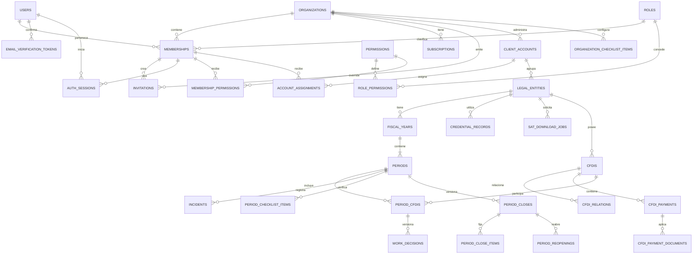

# Balanz
## SaaS de control mensual de CFDI para despachos contables

**Versión:** 3.3  
**Fecha:** 24 de agosto de 2026  
**Nombre clave:** Balanz  
**Tipo de producto:** SaaS B2B multi-tenant  
**Mercado objetivo:** contadores independientes y despachos pequeños en México, normalmente de 1 a 10 colaboradores

---

## 1. Resumen ejecutivo

Balanz es un SaaS para que un contador o despacho sepa, desde una sola vista, qué clientes no han iniciado su revisión mensual, cuáles tienen incidencias, cuáles están listos para cerrar, cuáles ya se cerraron y cuáles recibieron información posterior.

La plataforma permitirá descargar CFDI desde el servicio oficial del SAT, cargar XML o ZIP manualmente, depurar documentos e incidencias, documentar decisiones, completar un checklist, cerrar internamente un período y exportar información utilizable en el sistema contable que el despacho ya emplea.

### Promesa comercial

> **Descarga, depura y cierra la revisión mensual de todos tus clientes desde un solo lugar.**

### Trabajo que el producto resuelve

> Cuando llega el cierre del mes, ayúdame a reunir y revisar los CFDI de cada cliente, resolver excepciones y entregar un conjunto depurado y trazable, para continuar la contabilidad sin perseguir carpetas, correos ni hojas de cálculo.

### Resultado esperado

El contador debe poder llevar un período de **Sin iniciar** a **Cerrado y exportado** sin depender de carpetas, controles paralelos o recaptura para completar el control de CFDI.

### Límites del producto

Balanz no sustituye al sistema contable ni presenta declaraciones. El cierre es un control interno del despacho; no genera pólizas, no concilia bancos y no determina de forma definitiva impuestos o deducibilidad.

---

## 2. Definición del producto

### 2.1 Usuario objetivo

- Contador independiente que administra aproximadamente entre 10 y 20 contribuyentes.
- Despacho pequeño de 2 a 10 colaboradores que necesita asignar clientes y evitar trabajo duplicado.
- Titular del despacho que necesita ver carga operativa, conexiones fallidas, vigencia de e.firmas y períodos pendientes.

El MVP se concentra en despachos pequeños y excluye corporativos, áreas fiscales complejas y flujos de aprobación multinivel.

### 2.2 Problemas prioritarios

- Descargas del SAT separadas de carpetas y controles del despacho.
- Falta de una vista global del estado mensual de todos los clientes.
- Revisión repetitiva de duplicados, XML inválidos o ajenos, cancelaciones y relaciones de pago.
- Decisiones de incluir o excluir sin motivo, responsable o historial.
- Información posterior que modifica silenciosamente un período ya revisado.
- Recaptura para continuar el trabajo en otra herramienta contable.
- Dependencia de una sesión abierta para procesos que deberían continuar en segundo plano.

### 2.3 Principios funcionales

- **XML como fuente primaria:** el sistema genera una vista legible; el PDF no es fuente fiscal del MVP.
- **Original inmutable:** importes, fechas, impuestos y relaciones no se editan. Las decisiones del despacho viven en registros separados.
- **Fecha de corte visible:** cada consulta, mesa, cierre y exportación indica hasta cuándo se obtuvo información.
- **Automatización revisable:** toda sugerencia automatizada debe ser explicable, confirmable y reversible.
- **Continuidad ante fallas:** si el SAT no está disponible, el usuario puede cargar archivos y revisar información existente.
- **Trazabilidad por diseño:** descargas, cargas, decisiones, cierres, reaperturas y exportaciones se auditan.
- **Portabilidad:** el despacho puede recuperar los XML y datos de trabajo en formatos documentados.
- **Sin promesa de contabilidad completa:** cerrar una revisión no presenta una declaración ni genera una póliza.

---

## 3. Modelo SaaS y organización de la información

### 3.1 Estructura multi-tenant

```text
Plataforma Balanz
├── Organización / tenant A: despacho contable
│   ├── Miembros del equipo
│   │   ├── Contador 1 → cuentas cliente A y C
│   │   ├── Contador 2 → cuenta cliente B
│   │   └── Colaborador → cuentas cliente A y B
│   ├── Cuenta cliente A: Grupo Comercial ABC
│   │   ├── Entidad fiscal / RFC A1
│   │   │   └── Ejercicios → períodos → CFDI y cierres
│   │   └── Entidad fiscal / RFC A2
│   │       └── Ejercicios → períodos → CFDI y cierres
│   ├── Cuenta cliente B: Restaurante XYZ
│   │   └── Entidad fiscal / RFC B1
│   └── Cuenta cliente C: Persona física
│       └── Entidad fiscal / RFC C1
└── Organización / tenant B: otro despacho, totalmente aislado
```

### 3.2 Distinción entre tenant, cuenta cliente y RFC

Los conceptos no deben confundirse:

- **Organización / tenant:** el despacho contable o contador independiente que contrata Balanz. Es la frontera principal de datos, seguridad y facturación.
- **Miembro:** una persona que trabaja dentro del tenant. Un mismo usuario puede tener membresías en más de una organización, pero siempre opera dentro de un tenant activo.
- **Cuenta cliente:** la relación operativa que el despacho administra; puede representar una persona, empresa o grupo económico.
- **Entidad fiscal:** el contribuyente identificado por un RFC. Aquí viven la e.firma, las descargas SAT, los ejercicios y los períodos.
- **Asignación:** relación muchos-a-muchos entre miembros y cuentas cliente. Un contador puede llevar muchas cuentas y una cuenta puede tener responsable, colaboradores y revisor.

Una cuenta cliente puede contener uno o varios RFC desde el MVP. El cierre, la fecha de corte, las incidencias y la propiedad de cada CFDI permanecen separados por entidad fiscal. El dashboard puede agregarlos por cuenta sin mezclar sus expedientes.

Para mantener simple la autorización inicial, la asignación del MVP se realiza a nivel de cuenta cliente y se hereda a sus entidades fiscales. Los permisos sensibles —por ejemplo, ver nómina, administrar e.firma, cerrar o exportar— se siguen evaluando por permiso. Si los pilotos necesitan responsables diferentes por RFC dentro de la misma cuenta, la asignación granular por entidad se incorpora en Fase 2.

### 3.3 Reglas de aislamiento y asignación

- Toda consulta utiliza el tenant activo y valida la asignación a la cuenta cliente.
- Un usuario no puede inferir la existencia de cuentas o RFC de otro tenant.
- Una cuenta cliente puede estar asignada a varios miembros.
- Un miembro puede tener asignadas muchas cuentas cliente.
- Agregar un RFC a una cuenta no concede acceso a personas que no estén asignadas a esa cuenta.
- El mismo RFC no debe duplicarse en dos cuentas activas del mismo tenant sin una resolución explícita.
- Un CFDI relevante para dos RFC administrados se representa en el contexto autorizado de cada entidad; una optimización física nunca debe crear filtraciones.

Todos los registros deben quedar vinculados como mínimo con:

```text
organization_id
client_account_id
legal_entity_id, cuando el registro sea fiscal
fiscal_year_id
period_id, cuando aplique
```

### 3.4 Modelo conceptual mínimo

| Entidad | Responsabilidad |
|---|---|
| `User` | Identidad de autenticación; no concede acceso fiscal por sí misma |
| `Organization` | Tenant del despacho, plan, políticas y cuentas cliente |
| `Subscription` | Plan comercial de la organización, estado de pago, trial y entitlements |
| `EmailVerificationToken` | Token de confirmación de correo de un solo uso, con hash, expiración y consumo |
| `Membership` | Relación usuario-organización, `role_id`, estado, MFA y permisos efectivos |
| `Invitation` | Invitación de un solo uso, expiración, aceptación y revocación |
| `AuthSession` | Sesión revocable con tenant y membresía activos |
| `Role` | Catálogo persistido de roles base, con clave estable y alcance de organización o plataforma |
| `Permission` | Acción autorizable del sistema, con clave, nombre y descripción estables |
| `RolePermission` | Permiso por defecto asociado a un rol base |
| `MembershipPermission` | Override `grant` o `deny` de un permiso para una membresía |
| `ClientAccount` | Cuenta operativa administrada por el despacho; agrupa una o varias entidades fiscales |
| `AccountAssignment` | Relación muchos-a-muchos entre membresía y cuenta cliente, con responsabilidad operativa |
| `LegalEntity` | RFC, tipo de contribuyente, datos fiscales, responsables y ejercicios |
| `CredentialRecord` | e.firma de una entidad fiscal: metadatos, archivos protegidos, vigencia e historial |
| `SATDownloadJob` | Solicitud, folio, estados, paquetes, reintentos y fecha de corte |
| `FiscalYear` / `Period` | Espacio mensual de una entidad fiscal, checklist, estado y versiones de cierre |
| `CFDI` | Registro único por entidad fiscal y UUID, XML inmutable, origen y datos fiscales |
| `CFDIRelation` | Pagos, egresos, sustituciones y demás relaciones entre CFDI |
| `WorkDecision` | Revisión, inclusión/exclusión, motivo, categoría y comentario |
| `Incident` | Tipo, severidad, resolución, excepción y responsable |
| `PeriodClose` | Snapshot versionado de decisiones, incidencias y referencias |
| `ExportJob` | Formato, alcance, versión, solicitante y expiración |
| `AuditEvent` | Actor, tenant, cuenta, RFC, acción, objeto, fecha, motivo y correlación |

Un CFDI se almacena una sola vez por entidad fiscal, pero puede participar en varios períodos. Por ejemplo, una factura PPD emitida en enero puede relacionarse con pagos de febrero y marzo y producir una novedad si su estado cambia en abril.

### 3.5 Arquitectura de navegación

La navegación de Balanz parte siempre de una **organización activa** y desciende de la cuenta cliente al RFC, ejercicio, período y documento. Esta jerarquía permite que un contador administre varias cuentas sin mezclar expedientes fiscales y que una cuenta con varios RFC conserve cierres independientes por entidad fiscal.

```text
Organización activa / despacho
├── Inicio
├── Cartera de cuentas cliente
│   └── Cuenta cliente
│       ├── Resumen y equipo asignado
│       └── Entidad fiscal / RFC
│           ├── Datos fiscales y conexión SAT
│           ├── Ejercicios
│           │   └── Período mensual
│           │       ├── Resumen
│           │       ├── CFDI emitidos y recibidos
│           │       ├── Pagos, nómina y traslado
│           │       ├── Incidencias y checklist
│           │       └── Cierre, versiones y exportación
│           └── Documentos
│               └── Detalle del CFDI e historial
├── Centro de descargas
├── Equipo y permisos
├── Auditoría
└── Configuración, seguridad, plan y soporte
```

#### Niveles y pantallas principales

| Nivel | Propósito y contenido |
|---|---|
| Organización / despacho | Inicio, cartera, equipo, permisos, plan, seguridad, auditoría, soporte e indicadores agregados del tenant activo |
| Cuenta cliente | Resumen operativo, entidades fiscales asociadas, responsables y colaboradores asignados, alertas y avance agregado sin mezclar cierres entre RFC |
| Entidad fiscal / RFC | Datos fiscales, e.firma, conexión SAT, vigencia de credenciales, ejercicios, documentos y alertas propias del contribuyente |
| Ejercicio | Doce períodos del RFC, avance, cierres vigentes, novedades, bloqueos y exportaciones |
| Período | Resumen, CFDI emitidos y recibidos, pagos, nómina, traslado, incidencias, decisiones, checklist, cierre y exportación |
| Documento | Vista legible generada desde XML, archivo original autorizado, conceptos, impuestos, relaciones, estado consultado, decisiones e historial |
| Centro de descargas | Trabajos SAT del alcance autorizado, folio, rango, estado interno y oficial, paquetes, errores, reintentos, resultados y fecha de corte |

#### Inicio y cartera por perfil

- **Titular:** ve el estado del despacho completo, las cuentas y RFC con problemas, e.firmas por vencer, trabajos fallidos, carga del equipo y períodos pendientes, bloqueados, cerrados o con novedades.
- **Contador responsable:** ve primero su cartera asignada, sus períodos por atender, descargas que requieren acción y cierres listos o con novedades.
- **Colaborador:** ve las cuentas asignadas y el trabajo pendiente que puede preparar, sin acciones de cierre, exportación o administración que no le hayan sido concedidas.

La cartera permite agrupar por responsable o cuenta cliente y desplegar sus RFC. Cada fila debe mostrar, como mínimo, responsable, estado del período, última consulta SAT, fecha de corte, incidencias, avance del checklist y siguiente acción disponible.

#### Reglas obligatorias de navegación

- Si una persona pertenece a más de una organización, debe seleccionar o cambiar el tenant de forma explícita. Cambiar de tenant restablece cuenta, RFC, ejercicio, período, filtros y búsquedas activas.
- La organización, cuenta cliente y entidad fiscal activas permanecen visibles en el encabezado o ruta de navegación. En pantallas mensuales también se muestran ejercicio, período, estado y fecha de corte.
- La búsqueda global se limita al tenant activo y sólo devuelve cuentas, RFC, CFDI o trabajos permitidos por las asignaciones y permisos del usuario.
- El dashboard de una cuenta puede agregar información de varios RFC, pero cada importe, incidencia, cierre y exportación debe permitir identificar su entidad fiscal de origen.
- Volver a la cartera conserva filtros y orden durante la sesión para que el contador pueda revisar varias cuentas sin reconstruir su vista de trabajo.
- El Centro de descargas permite continuar desde un trabajo hasta su RFC y período, y desde un período hasta los trabajos que originaron su información.
- Las secciones y acciones se muestran según rol, asignación y permisos. Ocultar una opción no sustituye la autorización backend al abrir una URL, descargar un archivo o ejecutar una acción.
- Nómina, e.firma, exportaciones, auditoría, soporte y administración sólo aparecen cuando el usuario tiene el permiso correspondiente.
- Los enlaces, pestañas y notificaciones conservan el contexto del tenant. Si el usuario perdió acceso, el recurso se deniega sin revelar si existe.
- Ninguna navegación permite cambiar identificadores para acceder a otra organización, cuenta cliente o RFC; cada transición vuelve a validar el alcance autorizado.

### 3.6 Identidad, invitaciones, membresías y sesiones

Esta sección define el mínimo técnico de identidad necesario para que la organización activa y la autorización sean implementables. El proveedor de autenticación puede cambiar, pero estas entidades y reglas pertenecen al dominio de Balanz.

#### Entidades de identidad

| Entidad | Responsabilidad |
|---|---|
| `User` | Identidad global; por sí sola no concede acceso fiscal |
| `Organization` | Tenant activo y frontera de datos, seguridad y facturación |
| `Membership` | Relación usuario-organización, rol, estado y titularidad derivada |
| `Invitation` | Invitación de un solo uso para crear o vincular una membresía |
| `MembershipPermission` | Permiso sensible concedido o denegado para una membresía |
| `AuthSession` | Sesión revocable con organización y membresía activas |

#### Estados mínimos

```text
User:         active | suspended
Organization: active | suspended | cancelled
Membership:   pending | active | suspended | revoked
Invitation:   pending | accepted | expired | revoked
AuthSession:  active | expired | revoked
Permission override: grant | deny; vigente mientras revoked_at sea nulo
```

Reglas obligatorias:

- Sólo una membresía `active` de una organización `active` puede establecerse como tenant activo.
- MFA es opcional para el acceso normal. Las capacidades P0 críticas y de extracción exigen un factor TOTP activo y una sesión verificada.
- Una invitación `accepted`, `expired` o `revoked` no puede reutilizarse.
- Aceptar una invitación crea o vincula una membresía, pero no crea asignaciones a cuentas cliente.
- Suspender o revocar una membresía impide nuevas solicitudes, invalida sesiones según la política vigente y conserva la identidad histórica para auditoría.
- Revocar un override establece `revoked_at`, conserva el historial y devuelve la evaluación al permiso por defecto del rol; concederlo nuevamente crea un nuevo override y genera un evento de auditoría.
- Cambiar de tenant cambia el contexto de sesión; no concede roles, permisos ni asignaciones de la organización anterior.

#### Estados iniciales del alta

El registro de una organización y su titular debe crear los registros siguientes dentro de una única transacción:

| Entidad | Estado inicial | Regla de acceso |
|---|---|---|
| `User` | `active` | `email_verified_at` puede ser nulo mientras termina la verificación; la identidad no concede acceso fiscal por sí sola |
| `Organization` | `active` | Se crea con `owner_user_id`; no existe un estado `pending` de organización |
| `Membership` titular | `pending` | Usa el `role_id` correspondiente a `roles.key = owner`; la titularidad se deriva de `organizations.owner_user_id` |
| `AuthSession` | Sin contexto fiscal activo | Sólo puede establecer tenant después de sesión válida, membresía activa y organización activa |
| `Subscription` | `pending`, si se crea en el alta comercial | Pertenece a `Organization`; no se cobra como parte de la transacción de identidad |

La membresía titular pasa de `pending` a `active` al confirmar el correo. MFA no condiciona la membresía ni el acceso normal; una sesión con factor activo se mantiene preliminar hasta validar TOTP, y las acciones sensibles sin MFA responden `MFA_SETUP_REQUIRED` o `MFA_REQUIRED`.

```text
registro
  → User active + Organization active + Membership pending
  → email verificado + Membership active
  → AuthSession active con organization_id y membership_id explícitos
  → acceso fiscal si también cumplen rol, permisos, asignación y estado del recurso
```

Si falla cualquier paso, se revierte el alta completa y no quedan usuarios, organizaciones o membresías huérfanos. El alta no crea asignaciones a cuentas cliente ni permisos personalizados.

#### Verificación de correo y alta pendiente

La selección del plan ocurre antes de crear la cuenta. En esta fase el plan se conserva únicamente como `subscriptionType`; no se crea catálogo de planes, precio, ciclo de cobro ni integración con Hemia Billing.

```text
seleccionar subscriptionType
  → User active + email_verified_at = null
  → Organization active + Membership pending
  → Subscription pending + onboarding.nextStep = verify_email
  → enviar correo con enlace HTTPS
  → pantalla “Confirma tu correo”
  → POST /auth/email/verification/confirm
  → email_verified_at + Subscription trialing
  → onboarding.nextStep = ready + mfaStatus = disabled
```

El token se genera con un CSPRNG de al menos 32 bytes, se almacena únicamente como hash, expira a los 30 minutos por configuración (permitido entre 15 y 60), sólo puede consumirse una vez y se invalida dentro de la misma transacción que confirma el correo. El reenvío invalida tokens anteriores. Las solicitudes de reenvío y confirmación tienen rate limiting por IP y correo normalizado y no revelan si una cuenta existe.

La confirmación activa la cuenta, la membresía y el trial, y crea una sesión utilizable. No concede beneficios costosos sin la autorización correspondiente. El enlace nunca se genera con `http` en producción y el token no aparece en logs, auditoría, errores ni respuestas.

#### MFA TOTP local y opcional

Balanz implementa TOTP RFC 6238 localmente: issuer `Balanz`, correo normalizado
como cuenta, secreto Base32 de 160 bits, SHA-1, seis dígitos, período de 30
segundos y tolerancia de ±30 segundos. El secreto se cifra con AES-256-GCM y
la llave del mecanismo de secretos; `MFA_ENCRYPTION_KEY` sólo es fallback local.
No se integra proveedor externo, no se agregan recovery codes y no existe
recuperación autoservicio. El procedimiento de pérdida del autenticador es
manual, con validación reforzada, ticket, revocación transaccional y auditoría.

El estado del onboarding se deriva de la identidad y la suscripción y conserva `subscriptionType`, estado del trial y `nextStep`. Tras una confirmación válida, la respuesta y la pantalla de onboarding restauran esos datos sin crear un workflow genérico.

#### Titularidad de la organización

La fuente única de verdad de titularidad es `organizations.owner_user_id`. El usuario referenciado debe tener una membresía `active` en esa organización. No se persiste una segunda autoridad de titularidad en `memberships`.

La transferencia de titularidad se ejecuta en una única transacción que: (1) verifica reautenticación, titular actual y nueva membresía activa; (2) actualiza `organizations.owner_user_id`; (3) registra el evento de auditoría; y (4) reevalúa o revoca sesiones y permisos que dependan de la titularidad. Si falla cualquier paso, se revierte toda la operación.

#### Contexto de sesión

La sesión autenticada debe poder resolver, como mínimo:

```text
user_id
membership_id
organization_id
session_id
role
permissions
mfa_verified_at
requires_mfa
mfa_status
expires_at
```

El cliente puede recibir estos datos en un token o respuesta de sesión, pero el backend debe volver a validar el estado actual de la sesión, membresía, organización, rol, permisos y asignación para acciones sensibles y trabajos asíncronos. El token no es la única fuente de autorización.

La creación de la sesión no debe confundirse con la autorización de una acción. El acceso normal se permite con sesión, tenant y membresía activos; una sesión preliminar con `requires_mfa = true` sólo puede completar MFA o cerrar sesión.

#### Estrategia de sesión implementada

El backend usa una sesión persistida, no un JWT bearer como autoridad de acceso. El navegador transporta un token opaco de 32 bytes en una cookie `HttpOnly`; PostgreSQL conserva únicamente su hash SHA-256 en `auth_sessions`. La sesión es revocable y el cambio de contraseña, la suspensión del usuario y las transiciones de seguridad que correspondan revocan las sesiones afectadas.

La duración absoluta inicial es de ocho horas (`AUTH_SESSION_TTL_SECONDS=28800`) y el límite de inactividad es de treinta minutos (`AUTH_SESSION_IDLE_TTL_SECONDS=1800`). Redis conserva temporalmente la sesión resuelta y su contexto de autorización; su TTL nunca excede la menor ventana entre expiración absoluta, inactividad y `AUTHORIZATION_CACHE_TTL_SECONDS`, cuyo valor inicial es 60 segundos. Si Redis no está disponible, la resolución continúa contra PostgreSQL.

En producción la cookie debe ser `Secure`, usa `SameSite=Strict` por defecto, `Path=/` y no define `Domain` cuando adopta el prefijo `__Host-`. La configuración rechaza una cookie `__Host-` sin `Secure` o con `Domain`. Además, un guard global valida el encabezado `Origin`, cuando está presente, en métodos no seguros (`POST`, `PUT`, `PATCH` y `DELETE`) contra los orígenes CORS permitidos. `GET`, `HEAD`, `OPTIONS` y clientes sin `Origin` no requieren esta verificación; en desarrollo también se permite operar sin lista CORS explícita.

#### Contexto frontend y cachés

Todas las claves de caché, borradores y solicitudes dependientes del tenant deben incluir `organization_id` y, cuando aplique, `membership_id`. Al cambiar de tenant se deben limpiar o invalidar cuenta, RFC, ejercicio, período, filtros, búsquedas, orden, paginación, selecciones y formularios del tenant anterior. Las respuestas asíncronas iniciadas en el contexto anterior no pueden actualizar componentes del nuevo contexto.

---

## 4. Roles y autorización del MVP

### 4.1 Perfiles base

| Perfil | Responsabilidad |
|---|---|
| Titular (`owner`) | Equipo, cuentas cliente, entidades fiscales, seguridad, asignaciones, plan y políticas de su organización |
| Contador responsable | Descarga, revisión, incidencias, cierre y reapertura de las cuentas asignadas |
| Colaborador | Carga, revisión, clasificación, comentarios y checklist de las cuentas asignadas |
| Administrador de plataforma (`admin`) | Operación interna de Balanz fuera de los tenants; no es una membresía de despacho ni hereda acceso fiscal |

Los roles de organización son `owner`, `accountant` y `collaborator`. `admin` tiene alcance `platform` y no puede utilizarse en `memberships` de una organización. La titularidad se resuelve desde `organizations.owner_user_id`; las acciones excepcionales —transferir la propiedad, cancelar la suscripción o eliminar la organización— siempre comparan el usuario autenticado contra `owner_user_id`.

### 4.2 Matriz de permisos por rol

**Leyenda:**

- **Tenant:** puede operar sobre todo el despacho.
- **Asignadas:** sólo sobre las cuentas cliente asignadas y sus RFC.
- **Propias:** sólo registros creados o acciones realizadas por la persona.
- **Permiso:** requiere un permiso sensible explícito, además del alcance de cuenta.
- **No:** acción no disponible para el rol.

| Acción | Titular (`owner`) | Contador responsable | Colaborador |
|---|---|---|---|
| Ver dashboard del despacho | Tenant | Cartera asignada | Cartera asignada |
| Ver cuentas, RFC y períodos | Tenant | Asignadas | Asignadas |
| Crear, editar o archivar cuentas cliente | Tenant | No | No |
| Agregar o sustituir entidades fiscales / RFC | Tenant | No | No |
| Invitar, suspender o revocar miembros | Tenant | No | No |
| Asignar miembros a cuentas cliente | Tenant | No | No |
| Configurar roles y permisos | Tenant | No | No |
| Administrar plan y facturación | Sólo titular | No | No |
| Transferir titularidad o cancelar organización | Sólo titular + reautenticación | No | No |
| Ver metadata y vigencia de e.firma | Tenant | Asignadas | Asignadas, sin archivos |
| Cargar, sustituir o revocar e.firma | Permiso + reautenticación | Permiso + asignadas | No |
| Solicitar descarga SAT | Permiso + reautenticación | Permiso + asignadas | Permiso + asignadas |
| Ver estado y errores de descargas | Tenant | Asignadas | Asignadas |
| Cargar XML o ZIP manualmente | Tenant | Asignadas | Asignadas |
| Ver CFDI y descargar XML individual | Tenant | Asignadas | Asignadas |
| Ver o exportar CFDI de nómina | Permiso | Permiso + asignadas | Permiso + asignadas |
| Marcar pendiente/revisado y comentar | Tenant | Asignadas | Asignadas |
| Clasificar y aplicar acciones masivas | Tenant | Asignadas | Asignadas |
| Excluir o reincorporar CFDI | Permiso | Permiso + asignadas | Permiso + asignadas |
| Crear y tratar incidencias | Tenant | Asignadas | Asignadas |
| Aceptar una excepción bloqueante | Permiso | Permiso + asignadas | No |
| Completar checklist | Tenant | Asignadas | Asignadas |
| Tomar control de edición de un período | Tenant + motivo | No | No |
| Enviar período a revisión | Tenant | Asignadas | Asignadas |
| Marcar período listo para cerrar | Tenant | Asignadas | No |
| Cerrar período | Permiso | Permiso + asignadas | No |
| Reabrir período | Permiso + motivo | Permiso + asignadas + motivo | No |
| Generar exportación básica | Permiso | Permiso + asignadas | Permiso + asignadas |
| Generar exportación masiva | Permiso + reautenticación | Permiso + asignadas + reautenticación | No |
| Consultar auditoría | Tenant | Asignadas | Propias e historial visible del documento |
| Autorizar acceso de soporte | Permiso | No | No |
| Gestionar retención, cancelación y purgado | Tenant + reautenticación | No | No |

La matriz define los permisos por defecto y el máximo permitido por el rol. No reemplaza la asignación de cuenta ni los overrides de `membership_permissions`.

### 4.3 Modelo de permisos

El rol es un conjunto de permisos por defecto. El permiso es una acción atómica y el alcance es una condición independiente sobre la que puede operar la membresía.

```text
rol
  → permisos por defecto
  + overrides de membership_permissions
  → permiso efectivo
  + scope de account_assignments
  + estado de tenant, membresía y recurso
  + MFA/reautenticación cuando aplique
  → decisión de autorización
```

El modelo no debe crear permisos artificiales que mezclen acción y cuenta, por ejemplo `periods.close_cliente_abc`. El permiso es `periods.close`; la cuenta autorizada se resuelve mediante `account_assignments`.

#### Base RBAC implementada al corte de esta versión

El backend ya persiste `roles`, `permissions` y `role_permissions`. `memberships` referencia `roles.id` mediante `role_id`; los servicios sólo aceptan roles con `scope = organization` al resolver un tenant. Los seeds son idempotentes: crean o actualizan el catálogo y reconstruyen las relaciones por defecto dentro de una transacción.

El catálogo ejecutable actual contiene las siguientes claves. `owner` recibe todas; `accountant` recibe las marcadas en su columna; `collaborator` inicia con el subconjunto indicado. `admin` tiene `scope = platform`, por lo que no recibe permisos de organización ni participa en una membresía de tenant.

| permission implementado | `owner` | `accountant` | `collaborator` |
|---|:---:|:---:|:---:|
| `organization.view` | Sí | Sí | Sí |
| `organization.manage` | Sí | No | No |
| `ownership.manage` | Sí | No | No |
| `billing.manage` | Sí | No | No |
| `team.view` | Sí | Sí | No |
| `team.manage` | Sí | No | No |
| `clients.view` | Sí | Sí | Sí |
| `clients.manage` | Sí | Sí | No |
| `clients.assign` | Sí | Sí | No |
| `credentials.manage` | Sí | Sí | No |
| `sat.download` | Sí | Sí | No |
| `payroll.view` | Sí | Sí | No |
| `cfdi.review` | Sí | Sí | Sí |
| `cfdi.exclude` | Sí | Sí | No |
| `period.close` | Sí | Sí | No |
| `period.reopen` | Sí | Sí | No |
| `exports.create` | Sí | Sí | No |
| `obligations.view` | Sí | Sí | Sí |
| `obligations.configure` | Sí | Sí | No |
| `diot.generate` | Sí | Sí | No |
| `ieps.generate` | Sí | Sí | No |
| `audit.view` | Sí | Sí | No |
| `support.authorize` | Sí | No | No |

Los permisos efectivos de una sesión se consultan desde `role_permissions`, se ordenan por clave y se incluyen en el contexto cacheado. Cada escritura en Redis queda limitada por `AUTHORIZATION_CACHE_TTL_SECONDS`; como los aciertos renuevan esa entrada sin recalcular permisos, un cambio de rol o relación debe invalidar expresamente las sesiones o sus claves de caché. Los overrides por membresía y el alcance por `account_assignments` permanecen en el diseño objetivo y no forman parte todavía de esta base implementada.

La política central de MFA implementada contiene estas capacidades P0:
`organization.manage`, `organization.transfer`, `organization.cancel`,
`members.manage`, `permissions.manage`, `billing.manage`, `clients.assign`,
`fiscal_entities.manage`, `credentials.manage`, `sat.download`,
`cfdi.download`, `payroll.export`, `exceptions.accept`,
`checklist.configure`, `periods.takeover`, `periods.close`, `periods.reopen`,
`exports.generate`, `exports.download`, `exports.bulk`, `support.authorize` y
`retention.manage`. Sin factor activo la API devuelve `403 MFA_SETUP_REQUIRED`;
con factor activo pero sesión preliminar devuelve `401 MFA_REQUIRED`. Las demás
reglas de permisos, asignación, tenant y reautenticación continúan aplicando.

Existe una divergencia que debe cerrarse antes de producción: el catálogo ejecutable usa `ownership.manage`, `team.manage`, `period.close`, `period.reopen` y `exports.create`, mientras la política MFA todavía referencia `organization.transfer`, `members.manage`, `periods.close`, `periods.reopen` y `exports.generate`. Hasta homologar las claves mediante migración, seed, política y pruebas, las variantes del catálogo ejecutable no heredan automáticamente el requisito MFA de su equivalente funcional.

#### Catálogo funcional objetivo

La tabla siguiente define la granularidad funcional objetivo para API, workers,
URLs firmadas, frontend y auditoría. Mientras cada módulo no esté implementado,
la única lista concedible es la base RBAC descrita arriba. Las claves nuevas o
renombradas deben incorporarse mediante migración y seed antes de utilizarse;
no se aceptan como valores libres. Todas las claves usan el formato
`module.action`, en minúsculas, con un solo punto y sin combinaciones como
`clients.view/manage` o `periods.close/reopen`. El alcance de cuenta cliente se
resuelve por `account_assignments`, no se codifica en la clave.

Los permisos `P0` representan el alcance objetivo del MVP, pero sólo están
disponibles cuando existen en el catálogo persistido. Todo permiso que no aplique
al MVP o que extienda su alcance se registra como `P1 / Fase 2`; no puede
concederse hasta que el módulo correspondiente sea aprobado e incorporado por
migración y seed. La presencia en esta tabla no compromete su implementación.

| permission | Acción | Fase | MFA/reautenticación |
|---|---|---:|---|
| `organization.view` | Consultar organización, configuración y contexto activo | P0 | — |
| `organization.manage` | Modificar datos y políticas de la organización | P0 | MFA; reautenticación según la acción |
| `organization.transfer` | Transferir titularidad | P0 | MFA + reautenticación |
| `organization.cancel` | Cancelar la organización | P0 | MFA + reautenticación |
| `dashboard.view` | Consultar dashboard y cartera permitida | P0 | — |
| `members.view` | Consultar miembros e invitaciones | P0 | — |
| `members.manage` | Invitar, suspender, reactivar o revocar miembros | P0 | MFA; reautenticación según la acción |
| `permissions.view` | Consultar permisos efectivos, defaults y overrides | P0 | — |
| `permissions.manage` | Conceder, denegar o revocar permisos de otras membresías | P0 | MFA + reautenticación |
| `billing.view` | Consultar plan, trial, suscripción y estado comercial | P0 | — |
| `billing.manage` | Administrar plan, suscripción y facturación | P0 | MFA + reautenticación |
| `clients.view` | Consultar cuentas cliente y su información operativa | P0 | — |
| `clients.manage` | Crear, editar o archivar cuentas cliente | P0 | — |
| `clients.assign` | Asignar o retirar miembros de cuentas cliente | P0 | MFA + reautenticación |
| `fiscal_entities.view` | Consultar RFC y datos de entidades fiscales | P0 | — |
| `fiscal_entities.manage` | Agregar, sustituir o archivar entidades fiscales | P0 | MFA + reautenticación |
| `fiscal_years.view` | Consultar ejercicios y sus períodos | P0 | — |
| `fiscal_years.manage` | Crear o archivar ejercicios y períodos | P0 | — |
| `credentials.view` | Consultar metadata y vigencia de e.firma | P0 | — |
| `credentials.manage` | Cargar, sustituir o revocar e.firma | P0 | MFA + reautenticación |
| `sat.view` | Consultar trabajos, folios, estados y errores SAT | P0 | — |
| `sat.download` | Firmar y solicitar una descarga al SAT | P0 | MFA + reautenticación |
| `sat.retry` | Reintentar un trabajo SAT fallido o recuperable | P0 | —; reautenticación según la acción |
| `sat.cancel` | Cancelar un trabajo SAT pendiente | P0 | —; reautenticación según la acción |
| `ingestion.view` | Consultar cargas, paquetes y resultados de ingesta | P0 | — |
| `ingestion.create` | Cargar XML o ZIP e iniciar una ingesta | P0 | — |
| `ingestion.retry` | Reintentar una ingesta recuperable | P0 | — |
| `cfdi.view` | Consultar CFDI, conceptos, impuestos y relaciones | P0 | — |
| `cfdi.download` | Descargar el XML de un CFDI autorizado | P0 | MFA |
| `cfdi.review` | Marcar CFDI como pendiente o revisado y comentar | P0 | — |
| `cfdi.classify` | Clasificar CFDI y asignar tratamientos operativos | P0 | — |
| `cfdi.bulk_action` | Aplicar acciones masivas a CFDI seleccionados | P0 | — |
| `cfdi.exclude` | Excluir o reincorporar CFDI con motivo | P0 | —; reautenticación según la acción |
| `payroll.view` | Consultar CFDI de nómina | P0 | — |
| `payroll.export` | Exportar CFDI de nómina | P0 | MFA; reautenticación según el alcance |
| `incidents.view` | Consultar incidencias y su historial | P0 | — |
| `incidents.manage` | Crear, asignar, resolver o cancelar incidencias | P0 | — |
| `exceptions.accept` | Aceptar una excepción bloqueante | P0 | MFA + reautenticación |
| `checklist.view` | Consultar checklist y avance del período | P0 | — |
| `checklist.complete` | Completar checklist y registrar excepciones permitidas | P0 | — |
| `checklist.configure` | Configurar ítems de checklist por organización | P0 | MFA + reautenticación |
| `periods.view` | Consultar períodos, estados, cierres y novedades | P0 | — |
| `periods.review` | Enviar un período a revisión | P0 | — |
| `periods.ready` | Marcar un período listo para cerrar | P0 | — |
| `periods.takeover` | Tomar control administrativo del lease de un período | P0 | MFA + reautenticación |
| `periods.close` | Crear una versión cerrada del período | P0 | MFA + reautenticación |
| `periods.reopen` | Reabrir un período con motivo | P0 | MFA + reautenticación |
| `exports.view` | Consultar historial y estado de exportaciones | P0 | — |
| `exports.generate` | Generar Excel, CSV o ZIP de XML | P0 | MFA; reautenticación para alcance masivo |
| `exports.download` | Descargar un resultado de exportación autorizado | P0 | MFA |
| `exports.bulk` | Generar exportaciones masivas | P0 | MFA + reautenticación |
| `processes.view` | Consultar el centro de trabajos y procesos | P0 | — |
| `processes.retry` | Reintentar un proceso recuperable | P0 | — |
| `processes.cancel` | Cancelar un proceso pendiente | P0 | —; reautenticación según la acción |
| `audit.view` | Consultar auditoría permitida por tenant y asignación | P0 | — |
| `support.authorize` | Conceder acceso JIT temporal al equipo de soporte | P0 | MFA + reautenticación |
| `retention.manage` | Administrar retención, cancelación y purgado autorizado | P0 | MFA + reautenticación |
| `notifications.view` | Consultar notificaciones e inbox operativo | P1 | MFA |
| `notifications.manage` | Configurar preferencias y canales de notificación | P1 | MFA |
| `tasks.view` | Consultar tareas y obligaciones configuradas | P1 | MFA |
| `tasks.manage` | Crear y administrar tareas y obligaciones configuradas | P1 | MFA |
| `documents.view` | Consultar PDF y anexos asociados | P1 | MFA |
| `documents.upload` | Cargar PDF y anexos asociados | P1 | MFA |
| `rules.view` | Consultar reglas recurrentes | P1 | MFA |
| `rules.manage` | Crear, versionar y administrar reglas recurrentes | P1 | MFA + reautenticación |
| `search.view` | Usar búsqueda global dentro del alcance autorizado | P1 | MFA |
| `obligations.view` | Consultar obligaciones y su estado preparado | P1 | MFA |
| `obligations.configure` | Configurar aplicabilidad y variantes fiscales | P1 | MFA + reautenticación |
| `diot.view` | Consultar papeles y operaciones DIOT | P1 | MFA |
| `diot.configure` | Configurar y ajustar información DIOT | P1 | MFA + reautenticación |
| `diot.prepare` | Preparar una versión de trabajo DIOT | P1 | MFA |
| `diot.validate` | Validar una versión de trabajo DIOT | P1 | MFA + reautenticación |
| `diot.generate` | Generar archivo DIOT preparado | P1 | MFA + reautenticación |
| `ieps.view` | Consultar papeles e ítems IEPS | P1 | MFA |
| `ieps.configure` | Configurar y ajustar información IEPS | P1 | MFA + reautenticación |
| `ieps.prepare` | Preparar una versión de trabajo IEPS | P1 | MFA |
| `ieps.validate` | Validar una versión de trabajo IEPS | P1 | MFA + reautenticación |
| `ieps.generate` | Generar archivo IEPS preparado | P1 | MFA + reautenticación |
| `integrations.view` | Consultar integraciones disponibles y su estado | P1 | MFA |
| `integrations.manage` | Configurar integraciones y webhooks | P1 | MFA + reautenticación |
| `api.manage` | Administrar credenciales, scopes y webhooks de API | P1 | MFA + reautenticación |
| `ai.use` | Usar asistencia inteligente explicable | P1 | MFA |
| `portal.view` | Consultar el portal externo de cliente | P1 | MFA |
| `portal.manage` | Administrar entregas y solicitudes del portal externo | P1 | MFA |

La metadata de MFA y reautenticación orienta la política, pero no sustituye la evaluación de seguridad. Una membresía puede tener un permiso efectivo y aun así recibir `MFA_REQUIRED` o `REAUTHENTICATION_REQUIRED` al ejecutar la acción.

#### role_permissions

`role_permissions` define los permisos por defecto de los roles persistidos. En el MVP `roles` es un catálogo global administrado por migración y seeds, no una tabla configurable por cada tenant. `memberships.role_id` referencia ese catálogo y la clave funcional estable se obtiene desde `roles.key`.

Los roles `owner`, `accountant` y `collaborator` tienen alcance `organization`. El rol `admin` tiene alcance `platform`: no es un bypass de autorización ni puede asignarse a una membresía de tenant. El owner obtiene sus permisos desde `role_permissions` y conserva además las acciones especiales derivadas de `organizations.owner_user_id`.

#### membership_permissions

`membership_permissions` registra excepciones por membresía:

- `effect = grant`: agrega un permiso que el rol no tenía por defecto.
- `effect = deny`: retira un permiso que el rol tenía por defecto.
- `deny` prevalece sobre `grant`, y `grant` prevalece sobre el permiso por defecto del rol.
- No puede haber dos overrides vigentes para `membership_id + permission`.
- `revoked_at` deriva la vigencia del override; no combinar estados contradictorios con una fecha de revocación.
- El actor que concede o deniega debe estar autorizado en el mismo tenant y no puede elevar sus propios privilegios.

El titular puede conceder o revocar permisos. Otra membresía sólo puede hacerlo si recibe la capacidad administrativa correspondiente; ningún usuario puede modificar sus propios permisos sin una regla explícita de transferencia aprobada y auditada.

#### Auditoría de autorización

Los cambios de permisos y el uso de permisos sensibles se registran en `audit_events`; no se crea una tabla paralela para el MVP. Para acciones sensibles el evento debe conservar, como mínimo:

```text
organization_id
actor_membership_id
permission
resource_type
resource_id
decision: ALLOW | DENY | MFA_REQUIRED | REAUTHENTICATION_REQUIRED | OUT_OF_SCOPE
reason
correlation_id
created_at
```

Se auditan siempre la concesión, denegación, revocación y uso de `periods.close`, `exports.generate`, `sat.download`, `credentials.manage`, `permissions.manage` y `support.authorize`. Las lecturas normales sólo se auditan cuando una política de seguridad, legal o contractual lo requiera. Nunca se almacenan contraseñas, códigos MFA, tokens, llaves privadas, XML completo ni URLs firmadas permanentes.

### 4.4 Acceso de soporte JIT

Soporte no es un rol del despacho ni una membresía permanente.

| Control | Regla del MVP |
|---|---|
| Autorización | Titular o membresía autorizada con `support.authorize`, ticket, motivo y cuentas/RFC explícitos |
| Alcance | Sólo las cuentas autorizadas; nunca todo el tenant por defecto |
| Permiso inicial | Sólo lectura |
| Duración | TTL definido y revocación inmediata disponible |
| Secretos | e.firma, contraseñas y material privado nunca visibles |
| Exportación | Prohibida salvo autorización adicional explícita |
| Escritura | Prohibida por defecto; cualquier excepción exige alcance, motivo y nueva autorización |
| Evidencia | Todas las acciones quedan auditadas y son consultables por el despacho |

### 4.5 Evaluación efectiva de permisos

La política central debe evaluar primero el permiso y después el scope y las condiciones de seguridad. Cada solicitud debe satisfacer todas las condiciones aplicables:

```text
sesión válida y MFA
+ tenant activo
+ membresía activa
+ permiso efectivo
+ cuenta cliente asignada, cuando el recurso sea fiscal
+ condición del recurso, estado o reautenticación
= acción autorizada
```

El permiso efectivo se calcula así:

```text
override deny vigente
  → DENY
override grant vigente
  → ALLOW provisional
sin override
  → consultar role_permissions
```

Después se evalúan tenant, membresía, account_assignments, estado del recurso, MFA cuando la acción está en la política P0 y reautenticación. La decisión final puede ser:

```text
ALLOW
DENY
MFA_REQUIRED
REAUTHENTICATION_REQUIRED
OUT_OF_SCOPE
```

La interfaz puede ocultar acciones no disponibles, pero la decisión definitiva siempre se realiza en backend. Los permisos se aplican también a archivos, URLs firmadas, exportaciones y trabajos asíncronos.

### 4.6 Reglas obligatorias

- MFA opcional para acceso normal; obligatorio únicamente en la política P0 de acciones críticas y de extracción.
- Pertenecer al despacho no concede acceso automático a todas las cuentas cliente.
- Las asignaciones son muchos-a-muchos: cada miembro puede llevar varias cuentas y cada cuenta puede tener varias personas asignadas.
- La autorización se verifica en backend para cada acción y archivo.
- Al revocar a un usuario se elimina su acceso inmediato, conservando su identidad histórica en auditoría.
- Los cambios de rol, permiso u asignación invalidan sesiones y enlaces que ya no correspondan.
- Toda denegación sensible debe registrarse sin exponer datos ni secretos del recurso solicitado.
- La concesión, denegación, revocación y uso de permisos sensibles debe registrar actor, tenant, permiso, recurso, decisión, motivo y correlación en `audit_events`.

### 4.7 Contrato de autorización efectivo

La autorización se implementa como una política central reutilizable desde controladores, servicios, workers, generación de URLs firmadas y exportaciones. No se deben duplicar reglas distintas en cada módulo.

Para cualquier decisión de titularidad, la política consulta `organizations.owner_user_id` y verifica que el usuario tenga una membresía activa en la organización.

#### Condiciones de autorización

```text
sesión activa y no expirada
+ organización activa igual al tenant del recurso
+ membresía activa dentro de la organización
+ permiso efectivo para la acción
+ cuenta cliente asignada, cuando el recurso sea fiscal
+ estado válido del recurso
+ reautenticación vigente, cuando la acción lo requiera
= acción autorizada
```

La evaluación debe ejecutarse en backend aunque la interfaz oculte una acción. Un cambio de rol, permiso, asignación, membresía u organización invalida el contexto y los enlaces que ya no correspondan.

#### Permisos administrables

El catálogo concedible es la base implementada de la sección 4.3 y se ampliará con el catálogo funcional objetivo mediante migraciones. Los permisos por defecto se resuelven desde `role_permissions` y los overrides futuros desde `membership_permissions`. Sólo el titular o una membresía con la capacidad administrativa correspondiente puede conceder o denegar permisos. El cambio queda auditado con actor, membresía, permiso, efecto, valor anterior, valor nuevo y motivo cuando aplique. Una clave fuera del catálogo persistido o con formato distinto de `module.action` se rechaza.

#### APIs de identidad y autorización

Estas APIs son el contrato mínimo del MVP. Los nombres de ruta pueden ajustarse durante el diseño, pero su responsabilidad y validaciones deben conservarse.

| Método | Endpoint | Propósito y validación mínima |
|---|---|---|
| `POST` | `/auth/register` | Crear usuario, organización, membresía titular y `Subscription.pending` con `subscriptionType`; devolver `nextStep = verify_email` sin conceder acceso fiscal |
| `POST` | `/auth/email/verification/resend` | Reenviar el correo sin enumerar cuentas, invalidar tokens anteriores y aplicar rate limiting |
| `POST` | `/auth/email/verification/confirm` | Consumir token válido una sola vez, marcar `email_verified_at`, activar trial y devolver `emailVerified`, `subscriptionType`, estado del trial y `nextStep` |
| `GET` | `/auth/onboarding` | Recuperar `subscriptionType`, estado del trial y siguiente paso del onboarding sin devolver datos fiscales |
| `POST` | `/auth/login` | Autenticar con contraseña y devolver `requiresMfa` si existe factor activo |
| `POST` | `/auth/login/mfa` | Consumir el desafío TOTP, rotar la cookie y habilitar selección de tenant |
| `POST` | `/auth/mfa/totp/setup` | Crear o reutilizar factor pendiente; devolver secreto/QR sin caché |
| `POST` | `/auth/mfa/totp/verify` | Activar factor, verificar la sesión y revocar sesiones anteriores |
| `POST` | `/auth/mfa/totp/disable` | Revocar factor con contraseña y TOTP |
| `GET` | `/auth/session` | Consultar sesión, usuario, membresía, tenant, rol y permisos efectivos |
| `DELETE` | `/auth/session` | Cerrar y revocar la sesión actual |
| `GET` | `/me/organizations` | Listar sólo organizaciones con membresía del usuario |
| `PATCH` | `/auth/session/organization` | Cambiar tenant; exige membresía y organización activas |
| `GET` | `/me/authorization` | Obtener autorización efectiva del tenant actual |
| `GET` | `/organizations/{organizationId}/memberships` | Listar miembros dentro del tenant autorizado |
| `POST` | `/organizations/{organizationId}/invitations` | Crear invitación con rol, expiración y alcance de organización |
| `GET` | `/organizations/{organizationId}/invitations` | Listar invitaciones dentro del tenant autorizado |
| `POST` | `/invitations/{invitationId}/accept` | Aceptar una invitación vigente de un solo uso |
| `POST` | `/invitations/{invitationId}/revoke` | Revocar una invitación pendiente |
| `PATCH` | `/memberships/{membershipId}/suspend` | Suspender membresía e invalidar acceso según política |
| `PATCH` | `/memberships/{membershipId}/reactivate` | Reactivar membresía autorizada |
| `POST` | `/memberships/{membershipId}/revoke` | Revocar membresía y sesiones correspondientes |
| `PATCH` | `/memberships/{membershipId}/role` | Cambiar rol con permiso administrativo y auditoría |
| `POST` | `/organizations/{organizationId}/ownership/transfer` | Transferir titularidad; exige titular actual, reautenticación y nueva membresía `active`; actualiza `owner_user_id` y registra auditoría en una sola transacción |
| `GET` | `/organizations/{organizationId}/memberships/{membershipId}/permissions` | Consultar permisos efectivos, defaults del rol y overrides |
| `POST` | `/organizations/{organizationId}/memberships/{membershipId}/permissions` | Crear o actualizar un override `grant` o `deny` |
| `DELETE` | `/organizations/{organizationId}/memberships/{membershipId}/permissions/{permission}` | Revocar el override y volver al permiso por defecto del rol |
| `POST` | `/objects/{objectId}/access-url` | Generar URL firmada sólo para un objeto autorizado |

`GET /me/authorization` es de sólo lectura. No concede permisos ni modifica `memberships`, `role_permissions` o `membership_permissions`; devuelve la autorización efectiva del tenant activo.

Respuesta sugerida:

~~~json
{
  "organizationId": "org-001",
  "membershipId": "membership-001",
  "role": "accountant",
  "permissions": ["sat.download", "exports.generate"],
  "assignedAccountIds": ["account-001"],
  "reauthenticationRequiredActions": ["periods.close"]
}
~~~

Los permisos devueltos no son una autoridad confiable para el cliente. Cada endpoint debe volver a evaluar la política vigente en backend.

Para conceder o denegar un permiso:

~~~json
POST /organizations/org-001/memberships/membership-001/permissions
{
  "permission": "periods.close",
  "effect": "grant"
}
~~~

El endpoint debe validar `permissions.manage`, tenant, membresía objetivo, precedencia `deny > grant > role default`, no autoelevación y registrar `audit_events`.

Los endpoints de negocio existentes también deben invocar esta política, como mínimo:

| Método | Endpoint | Permiso/alcance adicional |
|---|---|---|
| `POST` | `/sat-download-jobs` | `sat.download`, MFA, reautenticación, RFC y cuenta asignada |
| `POST` | `/periods/{periodId}/close` | `periods.close`, RFC/cuenta asignada y estado `Listo para cerrar` |
| `POST` | `/periods/{periodId}/reopen` | `periods.reopen`, motivo y RFC/cuenta asignada |
| `POST` | `/exports` | `exports.generate`, alcance explícito y reautenticación para exportación masiva |
| `GET` | `/client-accounts/{clientAccountId}` | Tenant activo y asignación a cuenta |
| `GET` | `/legal-entities/{legalEntityId}` | Tenant, cuenta, RFC y asignación |
| `GET` | `/periods/{periodId}` | Tenant, RFC, cuenta y asignación |

Las acciones de workers no se exponen como APIs públicas. Un servicio interno debe revalidar el `job_id`, actor solicitante, membresía, tenant, asignación, permiso y estado del recurso antes de ejecutar. Si una autorización fue revocada, el trabajo se rechaza o cancela sin perder evidencia de auditoría.

#### Respuestas HTTP y no enumeración

```text
200 OK             Consulta o cambio autorizado
201 Created        Recurso creado
204 No Content     Revocación o cierre sin cuerpo
400 Bad Request    Datos o identificadores inválidos
401 Unauthorized   Sesión ausente, inválida, expirada o MFA no verificado
403 Forbidden      Rol, permiso, membresía, asignación o tenant insuficiente
404 Not Found      Recurso fuera del alcance, sin revelar su existencia
409 Conflict       Invitación usada, membresía duplicada o estado incompatible
422 Unprocessable  Datos válidos pero no procesables por la política
429 Too Many       Límite de intentos MFA o invitación excedido
```

Las respuestas `403`/`404` deben ser seguras y no permitir enumerar organizaciones, cuentas, RFC, trabajos u objetos de otro tenant.

#### URLs firmadas y objetos

Antes de crear o entregar una URL firmada se valida `organization_id`, objeto, membresía activa, asignación, permiso requerido, reautenticación cuando aplique y expiración. La validación se repite al servir el objeto o se usa un mecanismo equivalente de revocación. Esto aplica a XML, ZIP, exportaciones y cualquier archivo protegido; la e.firma nunca se entrega como objeto descargable normal.

#### Contrato frontend de tenant y autorización

El frontend obtiene el contexto desde `/auth/session` y `/me/authorization`; no construye permisos a partir de valores libres ni conserva permisos de otro tenant. Al cambiar de organización:

- muestra el estado `switching` y bloquea acciones durante la transición;
- confirma el cambio en backend antes de presentar el nuevo contexto;
- limpia o invalida cuenta, RFC, ejercicio, período, filtros, búsquedas, orden, paginación, selecciones, formularios y borradores del tenant anterior;
- cancela solicitudes pendientes o ignora respuestas tardías del contexto anterior;
- vuelve a cargar sesión, permisos, menú, dashboard y datos del nuevo tenant;
- si el cambio falla, conserva el tenant anterior y muestra un error seguro;
- al recibir `401`, solicita autenticación; al recibir `403`/`404`, no revela la existencia del recurso;
- al recargar, usar historial o abrir una ruta antigua, vuelve a validar el tenant y no muestra caché cruzada.

### 4.8 Suscripción comercial y trial

La suscripción pertenece a `Organization`, que es la frontera de facturación. Las cuentas cliente y los RFC no tienen suscripciones independientes.

#### Alcance actual del alta

Para el flujo de registro de esta fase, la suscripción sólo persiste `subscriptionType`, `status`, `trial_started_at` y `trial_ends_at`. La duración del trial es configuración del entorno y no se fija como regla comercial en código. No se implementan pagos, catálogo, precios, ciclos, facturación, checkout, webhooks ni entitlements comerciales; esas capacidades quedan para Hemia Billing.

El flujo de alta usa `Subscription.pending` mientras el correo no esté verificado y pasa a `Subscription.trialing` al confirmar el token. `trialing` no sustituye membresía activa, autorización ni asignación y no habilita beneficios costosos antes de la confirmación.

El registro de identidad no debe cobrar ni activar automáticamente el acceso comercial pagado. Si se crea el registro comercial durante el alta, inicia en `pending`; la confirmación de correo activa únicamente el trial no pagado de esta fase:

```text
Organization active + Membership pending + email no verificado
  → Subscription pending
  → email verificado: Subscription trialing
  → Membership active: acceso normal elegible; MFA sólo para acciones P0 sensibles
  → pago confirmado: active
  → conversión pendiente o pago rechazado: grace
  → gracia vencida: suspended
  → cancelación definitiva: cancelled
```

Estados mínimos de la suscripción:

| Estado | Regla |
|---|---|
| `pending` | Organización creada o solicitud iniciada sin suscripción pagada activa |
| `trialing` | Prueba vigente con plan, fechas y límites de trial |
| `active` | Suscripción pagada vigente |
| `grace` | Conversión o renovación con pago pendiente dentro de una ventana permitida |
| `suspended` | Sin derecho operativo pleno por vencimiento de gracia o regla comercial |
| `cancelled` | Suscripción terminada; conserva datos, cierres e historial |

El trial no sustituye la autorización de aplicación. Durante `trialing` siguen siendo obligatorios tenant activo, membresía activa, rol, permiso, asignación y estado válido del recurso. Los entitlements del plan son una condición adicional y deben evaluarse en API, interfaz, workers, exportaciones y URLs firmadas.

La conversión a pago debe confirmarse desde Backend o mediante evento idempotente del proveedor; el frontend no puede marcar una suscripción como `active` sólo por regresar de un checkout. Balanz conserva referencias, estados, fechas y eventos, pero no números completos de tarjeta, CVC ni secretos de pago.

La duración del trial, límites, método de pago inicial, auto-cobro, moneda, impuestos, prorrateo, gracia, reembolso y tratamiento de datos después de `suspended` o `cancelled` quedan como decisiones comerciales explícitas y no deben resolverse implícitamente en código.

---

## 5. Recorrido principal del usuario

1. Selecciona `subscriptionType`, registra la cuenta y queda en `Subscription.pending`.
2. Recibe el correo, abre la pantalla “Confirma tu correo” y confirma mediante el token.
3. La cuenta queda verificada, el trial pasa a `trialing` y el onboarding restaura plan, trial y `nextStep`.
4. Puede configurar TOTP opcional; si lo activa, el login futuro exige código y las acciones P0 sensibles quedan habilitadas tras verificarlo.
5. El titular crea el despacho e invita a su equipo.
6. Crea una cuenta cliente, agrega una o varias entidades fiscales y asigna a los miembros responsables.
7. Para cada RFC, abre un ejercicio con doce períodos y registra `.cer` y `.key`; el sistema valida correspondencia y vigencia.
8. Solicita al SAT CFDI emitidos, recibidos o ambos para un rango explícito.
9. Cierra el navegador; el trabajo continúa y se puede retomar.
10. El sistema consulta el folio, descarga todos los paquetes, importa y deduplica.
11. El usuario puede agregar XML o ZIP manuales; se conservan los válidos aunque otros archivos fallen.
12. Revisa la mesa mensual de emitidos, recibidos, pagos, nómina, traslado e incidencias.
13. Aplica decisiones individuales o masivas, agrega motivos/comentarios y completa el checklist.
14. El responsable confirma el cierre interno y genera una versión inmutable.
15. Exporta Excel/CSV y un ZIP básico de XML.
16. Si llega un documento o cambio posterior, el período queda **Con novedades**; se reabre con motivo y se crea una nueva versión.

---

## 6. Estados del período

| Estado | Definición |
|---|---|
| Sin iniciar | No existe trabajo relevante para el período |
| En preparación | Hay documentos o decisiones en proceso |
| En revisión | El colaborador terminó y espera validación |
| Listo para cerrar | Checklist completo o excepciones aceptadas |
| Cerrado | Existe una versión inmutable del cierre interno |
| Con novedades | Se detectó información o cambió un estado respecto del cierre vigente |
| Reabierto | Se trabaja en una versión nueva |
| Bloqueado | Una incidencia de integridad o pertenencia impide cerrar |

El dashboard del despacho se construye alrededor de estos estados, no alrededor de gigabytes almacenados ni árboles de carpetas.

---

## 7. MVP — Fase 1 / P0

### 7.1 Objetivo del MVP

Validar que un despacho pequeño puede completar en Balanz el control mensual de CFDI de varios clientes de forma rápida, visible y trazable.

### 7.2 Alcance funcional obligatorio

#### A. Despacho, acceso y clientes

- Alta de organización y titular.
- MFA opcional; TOTP local requerido sólo para acciones P0 críticas y de extracción.
- Invitación de equipo.
- Tres perfiles base y permisos sensibles.
- Alta de cuentas cliente.
- Relación de uno o varios RFC con cada cuenta cliente.
- Asignación muchos-a-muchos entre miembros y cuentas cliente.
- Vista de cartera por contador responsable.
- Creación de ejercicio y doce períodos por entidad fiscal.

#### B. e.firma y descarga SAT bajo demanda

- Registro de `.cer` y `.key`.
- Validación de RFC, correspondencia y vigencia.
- Alertas de e.firma inválida o próxima a vencer.
- Solicitud real de CFDI emitidos, recibidos o ambos por rango.
- Flujo asíncrono con folio, estados, reintentos y recuperación.
- Descarga de todos los paquetes disponibles con prioridad según su vencimiento.
- Importación idempotente de XML y registros que sólo tengan metadata.
- Fecha de última consulta, rango, origen y corte visibles.
- Mensajes accionables que preserven código y mensaje oficial para soporte.

Flujo SAT obligatorio:

1. El usuario se reautentica, completa MFA e introduce la contraseña de la e.firma sin almacenarla.
2. Balanz valida correspondencia entre `.cer`, `.key` y RFC, además de vigencia y permisos sobre la entidad fiscal.
3. Normaliza alcance, rango y parámetros; calcula la clave de idempotencia y reutiliza un trabajo activo equivalente cuando exista.
4. Crea un trabajo durable y un secreto temporal ligado al `job_id`; firma y envía la solicitud sin registrar material privado.
5. Conserva folio, respuesta y estado oficial, y consulta el avance mediante reintentos con backoff hasta terminar o alcanzar un estado final.
6. Obtiene la lista completa de paquetes y prioriza los próximos a vencer; cada paquete mantiene estado e identificador oficial propios.
7. Descarga cada paquete de forma idempotente, valida integridad y evita repetir una descarga ya confirmada.
8. Descomprime en un entorno restringido, aplica límites y valida XML, metadata, pertenencia, versión, UUID, RFC, estructura y hash.
9. Importa CFDI y relaciones sin duplicar; conserva los archivos válidos y registra incidencias por los que fallen.
10. Actualiza fecha de corte y resultados, destruye el secreto temporal y presenta conteos, errores y acciones disponibles. Si el secreto vence antes de una nueva firma, el trabajo pasa a `credential_required`.

La sincronización es **bajo demanda**. La ejecución programada o permanente queda para Fase 2.

#### C. Carga manual robusta

- Carga individual de XML.
- Carga asíncrona de ZIP con XML.
- Resultado parcial: aceptar válidos y reportar duplicados, ajenos e inválidos.
- Límites de tamaño, cantidad, expansión, rutas y extensiones.
- Parser XML sin DTD ni entidades externas.

#### D. Dominio y lectura de CFDI

- CFDI único por `legal_entity_id + UUID`.
- XML original inmutable y hash de integridad.
- Vista legible generada desde XML.
- Datos fiscales esenciales, conceptos e impuestos.
- Tipos ingreso, egreso, pago, nómina y traslado.
- Relaciones múltiples de pago, egreso y sustitución.
- Separación de nómina mediante permiso específico.
- Origen del registro: SAT, carga manual o sólo metadata.

##### Tratamiento por tipo de CFDI

Balanz determina el tipo a partir del atributo `TipoDeComprobante` del XML. La dirección —emitido o recibido— se conserva como una dimensión independiente: un CFDI no cambia de tipo por la perspectiva del RFC que lo consulta.

| Tipo | Tratamiento mínimo del MVP |
|---|---|
| Ingreso | Mostrar emitidos y recibidos, importes, conceptos, impuestos, relaciones y estado consultado. Puede participar en resúmenes operativos, pero Balanz no determina ingreso acumulable ni tratamiento fiscal definitivo. |
| Egreso | Mostrar y relacionar con el CFDI de origen cuando exista. Una nota de crédito o comprobante relacionado no se considera fiscalmente válido, deducible ni aplicado de manera automática. |
| Pago | Soportar múltiples pagos y documentos relacionados dentro del mismo complemento. Mostrar fecha, moneda, tipo de cambio, número de parcialidad, saldo anterior, importe pagado y saldo insoluto cuando estén disponibles. No sumar el complemento como un nuevo ingreso o egreso facturado. |
| Nómina | Presentar en vista y exportación separadas, protegidas por el permiso `payroll.view`. Mostrar información del comprobante sin calcular nómina, cuotas, seguridad social, dispersión ni obligaciones asociadas. |
| Traslado | Registrar, consultar y relacionar el comprobante. Excluirlo por defecto de totales de ingreso y egreso, manteniéndolo visible en su vista específica y en el expediente del período. |

Reglas comunes:

- El tipo, los importes y las relaciones provenientes del XML son datos originales inmutables.
- Las decisiones de incluir, excluir, categorizar o asignar tratamiento se guardan por separado, con actor, fecha, período y motivo cuando corresponda.
- Los totales y conteos deben indicar qué tipos incluyen y respetar cuenta cliente, RFC, período, estado consultado y fecha de corte.
- Un CFDI con tipo ausente, inválido o no soportado queda fuera de los agregados y genera una incidencia revisable; no se reclasifica silenciosamente.
- La exclusión operativa de un comprobante no elimina su XML, sus relaciones ni su historial.

#### E. Mesa mensual

- Vistas de emitidos, recibidos, pagos, nómina y traslado.
- Filtros por UUID, RFC, razón social, fecha, monto, moneda, tipo, método y estado consultado.
- Conteos de nuevos, pendientes, revisados, excluidos y con incidencias.
- Estado de trabajo: pendiente o revisado.
- Incluir o excluir; excluir siempre exige motivo.
- Categoría simple configurable, sin motor de reglas.
- Tratamiento fiscal y de IVA opcionales, pendientes por defecto.
- Comentario breve por documento o decisión.
- Acciones masivas manuales con vista previa, resultado parcial y auditoría.

#### F. Incidencias esenciales

| Incidencia | Comportamiento del MVP |
|---|---|
| Duplicado | No incorporar copia; mostrar origen y registro existente |
| RFC ajeno | Rechazar para el cliente y explicar la causa |
| XML inválido | Rechazar y reportar la validación fallida |
| Cancelado | Exigir revisión, tratamiento o excepción; no bloquear siempre |
| PPD sin complemento | Mostrar advertencia dependiente de fecha de corte; no concluir incumplimiento |
| Información posterior | Marcar novedad y permitir reapertura |
| Posible gasto personal | Sugerencia; nunca excluir automáticamente |
| Relación incompleta | Solicitar revisión de pago, egreso o sustitución |

PUE se presenta como método declarado, no como evidencia de pago. El MVP no realiza conciliación bancaria.

#### G. Checklist, cierre y novedades

Checklist mínimo:

- Descarga o carga actualizada a la fecha de corte.
- Archivos inválidos o ajenos revisados.
- Cancelaciones y relaciones relevantes tratadas.
- Advertencias PPD revisadas o justificadas.
- Exclusiones con motivo.
- Incidencias bloqueantes resueltas.
- Exportación disponible o preparada.

El checklist puede variar por organización mediante la selección de ítems de un catálogo controlado. El MVP conserva los ítems mínimos anteriores y no incorpora tareas generales, recurrencias, dependencias ni notificaciones complejas.

Flujo de cierre:

1. Guardar borrador y avance.
2. Marcar el período listo para cerrar.
3. Confirmar el cierre por un contador responsable.
4. Crear una versión inmutable de decisiones, incidencias y referencias.
5. Comparar nueva información con la última versión cerrada.
6. Marcar **Con novedades** sin modificar silenciosamente el cierre existente.
7. Reabrir sólo con motivo y generar una nueva versión.

La interfaz debe indicar:

> El cierre corresponde al control interno del despacho y no representa la presentación de una declaración fiscal.

#### H. Exportación

- Excel o CSV con identidad, importes, pagos, impuestos, decisiones, responsables, origen, corte y versión.
- ZIP básico con XML seleccionados o incluidos en el cierre.
- Generación asíncrona.
- Enlace temporal y autorizado.
- Permiso explícito, reautenticación para exportaciones masivas y auditoría.

#### I. Dashboard, auditoría y soporte

- Estado mensual de todos los clientes.
- Última descarga y fecha de corte.
- Descargas fallidas o que requieren credencial.
- e.firmas próximas a vencer.
- Períodos bloqueados, listos, cerrados o con novedades.
- Auditoría de accesos y acciones críticas.
- Acceso de soporte JIT autorizado por el despacho.

### 7.3 Requisitos técnicos que forman parte del MVP

- Separación lógica estricta por tenant y cliente.
- Autorización backend en cada endpoint y objeto.
- Trabajos durables para SAT y exportaciones.
- Idempotencia de solicitudes, paquetes, archivos, CFDI, relaciones, cierres y exportaciones.
- Object storage privado para XML y archivos operativos.
- PostgreSQL para dominio, índices, decisiones, estados y auditoría.
- URLs firmadas con expiración breve.
- Cifrado en tránsito y en reposo.
- KMS o equivalente para cifrado por envoltura.
- Colas y workers aislados para SAT, importaciones y exportaciones.
- Logs por lista permitida, sin contraseñas, claves, XML completo ni secretos.
- Backups cifrados y restauración probada.
- Observabilidad que distinga errores del SAT, red, credencial, paquete, parser y almacenamiento.
- Lease de edición por período más versión optimista para evitar sobrescrituras.
- Sesiones revocables ligadas a usuario, membresía y tenant; el JWT o token no sustituye la autorización actual del backend.
- Cambio de tenant explícito mediante sesión; al cambiar se invalidan el contexto, cachés y solicitudes pendientes del tenant anterior.
- Claves de caché y borradores con `organization_id`; respuestas asíncronas de un tenant anterior no pueden actualizar la interfaz del nuevo tenant.
- Revalidación de membresía, rol, permiso, asignación y estado del recurso al ejecutar cualquier trabajo asíncrono.
- URLs firmadas con alcance, expiración breve y revocación o revalidación al descargar.

#### Matriz de idempotencia

| Operación | Clave o restricción mínima | Resultado al repetir |
|---|---|---|
| Solicitud SAT | Organización + entidad fiscal + alcance + rango y parámetros normalizados + ventana activa | Reutilizar el trabajo equivalente o devolver su estado actual |
| Paquete SAT | Trabajo de descarga + identificador oficial del paquete | No descargar ni importar dos veces un paquete confirmado |
| Archivo | Entidad fiscal + tipo de objeto + hash criptográfico; el origen permanece en el trabajo de ingesta | Referenciar el objeto existente y reportar duplicado cuando corresponda |
| CFDI | Entidad fiscal + UUID | Mantener una sola entidad lógica y agregar origen o metadata faltante sin duplicar XML |
| Relación CFDI | CFDI origen + tipo de relación + UUID relacionado + datos relevantes de pago | Conservar una sola relación lógica por ocurrencia fiscal |
| Cierre | Período + número de versión | Devolver la versión creada sin generar un segundo cierre equivalente |
| Exportación | Versión de cierre + formato + alcance y parámetros normalizados | Reutilizar el resultado vigente o generar una sola vez por clave |

#### Concurrencia visible para el usuario

El MVP permite una sola sesión de edición activa por período. El lease controla quién puede modificar decisiones, incidencias, comentarios, checklist y estado del cierre; los demás usuarios autorizados conservan acceso de consulta. Las descargas SAT, importaciones y exportaciones continúan como trabajos independientes y no quedan bloqueadas por el editor del período.

| Estado | Comportamiento visible |
|---|---|
| Sin editor activo | Un usuario con permiso puede entrar en modo edición y adquirir el lease del período. |
| Lease propio | La interfaz indica **Estás editando**, muestra guardado y última actualización, y renueva el lease mientras exista actividad. |
| Lease de otra persona | Se muestra el nombre del editor y su última actividad. El período queda en sólo lectura y no presenta controles que aparenten guardar cambios. |
| Lease vencido | La interfaz informa que la edición quedó disponible y permite adquirir un nuevo lease después de validar la versión vigente. |
| Escritura obsoleta | El cambio se rechaza, se conserva el contenido no aplicado para recuperación y se pide actualizar la vista antes de volver a intentar. |
| Toma de control | Sólo titular o membresía autorizada; exige confirmación y motivo. El editor anterior recibe aviso y pasa inmediatamente a sólo lectura. |

Comportamiento obligatorio:

- El período muestra siempre quién tiene el lease, si está activo, cuándo fue la última actividad y si la pantalla está en edición o sólo lectura.
- Las decisiones, comentarios y checklist se guardan automáticamente como borrador. La interfaz distingue **Guardando**, **Guardado**, **Sin conexión** y **Error al guardar**; nunca confirma un guardado que no llegó al servidor.
- Cada escritura envía la versión base del período. Si `lock_version` cambió, el backend impide la sobrescritura y devuelve un conflicto controlado.
- Ante un conflicto, cierre de sesión, pérdida de conexión o expiración del lease, Balanz conserva el borrador recuperable y explica qué contenido falta aplicar.
- El lease expira por inactividad y se libera al salir del modo edición cuando sea posible. Cerrar la pestaña no se considera una liberación confiable; la expiración sigue siendo obligatoria.
- La toma de control muestra editor actual, última actividad y consecuencias antes de confirmar. Registra actor autorizado, motivo, período, versión y momento del cambio.
- El editor desplazado no puede seguir escribiendo con una pestaña antigua. Su siguiente intento se rechaza sin perder silenciosamente el contenido local pendiente.
- Entrar en modo lectura, navegar por CFDI o consultar auditoría no adquiere ni renueva el lease.
- La edición simultánea por documento queda fuera del MVP; sólo puede evaluarse en una fase posterior si el piloto demuestra que el lease por período limita la operación.

### 7.4 Custodia de e.firma en el MVP

- Se conservan `.cer`, sus metadatos y el archivo `.key` original protegido por su formato y por cifrado de aplicación/KMS.
- La contraseña de la llave privada no se almacena.
- Para una descarga, el usuario se reautentica, completa MFA e introduce la contraseña.
- Un servicio aislado valida y abre temporalmente la llave.
- El material privado necesario se cifra, liga al `job_id`, limita por TTL, excluye de backups y sólo es accesible por el worker autorizado.
- Al completar, cancelar, vencer o agotar el TTL, el secreto temporal se destruye.
- Cuando el trabajo supera el TTL y requiere una nueva firma, pasa a `credential_required`.
- Un incidente de credencial activa un procedimiento documentado para revocar la e.firma registrada, cancelar trabajos y secretos temporales, bloquear nuevos usos, avisar al despacho y preservar evidencia de auditoría.
- Toda lectura de los objetos protegidos y todo uso del secreto temporal se registra por identidad de servicio, `job_id`, entidad fiscal, propósito y resultado, sin incluir material privado.

La validación de seguridad, legal y protección de datos es una condición de liberación. Este mecanismo no habilita sincronización permanente.

### 7.5 Fuera del MVP

- Emisión, timbrado, cancelación o sustitución de CFDI desde Balanz.
- Sincronización SAT programada o desatendida.
- PDF y anexos como evidencia.
- Reglas recurrentes automáticas.
- Gestor general de tareas, obligaciones y notificaciones.
- Doble aprobación.
- Vistas guardadas y paquetes de trabajo avanzados.
- Manifiestos, hashes visibles o expediente enriquecido.
- Portal para el cliente del despacho.
- API pública e integraciones con software contable.
- Conciliación bancaria.
- Pólizas, catálogo de cuentas, balanza, estados financieros o contabilidad electrónica.
- Declaraciones, DIOT o determinación definitiva de ISR, IVA o IEPS.
- Cálculo de nómina, SUA, IMSS, dispersión o timbrado.
- Determinación automática y definitiva de deducibilidad, ingreso acumulable o validez fiscal.
- Clasificación o exclusión automática mediante IA.
- Chat o consultas en lenguaje natural.

### 7.6 Definición de MVP terminado

El MVP sólo se considera terminado si:

- La descarga SAT funciona con solicitudes reales y rangos representativos.
- Cerrar el navegador no detiene el trabajo.
- Reiniciar un worker no pierde el folio ni duplica resultados.
- Repetir una descarga o carga no crea CFDI duplicados.
- Se importan correctamente relaciones múltiples, especialmente complementos de pago.
- Un archivo ajeno jamás aparece dentro del cliente equivocado.
- La información posterior no modifica silenciosamente un cierre.
- El despacho puede cerrar y exportar un período sin utilizar controles paralelos para una función esencial.
- Las pruebas negativas confirman que no existe cruce entre tenants o clientes no asignados.
- Los secretos no aparecen en logs, auditoría, errores ni respuestas de API.

### 7.7 Contratos funcionales del MVP

#### Estados del trabajo de descarga SAT

El estado interno de Balanz y el estado oficial del SAT se almacenan por separado. El código y mensaje oficial se conservan para soporte, mientras la interfaz presenta una explicación accionable.

| Tipo | Estados |
|---|---|
| Internos Balanz | `credential_required`, `queued`, `authenticating`, `requested`, `polling`, `packages_ready`, `downloading`, `importing`, `completed`, `completed_with_issues`, `failed_retryable`, `failed_final`, `expired`, `cancelled` |
| Oficiales SAT | Aceptada (1), En proceso (2), Terminada (3), Error (4), Rechazada (5), Vencida (6) |

#### Errores y recuperación

| Situación | Respuesta del MVP |
|---|---|
| e.firma vencida o RFC diferente | No crear la solicitud; explicar la causa y permitir sustituir la credencial |
| Contraseña incorrecta | No persistirla; aplicar controles de intento y mensaje seguro |
| SAT no disponible | Reintentar con backoff, conservar el trabajo y mantener disponible la carga manual |
| Solicitud rechazada | Mostrar código, mensaje oficial y acción sugerida |
| Paquete próximo a vencer | Priorizar descarga y alertar |
| Paquete vencido | Crear una nueva solicitud con parámetros precargados |
| Importación parcial | Conservar archivos válidos y reportar incidencias por archivo |
| Reinicio del worker | Retomar desde estado durable sin duplicar CFDI, relaciones o cierres |

#### Datos mínimos de exportación

| Grupo | Campos mínimos |
|---|---|
| Identidad | UUID, tipo, serie/folio, emisor, receptor, RFC y fechas |
| Importes | Subtotal, descuento, total, moneda y tipo de cambio |
| Pago | Forma, método, pagos, documentos relacionados, parcialidad y saldos disponibles |
| Impuestos | Trasladados y retenidos por impuesto, factor, tasa/cuota, base y monto |
| Trabajo | Estado, incluir/excluir, motivo, categoría, tratamientos, comentario y responsable |
| Control | Cuenta cliente, entidad fiscal, origen, estado consultado, fecha de consulta, corte y versión |

#### Eventos mínimos de auditoría

- Registro, inicio y cierre de sesión, MFA, cambio de tenant, revocación y cambios de membresía.
- Registro de `subscriptionType`, envío, reenvío, confirmación, expiración y consumo de tokens de verificación; activación del trial.
- Creación, aceptación, expiración y revocación de invitaciones.
- Concesión, denegación, reactivación y revocación de roles/permisos.
- Alta, validación, sustitución y revocación de e.firma.
- Solicitud SAT, folio, estados, paquetes, reintentos e importación.
- Carga, rechazo, deduplicación y descarga de archivos.
- Clasificación, acción masiva, exclusión, reincorporación y comentario.
- Incidencia, excepción, checklist, cierre, reapertura y toma de control.
- Exportación, expiración o revocación de enlaces.
- Autorización, acceso y acciones de soporte JIT.

### 7.8 Requisitos funcionales

Cada requisito debe convertirse en al menos una prueba de aceptación y vincularse con el módulo, endpoint y pantalla que lo implementa.

| ID | Permiso | Descripción | Criterio de aceptación |
|---|---|---|---|
| RF-001 | Crear organización | Registrar un despacho o contador independiente y su titular | Usuario, organización y membresía titular se crean de forma consistente; el titular completa MFA y selecciona un tenant activo antes de acceder a información fiscal |
| RF-002 | Invitar equipo | Invitar usuarios y asignar rol y permisos iniciales propuestos | La invitación es de un solo uso, expira o se revoca; el invitado no puede ver cuentas cliente hasta tener membresía activa, MFA y asignación |
| RF-003 | Crear cuenta cliente | Registrar la relación operativa administrada por el despacho | La cuenta pertenece a un solo tenant y queda disponible para asignaciones |
| RF-004 | Registrar entidad fiscal | Asociar uno o varios RFC con una cuenta cliente | El RFC es válido y no se duplica en dos cuentas activas del mismo tenant sin resolución explícita |
| RF-005 | Asignar cartera | Relacionar miembros con una o varias cuentas cliente | El acceso aparece al asignar y se revoca de inmediato al retirar la asignación |
| RF-006 | Crear ejercicio | Crear un ejercicio y sus doce períodos para una entidad fiscal | No se duplica el mismo año para el mismo RFC y se crean los meses 1 a 12 |
| RF-007 | Registrar e.firma | Cargar `.cer` y `.key` y validar correspondencia, RFC y vigencia | La contraseña no se conserva; el alta, validación o rechazo quedan auditados |
| RF-008 | Solicitar descarga | Solicitar CFDI emitidos, recibidos o ambos para un rango | Se obtiene folio o error accionable; una solicitud activa equivalente se reutiliza |
| RF-009 | Continuar trabajo | Procesar la descarga fuera de la sesión web | Cerrar el navegador o reiniciar el worker no pierde el trabajo |
| RF-010 | Descargar paquetes | Obtener todos los paquetes disponibles de una solicitud terminada | Se priorizan por vencimiento y no se descargan dos veces sin necesidad |
| RF-011 | Importar resultado SAT | Procesar XML o metadata de forma idempotente | Se informan nuevos, duplicados, inválidos, ajenos y registros sin XML |
| RF-012 | Cargar archivos | Cargar XML individuales o ZIP de forma asíncrona | Los válidos se incorporan aunque otros archivos del lote fallen |
| RF-013 | Validar pertenencia | Contrastar RFC, UUID, versión y estructura | Un archivo ajeno o inválido no entra al dominio fiscal de la entidad |
| RF-014 | Deduplicar | Evitar duplicados por entidad fiscal y UUID | Se conserva una sola entidad lógica y se muestra origen del registro existente |
| RF-015 | Relacionar CFDI | Modelar pagos, egresos, sustituciones y relaciones múltiples | Un complemento puede contener varios pagos y documentos relacionados sin duplicar XML |
| RF-016 | Mostrar documento | Generar vista legible desde XML con conceptos, impuestos y relaciones | La vista identifica cuando sólo existe metadata y no ofrece un XML inexistente |
| RF-017 | Clasificar | Guardar decisiones manuales por CFDI y período | Se conserva autor, fecha, versión y valor sustituido |
| RF-018 | Ejecutar acción masiva | Aplicar una decisión a varios CFDI seleccionados | Muestra vista previa, resultado parcial y auditoría por elemento |
| RF-019 | Excluir CFDI | Excluir o reincorporar un comprobante | Excluir exige motivo; el CFDI sigue visible y puede reincorporarse |
| RF-020 | Gestionar incidencias | Crear, asignar, resolver o aceptar excepciones | Sólo integridad y pertenencia bloquean sin excepción; toda resolución conserva responsable |
| RF-021 | Guardar borrador | Persistir decisiones, comentarios y checklist | El avance se recupera después de cerrar sesión o perder el lease |
| RF-022 | Preparar cierre | Marcar el período listo para cerrar | Sólo procede con checklist completo o excepciones autorizadas |
| RF-023 | Cerrar período | Crear un cierre interno versionado | Se genera una versión inmutable con fecha de corte, actor y referencias a decisiones |
| RF-024 | Detectar novedad | Comparar nueva información con el cierre vigente | El cierre no cambia silenciosamente y el período pasa a `Con novedades` |
| RF-025 | Reabrir período | Crear una versión de trabajo con motivo | La versión cerrada permanece consultable y la reapertura queda auditada |
| RF-026 | Exportar datos | Generar Excel o CSV | Incluye campos mínimos, cuenta, RFC, corte y versión de cierre |
| RF-027 | Exportar XML | Generar un ZIP básico de XML seleccionados o incluidos | El enlace es temporal, revocable y sólo accesible dentro del tenant y cuenta autorizados |
| RF-028 | Auditar | Registrar acciones críticas del producto | No almacena contraseñas, material privado ni XML completo en logs o eventos |
| RF-029 | Autorizar soporte | Conceder acceso JIT por ticket, motivo y alcance | El acceso expira, puede revocarse y todas sus acciones son visibles para el despacho |
| RF-030 | Aplicar autorización | Evaluar sesión, MFA, tenant, membresía, rol, permiso, asignación y estado del recurso en API, workers, objetos y URLs firmadas | El backend deniega accesos cruzados aunque la interfaz, URL, payload, trabajo asíncrono o identificador de objeto se manipulen; la revocación invalida nuevos usos |
| RF-031 | Aplicar tratamiento por tipo | Procesar ingreso, egreso, pago, nómina y traslado conforme a sus reglas funcionales | Los complementos soportan relaciones múltiples; nómina exige el permiso correspondiente; traslado se excluye por defecto de totales de ingreso/egreso y ningún tipo produce una conclusión fiscal definitiva |
| RF-032 | Controlar edición concurrente | Coordinar la edición del período mediante lease visible, autosalvado y versión optimista | Un segundo usuario queda en sólo lectura; una escritura obsoleta no sobrescribe datos; el borrador se recupera y la toma administrativa exige motivo y auditoría |
| RF-033 | Configurar checklist | Seleccionar por organización los ítems aplicables desde un catálogo controlado | Los ítems mínimos permanecen disponibles, cada cambio queda auditado y la función no se convierte en un gestor general de tareas |
| RF-034 | Crear alta pendiente | Registrar `subscriptionType`, usuario, organización, membresía pendiente y suscripción pendiente | El onboarding conserva `subscriptionType`, `trial = pending` y `nextStep = verify_email`; no se activan entitlements ni acceso fiscal |
| RF-035 | Verificar correo y activar trial | Enviar, reenviar y confirmar un token de correo de un solo uso | Un token válido marca `email_verified_at`, activa `trialing`, invalida el token y restaura `subscriptionType`, trial y `nextStep`; tokens inválidos, expirados o usados no cambian estado |

### 7.9 Requisitos no funcionales

| ID | Atributo | Criterio verificable |
|---|---|---|
| RNF-01 | Aislamiento | Ninguna consulta, fila, objeto, archivo, URL firmada, respuesta asíncrona o caché cruza tenants o cuentas no asignadas; existen pruebas negativas por endpoint, worker, descarga y navegación |
| RNF-02 | Idempotencia | Reintentos no duplican solicitudes SAT, paquetes, CFDI, relaciones, cierres ni exportaciones |
| RNF-03 | Durabilidad | Trabajos SAT, ingestiones y exportaciones sobreviven a cierre de pantalla, despliegues y reinicios de workers |
| RNF-04 | Observabilidad | Métricas y trazas distinguen errores de SAT, red, credencial, paquete, parser, base de datos y almacenamiento |
| RNF-05 | Seguridad | Secretos cifrados, TTL, mínimo privilegio, reautenticación, sesiones revocables y pruebas automáticas de ausencia en logs, errores, auditoría y respuestas |
| RNF-06 | Archivos | XML y ZIP resisten XXE, DTD, expansión, path traversal, extensiones inválidas y límites abusivos |
| RNF-07 | Concurrencia | Lease por período y versión optimista evitan sobrescrituras; la toma de control exige motivo y auditoría |
| RNF-08 | Portabilidad | El despacho exporta datos y XML en formatos documentados sin depender de acceso interno a Balanz |
| RNF-09 | Accesibilidad | Los flujos principales son operables con teclado, tienen foco visible y mensajes comprensibles |
| RNF-10 | Recuperación | Backups cifrados y ejercicios de restauración comprueban que datos, decisiones y referencias a objetos pueden recuperarse |
| RNF-11 | Verificación de correo | Token CSPRNG de al menos 32 bytes, hash en reposo, single-use, TTL configurable de 15–60 minutos, HTTPS, rate limiting, no enumeración y ausencia en logs/respuestas |
| RNF-12 | Sesión web y CSRF | Cookie opaca `HttpOnly`, `Secure` en producción, `SameSite=Strict` por defecto, reglas `__Host-` y validación global de `Origin` para métodos no seguros |

#### Evidencia de seguridad obligatoria para liberar

| Riesgo | Control mínimo | Evidencia o prueba requerida |
|---|---|---|
| Cruce entre organizaciones | `organization_id` obligatorio, autorización backend y objetos privados | Pruebas negativas entre tenants en consultas, archivos, trabajos y URLs firmadas |
| Cuenta cliente no asignada | Membresía activa + asignación + rol y permiso | Matriz positiva y negativa por endpoint, acción asíncrona y descarga |
| Uso no autorizado de e.firma | Reautenticación, MFA, KMS, secreto temporal, TTL y mínimo privilegio | Intentos con usuarios, workers e identidades de servicio no autorizados |
| Secreto en logs o errores | Registro por lista permitida, redacción y exclusión de payloads sensibles | Pruebas que introducen secretos señuelo y confirman su ausencia en logs, trazas, auditoría y respuestas |
| XML malicioso | Parser sin DTD ni entidades externas, límites de tamaño, profundidad y tiempo | Corpus con XXE, expansión de entidades, documentos truncados y estructuras abusivas |
| ZIP malicioso | Límites de expansión, cantidad, ratio, rutas y extensiones | Casos de ZIP bomb, path traversal, archivos anidados y extensiones no permitidas |
| Fuga por exportación | Permiso, reautenticación, enlace breve, alcance explícito y revocación | Acceso cruzado, enlace expirado, enlace revocado y manipulación de identificadores |
| Pérdida o corrupción de datos | Backups cifrados, hashes y restauración documentada | Ejercicios periódicos que recuperan dominio, decisiones, auditoría y referencias a objetos |

La liberación exige cero hallazgos críticos abiertos de aislamiento, custodia de e.firma o exposición de secretos. Cada prueba debe conservar fecha, ambiente, versión evaluada, resultado, evidencia y responsable de aceptación.

#### Matriz de pruebas de identidad, autorización y aislamiento

La épica `EP-P0-01` debe probar como mínimo las siguientes dimensiones. Las pruebas deben ser reproducibles con fixtures de dos organizaciones y ejecutarse en CI; no deben depender de datos creados manualmente ni incluir secretos o XML completo en los reportes.

| Dimensión | Valores mínimos |
|---|---|
| Usuario | `active`, `suspended` |
| MFA | Verificado, no verificado, demasiados intentos |
| Sesión | `active`, `expired`, `revoked` |
| Membresía | `pending`, `active`, `suspended`, `revoked` |
| Organización | `active`, `suspended`, `cancelled` |
| Rol | `owner`, `accountant`, `collaborator`; rechazo de `admin` por tener alcance de plataforma |
| Alcance | Tenant, cuenta asignada, cuenta no asignada, otro tenant, registro propio |
| Permiso | Por defecto del rol, grant, deny, revocado, reautenticación vigente/vencida |
| Canal | API, worker, objeto/URL firmada, navegación y caché |

Casos obligatorios:

- Sesión activa + MFA + membresía activa + alcance correcto permite la acción prevista.
- MFA no verificado, sesión expirada o revocada bloquea el acceso con `401 Unauthorized`.
- Membresía pendiente, suspendida o revocada bloquea el acceso con `403 Forbidden`.
- Rol válido sin el permiso sensible requerido bloquea la acción.
- Membresía válida sin asignación a la cuenta bloquea el acceso fiscal.
- Cambiar `organization_id`, `client_account_id`, `legal_entity_id`, `period_id` u `object_id` no permite acceder a otro tenant.
- Revocar una membresía, permiso u asignación bloquea nuevas solicitudes y revalida trabajos pendientes.
- Una URL firmada de otro tenant, expirada o revocada no entrega el objeto ni revela su existencia.
- Cambiar de tenant limpia contexto, filtros, cachés, borradores y respuestas asíncronas del tenant anterior.
- Aceptar, expirar o revocar invitaciones es de un solo uso y genera auditoría.

La suite debe conservar una matriz de casos ejecutados, aprobados y fallidos, además de evidencia de los errores corregidos. Las pruebas de guards, servicios, endpoints, workers, objetos y navegación pueden organizarse por módulo, pero los casos de aislamiento y no enumeración son obligatorios en todos los canales.

### 7.10 Esquema PostgreSQL propuesto

Al corte del 24 de agosto de 2026 ya está implementada la base de identidad compuesta por `users`, `organizations`, `memberships`, `roles`, `permissions`, `role_permissions`, `auth_sessions`, `auth_factors`, `auth_rate_limits`, `email_verification_tokens`, `subscriptions` y `audit_events`. Las demás tablas de esta sección continúan como modelo objetivo y se incorporarán por migraciones posteriores.

#### Principios de diseño

- PostgreSQL conserva dominio, índices, permisos, estados, decisiones y auditoría.
- XML, ZIP, `.cer`, `.key` y exportaciones se guardan en object storage privado; PostgreSQL almacena su referencia, hash, tamaño y metadata.
- Todos los datos del producto usan `organization_id`; las tablas fiscales agregan `client_account_id` y `legal_entity_id` según corresponda.
- Los identificadores son `uuid`, generados por la aplicación; las fechas usan `timestamptz` y los importes `numeric(20,6)`.
- Se usan claves foráneas, restricciones únicas y `check` de PostgreSQL. No se propone un modelo EAV ni tablas genéricas para funcionalidades hipotéticas.
- La autorización se valida en backend. Row Level Security puede añadirse como defensa adicional, no como sustituto de las verificaciones de membresía y permisos.
- Las decisiones y cierres son versionados; los eventos de auditoría son append-only.

#### Correcciones incorporadas del modelo de datos

El modelo conserva las siguientes correcciones como reglas obligatorias de diseño e implementación:

- `organizations.owner_user_id` es la única autoridad de titularidad; no se persiste `organization_owner` como autoridad duplicada en `memberships`.
- Toda relación interna de datos de negocio incluye `organization_id` y utiliza FKs compuestas cuando corresponda para impedir cruces entre tenants.
- El estado oficial del SAT (`sat_status`) se separa del estado interno del registro CFDI (`record_status`) y de la decisión de trabajo (`work_decisions`).
- Un CFDI puede existir sólo como metadata (`metadata_only`) cuando el SAT no entrega XML; la interfaz no debe ofrecer un archivo inexistente.
- SAT, ingesta y exportaciones son trabajos durables, reintentables e idempotentes; sobreviven al cierre de sesión y al reinicio de workers.
- Las decisiones, cierres y reaperturas conservan versiones, actor, fecha de corte y referencias inmutables.
- XML, ZIP, e.firma y exportaciones viven en object storage privado; PostgreSQL conserva referencias, hashes, tamaños, metadata y clase de cifrado.
- RLS se habilita como defensa adicional; nunca reemplaza la validación backend de sesión, tenant, membresía, permiso, asignación, estado y reautenticación.
- Las sesiones son revocables, están ligadas al usuario, membresía y tenant activos, y las acciones sensibles pueden exigir reautenticación.
- La edición mensual usa lease visible y control optimista por versión; las operaciones repetibles usan claves de idempotencia y no sobrescriben datos silenciosamente.

#### Relaciones principales



#### Catálogo de tablas

Cada entidad se documenta de forma independiente. Los bloques SQL son una representación lógica de columnas; los tipos concretos y nombres físicos pueden ajustarse en las migraciones sin cambiar las reglas indicadas. Cada ficha incluye **Descripción funcional**, **Restricciones y uso**, **Integridad lógica por tabla** e **Índices**.

##### users

**Tabla (formato SQL)**

~~~sql
TABLE users (
  id,
  first_name,
  last_name,
  email,
  email_verified_at,
  phone_e164,
  phone_verified_at,
  locale,
  timezone,
  status,
  last_login_at,
  password_hash,
  created_at,
  updated_at
);
~~~

**Descripción funcional**

Identidad global y perfil básico de la persona que utiliza Balanz.

**Restricciones y uso**

Identidad global; por sí sola no concede acceso fiscal. El nombre visible se deriva de first_name y last_name para identificación, auditoría y comunicación.

`phone_e164` debe almacenarse en formato internacional E.164, por ejemplo `+525512345678` para un número de México. Este formato evita duplicar teléfonos por diferencias de escritura (`55 1234 5678`, `+52 55 1234 5678`) y permite usar el mismo valor para MFA, recuperación y notificaciones.

**Integridad lógica por tabla**

- first_name y last_name son obligatorios; el nombre visible se deriva de ambos.
- email normalizado único y email_verified_at obligatorio antes de activar el acceso.
- phone_e164 es opcional y debe normalizarse al formato E.164; si se captura, phone_verified_at debe registrarse antes de usarlo para recuperación o notificaciones sensibles.
- locale y timezone tienen valores válidos del catálogo de configuración.
- status: active o suspended; una identidad suspended no puede iniciar nuevas sesiones.
- password_hash es obligatorio, nunca se devuelve en DTOs y un cambio de contraseña revoca las sesiones activas del usuario.

**Índices**

- UNIQUE sobre lower(email).
- Índice por (status, last_login_at) para soporte y limpieza de cuentas inactivas.

##### organizations

**Tabla (formato SQL)**

~~~sql
TABLE organizations (
  id,
  name,
  legal_name,
  slug,
  billing_email,
  timezone,
  owner_user_id,
  status,
  suspended_at,
  cancelled_at,
  created_at,
  updated_at
);
~~~

**Descripción funcional**

Tenant que representa al despacho y delimita sus datos, configuración, seguridad y facturación.

**Restricciones y uso**

Tenant y frontera de facturación. name es el nombre operativo y legal_name el nombre fiscal o contractual, cuando aplique; owner_user_id es la fuente única de titularidad.

**Integridad lógica por tabla**

- slug normalizado y único.
- billing_email es opcional y debe estar normalizado si se usa para facturación o notificaciones.
- owner_user_id referencia users.id y debe corresponder a una membresía active.
- status: active, suspended o cancelled; suspended_at y cancelled_at deben reflejar el estado correspondiente.
- La transferencia actualiza `organizations.owner_user_id` y valida la membresía activa correspondiente en una transacción.

**Índices**

- FK owner_user_id.
- UNIQUE sobre slug.
- Índices por (status, updated_at) y billing_email cuando aplique.

##### email_verification_tokens

**Tabla (formato SQL)**

~~~sql
TABLE email_verification_tokens (
  id,
  user_id,
  token_hash,
  expires_at,
  used_at,
  created_at
);
~~~

**Descripción funcional**

Token temporal para confirmar el correo de una cuenta durante el alta.

**Restricciones y uso**

El token claro sólo existe durante la generación del enlace. PostgreSQL conserva `token_hash`; la confirmación exige que no esté usado, no haya expirado y se consuma una sola vez.

**Integridad lógica por tabla**

- `user_id` referencia `users.id`.
- `token_hash` es único y nunca se registra el valor claro.
- `expires_at` queda entre 15 y 60 minutos desde `created_at`; la configuración operativa inicial es 30 minutos.
- `used_at` se establece en la misma transacción que `users.email_verified_at` y la activación del trial.
- Reenviar correo invalida tokens pendientes anteriores del mismo usuario.

**Índices**

- UNIQUE sobre `token_hash`.
- Índice por (`user_id`, `expires_at`, `used_at`) para validación y limpieza.

##### subscriptions

**Tabla (formato SQL)**

~~~sql
TABLE subscriptions (
  id,
  organization_id,
  subscription_type,
  status,
  trial_started_at,
  trial_ends_at,
  created_at,
  updated_at
);
~~~

**Descripción funcional**

Estado comercial mínimo de la organización durante el alta y el trial, sin integrar pagos ni catálogo.

**Restricciones y uso**

`subscription_type` es el único dato de selección de plan en esta fase. La organización inicia en `pending` y pasa a `trialing` sólo después de verificar el correo. La duración del trial proviene de configuración del entorno.

**Índices**

- FK sobre `organization_id`.
- UNIQUE sobre `organization_id` para una suscripción por organización en esta fase.
- Índice por (`status`, `trial_ends_at`).

##### memberships

**Tabla (formato SQL)**

~~~sql
TABLE memberships (
  id,
  organization_id,
  user_id,
  role_id,
  status,
  invited_at,
  joined_at,
  suspended_at,
  revoked_at,
  created_at,
  updated_at
);
~~~

**Descripción funcional**

Vínculo de un usuario con una organización, incluyendo su rol y ciclo de acceso.

**Restricciones y uso**

Relación usuario-organización, rol, MFA y ciclo de acceso. `role_id` referencia el catálogo global de roles; la titularidad se deriva de `organizations.owner_user_id`.

**Integridad lógica por tabla**

- Una membresía por organization_id y user_id.
- `role_id` referencia un rol con alcance `organization`: `owner`, `accountant` o `collaborator`; `admin` queda reservado para plataforma.
- status: pending, active, suspended o revoked; joined_at sólo se establece al aceptar o activar la membresía.
- suspended_at y revoked_at deben ser consistentes con el estado.
- La membresía del titular debe estar activa, pero no contiene una bandera de titularidad que duplique `organizations.owner_user_id`.

**Índices**

- UNIQUE (organization_id, user_id).
- La consulta de titularidad parte de `organizations.owner_user_id` y valida la membresía activa correspondiente.
- Índices por (organization_id, status) y (user_id, status).

##### roles

**Tabla (formato SQL)**

~~~sql
TABLE roles (
  id,
  key,
  name,
  description,
  scope
);
~~~

**Descripción funcional**

Catálogo global de roles base utilizado por membresías y permisos por defecto.

**Restricciones y uso**

- `key` es única y estable: `owner`, `accountant`, `collaborator` o `admin`.
- `scope` admite `organization` o `platform`.
- `owner`, `accountant` y `collaborator` usan alcance `organization`; `admin` usa alcance `platform`.
- Los tenants no crean ni editan roles en el MVP; el catálogo se mantiene mediante migraciones y seeds idempotentes.

**Índices**

- UNIQUE sobre `key`.

##### invitations

**Tabla (formato SQL)**

~~~sql
TABLE invitations (
  id,
  organization_id,
  email,
  email_normalized,
  role_id,
  proposed_permissions,
  token_hash,
  status,
  invited_by_membership_id,
  accepted_membership_id,
  expires_at,
  last_sent_at,
  send_count,
  accepted_at,
  revoked_at,
  created_at,
  updated_at
);
~~~

**Descripción funcional**

Invitación de un solo uso para incorporar a una persona a una organización.

**Restricciones y uso**

Invitación de un solo uso; el token original nunca se almacena. `proposed_permissions` sólo define una propuesta inicial con claves del catálogo canónico; no puede incluir permisos `disabled`, desconocidos o no permitidos para el actor. No concede permisos hasta que el usuario tenga membresía activa, MFA y las condiciones de autorización requeridas.

**Integridad lógica por tabla**

- email_normalized es la identidad de comparación; status: pending, accepted, expired o revoked.
- Una pending por tenant y correo; accepted, expired o revoked no se reutiliza.
- `role_id` debe referenciar un rol `organization`; `proposed_permissions` sólo puede usar claves concedibles de la sección 4.3.
- invited_by_membership_id y accepted_membership_id deben referenciar el mismo tenant.
- send_count no puede ser negativo y debe limitarse para evitar abuso de reenvíos.

**Índices**

- UNIQUE parcial por (organization_id, email_normalized) para pending.
- Índices por (status, expires_at) y (organization_id, email_normalized).

##### auth_sessions

**Tabla (formato SQL)**

~~~sql
TABLE auth_sessions (
  id,
  session_token_hash,
  user_id,
  membership_id,
  organization_id,
  status,
  mfa_verified_at,
  requires_mfa,
  expires_at,
  last_activity_at,
  ip_address,
  user_agent,
  revoked_reason,
  revoked_at,
  created_at
);
~~~

**Descripción funcional**

Sesión autenticada y revocable que mantiene el contexto de usuario, membresía y tenant.

**Restricciones y uso**

Sesión revocable ligada a usuario, membresía y tenant. Sólo se almacena el hash del token o identificador de sesión, nunca el secreto de sesión en claro.

**Integridad lógica por tabla**

- session_token_hash es único y no reversible.
- status: active, expired o revoked; no puede seguir active después de expirar o revocar acceso.
- `expires_at` aplica el TTL absoluto y `last_activity_at` participa en el límite de inactividad configurable.
- `requires_mfa` identifica una sesión preliminar que sólo puede completar MFA o cerrarse.
- MFA verificado antes de ejecutar una acción P0 sensible o de extracción.
- La ventana de reautenticación para acciones sensibles permanece pendiente; `reauthenticated_at` no forma parte todavía de la migración implementada.
- revoked_reason es obligatorio cuando status = revoked.

**Índices**

- UNIQUE sobre session_token_hash.
- Índices activos por (user_id, status, expires_at) y (membership_id, status, expires_at).
- Índice por (organization_id, status, expires_at).

##### permissions

**Tabla (formato SQL)**

~~~sql
TABLE permissions (
  id,
  key,
  name,
  description
);
~~~

**Descripción funcional**

Catálogo único de acciones autorizables del sistema.

**Restricciones y uso**

`key` es estable y usa el formato `modulo.permiso`, en minúsculas y separado por un único punto. `name` y `description` permiten presentar el permiso sin convertir el texto visible en autoridad. La sensibilidad, MFA y reautenticación se evalúan en la política de autorización; aún no se persisten como columnas de este catálogo.

**Índices**

- UNIQUE sobre `key`.

##### role_permissions

**Tabla (formato SQL)**

~~~sql
TABLE role_permissions (
  role_id,
  permission_id
);
~~~

**Descripción funcional**

Permisos por defecto de los roles base de organización.

**Restricciones y uso**

La existencia de una fila define el permiso por defecto del rol. `role_id` referencia `roles.id` y `permission_id` referencia `permissions.id`; ambos catálogos se mantienen mediante seeds. El rol `admin` de plataforma no recibe permisos de organización.

**Índices**

- PRIMARY KEY (`role_id`, `permission_id`); FKs con borrado en cascada hacia los catálogos.

##### membership_permissions

**Tabla (formato SQL)**

~~~sql
TABLE membership_permissions (
  organization_id,
  membership_id,
  permission_id,
  effect,
  granted_by_membership_id,
  granted_at,
  revoked_by_membership_id,
  revoked_at,
  created_at,
  updated_at
);
~~~

**Descripción funcional**

Overrides de permisos por membresía que permiten conceder (`grant`) o denegar (`deny`) un permiso por defecto.

**Restricciones y uso**

- `effect` sólo admite `grant` o `deny`.
- Un `deny` vigente prevalece sobre un `grant` vigente y sobre el permiso por defecto de `role_permissions`.
- No puede existir más de un override vigente por (organization_id, membership_id, permission_id).
- `revoked_at` deriva la vigencia del override; los registros históricos no se eliminan.
- `organization_id` debe coincidir con el tenant de memberships y permission_id debe existir en permissions.
- Los actores que conceden o deniegan deben ser membresías autorizadas del mismo tenant.

**Índices**

- UNIQUE parcial (organization_id, membership_id, permission_id) WHERE revoked_at IS NULL.
- Índices por membership_id, permission_id y organization_id.

##### client_accounts

**Tabla (formato SQL)**

~~~sql
TABLE client_accounts (
  id,
  organization_id,
  code,
  name,
  legal_name,
  external_reference,
  contact_name,
  contact_email,
  contact_phone,
  status,
  created_at,
  updated_at,
  archived_at
);
~~~

**Descripción funcional**

Cuenta operativa del despacho para agrupar y administrar uno o más contribuyentes.

**Restricciones y uso**

Cuenta operativa del despacho; no mezcla datos fiscales. Puede representar a una persona, empresa o grupo administrado por el despacho.

**Integridad lógica por tabla**

- code es único dentro del tenant cuando se use como identificador legible.
- Pertenece a un solo tenant.
- Los datos de contacto son opcionales y no sustituyen la entidad fiscal ni el RFC.
- status: active, suspended o archived; una cuenta archived no recibe nuevas asignaciones ni trabajos.

**Índices**

- UNIQUE parcial por (organization_id, code) cuando code no sea nulo.
- Índice (organization_id, status) y, si aplica, (organization_id, external_reference).

##### account_assignments

**Tabla (formato SQL)**

~~~sql
TABLE account_assignments (
  organization_id,
  client_account_id,
  membership_id,
  responsibility,
  status,
  assigned_by,
  assigned_at,
  revoked_at,
  created_at
);
~~~

**Descripción funcional**

Asignación de miembros a cuentas cliente para determinar el alcance de acceso fiscal.

**Restricciones y uso**

Relación muchos-a-muchos entre miembros y cuentas cliente. Conserva el ciclo de vida de la asignación para que el acceso y la auditoría no dependan de borrar filas.

**Integridad lógica por tabla**

- Cuenta y membresía del mismo tenant.
- status: active o revoked; retirar una asignación la marca como revoked y revoca el acceso fiscal derivado.
- assigned_by debe ser una membresía autorizada del mismo tenant.

**Índices**

- UNIQUE parcial por (client_account_id, membership_id) para status = active.
- Índices por miembro y cuenta dentro del tenant, incluyendo status.

##### legal_entities

**Tabla (formato SQL)**

~~~sql
TABLE legal_entities (
  id,
  organization_id,
  client_account_id,
  rfc,
  legal_name,
  trade_name,
  taxpayer_type,
  tax_regime,
  fiscal_postal_code,
  status,
  created_at,
  updated_at,
  archived_at
);
~~~

**Descripción funcional**

Entidad fiscal o contribuyente identificado por un RFC dentro de una cuenta cliente.

**Restricciones y uso**

Entidad fiscal asociada a una cuenta cliente. legal_name conserva la razón social o nombre fiscal; trade_name es opcional para operación.

**Integridad lógica por tabla**

- RFC normalizado y único entre entidades activas del tenant.
- legal_name es obligatorio; trade_name, tax_regime y fiscal_postal_code son opcionales según el alcance validado.
- client_account_id pertenece al mismo tenant.
- status: active, suspended o archived; una entidad archived no recibe nuevas descargas ni asignaciones.

**Índices**

- UNIQUE (organization_id, id).
- UNIQUE parcial (organization_id, rfc) para active.
- Índices por client_account_id y (organization_id, status).

##### fiscal_years

**Tabla (formato SQL)**

~~~sql
TABLE fiscal_years (
  id,
  organization_id,
  legal_entity_id,
  year,
  status,
  created_at,
  updated_at,
  archived_at
);
~~~

**Descripción funcional**

Ejercicio fiscal asociado a una entidad fiscal y sus períodos mensuales.

**Restricciones y uso**

Ejercicio fiscal de una entidad.

**Integridad lógica por tabla**

- Un ejercicio por legal_entity_id y year; referencia al mismo tenant.
- status: active, closed o archived; un ejercicio archived es sólo lectura.

**Índices**

- UNIQUE (legal_entity_id, year); índice (organization_id, year).

##### periods

**Tabla (formato SQL)**

~~~sql
TABLE periods (
  id,
  organization_id,
  fiscal_year_id,
  month,
  status,
  cutoff_at,
  lock_version,
  lease_membership_id,
  lease_acquired_at,
  lease_renewed_at,
  lease_expires_at,
  created_at,
  updated_at
);
~~~

**Descripción funcional**

Período mensual de trabajo donde se revisan CFDI, incidencias, checklist y cierre.

**Restricciones y uso**

Período mensual con control optimista y lease del editor.

**Integridad lógica por tabla**

- month entre 1 y 12; un período por ejercicio y mes; lease_membership_id del mismo tenant.
- status: Sin iniciar, En preparación, En revisión, Listo para cerrar, Cerrado, Con novedades, Reabierto o Bloqueado; las transiciones se auditan y no se saltan estados.

**Índices**

- UNIQUE (fiscal_year_id, month); índices (organization_id, status) y lease_expires_at.

##### stored_objects

**Tabla (formato SQL)**

~~~sql
TABLE stored_objects (
  id,
  organization_id,
  legal_entity_id,
  kind,
  object_key,
  sha256,
  size_bytes,
  mime_type,
  encryption_class,
  status,
  deleted_at,
  created_at
);
~~~

**Descripción funcional**

Referencia segura a un archivo almacenado en object storage privado.

**Restricciones y uso**

Referencia privada a object storage.

**Integridad lógica por tabla**

- object_key único y no público; entidad fiscal del mismo tenant; URLs firmadas de corta duración.
- encryption_class distingue, como mínimo, objetos estándar, fiscales, de e.firma y de exportación; los objetos de e.firma usan claves KMS y políticas separadas.
- status: active, quarantined, expired o deleted; un objeto quarantined no puede descargarse.
- deleted_at sólo se establece cuando termina la retención y el borrado es auditable.

**Índices**

- UNIQUE object_key; UNIQUE parcial (legal_entity_id, kind, sha256) cuando aplique; índices por tenant, kind y status.

##### credential_records

**Tabla (formato SQL)**

~~~sql
TABLE credential_records (
  id,
  organization_id,
  legal_entity_id,
  cer_object_id,
  key_object_id,
  serial_number,
  valid_from,
  valid_to,
  status,
  validated_at,
  validation_error_code,
  revoked_at,
  created_at,
  updated_at
);
~~~

**Descripción funcional**

Registro de metadatos y vigencia de una e.firma asociada a una entidad fiscal.

**Restricciones y uso**

Metadatos de e.firma y referencias protegidas; no almacena secretos.

**Integridad lógica por tabla**

- Una credencial active por entidad; RFC, vigencia y objetos deben estar verificados y ser del mismo tenant.
- status: pending_validation, active, expired, revoked o invalid.
- validation_error_code es obligatorio cuando status = invalid; revoked_at es obligatorio cuando status = revoked.

**Índices**

- Índice único parcial por legal_entity_id para active; índices por tenant, entidad y status.

##### sat_download_jobs

**Tabla (formato SQL)**

~~~sql
TABLE sat_download_jobs (
  id,
  organization_id,
  legal_entity_id,
  requested_by,
  request_scope,
  date_from,
  date_to,
  internal_state,
  sat_status_code,
  sat_request_id,
  idempotency_key,
  cutoff_at,
  attempt_count,
  last_error_code,
  last_error_message,
  created_at,
  updated_at
);
~~~

**Descripción funcional**

Trabajo asíncrono que solicita, consulta y controla una descarga de CFDI desde el SAT.

**Restricciones y uso**

Trabajo asíncrono SAT; separa estado interno y oficial.

**Integridad lógica por tabla**

- requested_by autorizado; solicitud equivalente activa se reutiliza; worker revalida autorización, tenant, e.firma y estado.

**Índices**

- UNIQUE parcial (legal_entity_id, idempotency_key) en estados activos; índice (internal_state, updated_at) y por entidad/fecha.

##### sat_download_packages

**Tabla (formato SQL)**

~~~sql
TABLE sat_download_packages (
  id,
  organization_id,
  sat_download_job_id,
  sat_package_id,
  object_id,
  status,
  expires_at,
  downloaded_at,
  error_code,
  error_message,
  created_at,
  updated_at
);
~~~

**Descripción funcional**

Paquete devuelto por el SAT y descargado como objeto privado para su posterior ingesta.

**Restricciones y uso**

Paquete SAT asociado a objeto privado.

**Integridad lógica por tabla**

- sat_package_id único por solicitud; trabajo, paquete y objeto del mismo tenant; expiración obligatoria.
- status: pending, downloaded, imported, expired o failed; error_code y error_message se llenan cuando status = failed.

**Índices**

- UNIQUE (sat_download_job_id, sat_package_id); índice (status, expires_at).

##### ingestion_jobs

**Tabla (formato SQL)**

~~~sql
TABLE ingestion_jobs (
  id,
  organization_id,
  legal_entity_id,
  source,
  sat_download_job_id,
  upload_object_id,
  status,
  total_items,
  valid_items,
  invalid_items,
  duplicate_items,
  created_at,
  started_at,
  completed_at,
  failed_at,
  error_code,
  error_message
);
~~~

**Descripción funcional**

Proceso de importación de archivos SAT o manuales, con resultados agregados.

**Restricciones y uso**

Importación SAT o manual con resultado agregado.

**Integridad lógica por tabla**

- source: sat o manual; exactamente un origen según source; contadores no negativos.
- status: queued, processing, completed, completed_with_errors o failed; las fechas reflejan la transición.

**Índices**

- Índices por tenant/status/fecha y entidad/fecha.

##### ingestion_items

**Tabla (formato SQL)**

~~~sql
TABLE ingestion_items (
  id,
  organization_id,
  ingestion_job_id,
  object_id,
  status,
  cfdi_id,
  error_code,
  error_message,
  created_at,
  updated_at
);
~~~

**Descripción funcional**

Resultado individual de cada archivo procesado dentro de una ingesta.

**Restricciones y uso**

Resultado por archivo; permite éxito parcial.

**Integridad lógica por tabla**

- Trabajo, objeto y CFDI del mismo tenant; un item no apunta a CFDI ajeno.
- status: pending, processed, duplicate, invalid, rejected o failed.

**Índices**

- Índice (ingestion_job_id, status) y (organization_id, cfdi_id).

##### cfdis

**Tabla (formato SQL)**

~~~sql
TABLE cfdis (
  id,
  organization_id,
  legal_entity_id,
  uuid,
  xml_object_id,
  source,
  metadata_only,
  record_status,
  cfdi_type,
  version,
  issued_at,
  certified_at,
  issuer_rfc,
  issuer_name,
  receiver_rfc,
  receiver_name,
  series,
  folio,
  currency,
  exchange_rate,
  subtotal,
  discount,
  total,
  payment_method,
  payment_form,
  usage_code,
  sat_status,
  sat_status_checked_at,
  updated_at,
  created_at
);
~~~

**Descripción funcional**

Representación lógica e inmutable de un CFDI y sus metadatos fiscales.

**Restricciones y uso**

Documento fiscal lógico e inmutable; puede existir sólo como metadata.

**Integridad lógica por tabla**

- uuid único por entidad; entidad y objeto del mismo tenant; XML original no se actualiza.
- record_status: active, quarantined, invalid o archived; sat_status conserva por separado el resultado oficial del SAT.

**Índices**

- UNIQUE (legal_entity_id, uuid); FK compuesta tenant-entidad; índices por fecha, issuer_rfc y receiver_rfc.

##### cfdi_concepts

**Tabla (formato SQL)**

~~~sql
TABLE cfdi_concepts (
  id,
  organization_id,
  cfdi_id,
  line_number,
  product_service_code,
  quantity,
  unit_code,
  description,
  unit_value,
  amount,
  discount,
  tax_object
);
~~~

**Descripción funcional**

Partidas o conceptos incluidos dentro de un CFDI.

**Restricciones y uso**

Conceptos de un CFDI.

**Integridad lógica por tabla**

- line_number único por cfdi_id; fila del mismo tenant del CFDI padre.

**Índices**

- UNIQUE (cfdi_id, line_number); índice (organization_id, cfdi_id).

##### cfdi_taxes

**Tabla (formato SQL)**

~~~sql
TABLE cfdi_taxes (
  id,
  organization_id,
  cfdi_id,
  concept_id,
  scope,
  direction,
  tax_code,
  factor_type,
  rate_or_quota,
  base,
  amount
);
~~~

**Descripción funcional**

Impuestos trasladados o retenidos asociados a un CFDI o a uno de sus conceptos.

**Restricciones y uso**

Impuestos trasladados o retenidos.

**Integridad lógica por tabla**

- scope y direction del catálogo; concept_id, si existe, del mismo CFDI y tenant.

**Índices**

- Índice (cfdi_id, scope, direction) y (organization_id, tax_code).

##### cfdi_relations

**Tabla (formato SQL)**

~~~sql
TABLE cfdi_relations (
  id,
  organization_id,
  source_cfdi_id,
  relation_type,
  related_uuid,
  related_cfdi_id,
  created_at
);
~~~

**Descripción funcional**

Relaciones fiscales entre CFDI, como sustituciones, pagos o documentos relacionados.

**Restricciones y uso**

Relaciones entre CFDI; destino puede llegar posteriormente.

**Integridad lógica por tabla**

- relation_type del catálogo; origen y destino, si existen, del mismo tenant.

**Índices**

- UNIQUE (source_cfdi_id, relation_type, related_uuid); índice related_uuid por tenant.

##### cfdi_payments

**Tabla (formato SQL)**

~~~sql
TABLE cfdi_payments (
  id,
  organization_id,
  cfdi_id,
  payment_number,
  paid_at,
  payment_form,
  currency,
  exchange_rate,
  amount,
  created_at
);
~~~

**Descripción funcional**

Pagos individuales contenidos en un complemento de recepción de pagos.

**Restricciones y uso**

Pago dentro de complemento de recepción.

**Integridad lógica por tabla**

- payment_number único dentro de cfdi_id; pago del CFDI y tenant correctos.

**Índices**

- UNIQUE (cfdi_id, payment_number); índice por tenant y paid_at.

##### cfdi_payment_documents

**Tabla (formato SQL)**

~~~sql
TABLE cfdi_payment_documents (
  id,
  organization_id,
  payment_id,
  related_uuid,
  related_cfdi_id,
  installment_number,
  previous_balance,
  paid_amount,
  remaining_balance,
  tax_object,
  created_at
);
~~~

**Descripción funcional**

Documentos relacionados a cada pago, incluyendo parcialidades y saldos.

**Restricciones y uso**

Documento relacionado dentro de un pago.

**Integridad lógica por tabla**

- installment_number único por pago y related_uuid; destino, si existe, del mismo tenant.

**Índices**

- UNIQUE (payment_id, related_uuid, installment_number); índice related_uuid por tenant.

##### period_cfdis

**Tabla (formato SQL)**

~~~sql
TABLE period_cfdis (
  id,
  organization_id,
  period_id,
  cfdi_id,
  participation_type,
  current_decision_id,
  first_seen_at,
  created_at,
  updated_at
);
~~~

**Descripción funcional**

Relación que incorpora un CFDI a un período sin duplicar el documento original.

**Restricciones y uso**

Participación de un CFDI en un período sin duplicar XML.

**Integridad lógica por tabla**

- Una aparición por período, CFDI y participación; período y CFDI del mismo tenant.
- current_decision_id puede ser nulo hasta que exista la primera decisión y siempre debe apuntar a una versión de este registro.

**Índices**

- UNIQUE (period_id, cfdi_id, participation_type); índices (period_id, participation_type) y (organization_id, cfdi_id).

##### work_decisions

**Tabla (formato SQL)**

~~~sql
TABLE work_decisions (
  id,
  organization_id,
  period_cfdi_id,
  version,
  work_status,
  inclusion,
  exclusion_reason,
  category,
  tax_treatment,
  vat_treatment,
  comment,
  decided_by,
  created_at
);
~~~

**Descripción funcional**

Versiones de las decisiones de revisión tomadas sobre un CFDI dentro de un período.

**Restricciones y uso**

Decisión de trabajo versionada.

**Integridad lógica por tabla**

- Una versión por period_cfdi_id; append-only; decided_by válido al crear.

**Índices**

- UNIQUE (period_cfdi_id, version); índice por period_cfdi_id y versión descendente.

##### incidents

**Tabla (formato SQL)**

~~~sql
TABLE incidents (
  id,
  organization_id,
  period_id,
  cfdi_id,
  type,
  severity,
  status,
  blocking,
  resolution,
  assigned_to,
  resolved_by,
  resolved_at,
  created_at,
  updated_at
);
~~~

**Descripción funcional**

Excepciones o problemas operativos que requieren seguimiento y pueden bloquear el cierre.

**Restricciones y uso**

Excepción operativa de período y opcionalmente CFDI.

**Integridad lógica por tabla**

- Incidencia blocking exige resolución o responsable autorizado; referencias del mismo tenant.
- status: open, in_progress, resolved, accepted o cancelled.

**Índices**

- Índice (period_id, status, blocking) y (organization_id, assigned_to, status).

##### organization_checklist_items

**Tabla (formato SQL)**

~~~sql
TABLE organization_checklist_items (
  organization_id,
  code,
  label,
  enabled,
  required_for_close,
  sort_order,
  updated_by,
  updated_at
);
~~~

**Descripción funcional**

Plantilla de checklist configurada por la organización.

**Restricciones y uso**

Configuración de checklist por organización.

**Integridad lógica por tabla**

- code único por tenant; no borrar códigos usados por cierres, sólo deshabilitar.

**Índices**

- UNIQUE (organization_id, code); índice (organization_id, enabled, sort_order).

##### period_checklist_items

**Tabla (formato SQL)**

~~~sql
TABLE period_checklist_items (
  id,
  organization_id,
  period_id,
  code,
  label,
  status,
  exception_reason,
  completed_by,
  completed_at
);
~~~

**Descripción funcional**

Instancia del checklist aplicada a un período específico.

**Restricciones y uso**

Instancia del checklist para un período.

**Integridad lógica por tabla**

- code único por período; requisito obligatorio incompleto bloquea cierre salvo excepción autorizada.

**Índices**

- UNIQUE (period_id, code); índice (period_id, status).

##### period_closes

**Tabla (formato SQL)**

~~~sql
TABLE period_closes (
  id,
  organization_id,
  period_id,
  version,
  cutoff_at,
  closed_by,
  created_at
);
~~~

**Descripción funcional**

Versión inmutable que representa el cierre interno de un período.

**Restricciones y uso**

Versión inmutable del cierre interno.

**Integridad lógica por tabla**

- Una versión por período; sólo se crea si cumple condiciones; reapertura crea period_reopenings.

**Índices**

- UNIQUE (period_id, version); índice por tenant, período y versión descendente.

##### period_close_items

**Tabla (formato SQL)**

~~~sql
TABLE period_close_items (
  organization_id,
  period_close_id,
  period_cfdi_id,
  work_decision_id
);
~~~

**Descripción funcional**

Detalle de CFDI y decisiones incluidos en una versión de cierre.

**Restricciones y uso**

Decisiones incluidas en una versión de cierre, sin copiar XML.

**Integridad lógica por tabla**

- Decisión, participación y cierre del mismo período y tenant; no se modifica tras publicar.

**Índices**

- UNIQUE (period_close_id, period_cfdi_id); índice por organization_id y period_close_id.

##### period_reopenings

**Tabla (formato SQL)**

~~~sql
TABLE period_reopenings (
  id,
  organization_id,
  period_close_id,
  reopened_by,
  reason,
  created_at
);
~~~

**Descripción funcional**

Historial de reaperturas realizadas sobre períodos previamente cerrados.

**Restricciones y uso**

Registro de reapertura de un cierre.

**Integridad lógica por tabla**

- reason obligatorio; reopened_by autorizado y del tenant; siempre auditado.

**Índices**

- Índices por period_close_id/fecha y tenant/fecha.

##### export_jobs

**Tabla (formato SQL)**

~~~sql
TABLE export_jobs (
  id,
  organization_id,
  client_account_id,
  legal_entity_id,
  period_id,
  period_close_id,
  format,
  scope,
  idempotency_key,
  status,
  requested_by,
  object_id,
  expires_at,
  started_at,
  completed_at,
  failed_at,
  error_code,
  error_message,
  updated_at,
  created_at
);
~~~

**Descripción funcional**

Trabajo asíncrono para generar archivos de exportación con alcance controlado.

**Restricciones y uso**

Trabajo asíncrono e idempotente de exportación.

**Integridad lógica por tabla**

- idempotency_key única dentro del tenant; requested_by autorizado; objeto y URL temporales del mismo tenant.
- status: queued, processing, completed, failed, expired o cancelled.

**Índices**

- UNIQUE (organization_id, idempotency_key); índice (organization_id, status, created_at DESC).

##### audit_events

**Tabla (formato SQL)**

~~~sql
TABLE audit_events (
  id,
  organization_id,
  actor_user_id,
  actor_membership_id,
  client_account_id,
  legal_entity_id,
  action,
  permission,
  decision,
  object_type,
  object_id,
  reason,
  correlation_id,
  metadata,
  created_at
);
~~~

**Descripción funcional**

Bitácora inmutable de eventos de seguridad, autorización y operación.

**Restricciones y uso**

Bitácora append-only de seguridad y operación.

**Integridad lógica por tabla**

- actor_membership_id puede ser nulo antes de crear membresía; metadata sin secretos/XML; rol de aplicación no actualiza ni elimina.
- permission y decision se registran para cambios de permisos y usos sensibles; decision admite ALLOW, DENY, MFA_REQUIRED, REAUTHENTICATION_REQUIRED u OUT_OF_SCOPE.
- object_type/object_id representan el resource_type/resource_id de la decisión; reason es obligatorio cuando la política lo requiera.

**Índices**

- Índices (organization_id, created_at DESC) y actor_membership_id/fecha.

Todas las referencias entre tablas del tenant deben impedir relaciones cruzadas. Las migraciones pueden usar FKs compuestas, constraints e índices equivalentes, pero no deben cambiar estas reglas del dominio.

#### Row Level Security como defensa adicional

Row Level Security (RLS) debe habilitarse como segunda barrera para tablas con información fiscal o sensible. El patrón recomendado es:

1. La API autentica la sesión y resuelve el tenant activo.
2. La transacción establece el organization_id autorizado en una variable de sesión local, no controlable por el cliente.
3. Cada tabla protegida aplica una política USING para lecturas y WITH CHECK para inserciones o actualizaciones.
4. La política compara el organization_id de la fila con el contexto transaccional.
5. La aplicación sigue validando membresía, asignación de cuenta, permisos, estado del recurso y reautenticación; RLS no sustituye la autorización de negocio.

Ejemplo conceptual para cfdis en PostgreSQL:

~~~sql
ALTER TABLE cfdis ENABLE ROW LEVEL SECURITY;

CREATE POLICY cfdis_tenant_policy ON cfdis
USING (organization_id = current_setting('app.organization_id')::uuid)
WITH CHECK (organization_id = current_setting('app.organization_id')::uuid);
~~~

La aplicación debe establecer el contexto dentro de la transacción y limpiarlo al finalizar:

~~~sql
BEGIN;
SET LOCAL app.organization_id = '<tenant-autorizado>';
-- consultas y mutaciones del caso de uso
COMMIT;
~~~

No se debe aceptar organization_id del cuerpo de la petición como contexto de seguridad. Para workers y procesos asíncronos, el tenant se obtiene del trabajo validado y se establece antes de leer o modificar datos.
#### Decisiones de almacenamiento

- PostgreSQL no almacena el XML completo salvo una necesidad operativa demostrada.
- `stored_objects.object_key` nunca es público; las descargas usan URLs firmadas de corta duración.
- Los objetos de e.firma usan claves KMS y políticas distintas de los XML.
- El rol de aplicación que escribe `audit_events`, `work_decisions` y `period_closes` no recibe permisos para actualizar o eliminar esos registros.
- El borrado se ejecuta mediante un trabajo auditable que respeta retenciones contractuales o legales.
- La configuración propuesta ofrece acceso inmediato al ejercicio en curso y al anterior, con tres ejercicios adicionales en archivo de menor costo.
- El total propuesto es de cinco ejercicios para cuentas activas y una ventana de 45 días para exportar al cancelar.
- Los períodos y la ventana son parámetros comerciales sujetos a validación legal y contractual; no se codifican como constantes del dominio.

### 7.11 Trazabilidad de tareas Jira — EP-P0-01

Las siguientes tareas de la épica **Identidad, organizaciones y autorización** ya tienen ticket en Jira. `✅ En Jira` indica que el ticket fue creado; no significa que la implementación esté terminada.

| Historia | Tarea | Estado |
|---|---|---|
| HU-P0-001 | `TA-P0-001-01` — Diseñar alta transaccional y estados de membresía | ✅ En Jira |
| HU-P0-001 | `TA-P0-001-02` — Implementar registro, verificación MFA y sesión con tenant activo | ✅ En Jira |
| HU-P0-001 | `TA-P0-001-03` — Construir interfaz accesible de alta y MFA | ✅ En Jira |
| HU-P0-001 | `TA-P0-001-04` — Automatizar pruebas de acceso, auditoría y aislamiento | ✅ En Jira |
| HU-P0-002 | `TA-P0-002-01` — Modelar invitaciones y ciclo de vida de membresías | ✅ En Jira |
| HU-P0-002 | `TA-P0-002-02` — Implementar endpoints y revocación de acceso | ✅ En Jira |
| HU-P0-002 | `TA-P0-002-03` — Implementar pantallas de equipo e invitaciones | ✅ En Jira |
| HU-P0-002 | `TA-P0-002-04` — Probar tokens, expiración, revocación y acceso cruzado | ✅ En Jira |
| HU-P0-003 | `TA-P0-003-01` — Definir catálogo y política central de permisos | ✅ En Jira |
| HU-P0-003 | `TA-P0-003-02` — Implementar autorización en API, workers y objetos | ✅ En Jira |
| HU-P0-003 | `TA-P0-003-03` — Adaptar navegación y acciones a permisos efectivos | ✅ En Jira |
| HU-P0-003 | `TA-P0-003-04` — Ejecutar matriz automatizada de autorización | ✅ En Jira |
| HU-P0-004 | `TA-P0-004-01` — Implementar selección y validación del tenant activo | ✅ En Jira |
| HU-P0-004 | `TA-P0-004-02` — Limpiar contexto, navegación y cachés al cambiar | ✅ En Jira |
| HU-P0-004 | `TA-P0-004-03` — Probar enlaces, historial y datos cacheados entre tenants | ✅ En Jira |

El detalle operativo, criterios de aceptación y responsables de estas tareas se mantiene en [backlog_control_mensual_cfdi.md](backlog_control_mensual_cfdi.md). Los requisitos funcionales y no funcionales de esta propuesta siguen siendo la fuente de alcance; Jira administra el trabajo y su estado.

---

## 8. Fase 2 / P1 — eficiencia y operación recurrente

### Objetivo

Reducir trabajo repetitivo una vez que el flujo manual del MVP esté estable y se conozcan los patrones reales de los despachos.

### Capacidades de producto candidatas

- Sincronización SAT programada y ejecución desatendida.
- Custodia persistente del material de firma, sólo tras aprobación independiente de seguridad y legal.
- Reglas recurrentes simples, versionadas, explicables y reversibles.
- Plantillas de checklist por tipo de cliente.
- Gestor de tareas y obligaciones configuradas manualmente.
- Notificaciones por vencimiento, incidencia, descarga fallida y período pendiente.
- Carga y asociación de PDF y anexos.
- Vistas y filtros guardados.
- Acciones masivas reutilizables.
- Doble revisión o aprobación opcional.
- Expediente enriquecido con manifiesto, hashes y evidencias.
- Exportadores configurables para los sistemas contables confirmados en pilotos.
- Asignación granular por RFC dentro de una cuenta, si los pilotos demuestran que la herencia por cuenta es insuficiente.
- Archivo histórico autoservicio y recuperación diferenciada por plan.

### Módulos y permisos que pasan a Fase 2

Todo lo siguiente queda fuera de P0 y se implementa sólo después de validar el
flujo mensual básico. Sus permisos permanecen `disabled` hasta aprobar el
módulo y sus criterios de salida:

- **Operación recurrente:** `notifications.view`, `notifications.manage`,
  `tasks.view`, `tasks.manage`, `documents.view`, `documents.upload`,
  `rules.view`, `rules.manage` y `search.view`.
- **Preparación fiscal adicional:** `obligations.view`,
  `obligations.configure`, `diot.view`, `diot.configure`, `diot.prepare`,
  `diot.validate`, `diot.generate`, `ieps.view`, `ieps.configure`,
  `ieps.prepare`, `ieps.validate` e `ieps.generate`.
- **Extensiones futuras:** `integrations.view`, `integrations.manage`,
  `api.manage`, `ai.use`, `portal.view` y `portal.manage`. En Fase 2 se
  pueden definir sus contratos, scopes y controles; su activación funcional
  sigue sujeta a la decisión de producto de Fase 3.

DIOT e IEPS sólo pueden producir archivos preparados y trazables. Esta fase no
incluye presentación ante el SAT, declaraciones, acuses ni determinaciones
fiscales definitivas.

### Condiciones para iniciar Fase 2

- Descarga SAT estable en pilotos, sin pérdida de trabajos.
- Cero hallazgos críticos abiertos de aislamiento o custodia.
- Los usuarios completan cierres dentro de Balanz.
- Las decisiones manuales muestran patrones suficientes para diseñar reglas.
- Los pilotos confirman qué tareas, PDF, notificaciones y formatos externos aportan valor.
- La retención y cancelación de datos cuentan con definición comercial, legal y contractual.

---

## 9. Fase 3 / P2 — integración e inteligencia asistida

### Objetivo

Convertir el historial validado del despacho en asistencia explicable e integrar Balanz con el ecosistema contable, sin convertir sugerencias en decisiones fiscales automáticas.

### Capacidades de producto candidatas

- Integraciones bidireccionales con herramientas contables específicas validadas por uso real.
- API empresarial y webhooks.
- Sugerencias de categoría, inclusión y tratamiento basadas en decisiones históricas del propio despacho.
- Explicación de anomalías y cambios relevantes entre períodos.
- Resumen mensual asistido con referencias a los CFDI y decisiones fuente.
- Consultas en lenguaje natural con respuestas trazables.
- Priorización inteligente de incidencias y checklist.
- Controles por régimen mantenidos mediante un proceso normativo formal.
- Agente local para despachos que no acepten custodia cloud del material de firma.
- Colaboración granular por documento.
- Portal opcional para que el cliente entregue información y atienda solicitudes.

### Reglas para IA

- Ninguna sugerencia se aplica sin confirmación humana.
- Toda salida muestra evidencia, criterio y fecha de corte.
- Una recomendación puede revertirse y queda auditada.
- El sistema debe poder responder “no hay evidencia suficiente”.
- Los datos de un tenant no se utilizan para revelar o inferir información de otro.

### Capacidades de producto adyacentes que no se comprometen como Fase 3

Conciliación bancaria, pólizas, obligaciones fiscales y declaraciones sólo deben considerarse mediante una nueva decisión de producto. Incluirlas ampliaría el dominio, los riesgos y las integraciones mucho más allá del control mensual de CFDI.

---

## 10. Matriz de fases

| Capacidad de producto | MVP / Fase 1 | Fase 2 | Fase 3 |
|---|:---:|:---:|:---:|
| Multi-tenant, MFA y asignación de varias cuentas por contador | Sí | Asignación granular por RFC | Mejora |
| Descarga SAT real | Bajo demanda | Programada | Optimizada |
| Carga XML/ZIP | Sí | Mejora | Sí |
| Mesa mensual y filtros | Sí | Vistas guardadas | Asistencia inteligente |
| Incidencias esenciales | Sí | Reglas explicables | Priorización inteligente |
| Decisiones y acciones masivas | Manuales | Reutilizables | Sugeridas |
| Checklist y cierre versionado | Sí | Plantillas y doble revisión | Asistencia contextual |
| Novedades y reapertura | Sí | Notificaciones | Explicación de impacto |
| Excel/CSV y ZIP XML | Básico | Configurable/enriquecido | Integrado vía API |
| PDF y anexos | No | Sí | Sí |
| Portal de cliente | No | No | Opcional |
| IA / lenguaje natural | No | No | Sí, con evidencia |
| Bancos, pólizas y declaraciones | No | No | No comprometido |

---

## 11. Piloto recomendado

### Participantes

- **Despacho A:** contador independiente con 10 a 20 clientes.
- **Despacho B:** equipo de 3 a 5 colaboradores con asignaciones distintas.

### Datos y casos obligatorios

- Un mes actual y un mes histórico por despacho.
- Emitidos y recibidos descargados desde el SAT.
- Carga manual con XML válidos, duplicados, ajenos e inválidos.
- PUE y PPD.
- Complementos con múltiples pagos y documentos relacionados.
- Cancelaciones, notas de crédito, sustituciones y novedades posteriores.
- CFDI de nómina con acceso restringido.
- Reinicio de worker durante una descarga.
- Revocación de un colaborador y expiración de enlaces.

### Validación comercial obligatoria

Cada despacho piloto debe registrar, como mínimo:

- Software contable utilizado y punto exacto donde recibe la información proveniente de Balanz.
- Formato de exportación realmente útil, incluyendo columnas, orden, nombres, agrupaciones y necesidad de XML adjuntos.
- Precio percibido para el producto base y criterio utilizado para considerar una cuenta o RFC como activo.
- Funciones por las que pagaría adicionalmente y funciones que espera incluidas en la suscripción base.

La validación no se considera completa con opiniones generales. Debe producir una plantilla de exportación probada, una referencia de precio por despacho/RFC y evidencia de que el período puede cerrarse y entregarse sin recaptura para una función esencial.

### Recorrido demostrable de liberación

1. Crear despacho, completar MFA e invitar colaborador.
2. Crear dos clientes y demostrar aislamiento.
3. Registrar e.firma y validar RFC/vigencia.
4. Solicitar emitidos y recibidos de un rango real.
5. Cerrar navegador y reiniciar worker sin perder el trabajo.
6. Descargar todos los paquetes e importar XML/metadata.
7. Cargar un ZIP mixto y mostrar resultado parcial.
8. Mostrar un CFDI una sola vez y sus relaciones múltiples.
9. Revisar PUE, PPD, pagos, cancelado, nómina y novedad.
10. Aplicar acción masiva, excluir con motivo y completar checklist.
11. Cerrar y crear una versión inmutable.
12. Exportar Excel/CSV y ZIP básico.
13. Importar información posterior, reabrir y crear una segunda versión.
14. Revocar al colaborador y comprobar pérdida de acceso.

Un demo feliz sin errores, reinicios, expiraciones y pruebas de permisos no abre la puerta de producción.

---

## 12. KPIs y puertas de decisión

### Métrica norte

**Porcentaje de períodos mensuales cerrados y exportados dentro del plazo del despacho completamente en Balanz.**

### KPIs del MVP

- Tasa de descargas SAT completas y recuperables.
- Tiempo desde solicitud o carga hasta mesa lista para revisión.
- Tiempo mensual por cliente y ahorro respecto de la línea base manual del piloto.
- Porcentaje de duplicados, ajenos e inválidos detectados correctamente.
- Períodos cerrados y exportados.
- Períodos bloqueados y causa.
- Reaperturas por información posterior y causa.
- Uso de acciones masivas y ahorro estimado.
- Exportaciones utilizadas sin recaptura.
- Incidentes de autorización, secretos o archivos maliciosos detectados en QA y producción.
- Retención semanal y mensual por despacho activo.

### Señales para continuar, ajustar o detener

| Decisión | Evidencia |
|---|---|
| Continuar a Fase 2 | Uso mensual repetido, cierres completos, ahorro medible y formatos externos identificados |
| Ajustar el MVP | Los usuarios descargan o almacenan, pero completan el cierre fuera de Balanz |
| Replantear posicionamiento | El dashboard y el cierre no se usan; el valor percibido se limita a descarga |
| Detener sincronización persistente | No supera revisión de seguridad/legal o no existe demanda suficiente |
| Habilitar IA en Fase 3 | Existe volumen de decisiones humanas consistentes y métricas para evaluar precisión |

---

## 13. Modelo comercial a validar

La métrica de cobro debe acompañar el valor operativo y ser predecible.

```text
Suscripción base por despacho
+
RFC activos con al menos un período trabajado
+
Módulos opcionales de Fase 2 o 3
+
Consumo extraordinario claramente definido
```

### Incluido en el producto base

- Equipo y asignación de clientes.
- Descarga SAT bajo demanda dentro de límites razonables.
- Carga XML/ZIP.
- Mesa mensual, incidencias, checklist y cierre.
- Exportación básica.
- Retención operativa definida contractualmente.

### Módulos opcionales

- Sincronización programada.
- Retención histórica ampliada.
- PDF y expediente enriquecido.
- Exportadores e integraciones especializadas.
- API empresarial.
- Asistencia inteligente.

El almacenamiento no se ofrece como producto independiente: forma parte del flujo mensual y de su política contractual de retención.

---

## 14. Riesgos principales

| Riesgo | Probabilidad | Impacto | Mitigación |
|---|:---:|:---:|---|
| Cambio o indisponibilidad del SAT | Alta | Alto | Adaptador aislado, backoff, observabilidad y carga manual |
| Compromiso de e.firma | Media | Crítico | KMS, reautenticación, secreto temporal, TTL, mínimo privilegio y pentest |
| Fuga entre despachos o clientes | Media | Crítico | Autorización backend y pruebas negativas cross-tenant |
| XML o ZIP malicioso | Alta | Alto | Parser endurecido, límites, cuarentena y corpus de pruebas |
| Criterio fiscal incorrecto | Media | Alto | Advertencias, pendiente por defecto, explicabilidad y validación con contador |
| Alcance excesivo | Media | Alto | Congelar el MVP y usar puertas explícitas para cada fase |
| Exportación poco útil | Media | Medio | Pilotos con sistemas y plantillas reales |
| Costos de almacenamiento | Media | Medio | Métricas, capas de acceso, límites y política contractual |
| Producto percibido sólo como descargador | Media | Alto | Medir uso de mesa, decisiones, checklist, cierre y exportación |
| Automatización sin evidencia | Media | Alto | Sustentar reglas e IA en decisiones humanas auditadas |

---

## 15. Alcance definido

- Producto: control mensual de CFDI para despachos contables.
- Usuario inicial: contadores independientes y despachos pequeños.
- Descarga SAT real y recuperable: obligatoria en MVP.
- Carga XML y ZIP: siempre disponible.
- Fuente primaria: XML; PDF fuera del MVP.
- Roles: tres perfiles base, matriz de permisos, permisos sensibles y soporte JIT fuera del RBAC normal.
- MFA: opcional; TOTP local sin proveedor externo ni recovery codes.
- Suscripción: se utilizará un trial explícito (`trialing`) antes de la suscripción pagada; el registro de identidad no cobra por sí mismo.
- Cuenta cliente y entidad fiscal: una cuenta puede agrupar uno o varios RFC; los cierres permanecen separados por RFC.
- Asignación: relación muchos-a-muchos entre miembros y cuentas cliente.
- Sincronización: bajo demanda en MVP; programada en Fase 2.
- Decisiones: manuales y masivas en MVP; reglas automáticas en Fase 2.
- Cierre: interno, versionado y reabrible con motivo.
- Exportación: Excel/CSV y ZIP básico en MVP.
- IA: fuera del MVP.
- Bancos, pólizas y declaraciones: fuera del roadmap comprometido.

---

## 16. Definiciones pendientes para estimar implementación

Estas decisiones no deben resolverse implícitamente durante el desarrollo:

1. Volumen objetivo por RFC y límites de descarga, almacenamiento y exportación.
2. Procedimiento manual de pérdida del autenticador y operación de la llave de cifrado.
3. Revisión legal, de privacidad y de seguridad de la custodia de e.firma.
4. Política contractual de retención, cancelación, exportación y purgado.
5. Campos exactos del Excel/CSV validados por los dos despachos piloto.
6. Catálogo inicial de categorías y qué campos de tratamiento se conservan en MVP.
7. Incidencias que bloquean cierre y quién puede aceptar excepciones.
8. `subscriptionType`, duración configurable y límites del trial, y definición de “RFC activo”; esta fase no fija catálogo ni precio.
9. Método de pago inicial, auto-cobro, conversión del trial, moneda, impuestos, prorrateo, gracia, reembolso y acceso posterior a suspensión/cancelación.
10. Objetivos medibles de desempeño, disponibilidad y recuperación.
11. Criterios de éxito cuantitativos del piloto y responsable de aprobar la liberación.
12. Valores productivos definitivos para TTL absoluto, inactividad y caché de autorización; la estrategia de sesión persistida con token opaco y revocación ya está definida.
13. Duración, reenvío y política de expiración de invitaciones; estados y comportamiento ante correo ya miembro.
14. Ventana de reautenticación para e.firma, exportación masiva, cierre, administración y cambio de permisos.
15. Política de cachés, borradores, solicitudes pendientes y recuperación al cambiar de tenant.
16. Proveedor de correo, dominio público HTTPS, cuotas exactas de rate limiting y política operativa de limpieza de tokens expirados.

---

## 17. Fuentes oficiales y alcance normativo

**Corte documental de referencia:** 5 de agosto de 2026.

Las fuentes oficiales sustentan los estados y condiciones externas indicados en la propuesta. El alcance, frecuencia, almacenamiento, roles, arquitectura y fases son decisiones de producto que deben validarse por separado. Antes de liberar producción se requiere revisión fiscal, legal, de privacidad y seguridad con las versiones vigentes de cada disposición.

1. [SAT — Servicio Web de Verificación de Descarga Masiva](https://www.sat.gob.mx/cs/Satellite?blobcol=urldata&blobkey=id&blobtable=MungoBlobs&blobwhere=1461175779527). Estados oficiales, consulta de solicitudes, paquetes y vencimiento informado.
2. [SAT — Servicio de Descarga de Solicitudes Exitosas](https://www.sat.gob.mx/cs/Satellite?blobcol=urldata&blobkey=id&blobtable=MungoBlobs&blobwhere=1461174995026&ssbinary=true). Prerrequisito de e.firma y descarga de XML o metadata.
3. [SAT — Compilado de la Primera Modificación a la Resolución Miscelánea Fiscal para 2026](https://www.sat.gob.mx/minisitio/NormatividadRMFyRGCE/documentos2026/rmf/compiladas/Compilado_Primera_Modificacion_a_la-Resolucion_Miscelanea_Fiscal_para_2026.pdf). Referencia para complementos de pago y correcciones relacionadas con PUE.
4. [Cámara de Diputados — Código Fiscal de la Federación](https://www.diputados.gob.mx/LeyesBiblio/pdf/CFF.pdf). CFDI y conservación general de contabilidad y documentación.
5. [Cámara de Diputados — Ley Federal de Protección de Datos Personales en Posesión de los Particulares](https://www.diputados.gob.mx/LeyesBiblio/pdf/LFPDPPP.pdf). Medidas de seguridad, confidencialidad y tratamiento de vulneraciones.
6. [Cámara de Diputados — Ley de Firma Electrónica Avanzada](https://www.diputados.gob.mx/LeyesBiblio/pdf/LFEA.pdf). Custodia de la clave privada y deberes del titular.
7. [SAT — Normatividad RMF y RGCE 2026](https://www.sat.gob.mx/minisitio/NormatividadRMFyRGCE/normatividad_rmf_rgce2026.html). Punto de control para publicaciones, compilados y versiones oficiales.

---

## 18. Glosario

| Término | Definición |
|---|---|
| CFDI | Comprobante Fiscal Digital por Internet. |
| XML | Archivo electrónico estructurado y fuente primaria de procesamiento fiscal en Balanz. |
| e.firma | Firma electrónica avanzada utilizada para autenticarse y firmar solicitudes en el servicio oficial de descarga. |
| CSD | Certificado de Sello Digital asociado a la emisión de comprobantes; no debe confundirse con la e.firma. |
| PUE | Método declarado de pago en una sola exhibición; no confirma que exista un movimiento bancario. |
| PPD | Método declarado de pago en parcialidades o diferido. |
| Fecha de corte | Momento y rango hasta los cuales Balanz declara haber consultado o importado información para una vista, cierre o exportación. |
| Cierre interno | Consolidación operativa y versionada del despacho; no presenta una declaración ni determina impuestos de manera definitiva. |
| Novedad posterior | CFDI nuevo o cambio de estado detectado después de una versión cerrada. |
| Lease | Permiso temporal y exclusivo de edición sobre un período, con renovación y expiración. |
| Idempotencia | Propiedad que permite repetir una operación sin crear solicitudes, archivos, CFDI, relaciones, cierres o exportaciones duplicadas. |
| Membresía | Relación entre un usuario y una organización que define rol, estado, MFA y acceso potencial; no sustituye la asignación a cuentas cliente. |
| Invitación | Registro de un solo uso que permite crear o vincular una membresía dentro de una organización durante un período de vigencia. |
| Sesión autenticada | Contexto revocable que liga usuario, membresía, organización activa, MFA y expiración. |
| Permiso | Acción autorizable separada del rol, como `period.close`, `exports.create` o `credentials.manage`. |
| Alcance | Conjunto de recursos que una membresía puede consultar o modificar: tenant, cuentas asignadas o registros propios. |
| Tenant activo | Organización seleccionada explícitamente en la sesión actual y validada mediante una membresía activa. |
| Tenant / organización | Despacho o contador independiente que contrata Balanz y constituye la frontera principal de datos, seguridad y facturación. |
| Cuenta cliente | Relación operativa administrada por el despacho que puede agrupar uno o varios RFC. |
| Entidad fiscal | Contribuyente identificado por RFC; mantiene e.firma, descargas, períodos y cierres separados. |

---

## 19. Síntesis de producto

Balanz es el espacio de trabajo donde un despacho controla el estado mensual de cada RFC, obtiene información del SAT, depura incidencias, conserva decisiones y entrega un cierre interno exportable.

El MVP debe demostrar ese ciclo completo con seguridad y confiabilidad. La Fase 2 automatiza patrones comprobados. La Fase 3 agrega integración e inteligencia sobre datos ya validados. Cualquier expansión hacia bancos, pólizas o declaraciones requerirá una nueva tesis de producto, no sólo otro módulo.

---

## 20. Estrategia de pruebas automatizadas

Las pruebas automatizadas se utilizarán como puerta de liberación para comprobar que invitaciones, membresías, sesiones y recursos fiscales respetan su ciclo de vida y la frontera entre organizaciones. Su propósito principal es impedir regresiones que permitan reutilizar invitaciones, conservar acceso después de una revocación o consultar datos de otro tenant.

### Herramientas y alcance

- **Jest y Supertest:** pruebas de API, autorización, tokens, estados e integración con PostgreSQL.
- **PostgreSQL real de pruebas:** validación de filtros, restricciones, transacciones y aislamiento multi-tenant. Los mocks de repositorio no sustituyen estas pruebas.
- **Playwright:** recorridos completos desde el navegador cuando exista la interfaz correspondiente. Se limitará a los flujos visibles de mayor valor y no repetirá toda la matriz cubierta por Supertest.

El ciclo de invitaciones y membresías se implementará inicialmente en un solo archivo:

```text
apps/api/test/invitations-memberships.e2e-spec.ts
```

### Preparación y ejecución

1. Levantar una base exclusiva, por ejemplo `balanz_test`, separada de desarrollo y producción.
2. Ejecutar las migraciones una vez antes de iniciar la suite.
3. Crear organizaciones A y B, usuarios, membresías y recursos con identificadores determinísticos.
4. Limpiar las tablas entre pruebas. La limpieza debe abortar si la base configurada no es una base identificada explícitamente como de pruebas.
5. Generar tokens opacos de sesión mediante `SessionsService` y conservar sólo su hash. Para probar expiración absoluta o por inactividad, se crean `expires_at` o `last_activity_at` en el pasado; no se agregan esperas ni relojes falsos.
6. Ejecutar en cada integración continua:

```bash
bun run --cwd apps/api test:e2e --runInBand
```

### Reglas y casos obligatorios

- Una invitación `pending` y vigente puede aceptarse una sola vez.
- Una invitación inválida, manipulada, expirada, aceptada o revocada no crea ni reactiva una membresía.
- Aceptar una invitación crea o vincula la membresía dentro de la organización indicada, sin conceder asignaciones a cuentas cliente.
- Repetir la aceptación no duplica usuarios ni membresías y devuelve un conflicto seguro.
- Suspender o revocar una membresía bloquea inmediatamente una nueva solicitud, incluso si el token presentado todavía no ha expirado.
- Un usuario de la organización A no puede listar, consultar, modificar, eliminar, exportar ni generar URLs para recursos de la organización B.
- Una consulta directa por identificador fuera del tenant devuelve `404` sin revelar que el recurso existe; una lista nunca incluye registros ajenos.
- Enviar un `organization_id` distinto en ruta, query o body no cambia el alcance resuelto desde la sesión y la membresía activas.
- Cada prueba negativa confirma tanto la respuesta HTTP como la ausencia de cambios no autorizados en la base.
- Los casos deben cubrir al menos `401` por sesión o token inválido/expirado, `403` por membresía o permiso insuficiente, `404` por recurso fuera de alcance y `409` por invitación usada o membresía duplicada.

### Uso futuro de Playwright

Playwright se agregará cuando exista el primer flujo completo de interfaz. Vivirá con las pruebas del frontend y ejecutará el sistema real —web, API y PostgreSQL de pruebas— para comprobar, como mínimo:

```text
Titular inicia sesión
→ invita a un colaborador
→ el colaborador abre el enlace y acepta
→ entra a la organización autorizada
→ el titular revoca la membresía
→ el colaborador pierde acceso y la interfaz lo redirige
```

La integración continua ejecutará primero pruebas unitarias, después las pruebas e2e de API y finalmente los recorridos Playwright. Una falla de aislamiento, revocación o ciclo de invitación bloquea la liberación.
