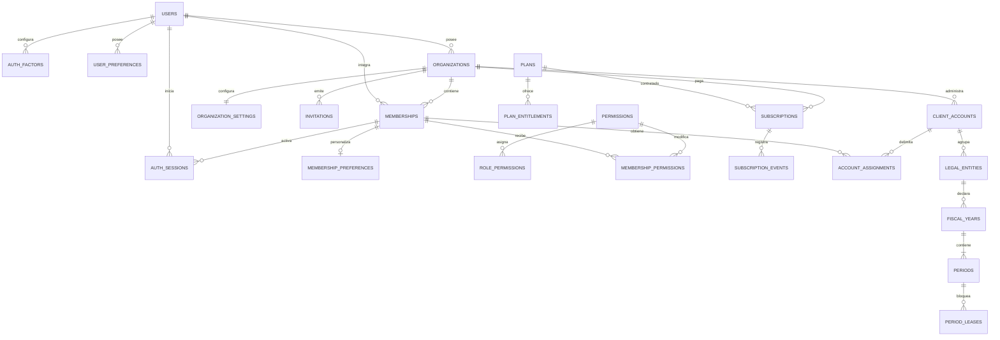
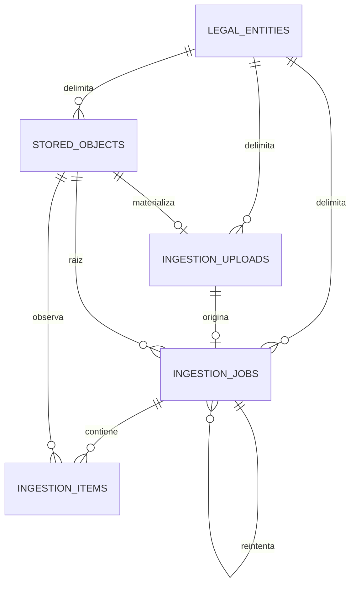
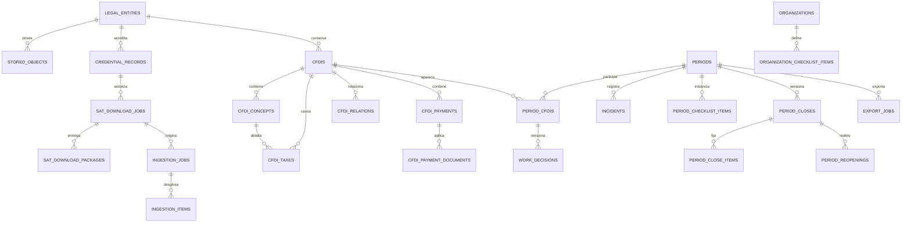
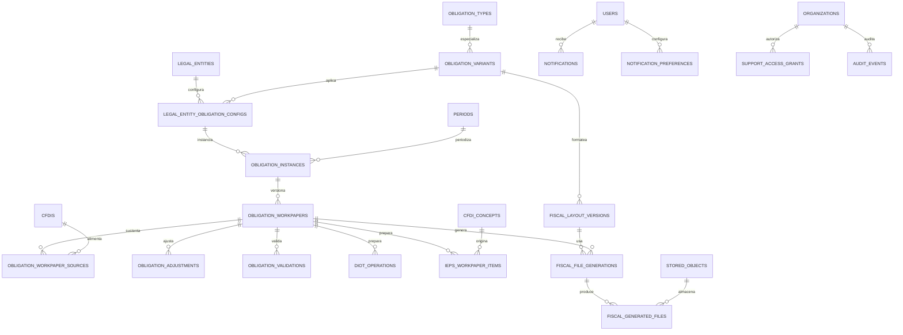

# Modelo de datos PostgreSQL corregido de Balanz

## 1. Metadatos

| Campo                | Valor                                                                                                     |
| -------------------- | --------------------------------------------------------------------------------------------------------- |
| Sistema              | Balanz por Hemia                                                                                          |
| Versión del modelo   | 4.1                                                                                                       |
| Fecha                | 28 de agosto de 2026                                                                                      |
| Estado               | Fase 0 ejecutable; dominio CFDI y fases posteriores `FUTURE / NOT_STARTED`                                |
| Alcance              | SaaS B2B multi-tenant, control mensual CFDI, colaboración, suscripción y preparación DIOT/IEPS            |
| PostgreSQL objetivo  | PostgreSQL 16 o superior                                                                                  |
| Persistencia binaria | Object storage privado; PostgreSQL conserva referencias, hashes, metadata y dominio                       |
| Migraciones F0       | `1787690600000-FiscalIngestionFoundation.ts` y `1787690610000-FiscalRlsWorkerClaims.ts`                   |
| Exclusiones actuales | Endpoint/parser/dominio CFDI, ZIP funcional, e.firma, SAT, mesa mensual, exportaciones y presentación SAT |

Supuestos: español de México es el único locale operativo; una cuenta cliente agrupa uno o varios RFC; la asignación del MVP es por cuenta; el cierre es interno; DIOT/IEPS producen archivos preparados, no declaraciones presentadas. Los layouts fiscales y reglas normativas requieren aprobación y vigencia explícitas.

Regla de lectura: sólo las cuatro tablas descritas como **F0 ejecutable** en
6.4–6.5 están implementadas por este programa. La migración TypeORM es la
autoridad exacta ante cualquier diferencia de formato. Todo DDL posterior
marcado `FUTURE / NOT_STARTED` es arquitectura objetivo, no schema existente ni
autorización para iniciar Fase 1.

## 2. Principios del modelo

1. **Identidad global:** `users` no contiene tenant ni concede acceso. Un correo normalizado identifica una persona y puede tener N membresías.
2. **Tenant explícito:** toda fila de negocio contiene `organization_id`; las FKs compuestas impiden relaciones cruzadas.
3. **Titularidad única:** sólo `organizations.owner_user_id` define al titular. “Titular” es una capacidad contextual, no un rol duplicado.
4. **Asignación explícita:** membresía no implica acceso fiscal. `account_assignments` concede alcance sobre una cuenta y sus RFC.
5. **Suscripción organizacional:** plan, trial, cobro y límites pertenecen al despacho.
6. **Original fiscal inmutable:** XML, campos CFDI, conceptos, impuestos y relaciones importados no se editan; decisiones humanas se versionan aparte.
7. **Decisiones y cierres reproducibles:** decisiones, ajustes, cierres, layouts, papeles y generaciones conservan versión, actor, corte y fuentes.
8. **Jobs durables e idempotentes:** SAT, ingesta, exportación y archivos fiscales sobreviven a reinicios y tienen claves de idempotencia propias.
9. **Object storage privado:** XML, ZIP, `.cer`, `.key`, previews y resultados viven cifrados fuera de PostgreSQL; no hay claves privadas descifradas ni contraseñas persistidas.
10. **Auditoría append-only:** los eventos críticos no se actualizan ni eliminan por el rol normal de aplicación.
11. **RLS como defensa adicional:** el backend sigue validando sesión, tenant, membresía, permiso, asignación, owner, MFA, reautenticación y estado.
12. **Sin EAV en el núcleo:** clientes, CFDI, períodos, permisos, DIOT e IEPS tienen columnas y relaciones explícitas.
13. **`jsonb` acotado:** sólo snapshots inmutables, parámetros normalizados, payloads externos redactados y definiciones de layout versionadas.

## 3. Jerarquía de dominio

La jerarquía completa expresa el destino del producto. En el alcance fiscal de
esta ejecución sólo están materializados `StoredObject`, `IngestionUpload`,
`IngestionJob` e `IngestionItem`; las ramas de credenciales, SAT, CFDI, período,
exportación y obligaciones permanecen `FUTURE / NOT_STARTED`.

```text
User (identidad global)
├── AuthFactor / AuthSession / UserPreference
└── Membership ── Organization (owner_user_id = fuente única)
    ├── MembershipPreference / Permission override
    ├── Subscription ── Plan ── Entitlements
    ├── Notification / SupportAccessGrant / AuditEvent
    └── AccountAssignment ── ClientAccount
        └── LegalEntity (RFC)
            ├── CredentialRecord / StoredObject
            ├── FiscalYear
            │   └── Period
            │       ├── PeriodLease
            │       ├── PeriodCFDI ── WorkDecision
            │       ├── Incident / Checklist
            │       ├── PeriodClose / Reopening
            │       ├── ExportJob
            │       └── ObligationInstance
            │           └── ObligationWorkpaper
            │               ├── SourceCFDI / Adjustment / Validation
            │               ├── DIOTOperation o IEPSWorkpaperItem
            │               └── FiscalFileGeneration ── GeneratedFile
            ├── SATDownloadJob ── Package ── IngestionJob
            └── CFDI ── concepts/taxes/relations/payments
```

## 4. Diagramas ER

### 4.1 Identidad, comercial y clientes



### 4.2 Fundación fiscal ejecutable — Fase 0



Cada relación fiscal usa el scope compuesto
`organization_id + client_account_id + legal_entity_id`; no existe FK a
`cfdis` en Fase 0.

### 4.3 Arquitectura objetivo de archivos, CFDI y cierre — FUTURE / NOT_STARTED



### 4.4 Obligaciones, colaboración y soporte — FUTURE / NOT_STARTED



## 5. Convenciones físicas

- IDs: `uuid`, generados por aplicación (UUIDv7 recomendado); no se depende de `uuid_generate_v4()`.
- Fechas: `timestamptz`; fecha civil fiscal, cuando corresponda, usa `date` y período usa `smallint` año/mes.
- Importes: `numeric(20,6)`; tipos de cambio/tasas `numeric(20,10)`; nunca `float`.
- Correo: `citext` o índice único `lower(email)`; se conserva el valor normalizado. RFC: mayúsculas sin espacios, `varchar(13)`, validación sintáctica en dominio/aplicación y `CHECK` conservador de longitud.
- Constraints: `pk_<tabla>`, `fk_<hija>_<padre>`, `uq_<tabla>_<campos>`, `ck_<tabla>_<regla>` e `ix_<tabla>_<campos>`.
- Estados: `varchar` + `CHECK` para state machines del dominio; catálogos para valores administrables. No se comparten enums entre dominios.
- Auditoría: `created_at`, `updated_at` donde hay mutación; `created_by_membership_id`/actor cuando la acción lo exige. Tablas append-only no tienen `updated_at`.
- Soft delete: `archived_at`, `revoked_at` o estado específico; `deleted_at` sólo para purga preparada. No se usa cascade destructivo sobre evidencia fiscal.
- Versionado: versión entera positiva única por agregado. Punteros “actuales” son aceleradores comprobados por trigger, no fuente independiente.
- Tenant: cada tabla tenant-owned tiene `organization_id NOT NULL` y `UNIQUE (organization_id,id)` si será padre. Las FKs internas incluyen `organization_id`.
- `jsonb`: cada columna documenta un propósito y, cuando sea crítico, un `schema_version`; nunca contiene secretos, XML completo ni importes que deban consultarse/validarse.
- Extensiones previstas: `citext` y `pg_trgm`. RLS se habilita antes de datos productivos.

En los DDL siguientes `REFERENCES ...` representa el contrato lógico. Las migraciones deberán ordenar la creación y agregar triggers diferibles para invariantes que PostgreSQL no puede expresar con un `CHECK` entre tablas, especialmente owner-membresía, decisión vigente y coincidencia período/CFDI.

## 6. Catálogo completo y DDL lógico

### 6.1 Identidad, autorización y preferencias

#### `users`

```sql
CREATE TABLE users (
  id uuid CONSTRAINT pk_users PRIMARY KEY,
  first_name varchar(100) NOT NULL,
  last_name varchar(100) NOT NULL,
  email citext NOT NULL CONSTRAINT uq_users_email UNIQUE,
  email_verified_at timestamptz,
  phone_e164 varchar(16), phone_verified_at timestamptz,
  password_hash text,
  auth_provider varchar(40), auth_subject varchar(255),
  locale varchar(10) NOT NULL DEFAULT 'es-MX',
  timezone varchar(64) NOT NULL DEFAULT 'America/Mexico_City',
  status varchar(20) NOT NULL DEFAULT 'active',
  last_login_at timestamptz,
  created_at timestamptz NOT NULL DEFAULT now(),
  updated_at timestamptz NOT NULL DEFAULT now(),
  deleted_at timestamptz,
  CONSTRAINT uq_users_provider_subject UNIQUE (auth_provider, auth_subject),
  CONSTRAINT ck_users_status CHECK (status IN ('active','suspended')),
  CONSTRAINT ck_users_locale CHECK (locale = 'es-MX'),
  CONSTRAINT ck_users_auth CHECK ((auth_provider IS NULL)=(auth_subject IS NULL)
    AND (password_hash IS NOT NULL OR (auth_provider IS NOT NULL AND auth_subject IS NOT NULL)))
);
CREATE INDEX ix_users_status_last_login ON users(status,last_login_at);
```

#### `user_preferences`

```sql
CREATE TABLE user_preferences (
  user_id uuid CONSTRAINT pk_user_preferences PRIMARY KEY REFERENCES users(id),
  theme varchar(12) NOT NULL DEFAULT 'system',
  table_density varchar(12),
  created_at timestamptz NOT NULL DEFAULT now(), updated_at timestamptz NOT NULL DEFAULT now(),
  CONSTRAINT ck_user_preferences_theme CHECK (theme IN ('light','dark','system')),
  CONSTRAINT ck_user_preferences_density CHECK (table_density IS NULL OR table_density IN ('comfortable','compact'))
);
```

#### `auth_factors`

```sql
CREATE TABLE auth_factors (
  id uuid CONSTRAINT pk_auth_factors PRIMARY KEY,
  user_id uuid NOT NULL REFERENCES users(id),
  provider varchar(40) NOT NULL, provider_factor_ref varchar(255) NOT NULL,
  factor_type varchar(24) NOT NULL, status varchar(20) NOT NULL DEFAULT 'pending',
  verified_at timestamptz, last_used_at timestamptz, revoked_at timestamptz,
  created_at timestamptz NOT NULL DEFAULT now(),
  CONSTRAINT uq_auth_factors_provider_ref UNIQUE (provider,provider_factor_ref),
  CONSTRAINT ck_auth_factors_type CHECK (factor_type IN ('totp','webauthn','sms','provider_mfa')),
  CONSTRAINT ck_auth_factors_status CHECK (status IN ('pending','active','revoked'))
);
CREATE INDEX ix_auth_factors_user_status ON auth_factors(user_id,status);
```

#### `organizations`

```sql
CREATE TABLE organizations (
  id uuid CONSTRAINT pk_organizations PRIMARY KEY,
  name varchar(160) NOT NULL, legal_name varchar(200), slug citext NOT NULL,
  owner_user_id uuid NOT NULL REFERENCES users(id),
  billing_email citext, timezone varchar(64) NOT NULL DEFAULT 'America/Mexico_City',
  status varchar(20) NOT NULL DEFAULT 'active', suspended_at timestamptz, cancelled_at timestamptz,
  created_at timestamptz NOT NULL DEFAULT now(), updated_at timestamptz NOT NULL DEFAULT now(),
  CONSTRAINT uq_organizations_slug UNIQUE (slug),
  CONSTRAINT ck_organizations_status CHECK (status IN ('active','suspended','cancelled'))
);
CREATE INDEX ix_organizations_owner ON organizations(owner_user_id,status);
```

#### `organization_settings`

```sql
CREATE TABLE organization_settings (
  organization_id uuid CONSTRAINT pk_organization_settings PRIMARY KEY REFERENCES organizations(id),
  operational_email citext, default_period_strategy varchar(24) NOT NULL DEFAULT 'current_month',
  retention_policy_code varchar(48), support_contact_email citext,
  created_at timestamptz NOT NULL DEFAULT now(), updated_at timestamptz NOT NULL DEFAULT now(),
  CONSTRAINT ck_organization_settings_period CHECK (default_period_strategy IN ('current_month','last_open','manual'))
);
```

#### `memberships`

```sql
CREATE TABLE memberships (
  id uuid CONSTRAINT pk_memberships PRIMARY KEY,
  organization_id uuid NOT NULL REFERENCES organizations(id), user_id uuid NOT NULL REFERENCES users(id),
  role varchar(24) NOT NULL, status varchar(20) NOT NULL DEFAULT 'pending',
  invited_at timestamptz, joined_at timestamptz, suspended_at timestamptz, revoked_at timestamptz,
  created_at timestamptz NOT NULL DEFAULT now(), updated_at timestamptz NOT NULL DEFAULT now(),
  CONSTRAINT uq_memberships_org_user UNIQUE (organization_id,user_id),
  CONSTRAINT uq_memberships_org_id UNIQUE (organization_id,id),
  CONSTRAINT ck_memberships_role CHECK (role IN ('admin','accountant','collaborator')),
  CONSTRAINT ck_memberships_status CHECK (status IN ('pending','active','suspended','revoked'))
);
CREATE INDEX ix_memberships_user_status ON memberships(user_id,status);
CREATE INDEX ix_memberships_org_status ON memberships(organization_id,status);
```

#### `membership_preferences`

```sql
CREATE TABLE membership_preferences (
  organization_id uuid NOT NULL, membership_id uuid CONSTRAINT pk_membership_preferences PRIMARY KEY,
  default_client_account_id uuid, default_period varchar(7), timezone_override varchar(64),
  created_at timestamptz NOT NULL DEFAULT now(), updated_at timestamptz NOT NULL DEFAULT now(),
  CONSTRAINT fk_membership_preferences_membership FOREIGN KEY (organization_id,membership_id)
    REFERENCES memberships(organization_id,id),
  CONSTRAINT ck_membership_preferences_period CHECK (default_period IS NULL OR default_period ~ '^[0-9]{4}-(0[1-9]|1[0-2])$')
);
```

#### `invitations`

```sql
CREATE TABLE invitations (
  id uuid CONSTRAINT pk_invitations PRIMARY KEY, organization_id uuid NOT NULL,
  email_normalized citext NOT NULL, proposed_role varchar(24) NOT NULL,
  token_hash char(64) NOT NULL, idempotency_key varchar(128) NOT NULL,
  status varchar(20) NOT NULL DEFAULT 'pending', invited_by_membership_id uuid NOT NULL,
  accepted_membership_id uuid, expires_at timestamptz NOT NULL, last_sent_at timestamptz,
  send_count integer NOT NULL DEFAULT 0, accepted_at timestamptz, revoked_at timestamptz,
  created_at timestamptz NOT NULL DEFAULT now(), updated_at timestamptz NOT NULL DEFAULT now(),
  CONSTRAINT uq_invitations_token UNIQUE (token_hash),
  CONSTRAINT uq_invitations_org_idempotency UNIQUE (organization_id,idempotency_key),
  CONSTRAINT fk_invitations_actor FOREIGN KEY (organization_id,invited_by_membership_id) REFERENCES memberships(organization_id,id),
  CONSTRAINT fk_invitations_accepted FOREIGN KEY (organization_id,accepted_membership_id) REFERENCES memberships(organization_id,id),
  CONSTRAINT ck_invitations_role CHECK (proposed_role IN ('admin','accountant','collaborator')),
  CONSTRAINT ck_invitations_status CHECK (status IN ('pending','accepted','expired','revoked')),
  CONSTRAINT ck_invitations_send_count CHECK (send_count >= 0)
);
CREATE UNIQUE INDEX uq_invitations_pending_email ON invitations(organization_id,email_normalized) WHERE status='pending';
CREATE INDEX ix_invitations_expiry ON invitations(status,expires_at);
```

#### `auth_sessions`

```sql
CREATE TABLE auth_sessions (
  id uuid CONSTRAINT pk_auth_sessions PRIMARY KEY, session_token_hash char(64) NOT NULL,
  user_id uuid NOT NULL REFERENCES users(id), organization_id uuid, membership_id uuid,
  status varchar(20) NOT NULL DEFAULT 'active', mfa_verified_at timestamptz,
  reauthenticated_at timestamptz, expires_at timestamptz NOT NULL, last_activity_at timestamptz NOT NULL,
  ip_address inet, user_agent text, revoked_reason varchar(200), revoked_at timestamptz,
  created_at timestamptz NOT NULL DEFAULT now(),
  CONSTRAINT uq_auth_sessions_token UNIQUE (session_token_hash),
  CONSTRAINT fk_auth_sessions_membership FOREIGN KEY (organization_id,membership_id) REFERENCES memberships(organization_id,id),
  CONSTRAINT ck_auth_sessions_context CHECK ((organization_id IS NULL) = (membership_id IS NULL)),
  CONSTRAINT ck_auth_sessions_status CHECK (status IN ('active','expired','revoked'))
);
CREATE INDEX ix_auth_sessions_user_active ON auth_sessions(user_id,expires_at) WHERE status='active';
CREATE INDEX ix_auth_sessions_membership_active ON auth_sessions(organization_id,membership_id,expires_at) WHERE status='active';
```

#### `permissions`, `role_permissions`, `membership_permissions`

```sql
CREATE TABLE permissions (
  id uuid CONSTRAINT pk_permissions PRIMARY KEY, key varchar(80) NOT NULL,
  description varchar(240) NOT NULL, sensitive boolean NOT NULL DEFAULT false,
  requires_mfa boolean NOT NULL DEFAULT true, requires_reauthentication boolean NOT NULL DEFAULT false,
  status varchar(16) NOT NULL DEFAULT 'active', created_at timestamptz NOT NULL DEFAULT now(), updated_at timestamptz NOT NULL DEFAULT now(),
  CONSTRAINT uq_permissions_key UNIQUE (key),
  CONSTRAINT ck_permissions_key CHECK (key ~ '^[a-z][a-z0-9_-]*\.[a-z][a-z0-9_-]*$'),
  CONSTRAINT ck_permissions_status CHECK (status IN ('active','deprecated','disabled'))
);

CREATE TABLE role_permissions (
  role varchar(24) NOT NULL, permission_id uuid NOT NULL REFERENCES permissions(id), enabled boolean NOT NULL DEFAULT true,
  valid_from timestamptz NOT NULL DEFAULT now(), valid_until timestamptz,
  created_at timestamptz NOT NULL DEFAULT now(), updated_at timestamptz NOT NULL DEFAULT now(),
  CONSTRAINT pk_role_permissions PRIMARY KEY (role,permission_id,valid_from),
  CONSTRAINT ck_role_permissions_role CHECK (role IN ('admin','accountant','collaborator')),
  CONSTRAINT ck_role_permissions_range CHECK (valid_until IS NULL OR valid_until > valid_from)
);

CREATE TABLE membership_permissions (
  id uuid CONSTRAINT pk_membership_permissions PRIMARY KEY, organization_id uuid NOT NULL,
  membership_id uuid NOT NULL, permission_id uuid NOT NULL REFERENCES permissions(id),
  effect varchar(8) NOT NULL, granted_by_membership_id uuid NOT NULL, granted_at timestamptz NOT NULL DEFAULT now(),
  revoked_by_membership_id uuid, revoked_at timestamptz, reason varchar(300),
  CONSTRAINT uq_membership_permissions_org_id UNIQUE (organization_id,id),
  CONSTRAINT fk_membership_permissions_subject FOREIGN KEY (organization_id,membership_id) REFERENCES memberships(organization_id,id),
  CONSTRAINT fk_membership_permissions_granter FOREIGN KEY (organization_id,granted_by_membership_id) REFERENCES memberships(organization_id,id),
  CONSTRAINT fk_membership_permissions_revoker FOREIGN KEY (organization_id,revoked_by_membership_id) REFERENCES memberships(organization_id,id),
  CONSTRAINT ck_membership_permissions_effect CHECK (effect IN ('grant','deny'))
);
CREATE UNIQUE INDEX uq_membership_permissions_active ON membership_permissions(organization_id,membership_id,permission_id) WHERE revoked_at IS NULL;
```

### 6.2 Comercial

#### `plans`, `plan_entitlements`, `subscriptions`, `subscription_events`

```sql
CREATE TABLE plans (
  id uuid CONSTRAINT pk_plans PRIMARY KEY, code varchar(48) NOT NULL, name varchar(120) NOT NULL,
  version integer NOT NULL, currency char(3) NOT NULL DEFAULT 'MXN', price numeric(20,6) NOT NULL,
  billing_interval varchar(16) NOT NULL, status varchar(16) NOT NULL DEFAULT 'active',
  valid_from timestamptz NOT NULL, valid_until timestamptz, created_at timestamptz NOT NULL DEFAULT now(),
  CONSTRAINT uq_plans_code_version UNIQUE (code,version),
  CONSTRAINT ck_plans_price CHECK (price >= 0),
  CONSTRAINT ck_plans_interval CHECK (billing_interval IN ('monthly','annual')),
  CONSTRAINT ck_plans_status CHECK (status IN ('draft','active','retired'))
);

CREATE TABLE plan_entitlements (
  id uuid CONSTRAINT pk_plan_entitlements PRIMARY KEY, plan_id uuid NOT NULL REFERENCES plans(id),
  entitlement_key varchar(80) NOT NULL, value_type varchar(12) NOT NULL,
  boolean_value boolean, numeric_value numeric(20,6), text_value varchar(200),
  created_at timestamptz NOT NULL DEFAULT now(),
  CONSTRAINT uq_plan_entitlements_key UNIQUE (plan_id,entitlement_key),
  CONSTRAINT ck_plan_entitlements_type CHECK (value_type IN ('boolean','number','text')),
  CONSTRAINT ck_plan_entitlements_one_value CHECK (
    (value_type='boolean' AND boolean_value IS NOT NULL AND numeric_value IS NULL AND text_value IS NULL) OR
    (value_type='number' AND numeric_value IS NOT NULL AND boolean_value IS NULL AND text_value IS NULL) OR
    (value_type='text' AND text_value IS NOT NULL AND boolean_value IS NULL AND numeric_value IS NULL))
);

CREATE TABLE subscriptions (
  id uuid CONSTRAINT pk_subscriptions PRIMARY KEY, organization_id uuid NOT NULL REFERENCES organizations(id),
  plan_id uuid NOT NULL REFERENCES plans(id), status varchar(20) NOT NULL DEFAULT 'pending',
  provider varchar(40), provider_customer_ref varchar(255), provider_subscription_ref varchar(255),
  trial_starts_at timestamptz, trial_ends_at timestamptz, current_period_starts_at timestamptz,
  current_period_ends_at timestamptz, grace_ends_at timestamptz, cancel_at_period_end boolean NOT NULL DEFAULT false,
  cancelled_at timestamptz, payment_method_label varchar(80), lock_version integer NOT NULL DEFAULT 0,
  created_at timestamptz NOT NULL DEFAULT now(), updated_at timestamptz NOT NULL DEFAULT now(),
  CONSTRAINT uq_subscriptions_org_id UNIQUE (organization_id,id),
  CONSTRAINT uq_subscriptions_provider_ref UNIQUE (provider,provider_subscription_ref),
  CONSTRAINT ck_subscriptions_status CHECK (status IN ('pending','trialing','active','grace','suspended','cancelled')),
  CONSTRAINT ck_subscriptions_trial CHECK (trial_ends_at IS NULL OR trial_starts_at IS NOT NULL AND trial_ends_at > trial_starts_at)
);
CREATE UNIQUE INDEX uq_subscriptions_current_org ON subscriptions(organization_id) WHERE status IN ('pending','trialing','active','grace','suspended');

CREATE TABLE subscription_events (
  id uuid CONSTRAINT pk_subscription_events PRIMARY KEY, organization_id uuid NOT NULL,
  subscription_id uuid NOT NULL, provider varchar(40), provider_event_ref varchar(255),
  event_type varchar(80) NOT NULL, previous_status varchar(20), resulting_status varchar(20),
  effective_at timestamptz NOT NULL, payload_snapshot jsonb NOT NULL DEFAULT '{}'::jsonb,
  received_at timestamptz NOT NULL DEFAULT now(), processed_at timestamptz,
  CONSTRAINT fk_subscription_events_subscription FOREIGN KEY (organization_id,subscription_id) REFERENCES subscriptions(organization_id,id),
  CONSTRAINT uq_subscription_events_provider UNIQUE (provider,provider_event_ref)
);
CREATE INDEX ix_subscription_events_subscription_time ON subscription_events(organization_id,subscription_id,effective_at DESC);
```

### 6.3 Clientes, entidades fiscales, ejercicios y períodos

#### `client_accounts`

```sql
CREATE TABLE client_accounts (
  id uuid CONSTRAINT pk_client_accounts PRIMARY KEY, organization_id uuid NOT NULL REFERENCES organizations(id),
  code varchar(40), name varchar(160) NOT NULL, legal_name varchar(200), external_reference varchar(120),
  contact_name varchar(160), contact_email citext, contact_phone varchar(24),
  status varchar(16) NOT NULL DEFAULT 'active', created_at timestamptz NOT NULL DEFAULT now(),
  updated_at timestamptz NOT NULL DEFAULT now(), archived_at timestamptz,
  CONSTRAINT uq_client_accounts_org_id UNIQUE (organization_id,id),
  CONSTRAINT ck_client_accounts_status CHECK (status IN ('active','suspended','archived'))
);
CREATE UNIQUE INDEX uq_client_accounts_code ON client_accounts(organization_id,code) WHERE code IS NOT NULL AND archived_at IS NULL;
CREATE INDEX ix_client_accounts_name_trgm ON client_accounts USING gin (name gin_trgm_ops);
```

#### `account_assignments`

```sql
CREATE TABLE account_assignments (
  id uuid CONSTRAINT pk_account_assignments PRIMARY KEY, organization_id uuid NOT NULL,
  client_account_id uuid NOT NULL, membership_id uuid NOT NULL,
  responsibility varchar(20) NOT NULL DEFAULT 'collaborator', status varchar(16) NOT NULL DEFAULT 'active',
  assigned_by_membership_id uuid NOT NULL, assigned_at timestamptz NOT NULL DEFAULT now(),
  revoked_by_membership_id uuid, revoked_at timestamptz, revocation_reason varchar(300),
  CONSTRAINT uq_account_assignments_org_id UNIQUE (organization_id,id),
  CONSTRAINT fk_account_assignments_account FOREIGN KEY (organization_id,client_account_id) REFERENCES client_accounts(organization_id,id),
  CONSTRAINT fk_account_assignments_member FOREIGN KEY (organization_id,membership_id) REFERENCES memberships(organization_id,id),
  CONSTRAINT fk_account_assignments_assigner FOREIGN KEY (organization_id,assigned_by_membership_id) REFERENCES memberships(organization_id,id),
  CONSTRAINT fk_account_assignments_revoker FOREIGN KEY (organization_id,revoked_by_membership_id) REFERENCES memberships(organization_id,id),
  CONSTRAINT ck_account_assignments_responsibility CHECK (responsibility IN ('primary','collaborator','reviewer')),
  CONSTRAINT ck_account_assignments_status CHECK (status IN ('active','revoked'))
);
CREATE UNIQUE INDEX uq_account_assignments_active ON account_assignments(organization_id,client_account_id,membership_id) WHERE status='active';
CREATE UNIQUE INDEX uq_account_assignments_primary ON account_assignments(organization_id,client_account_id) WHERE status='active' AND responsibility='primary';
CREATE INDEX ix_account_assignments_member ON account_assignments(organization_id,membership_id,status);
```

#### `legal_entities`

```sql
CREATE TABLE legal_entities (
  id uuid CONSTRAINT pk_legal_entities PRIMARY KEY, organization_id uuid NOT NULL, client_account_id uuid NOT NULL,
  rfc varchar(13) NOT NULL, legal_name varchar(200) NOT NULL, trade_name varchar(160),
  taxpayer_type varchar(16) NOT NULL, fiscal_postal_code varchar(5),
  status varchar(16) NOT NULL DEFAULT 'active', created_at timestamptz NOT NULL DEFAULT now(),
  updated_at timestamptz NOT NULL DEFAULT now(), archived_at timestamptz,
  CONSTRAINT uq_legal_entities_org_id UNIQUE (organization_id,id),
  CONSTRAINT uq_legal_entities_scope_id UNIQUE (organization_id,client_account_id,id),
  CONSTRAINT fk_legal_entities_account FOREIGN KEY (organization_id,client_account_id) REFERENCES client_accounts(organization_id,id),
  CONSTRAINT ck_legal_entities_rfc CHECK (rfc=upper(rfc) AND length(rfc) BETWEEN 12 AND 13),
  CONSTRAINT ck_legal_entities_type CHECK (taxpayer_type IN ('individual','company')),
  CONSTRAINT ck_legal_entities_status CHECK (status IN ('active','suspended','archived'))
);
CREATE UNIQUE INDEX uq_legal_entities_active_rfc ON legal_entities(organization_id,rfc) WHERE archived_at IS NULL;
CREATE INDEX ix_legal_entities_rfc ON legal_entities(organization_id,rfc);
```

`tax_regime` no se conserva como un string eterno: las obligaciones y su vigencia viven en `legal_entity_obligation_configs`. Si se requiere un historial general de regímenes distinto de obligaciones, se añadirá un catálogo específico cuando exista contrato fiscal aprobado.

#### `fiscal_years`

```sql
CREATE TABLE fiscal_years (
  id uuid CONSTRAINT pk_fiscal_years PRIMARY KEY, organization_id uuid NOT NULL,
  client_account_id uuid NOT NULL, legal_entity_id uuid NOT NULL, year smallint NOT NULL,
  status varchar(16) NOT NULL DEFAULT 'active', created_at timestamptz NOT NULL DEFAULT now(),
  updated_at timestamptz NOT NULL DEFAULT now(), archived_at timestamptz,
  CONSTRAINT uq_fiscal_years_entity_year UNIQUE (legal_entity_id,year),
  CONSTRAINT uq_fiscal_years_scope_id UNIQUE (organization_id,client_account_id,legal_entity_id,id),
  CONSTRAINT fk_fiscal_years_entity FOREIGN KEY (organization_id,client_account_id,legal_entity_id)
    REFERENCES legal_entities(organization_id,client_account_id,id),
  CONSTRAINT ck_fiscal_years_year CHECK (year BETWEEN 2000 AND 2200),
  CONSTRAINT ck_fiscal_years_status CHECK (status IN ('active','closed','archived'))
);
CREATE INDEX ix_fiscal_years_org_year ON fiscal_years(organization_id,year,status);
```

#### `periods`

```sql
CREATE TABLE periods (
  id uuid CONSTRAINT pk_periods PRIMARY KEY, organization_id uuid NOT NULL,
  client_account_id uuid NOT NULL, legal_entity_id uuid NOT NULL, fiscal_year_id uuid NOT NULL,
  month smallint NOT NULL, status varchar(24) NOT NULL DEFAULT 'not_started', cutoff_at timestamptz,
  lock_version integer NOT NULL DEFAULT 0, current_close_id uuid,
  created_at timestamptz NOT NULL DEFAULT now(), updated_at timestamptz NOT NULL DEFAULT now(),
  CONSTRAINT uq_periods_year_month UNIQUE (fiscal_year_id,month),
  CONSTRAINT uq_periods_org_id UNIQUE (organization_id,id),
  CONSTRAINT uq_periods_scope_id UNIQUE (organization_id,client_account_id,legal_entity_id,id),
  CONSTRAINT fk_periods_year FOREIGN KEY (organization_id,client_account_id,legal_entity_id,fiscal_year_id)
    REFERENCES fiscal_years(organization_id,client_account_id,legal_entity_id,id),
  CONSTRAINT ck_periods_month CHECK (month BETWEEN 1 AND 12),
  CONSTRAINT ck_periods_lock CHECK (lock_version >= 0),
  CONSTRAINT ck_periods_status CHECK (status IN ('not_started','preparing','in_review','ready_to_close','closed','has_updates','reopened','blocked'))
);
CREATE INDEX ix_periods_portfolio ON periods(organization_id,status,updated_at DESC);
```

`current_close_id` se agrega como FK diferible después de crear `period_closes`; un trigger verifica que apunte al mismo período. Sólo acelera la lectura del cierre vigente.

#### `period_leases`

```sql
CREATE TABLE period_leases (
  id uuid CONSTRAINT pk_period_leases PRIMARY KEY, organization_id uuid NOT NULL,
  period_id uuid NOT NULL, membership_id uuid NOT NULL, status varchar(16) NOT NULL DEFAULT 'active',
  acquired_at timestamptz NOT NULL DEFAULT now(), renewed_at timestamptz NOT NULL DEFAULT now(),
  expires_at timestamptz NOT NULL, released_at timestamptz, takeover_reason varchar(300),
  displaced_lease_id uuid, base_lock_version integer NOT NULL,
  CONSTRAINT uq_period_leases_org_id UNIQUE (organization_id,id),
  CONSTRAINT fk_period_leases_period FOREIGN KEY (organization_id,period_id) REFERENCES periods(organization_id,id),
  CONSTRAINT fk_period_leases_member FOREIGN KEY (organization_id,membership_id) REFERENCES memberships(organization_id,id),
  CONSTRAINT fk_period_leases_displaced FOREIGN KEY (organization_id,displaced_lease_id) REFERENCES period_leases(organization_id,id),
  CONSTRAINT ck_period_leases_status CHECK (status IN ('active','released','expired','displaced')),
  CONSTRAINT ck_period_leases_expiry CHECK (expires_at > acquired_at)
);
CREATE UNIQUE INDEX uq_period_leases_active ON period_leases(organization_id,period_id) WHERE status='active';
CREATE INDEX ix_period_leases_expiry ON period_leases(status,expires_at);
```

### 6.4 Archivos fundacionales — F0 ejecutable

#### `stored_objects`

`FiscalIngestionFoundation1787690600000` crea exactamente estas columnas:

- identidad/scope: `id`, `organization_id`, `client_account_id`,
  `legal_entity_id`;
- ubicación e integridad: `kind`, `storage_provider`, `storage_container`,
  `object_key`, `original_filename`, `declared_mime_type`,
  `detected_mime_type`, `size_bytes`, `sha256`, `storage_etag`,
  `storage_version_id`, `encryption_class`;
- lifecycle/scanner: `lifecycle_state`, `malware_scan_status`,
  `malware_scanner_version`, `malware_scanned_at`,
  `quarantine_reason_code`, `retention_until`, `hold_until`,
  `redundant_reported_at`, `retention_eligible_reported_at`, `uploaded_at`,
  `available_at`, `deleted_at`;
- control: `version`, `created_at`, `updated_at`.

El scope completo es obligatorio. Las candidate keys son
`uq_stored_objects_org_id`, `uq_stored_objects_scope_id` y
`uq_stored_objects_storage_location`; la FK
`fk_stored_objects_legal_entity` usa las tres columnas de scope. Los checks
ejecutables son `ck_stored_objects_kind`, `provider`, `container`,
`encryption_class`, `lifecycle_state`, `scan_status`, `size`, `sha256`,
`object_key`, `filename`, `payload_state`, `deleted_state`, `available_scan`,
`scan_timestamp`, `quarantine_reason` y `version` (todos con el prefijo
`ck_stored_objects_`).

Los índices son `ix_stored_objects_scope_hash`,
`ix_stored_objects_lifecycle_updated` e `ix_stored_objects_retention`. El
trigger `trg_stored_objects_immutability` llama a
`enforce_stored_object_immutability()` y bloquea cambios de identidad/ubicación
y de hash/tamaño/versiones físicas después de confirmar los bytes.

`credential_records` es `FUTURE / PHASE_3 / NOT_STARTED`. No existe tabla de
credenciales, password, llave privada ni grant de reauth en Fase 0.

### 6.5 Plataforma de ingesta durable — F0 ejecutable

#### `ingestion_uploads`

Columnas exactas: `id`, scope completo, `workflow`, `upload_type`,
`init_idempotency_key`, `init_request_fingerprint`, `init_response_status`,
`init_response_reference`, `init_idempotency_expires_at`,
`confirm_idempotency_key`, `confirm_request_fingerprint`,
`confirm_response_status`, `confirm_response_reference`,
`confirm_idempotency_created_at`, `confirm_idempotency_expires_at`,
`object_id`, `state`, `expected_size_bytes`, `expected_sha256`,
`actual_size_bytes`, `actual_sha256`, `upload_expires_at`, `confirmed_at`,
`confirmed_without_job_reported_at`, `created_by_membership_id`,
`correlation_id`, `last_error_code`, `version`, `created_at`, `updated_at`.

Constraints: PK; candidate keys `uq_ingestion_uploads_org_id`,
`uq_ingestion_uploads_scope_id`, `uq_ingestion_uploads_object` y
`uq_ingestion_uploads_init_idempotency`; FKs compuestas a entidad, objeto y
membresía; checks de workflow, tipo, estado, ambas idempotencias, hashes,
tamaños, expiración, confirmación/payload, status de respuesta y versión. Los
índices son `ix_ingestion_uploads_expiration`,
`ix_ingestion_uploads_scope_state` y el unique parcial
`uq_ingestion_uploads_confirm_idempotency`.

#### `ingestion_jobs`

Columnas exactas: `id`, scope completo, `source_type`, `upload_id`,
`root_object_id`, `requested_by_membership_id`, `retry_of_job_id`,
`idempotency_key`, `request_fingerprint`, `response_status`,
`response_reference`, `idempotency_expires_at`, `status`, `current_stage`, los
nueve contadores (`total`, `pending`, `processing`, `incorporated`, `duplicate`,
`foreign`, `invalid`, `unsupported`, `internal_error`),
`counters_reconciled_at`, `attempt_count`, `automatic_retry_count`,
`next_attempt_at`, `worker_id`,
`locked_by`, `lease_expires_at`, `heartbeat_at`, `last_claimed_at`,
`cancel_requested_at`, `started_at`, `completed_at`, `last_error_code`,
`last_error_detail`, `correlation_id`, `version`, `created_at`, `updated_at`.

Constraints: PK; candidate keys `uq_ingestion_jobs_org_id`,
`uq_ingestion_jobs_scope_id`, `uq_ingestion_jobs_idempotency`; FKs compuestas a
entidad, objeto raíz, upload, membresía solicitante y job reintentado; checks de
source/shape, estados, etapa, idempotencia/fingerprint, status de respuesta,
contador de claims monotónico, presupuesto de tres retries, IDs de worker,
contadores, lease/unlock, cancelación,
terminalidad, retry schedule, self-retry, expiración y versión. Los índices son
`ix_ingestion_jobs_claim`, `active_tenant`, `counter_reconcile`,
`tenant_fairness`, `scope_status`, `requested_by_status`, `root_object` y
`retry_of` (todos con prefijo `ix_ingestion_jobs_`).

Estados ejecutables: `awaiting_upload`, `queued`, `processing`, `completed`,
`completed_with_issues`, `failed_retryable`, `failed_final`,
`cancel_requested`, `cancelled`. Las etapas reservadas son `scanning`,
`extracting`, `parsing` y `persisting`; reservarlas no registra un handler
productivo ni inicia XML/ZIP/SAT.

#### `ingestion_items`

Columnas exactas: `id`, scope completo, `ingestion_job_id`, `object_id`,
`ordinal`, `safe_filename`, `technical_status`, `product_result`, `sha256`,
`error_code`, `safe_error_detail`, `attempt_count`, `observed_at`,
`processed_at`, `version`, `created_at`, `updated_at`. No existen `cfdi_id`,
UUID/RFC candidatos, versión CFDI ni versión de parser en Fase 0.

Constraints: PK; candidate keys `uq_ingestion_items_org_id`,
`uq_ingestion_items_scope_id`, `uq_ingestion_items_job_ordinal`; FKs compuestas
a job y objeto; checks de ordinal, estado técnico, resultado reservado, hash,
intentos, coherencia terminal/error, filename seguro y versión. Los índices son
`ix_ingestion_items_job_status`, `ix_ingestion_items_job_updated` e
`ix_ingestion_items_object`.

#### RLS, roles y funciones de las migraciones 061/062

Las cuatro tablas tienen `ENABLE ROW LEVEL SECURITY`,
`FORCE ROW LEVEL SECURITY`, revocación a `PUBLIC` y políticas
`<tabla>_api_tenant_isolation` / `<tabla>_worker_tenant_isolation`. El contexto
usa `app.organization_id` y `app.membership_id`; ausente, vacío o UUID inválido
falla cerrado. `ingestion_jobs_cancel_tenant_isolation` delimita la cancelación
del usuario.

Los grupos runtime `balanz_api` y `balanz_worker` son `NOLOGIN` y
`NOBYPASSRLS`. Los owners técnicos son `NOLOGIN`: el owner de tablas y el owner
de cancelación son `NOBYPASSRLS`; sólo los owners aislados de claim y
reconciliación tienen `BYPASSRLS`, no son heredables ni se conceden a LOGINs y
carecen de `CREATE` en el schema al terminar la migración.

Funciones ejecutables, con `search_path` fijo y grants mínimos:

- `claim_ingestion_job(text,text,text[],integer,integer,integer,integer)` — claim
  atómico con fairness, advisory lock por tenant, `FOR UPDATE SKIP LOCKED`,
  lease exacto de 90 s, tres retries durables y retorno de scope mínimo;
- `ingestion_queue_ages(text[],integer,integer)` — sólo edades agregadas por
  source;
- `request_ingestion_job_cancellation(uuid)` — cancelación tenant-scoped y
  auditada;
- `reconcile_fiscal_ingestion_foundation(integer,integer,integer,integer,integer[],integer,integer,integer)`
  — leases, uploads/objetos/jobs huérfanos, contadores y lifecycle en batches;
- `mark_ingestion_job_counters_dirty()` mediante
  `trg_ingestion_items_mark_counters_dirty`.

`sat_download_jobs`, `sat_download_packages` y `export_jobs` son
`FUTURE / NOT_STARTED` (Fases 4 y 6). No existen en
`FiscalIngestionFoundation1787690600000` ni
`FiscalRlsWorkerClaims1787690610000`.

### 6.6 CFDI, conceptos, impuestos, relaciones y trabajo mensual — FUTURE / NOT_STARTED

Todo el DDL de esta sección es objetivo de Fases 1 y 5. Ninguna de estas tablas
existe ni debe migrarse durante Fase 0.

#### `cfdis`

```sql
CREATE TABLE cfdis (
  id uuid CONSTRAINT pk_cfdis PRIMARY KEY, organization_id uuid NOT NULL,
  client_account_id uuid NOT NULL, legal_entity_id uuid NOT NULL, uuid char(36) NOT NULL,
  xml_object_id uuid, source varchar(20) NOT NULL, metadata_only boolean NOT NULL DEFAULT false,
  record_status varchar(16) NOT NULL DEFAULT 'active', cfdi_type varchar(12) NOT NULL,
  direction varchar(12) NOT NULL, version varchar(10), issued_at timestamptz, certified_at timestamptz,
  issuer_rfc varchar(13) NOT NULL, issuer_name varchar(300), receiver_rfc varchar(13) NOT NULL, receiver_name varchar(300),
  series varchar(40), folio varchar(80), currency char(3), exchange_rate numeric(20,10),
  subtotal numeric(20,6), discount numeric(20,6), total numeric(20,6),
  payment_method varchar(8), payment_form varchar(8), usage_code varchar(8),
  sat_status varchar(24), sat_status_checked_at timestamptz,
  first_seen_at timestamptz NOT NULL DEFAULT now(), created_at timestamptz NOT NULL DEFAULT now(), updated_at timestamptz NOT NULL DEFAULT now(),
  CONSTRAINT uq_cfdis_entity_uuid UNIQUE (legal_entity_id,uuid),
  CONSTRAINT uq_cfdis_org_id UNIQUE (organization_id,id),
  CONSTRAINT uq_cfdis_scope_id UNIQUE (organization_id,client_account_id,legal_entity_id,id),
  CONSTRAINT fk_cfdis_entity FOREIGN KEY (organization_id,client_account_id,legal_entity_id) REFERENCES legal_entities(organization_id,client_account_id,id),
  CONSTRAINT fk_cfdis_xml FOREIGN KEY (organization_id,xml_object_id) REFERENCES stored_objects(organization_id,id),
  CONSTRAINT ck_cfdis_source CHECK (source IN ('sat','manual','metadata')),
  CONSTRAINT ck_cfdis_record_status CHECK (record_status IN ('active','quarantined','invalid','archived')),
  CONSTRAINT ck_cfdis_type CHECK (cfdi_type IN ('I','E','P','N','T')),
  CONSTRAINT ck_cfdis_direction CHECK (direction IN ('issued','received')),
  CONSTRAINT ck_cfdis_xml_presence CHECK ((metadata_only AND xml_object_id IS NULL) OR (NOT metadata_only AND xml_object_id IS NOT NULL)),
  CONSTRAINT ck_cfdis_amounts CHECK (subtotal IS NULL OR subtotal>=0)
);
CREATE INDEX ix_cfdis_dates ON cfdis(organization_id,legal_entity_id,issued_at DESC);
CREATE INDEX ix_cfdis_counterparties ON cfdis(organization_id,issuer_rfc,receiver_rfc);
CREATE INDEX ix_cfdis_folio_trgm ON cfdis USING gin (folio gin_trgm_ops);
```

El `uuid` se normaliza a mayúsculas canónicas. El estado oficial SAT no comparte state machine con `record_status`, y el estado de revisión vive en `work_decisions`.

#### `cfdi_concepts`

```sql
CREATE TABLE cfdi_concepts (
  id uuid CONSTRAINT pk_cfdi_concepts PRIMARY KEY, organization_id uuid NOT NULL,
  cfdi_id uuid NOT NULL, line_number integer NOT NULL, product_service_code varchar(16),
  identification_number varchar(100), quantity numeric(20,6) NOT NULL, unit_code varchar(16),
  unit_name varchar(80), description text NOT NULL, unit_value numeric(20,6) NOT NULL,
  amount numeric(20,6) NOT NULL, discount numeric(20,6), tax_object varchar(8),
  CONSTRAINT uq_cfdi_concepts_org_id UNIQUE (organization_id,id),
  CONSTRAINT uq_cfdi_concepts_line UNIQUE (cfdi_id,line_number),
  CONSTRAINT fk_cfdi_concepts_cfdi FOREIGN KEY (organization_id,cfdi_id) REFERENCES cfdis(organization_id,id),
  CONSTRAINT ck_cfdi_concepts_values CHECK (line_number>0 AND quantity>=0 AND unit_value>=0 AND amount>=0 AND (discount IS NULL OR discount>=0))
);
CREATE INDEX ix_cfdi_concepts_product ON cfdi_concepts(organization_id,product_service_code);
```

#### `cfdi_taxes`

```sql
CREATE TABLE cfdi_taxes (
  id uuid CONSTRAINT pk_cfdi_taxes PRIMARY KEY, organization_id uuid NOT NULL,
  cfdi_id uuid NOT NULL, concept_id uuid, line_number integer NOT NULL,
  scope varchar(12) NOT NULL, direction varchar(12) NOT NULL, tax_code varchar(8) NOT NULL,
  factor_type varchar(12), rate_or_quota numeric(20,10), tax_base numeric(20,6), amount numeric(20,6),
  CONSTRAINT uq_cfdi_taxes_org_id UNIQUE (organization_id,id),
  CONSTRAINT uq_cfdi_taxes_line UNIQUE (cfdi_id,line_number),
  CONSTRAINT fk_cfdi_taxes_cfdi FOREIGN KEY (organization_id,cfdi_id) REFERENCES cfdis(organization_id,id),
  CONSTRAINT fk_cfdi_taxes_concept FOREIGN KEY (organization_id,concept_id) REFERENCES cfdi_concepts(organization_id,id),
  CONSTRAINT ck_cfdi_taxes_scope CHECK (scope IN ('document','concept','payment')),
  CONSTRAINT ck_cfdi_taxes_direction CHECK (direction IN ('transferred','withheld')),
  CONSTRAINT ck_cfdi_taxes_amounts CHECK ((rate_or_quota IS NULL OR rate_or_quota>=0) AND (tax_base IS NULL OR tax_base>=0) AND (amount IS NULL OR amount>=0))
);
CREATE INDEX ix_cfdi_taxes_analysis ON cfdi_taxes(organization_id,tax_code,direction,rate_or_quota);
```

Un trigger exige `concept_id` cuando `scope='concept'` y que el concepto pertenezca al mismo CFDI.

#### `cfdi_relations`

```sql
CREATE TABLE cfdi_relations (
  id uuid CONSTRAINT pk_cfdi_relations PRIMARY KEY, organization_id uuid NOT NULL,
  source_cfdi_id uuid NOT NULL, relation_type varchar(8) NOT NULL,
  related_uuid char(36) NOT NULL, related_cfdi_id uuid,
  created_at timestamptz NOT NULL DEFAULT now(),
  CONSTRAINT uq_cfdi_relations_org_id UNIQUE (organization_id,id),
  CONSTRAINT uq_cfdi_relations_logical UNIQUE (source_cfdi_id,relation_type,related_uuid),
  CONSTRAINT fk_cfdi_relations_source FOREIGN KEY (organization_id,source_cfdi_id) REFERENCES cfdis(organization_id,id),
  CONSTRAINT fk_cfdi_relations_target FOREIGN KEY (organization_id,related_cfdi_id) REFERENCES cfdis(organization_id,id)
);
CREATE INDEX ix_cfdi_relations_related_uuid ON cfdi_relations(organization_id,related_uuid);
```

#### `cfdi_payments`

```sql
CREATE TABLE cfdi_payments (
  id uuid CONSTRAINT pk_cfdi_payments PRIMARY KEY, organization_id uuid NOT NULL,
  cfdi_id uuid NOT NULL, payment_number integer NOT NULL, paid_at timestamptz NOT NULL,
  payment_form varchar(8), currency char(3) NOT NULL, exchange_rate numeric(20,10), amount numeric(20,6) NOT NULL,
  created_at timestamptz NOT NULL DEFAULT now(),
  CONSTRAINT uq_cfdi_payments_org_id UNIQUE (organization_id,id),
  CONSTRAINT uq_cfdi_payments_number UNIQUE (cfdi_id,payment_number),
  CONSTRAINT fk_cfdi_payments_cfdi FOREIGN KEY (organization_id,cfdi_id) REFERENCES cfdis(organization_id,id),
  CONSTRAINT ck_cfdi_payments_values CHECK (payment_number>0 AND amount>=0)
);
CREATE INDEX ix_cfdi_payments_paid_at ON cfdi_payments(organization_id,paid_at);
```

#### `cfdi_payment_documents`

```sql
CREATE TABLE cfdi_payment_documents (
  id uuid CONSTRAINT pk_cfdi_payment_documents PRIMARY KEY, organization_id uuid NOT NULL,
  payment_id uuid NOT NULL, related_uuid char(36) NOT NULL, related_cfdi_id uuid,
  installment_number integer, document_currency char(3), equivalence numeric(20,10),
  previous_balance numeric(20,6), paid_amount numeric(20,6), remaining_balance numeric(20,6), tax_object varchar(8),
  created_at timestamptz NOT NULL DEFAULT now(),
  CONSTRAINT uq_cfdi_payment_documents_org_id UNIQUE (organization_id,id),
  CONSTRAINT uq_cfdi_payment_documents_logical UNIQUE NULLS NOT DISTINCT (payment_id,related_uuid,installment_number),
  CONSTRAINT fk_cfdi_payment_documents_payment FOREIGN KEY (organization_id,payment_id) REFERENCES cfdi_payments(organization_id,id),
  CONSTRAINT fk_cfdi_payment_documents_cfdi FOREIGN KEY (organization_id,related_cfdi_id) REFERENCES cfdis(organization_id,id),
  CONSTRAINT ck_cfdi_payment_documents_values CHECK ((installment_number IS NULL OR installment_number>0) AND (paid_amount IS NULL OR paid_amount>=0))
);
CREATE INDEX ix_cfdi_payment_documents_uuid ON cfdi_payment_documents(organization_id,related_uuid);
```

#### `period_cfdis`

```sql
CREATE TABLE period_cfdis (
  id uuid CONSTRAINT pk_period_cfdis PRIMARY KEY, organization_id uuid NOT NULL,
  client_account_id uuid NOT NULL, legal_entity_id uuid NOT NULL,
  period_id uuid NOT NULL, cfdi_id uuid NOT NULL, participation_type varchar(20) NOT NULL,
  current_decision_id uuid, first_seen_at timestamptz NOT NULL DEFAULT now(),
  source_revision bigint NOT NULL DEFAULT 1, created_at timestamptz NOT NULL DEFAULT now(), updated_at timestamptz NOT NULL DEFAULT now(),
  CONSTRAINT uq_period_cfdis_org_id UNIQUE (organization_id,id),
  CONSTRAINT uq_period_cfdis_participation UNIQUE (period_id,cfdi_id,participation_type),
  CONSTRAINT fk_period_cfdis_period FOREIGN KEY (organization_id,client_account_id,legal_entity_id,period_id) REFERENCES periods(organization_id,client_account_id,legal_entity_id,id),
  CONSTRAINT fk_period_cfdis_cfdi FOREIGN KEY (organization_id,client_account_id,legal_entity_id,cfdi_id) REFERENCES cfdis(organization_id,client_account_id,legal_entity_id,id),
  CONSTRAINT ck_period_cfdis_type CHECK (participation_type IN ('issued','received','payment','payroll','transfer','related_update')),
  CONSTRAINT ck_period_cfdis_revision CHECK (source_revision>0)
);
CREATE INDEX ix_period_cfdis_workspace ON period_cfdis(organization_id,period_id,participation_type);
```

#### `work_decisions`

```sql
CREATE TABLE work_decisions (
  id uuid CONSTRAINT pk_work_decisions PRIMARY KEY, organization_id uuid NOT NULL,
  period_cfdi_id uuid NOT NULL, version integer NOT NULL,
  work_status varchar(16) NOT NULL, inclusion varchar(16) NOT NULL,
  exclusion_reason_code varchar(48), category_code varchar(48), tax_treatment_code varchar(48), vat_treatment_code varchar(48),
  comment varchar(1000), decided_by_membership_id uuid NOT NULL, supersedes_decision_id uuid,
  created_at timestamptz NOT NULL DEFAULT now(),
  CONSTRAINT uq_work_decisions_org_id UNIQUE (organization_id,id),
  CONSTRAINT uq_work_decisions_version UNIQUE (period_cfdi_id,version),
  CONSTRAINT fk_work_decisions_participation FOREIGN KEY (organization_id,period_cfdi_id) REFERENCES period_cfdis(organization_id,id),
  CONSTRAINT fk_work_decisions_actor FOREIGN KEY (organization_id,decided_by_membership_id) REFERENCES memberships(organization_id,id),
  CONSTRAINT fk_work_decisions_supersedes FOREIGN KEY (organization_id,supersedes_decision_id) REFERENCES work_decisions(organization_id,id),
  CONSTRAINT ck_work_decisions_version CHECK (version>0),
  CONSTRAINT ck_work_decisions_status CHECK (work_status IN ('pending','reviewed')),
  CONSTRAINT ck_work_decisions_inclusion CHECK (inclusion IN ('pending','included','excluded')),
  CONSTRAINT ck_work_decisions_exclusion CHECK (inclusion<>'excluded' OR exclusion_reason_code IS NOT NULL)
);
CREATE INDEX ix_work_decisions_latest ON work_decisions(organization_id,period_cfdi_id,version DESC);
```

La aplicación inserta una decisión y actualiza `period_cfdis.current_decision_id` en la misma transacción. Un trigger diferible verifica que el puntero pertenece a la participación y es su mayor versión.

### 6.7 Revisión, incidencias, checklist y cierre — FUTURE / NOT_STARTED

#### `incidents`

```sql
CREATE TABLE incidents (
  id uuid CONSTRAINT pk_incidents PRIMARY KEY, organization_id uuid NOT NULL,
  client_account_id uuid NOT NULL, legal_entity_id uuid NOT NULL, period_id uuid NOT NULL, cfdi_id uuid,
  origin varchar(20) NOT NULL, incident_type varchar(48) NOT NULL, title varchar(180) NOT NULL,
  description text, severity varchar(16) NOT NULL, status varchar(20) NOT NULL DEFAULT 'open', blocking boolean NOT NULL DEFAULT false,
  assigned_to_membership_id uuid, resolution text, resolved_by_membership_id uuid, resolved_at timestamptz,
  exception_accepted_by_membership_id uuid, exception_reason varchar(500), exception_accepted_at timestamptz,
  created_at timestamptz NOT NULL DEFAULT now(), updated_at timestamptz NOT NULL DEFAULT now(),
  CONSTRAINT uq_incidents_org_id UNIQUE (organization_id,id),
  CONSTRAINT fk_incidents_period FOREIGN KEY (organization_id,client_account_id,legal_entity_id,period_id) REFERENCES periods(organization_id,client_account_id,legal_entity_id,id),
  CONSTRAINT fk_incidents_cfdi FOREIGN KEY (organization_id,client_account_id,legal_entity_id,cfdi_id) REFERENCES cfdis(organization_id,client_account_id,legal_entity_id,id),
  CONSTRAINT fk_incidents_assignee FOREIGN KEY (organization_id,assigned_to_membership_id) REFERENCES memberships(organization_id,id),
  CONSTRAINT ck_incidents_origin CHECK (origin IN ('ingestion','cfdi_rule','manual','close','obligation')),
  CONSTRAINT ck_incidents_severity CHECK (severity IN ('info','warning','blocking')),
  CONSTRAINT ck_incidents_status CHECK (status IN ('open','in_progress','resolved','accepted_exception','cancelled')),
  CONSTRAINT ck_incidents_resolution CHECK (status<>'resolved' OR (resolved_by_membership_id IS NOT NULL AND resolved_at IS NOT NULL AND resolution IS NOT NULL)),
  CONSTRAINT ck_incidents_exception CHECK (status<>'accepted_exception' OR (exception_accepted_by_membership_id IS NOT NULL AND exception_accepted_at IS NOT NULL AND exception_reason IS NOT NULL))
);
CREATE INDEX ix_incidents_period_status ON incidents(organization_id,period_id,status,blocking);
CREATE INDEX ix_incidents_assignee ON incidents(organization_id,assigned_to_membership_id,status);
```

#### `organization_checklist_items`

```sql
CREATE TABLE organization_checklist_items (
  id uuid CONSTRAINT pk_organization_checklist_items PRIMARY KEY, organization_id uuid NOT NULL REFERENCES organizations(id),
  code varchar(48) NOT NULL, label varchar(240) NOT NULL, enabled boolean NOT NULL DEFAULT true,
  required_for_close boolean NOT NULL DEFAULT true, sort_order integer NOT NULL DEFAULT 0,
  valid_from timestamptz NOT NULL DEFAULT now(), valid_until timestamptz,
  updated_by_membership_id uuid NOT NULL, created_at timestamptz NOT NULL DEFAULT now(), updated_at timestamptz NOT NULL DEFAULT now(),
  CONSTRAINT uq_organization_checklist_items_org_id UNIQUE (organization_id,id),
  CONSTRAINT uq_organization_checklist_items_code_version UNIQUE (organization_id,code,valid_from),
  CONSTRAINT fk_organization_checklist_items_actor FOREIGN KEY (organization_id,updated_by_membership_id) REFERENCES memberships(organization_id,id),
  CONSTRAINT ck_organization_checklist_items_range CHECK (valid_until IS NULL OR valid_until>valid_from)
);
CREATE UNIQUE INDEX uq_organization_checklist_items_current ON organization_checklist_items(organization_id,code) WHERE valid_until IS NULL;
```

#### `period_checklist_items`

```sql
CREATE TABLE period_checklist_items (
  id uuid CONSTRAINT pk_period_checklist_items PRIMARY KEY, organization_id uuid NOT NULL,
  period_id uuid NOT NULL, template_item_id uuid NOT NULL, code varchar(48) NOT NULL,
  label_snapshot varchar(240) NOT NULL, required_for_close boolean NOT NULL, sort_order integer NOT NULL,
  status varchar(20) NOT NULL DEFAULT 'pending', exception_reason varchar(500),
  completed_by_membership_id uuid, completed_at timestamptz, lock_version integer NOT NULL DEFAULT 0,
  created_at timestamptz NOT NULL DEFAULT now(), updated_at timestamptz NOT NULL DEFAULT now(),
  CONSTRAINT uq_period_checklist_items_org_id UNIQUE (organization_id,id),
  CONSTRAINT uq_period_checklist_items_code UNIQUE (period_id,code),
  CONSTRAINT fk_period_checklist_items_period FOREIGN KEY (organization_id,period_id) REFERENCES periods(organization_id,id),
  CONSTRAINT fk_period_checklist_items_template FOREIGN KEY (organization_id,template_item_id) REFERENCES organization_checklist_items(organization_id,id),
  CONSTRAINT ck_period_checklist_items_status CHECK (status IN ('pending','completed','accepted_exception','not_applicable')),
  CONSTRAINT ck_period_checklist_items_exception CHECK (status<>'accepted_exception' OR exception_reason IS NOT NULL)
);
CREATE INDEX ix_period_checklist_items_status ON period_checklist_items(organization_id,period_id,status);
```

#### `period_closes`

```sql
CREATE TABLE period_closes (
  id uuid CONSTRAINT pk_period_closes PRIMARY KEY, organization_id uuid NOT NULL,
  client_account_id uuid NOT NULL, legal_entity_id uuid NOT NULL, period_id uuid NOT NULL,
  version integer NOT NULL, cutoff_at timestamptz NOT NULL, source_revision bigint NOT NULL,
  manifest_snapshot jsonb NOT NULL, manifest_sha256 char(64) NOT NULL,
  comment varchar(1000), closed_by_membership_id uuid NOT NULL, created_at timestamptz NOT NULL DEFAULT now(),
  CONSTRAINT uq_period_closes_org_id UNIQUE (organization_id,id),
  CONSTRAINT uq_period_closes_version UNIQUE (period_id,version),
  CONSTRAINT fk_period_closes_period FOREIGN KEY (organization_id,client_account_id,legal_entity_id,period_id) REFERENCES periods(organization_id,client_account_id,legal_entity_id,id),
  CONSTRAINT fk_period_closes_actor FOREIGN KEY (organization_id,closed_by_membership_id) REFERENCES memberships(organization_id,id),
  CONSTRAINT ck_period_closes_version CHECK (version>0 AND source_revision>0)
);
CREATE INDEX ix_period_closes_latest ON period_closes(organization_id,period_id,version DESC);
```

#### `period_close_items`

```sql
CREATE TABLE period_close_items (
  id uuid CONSTRAINT pk_period_close_items PRIMARY KEY, organization_id uuid NOT NULL,
  period_close_id uuid NOT NULL, period_cfdi_id uuid NOT NULL, work_decision_id uuid NOT NULL,
  created_at timestamptz NOT NULL DEFAULT now(),
  CONSTRAINT uq_period_close_items_org_id UNIQUE (organization_id,id),
  CONSTRAINT uq_period_close_items_participation UNIQUE (period_close_id,period_cfdi_id),
  CONSTRAINT fk_period_close_items_close FOREIGN KEY (organization_id,period_close_id) REFERENCES period_closes(organization_id,id),
  CONSTRAINT fk_period_close_items_period_cfdi FOREIGN KEY (organization_id,period_cfdi_id) REFERENCES period_cfdis(organization_id,id),
  CONSTRAINT fk_period_close_items_decision FOREIGN KEY (organization_id,work_decision_id) REFERENCES work_decisions(organization_id,id)
);
CREATE INDEX ix_period_close_items_close ON period_close_items(organization_id,period_close_id);
```

#### `period_reopenings`

```sql
CREATE TABLE period_reopenings (
  id uuid CONSTRAINT pk_period_reopenings PRIMARY KEY, organization_id uuid NOT NULL,
  period_close_id uuid NOT NULL, reopened_by_membership_id uuid NOT NULL,
  reason varchar(1000) NOT NULL, resulting_lock_version integer NOT NULL,
  created_at timestamptz NOT NULL DEFAULT now(),
  CONSTRAINT uq_period_reopenings_org_id UNIQUE (organization_id,id),
  CONSTRAINT fk_period_reopenings_close FOREIGN KEY (organization_id,period_close_id) REFERENCES period_closes(organization_id,id),
  CONSTRAINT fk_period_reopenings_actor FOREIGN KEY (organization_id,reopened_by_membership_id) REFERENCES memberships(organization_id,id),
  CONSTRAINT uq_period_reopenings_close UNIQUE (period_close_id),
  CONSTRAINT ck_period_reopenings_reason CHECK (length(trim(reason))>0)
);
CREATE INDEX ix_period_reopenings_close ON period_reopenings(organization_id,period_close_id,created_at DESC);
```

### 6.8 Obligaciones fiscales, DIOT e IEPS — FUTURE / NOT_STARTED

#### `obligation_types`

```sql
CREATE TABLE obligation_types (
  id uuid CONSTRAINT pk_obligation_types PRIMARY KEY, code varchar(32) NOT NULL,
  name varchar(160) NOT NULL, description text NOT NULL, status varchar(16) NOT NULL DEFAULT 'active',
  created_at timestamptz NOT NULL DEFAULT now(), updated_at timestamptz NOT NULL DEFAULT now(),
  CONSTRAINT uq_obligation_types_code UNIQUE (code),
  CONSTRAINT ck_obligation_types_status CHECK (status IN ('active','deprecated','disabled'))
);
```

Valores iniciales controlados: `DIOT` e `IEPS`. Agregar un tipo es una decisión de producto, no un registro libre del tenant.

#### `obligation_variants`

```sql
CREATE TABLE obligation_variants (
  id uuid CONSTRAINT pk_obligation_variants PRIMARY KEY, obligation_type_id uuid NOT NULL REFERENCES obligation_types(id),
  code varchar(48) NOT NULL, name varchar(180) NOT NULL, annex_code varchar(40),
  default_periodicity varchar(20) NOT NULL, effective_from date NOT NULL, effective_to date,
  status varchar(16) NOT NULL DEFAULT 'active', created_at timestamptz NOT NULL DEFAULT now(), updated_at timestamptz NOT NULL DEFAULT now(),
  CONSTRAINT uq_obligation_variants_code UNIQUE (obligation_type_id,code,effective_from),
  CONSTRAINT ck_obligation_variants_periodicity CHECK (default_periodicity IN ('monthly','bimonthly','quarterly','semiannual','annual','event')),
  CONSTRAINT ck_obligation_variants_range CHECK (effective_to IS NULL OR effective_to>=effective_from),
  CONSTRAINT ck_obligation_variants_status CHECK (status IN ('draft','active','retired'))
);
CREATE INDEX ix_obligation_variants_effective ON obligation_variants(obligation_type_id,effective_from,effective_to);
```

DIOT puede usar una variante mensual sin anexo; IEPS usa una variante por anexo/obligación aplicable. No se presupone un IEPS universal.

#### `legal_entity_obligation_configs`

```sql
CREATE TABLE legal_entity_obligation_configs (
  id uuid CONSTRAINT pk_legal_entity_obligation_configs PRIMARY KEY, organization_id uuid NOT NULL,
  client_account_id uuid NOT NULL, legal_entity_id uuid NOT NULL, obligation_variant_id uuid NOT NULL REFERENCES obligation_variants(id),
  periodicity varchar(20) NOT NULL, effective_from date NOT NULL, effective_to date,
  status varchar(16) NOT NULL DEFAULT 'active', configuration_schema_version integer NOT NULL DEFAULT 1,
  configuration_snapshot jsonb NOT NULL DEFAULT '{}'::jsonb,
  created_by_membership_id uuid NOT NULL, created_at timestamptz NOT NULL DEFAULT now(), updated_at timestamptz NOT NULL DEFAULT now(),
  CONSTRAINT uq_legal_entity_obligation_configs_org_id UNIQUE (organization_id,id),
  CONSTRAINT fk_legal_entity_obligation_configs_entity FOREIGN KEY (organization_id,client_account_id,legal_entity_id) REFERENCES legal_entities(organization_id,client_account_id,id),
  CONSTRAINT fk_legal_entity_obligation_configs_actor FOREIGN KEY (organization_id,created_by_membership_id) REFERENCES memberships(organization_id,id),
  CONSTRAINT ck_legal_entity_obligation_configs_periodicity CHECK (periodicity IN ('monthly','bimonthly','quarterly','semiannual','annual','event')),
  CONSTRAINT ck_legal_entity_obligation_configs_range CHECK (effective_to IS NULL OR effective_to>=effective_from),
  CONSTRAINT ck_legal_entity_obligation_configs_status CHECK (status IN ('active','suspended','ended'))
);
CREATE UNIQUE INDEX uq_legal_entity_obligation_configs_active ON legal_entity_obligation_configs(organization_id,legal_entity_id,obligation_variant_id,effective_from);
```

`configuration_snapshot` sólo conserva opciones versionadas específicas de la variante (con `schema_version`), no campos fiscales nucleares ni importes.

#### `obligation_instances`

```sql
CREATE TABLE obligation_instances (
  id uuid CONSTRAINT pk_obligation_instances PRIMARY KEY, organization_id uuid NOT NULL,
  client_account_id uuid NOT NULL, legal_entity_id uuid NOT NULL,
  obligation_config_id uuid NOT NULL, fiscal_year_id uuid NOT NULL, period_id uuid,
  coverage_start date NOT NULL, coverage_end date NOT NULL,
  status varchar(24) NOT NULL DEFAULT 'not_started', cutoff_at timestamptz,
  source_revision bigint NOT NULL DEFAULT 1, current_workpaper_id uuid, responsible_membership_id uuid,
  created_at timestamptz NOT NULL DEFAULT now(), updated_at timestamptz NOT NULL DEFAULT now(),
  CONSTRAINT uq_obligation_instances_org_id UNIQUE (organization_id,id),
  CONSTRAINT uq_obligation_instances_coverage UNIQUE (obligation_config_id,coverage_start,coverage_end),
  CONSTRAINT fk_obligation_instances_config FOREIGN KEY (organization_id,obligation_config_id) REFERENCES legal_entity_obligation_configs(organization_id,id),
  CONSTRAINT fk_obligation_instances_year FOREIGN KEY (organization_id,client_account_id,legal_entity_id,fiscal_year_id) REFERENCES fiscal_years(organization_id,client_account_id,legal_entity_id,id),
  CONSTRAINT fk_obligation_instances_period FOREIGN KEY (organization_id,client_account_id,legal_entity_id,period_id) REFERENCES periods(organization_id,client_account_id,legal_entity_id,id),
  CONSTRAINT fk_obligation_instances_responsible FOREIGN KEY (organization_id,responsible_membership_id) REFERENCES memberships(organization_id,id),
  CONSTRAINT ck_obligation_instances_coverage CHECK (coverage_end>=coverage_start),
  CONSTRAINT ck_obligation_instances_revision CHECK (source_revision>0),
  CONSTRAINT ck_obligation_instances_status CHECK (status IN ('not_started','preparing','in_review','has_observations','validated','generated','stale','cancelled'))
);
CREATE INDEX ix_obligation_instances_period ON obligation_instances(organization_id,legal_entity_id,coverage_start,status);
```

`current_workpaper_id` se agrega como FK diferible y se valida contra la misma instancia. Cada incorporación/cambio de CFDI, pago, impuesto o decisión relevante incrementa `source_revision` en una transacción o mediante una cola outbox equivalente.

#### `obligation_workpapers`

```sql
CREATE TABLE obligation_workpapers (
  id uuid CONSTRAINT pk_obligation_workpapers PRIMARY KEY, organization_id uuid NOT NULL,
  obligation_instance_id uuid NOT NULL, version integer NOT NULL, based_on_source_revision bigint NOT NULL,
  status varchar(20) NOT NULL DEFAULT 'draft', rule_set_version varchar(80), snapshot_schema_version integer NOT NULL DEFAULT 1,
  summary_snapshot jsonb NOT NULL DEFAULT '{}'::jsonb, preview_snapshot jsonb,
  preview_sha256 char(64), prepared_by_membership_id uuid NOT NULL,
  submitted_for_review_at timestamptz, validated_at timestamptz,
  created_at timestamptz NOT NULL DEFAULT now(), updated_at timestamptz NOT NULL DEFAULT now(),
  CONSTRAINT uq_obligation_workpapers_org_id UNIQUE (organization_id,id),
  CONSTRAINT uq_obligation_workpapers_version UNIQUE (obligation_instance_id,version),
  CONSTRAINT fk_obligation_workpapers_instance FOREIGN KEY (organization_id,obligation_instance_id) REFERENCES obligation_instances(organization_id,id),
  CONSTRAINT fk_obligation_workpapers_actor FOREIGN KEY (organization_id,prepared_by_membership_id) REFERENCES memberships(organization_id,id),
  CONSTRAINT ck_obligation_workpapers_version CHECK (version>0 AND based_on_source_revision>0),
  CONSTRAINT ck_obligation_workpapers_status CHECK (status IN ('draft','in_review','has_observations','validated','superseded'))
);
CREATE INDEX ix_obligation_workpapers_latest ON obligation_workpapers(organization_id,obligation_instance_id,version DESC);
```

`preview_snapshot` es un snapshot estructurado reproducible con versión de esquema; el texto final también se conserva como objeto de generación, no sólo como JSON.

#### `obligation_workpaper_sources`

```sql
CREATE TABLE obligation_workpaper_sources (
  id uuid CONSTRAINT pk_obligation_workpaper_sources PRIMARY KEY, organization_id uuid NOT NULL,
  workpaper_id uuid NOT NULL, cfdi_id uuid NOT NULL, period_cfdi_id uuid,
  source_role varchar(20) NOT NULL, source_fingerprint char(64) NOT NULL,
  included boolean NOT NULL DEFAULT true, exclusion_reason varchar(300),
  created_at timestamptz NOT NULL DEFAULT now(),
  CONSTRAINT uq_obligation_workpaper_sources_org_id UNIQUE (organization_id,id),
  CONSTRAINT uq_obligation_workpaper_sources_cfdi UNIQUE (workpaper_id,cfdi_id,source_role),
  CONSTRAINT fk_obligation_workpaper_sources_workpaper FOREIGN KEY (organization_id,workpaper_id) REFERENCES obligation_workpapers(organization_id,id),
  CONSTRAINT fk_obligation_workpaper_sources_cfdi FOREIGN KEY (organization_id,cfdi_id) REFERENCES cfdis(organization_id,id),
  CONSTRAINT fk_obligation_workpaper_sources_period_cfdi FOREIGN KEY (organization_id,period_cfdi_id) REFERENCES period_cfdis(organization_id,id),
  CONSTRAINT ck_obligation_workpaper_sources_role CHECK (source_role IN ('invoice','payment','credit_note','payroll','transfer','manual_reference')),
  CONSTRAINT ck_obligation_workpaper_sources_inclusion CHECK (included OR exclusion_reason IS NOT NULL)
);
CREATE INDEX ix_obligation_workpaper_sources_lookup ON obligation_workpaper_sources(organization_id,cfdi_id,workpaper_id);
```

#### `obligation_adjustments`

```sql
CREATE TABLE obligation_adjustments (
  id uuid CONSTRAINT pk_obligation_adjustments PRIMARY KEY, organization_id uuid NOT NULL,
  workpaper_id uuid NOT NULL, diot_operation_id uuid, ieps_workpaper_item_id uuid,
  field_code varchar(80) NOT NULL, value_type varchar(12) NOT NULL,
  previous_numeric numeric(20,6), new_numeric numeric(20,6), previous_text text, new_text text,
  reason varchar(1000) NOT NULL, adjusted_by_membership_id uuid NOT NULL,
  supersedes_adjustment_id uuid, revoked_at timestamptz, revoked_by_membership_id uuid,
  created_at timestamptz NOT NULL DEFAULT now(),
  CONSTRAINT uq_obligation_adjustments_org_id UNIQUE (organization_id,id),
  CONSTRAINT fk_obligation_adjustments_workpaper FOREIGN KEY (organization_id,workpaper_id) REFERENCES obligation_workpapers(organization_id,id),
  CONSTRAINT fk_obligation_adjustments_actor FOREIGN KEY (organization_id,adjusted_by_membership_id) REFERENCES memberships(organization_id,id),
  CONSTRAINT fk_obligation_adjustments_supersedes FOREIGN KEY (organization_id,supersedes_adjustment_id) REFERENCES obligation_adjustments(organization_id,id),
  CONSTRAINT ck_obligation_adjustments_target CHECK (num_nonnulls(diot_operation_id,ieps_workpaper_item_id)<=1),
  CONSTRAINT ck_obligation_adjustments_value_type CHECK (value_type IN ('numeric','text','code')),
  CONSTRAINT ck_obligation_adjustments_values CHECK ((value_type='numeric' AND new_numeric IS NOT NULL AND new_text IS NULL) OR (value_type IN ('text','code') AND new_text IS NOT NULL AND new_numeric IS NULL))
);
CREATE INDEX ix_obligation_adjustments_target ON obligation_adjustments(organization_id,workpaper_id,diot_operation_id,ieps_workpaper_item_id,created_at);
```

No es EAV: `field_code` sólo identifica campos ajustables declarados por la variante/layout; las filas fiscales principales siguen en `diot_operations` o `ieps_workpaper_items`, y tipos/valores tienen reglas explícitas.

#### `obligation_validations`

```sql
CREATE TABLE obligation_validations (
  id uuid CONSTRAINT pk_obligation_validations PRIMARY KEY, organization_id uuid NOT NULL,
  workpaper_id uuid NOT NULL, validation_code varchar(80) NOT NULL,
  source_cfdi_id uuid, diot_operation_id uuid, ieps_workpaper_item_id uuid, severity varchar(16) NOT NULL,
  status varchar(20) NOT NULL DEFAULT 'open', message varchar(1000) NOT NULL,
  rule_version varchar(80), resolved_by_membership_id uuid, resolution_comment varchar(1000), resolved_at timestamptz,
  created_at timestamptz NOT NULL DEFAULT now(), updated_at timestamptz NOT NULL DEFAULT now(),
  CONSTRAINT uq_obligation_validations_org_id UNIQUE (organization_id,id),
  CONSTRAINT fk_obligation_validations_workpaper FOREIGN KEY (organization_id,workpaper_id) REFERENCES obligation_workpapers(organization_id,id),
  CONSTRAINT fk_obligation_validations_cfdi FOREIGN KEY (organization_id,source_cfdi_id) REFERENCES cfdis(organization_id,id),
  CONSTRAINT ck_obligation_validations_target CHECK (num_nonnulls(source_cfdi_id,diot_operation_id,ieps_workpaper_item_id)<=1),
  CONSTRAINT ck_obligation_validations_severity CHECK (severity IN ('info','warning','blocking')),
  CONSTRAINT ck_obligation_validations_status CHECK (status IN ('open','in_review','resolved','accepted_exception'))
);
CREATE INDEX ix_obligation_validations_open ON obligation_validations(organization_id,workpaper_id,status,severity);
```

#### `fiscal_layout_versions`

```sql
CREATE TABLE fiscal_layout_versions (
  id uuid CONSTRAINT pk_fiscal_layout_versions PRIMARY KEY, obligation_variant_id uuid NOT NULL REFERENCES obligation_variants(id),
  code varchar(80) NOT NULL, version varchar(40) NOT NULL, separator char(1) NOT NULL DEFAULT '|',
  encoding varchar(20) NOT NULL DEFAULT 'UTF-8', line_ending varchar(8) NOT NULL DEFAULT 'CRLF',
  effective_from date NOT NULL, effective_to date, status varchar(16) NOT NULL DEFAULT 'draft',
  definition_schema_version integer NOT NULL, definition jsonb NOT NULL, definition_sha256 char(64) NOT NULL,
  approved_by varchar(160), approved_at timestamptz, created_at timestamptz NOT NULL DEFAULT now(),
  CONSTRAINT uq_fiscal_layout_versions_code UNIQUE (obligation_variant_id,code,version),
  CONSTRAINT ck_fiscal_layout_versions_separator CHECK (separator='|'),
  CONSTRAINT ck_fiscal_layout_versions_line_ending CHECK (line_ending IN ('LF','CRLF')),
  CONSTRAINT ck_fiscal_layout_versions_status CHECK (status IN ('draft','active','retired')),
  CONSTRAINT ck_fiscal_layout_versions_range CHECK (effective_to IS NULL OR effective_to>=effective_from)
);
CREATE INDEX ix_fiscal_layout_versions_effective ON fiscal_layout_versions(obligation_variant_id,status,effective_from,effective_to);
```

La definición contiene orden, longitud/formato y reglas de serialización versionadas, nunca fórmulas tributarias no aprobadas ni secretos.

#### `diot_operations`

```sql
CREATE TABLE diot_operations (
  id uuid CONSTRAINT pk_diot_operations PRIMARY KEY, organization_id uuid NOT NULL,
  workpaper_id uuid NOT NULL, operation_number integer NOT NULL,
  provider_rfc varchar(13), foreign_tax_id varchar(80), provider_name varchar(300),
  third_party_type_code varchar(24) NOT NULL, operation_type_code varchar(24) NOT NULL,
  acts_value numeric(20,6) NOT NULL DEFAULT 0, vat_transferred numeric(20,6) NOT NULL DEFAULT 0,
  vat_withheld numeric(20,6) NOT NULL DEFAULT 0, vat_creditable numeric(20,6) NOT NULL DEFAULT 0,
  vat_non_creditable numeric(20,6) NOT NULL DEFAULT 0, status varchar(16) NOT NULL DEFAULT 'pending',
  created_at timestamptz NOT NULL DEFAULT now(), updated_at timestamptz NOT NULL DEFAULT now(),
  CONSTRAINT uq_diot_operations_org_id UNIQUE (organization_id,id),
  CONSTRAINT uq_diot_operations_number UNIQUE (workpaper_id,operation_number),
  CONSTRAINT fk_diot_operations_workpaper FOREIGN KEY (organization_id,workpaper_id) REFERENCES obligation_workpapers(organization_id,id),
  CONSTRAINT ck_diot_operations_number CHECK (operation_number>0),
  CONSTRAINT ck_diot_operations_amounts CHECK (least(acts_value,vat_transferred,vat_withheld,vat_creditable,vat_non_creditable)>=0),
  CONSTRAINT ck_diot_operations_status CHECK (status IN ('pending','reviewed','excluded'))
);
CREATE INDEX ix_diot_operations_provider ON diot_operations(organization_id,workpaper_id,provider_rfc);
```

Los códigos de tercero/operación se validan contra la definición aprobada de variante/layout en el servicio y en validaciones reproducibles; no se inventan aquí valores fiscales definitivos.

#### `ieps_workpaper_items`

```sql
CREATE TABLE ieps_workpaper_items (
  id uuid CONSTRAINT pk_ieps_workpaper_items PRIMARY KEY, organization_id uuid NOT NULL,
  workpaper_id uuid NOT NULL, item_number integer NOT NULL,
  cfdi_id uuid, cfdi_concept_id uuid, product_service_code varchar(16), description_snapshot text NOT NULL,
  detected_tax_id uuid, tax_code varchar(8), factor_type varchar(12), rate_or_quota numeric(20,10),
  tax_base numeric(20,6), tax_amount numeric(20,6), classification_code varchar(80),
  additional_information_schema_version integer NOT NULL DEFAULT 1,
  additional_information jsonb NOT NULL DEFAULT '{}'::jsonb, status varchar(20) NOT NULL DEFAULT 'pending_classification',
  created_at timestamptz NOT NULL DEFAULT now(), updated_at timestamptz NOT NULL DEFAULT now(),
  CONSTRAINT uq_ieps_workpaper_items_org_id UNIQUE (organization_id,id),
  CONSTRAINT uq_ieps_workpaper_items_number UNIQUE (workpaper_id,item_number),
  CONSTRAINT fk_ieps_workpaper_items_workpaper FOREIGN KEY (organization_id,workpaper_id) REFERENCES obligation_workpapers(organization_id,id),
  CONSTRAINT fk_ieps_workpaper_items_cfdi FOREIGN KEY (organization_id,cfdi_id) REFERENCES cfdis(organization_id,id),
  CONSTRAINT fk_ieps_workpaper_items_concept FOREIGN KEY (organization_id,cfdi_concept_id) REFERENCES cfdi_concepts(organization_id,id),
  CONSTRAINT fk_ieps_workpaper_items_tax FOREIGN KEY (organization_id,detected_tax_id) REFERENCES cfdi_taxes(organization_id,id),
  CONSTRAINT ck_ieps_workpaper_items_number CHECK (item_number>0),
  CONSTRAINT ck_ieps_workpaper_items_amounts CHECK ((tax_base IS NULL OR tax_base>=0) AND (tax_amount IS NULL OR tax_amount>=0)),
  CONSTRAINT ck_ieps_workpaper_items_status CHECK (status IN ('pending_classification','reviewed','excluded','needs_information'))
);
CREATE INDEX ix_ieps_workpaper_items_classification ON ieps_workpaper_items(organization_id,workpaper_id,status,classification_code);
```

`additional_information` sólo aloja campos específicos del anexo con esquema versionado. Concepto, impuesto, importes, clasificación y estado permanecen tipados.

#### `fiscal_file_generations`

```sql
CREATE TABLE fiscal_file_generations (
  id uuid CONSTRAINT pk_fiscal_file_generations PRIMARY KEY, organization_id uuid NOT NULL,
  obligation_instance_id uuid NOT NULL, workpaper_id uuid NOT NULL, layout_version_id uuid NOT NULL REFERENCES fiscal_layout_versions(id),
  generation_number integer NOT NULL, based_on_source_revision bigint NOT NULL,
  idempotency_key char(64) NOT NULL, parameters_snapshot jsonb NOT NULL DEFAULT '{}'::jsonb,
  preview_sha256 char(64), status varchar(24) NOT NULL DEFAULT 'queued',
  requested_by_membership_id uuid NOT NULL, started_at timestamptz, completed_at timestamptz,
  failed_at timestamptz, stale_at timestamptz, stale_reason varchar(500),
  error_code varchar(80), error_message varchar(500), created_at timestamptz NOT NULL DEFAULT now(), updated_at timestamptz NOT NULL DEFAULT now(),
  CONSTRAINT uq_fiscal_file_generations_org_id UNIQUE (organization_id,id),
  CONSTRAINT uq_fiscal_file_generations_number UNIQUE (obligation_instance_id,generation_number),
  CONSTRAINT uq_fiscal_file_generations_key UNIQUE (organization_id,idempotency_key),
  CONSTRAINT fk_fiscal_file_generations_instance FOREIGN KEY (organization_id,obligation_instance_id) REFERENCES obligation_instances(organization_id,id),
  CONSTRAINT fk_fiscal_file_generations_workpaper FOREIGN KEY (organization_id,workpaper_id) REFERENCES obligation_workpapers(organization_id,id),
  CONSTRAINT fk_fiscal_file_generations_actor FOREIGN KEY (organization_id,requested_by_membership_id) REFERENCES memberships(organization_id,id),
  CONSTRAINT ck_fiscal_file_generations_number CHECK (generation_number>0 AND based_on_source_revision>0),
  CONSTRAINT ck_fiscal_file_generations_status CHECK (status IN ('queued','validating','generating','completed','completed_with_warnings','failed','cancelled','stale'))
);
CREATE INDEX ix_fiscal_file_generations_worker ON fiscal_file_generations(status,created_at);
CREATE INDEX ix_fiscal_file_generations_history ON fiscal_file_generations(organization_id,obligation_instance_id,generation_number DESC);
```

#### `fiscal_generated_files`

```sql
CREATE TABLE fiscal_generated_files (
  id uuid CONSTRAINT pk_fiscal_generated_files PRIMARY KEY, organization_id uuid NOT NULL,
  generation_id uuid NOT NULL, object_id uuid NOT NULL, artifact_role varchar(24) NOT NULL,
  filename varchar(255) NOT NULL, sha256 char(64) NOT NULL, record_count integer,
  status varchar(16) NOT NULL DEFAULT 'available', expires_at timestamptz,
  created_at timestamptz NOT NULL DEFAULT now(),
  CONSTRAINT uq_fiscal_generated_files_org_id UNIQUE (organization_id,id),
  CONSTRAINT uq_fiscal_generated_files_role UNIQUE (generation_id,artifact_role),
  CONSTRAINT fk_fiscal_generated_files_generation FOREIGN KEY (organization_id,generation_id) REFERENCES fiscal_file_generations(organization_id,id),
  CONSTRAINT fk_fiscal_generated_files_object FOREIGN KEY (organization_id,object_id) REFERENCES stored_objects(organization_id,id),
  CONSTRAINT ck_fiscal_generated_files_role CHECK (artifact_role IN ('preview','balanz_batch','external_tool_result')),
  CONSTRAINT ck_fiscal_generated_files_status CHECK (status IN ('available','expired','revoked','quarantined')),
  CONSTRAINT ck_fiscal_generated_files_count CHECK (record_count IS NULL OR record_count>=0)
);
CREATE INDEX ix_fiscal_generated_files_availability ON fiscal_generated_files(organization_id,status,expires_at);
```

`external_tool_result` sólo representa un archivo que el usuario incorporó desde una herramienta externa; no prueba presentación, aceptación ni acuse SAT.

### 6.9 Colaboración, notificaciones, soporte y auditoría — modelo mixto

`audit_events` ya pertenece al baseline previo y es reutilizada por Fase 0. Las
notificaciones y grants de soporte descritos aquí son `FUTURE / NOT_STARTED`.

#### `notifications`

```sql
CREATE TABLE notifications (
  id uuid CONSTRAINT pk_notifications PRIMARY KEY, organization_id uuid NOT NULL REFERENCES organizations(id),
  recipient_user_id uuid NOT NULL REFERENCES users(id), recipient_membership_id uuid,
  event_type varchar(80) NOT NULL, title varchar(180) NOT NULL, body varchar(1000) NOT NULL,
  resource_type varchar(48), resource_id uuid, severity varchar(16) NOT NULL DEFAULT 'info',
  status varchar(16) NOT NULL DEFAULT 'unread', available_at timestamptz NOT NULL DEFAULT now(),
  read_at timestamptz, archived_at timestamptz, deduplication_key varchar(160),
  created_at timestamptz NOT NULL DEFAULT now(),
  CONSTRAINT uq_notifications_org_id UNIQUE (organization_id,id),
  CONSTRAINT fk_notifications_membership FOREIGN KEY (organization_id,recipient_membership_id) REFERENCES memberships(organization_id,id),
  CONSTRAINT ck_notifications_severity CHECK (severity IN ('info','success','warning','danger')),
  CONSTRAINT ck_notifications_status CHECK (status IN ('unread','read','archived'))
);
CREATE UNIQUE INDEX uq_notifications_dedupe ON notifications(organization_id,recipient_user_id,deduplication_key) WHERE deduplication_key IS NOT NULL;
CREATE INDEX ix_notifications_inbox ON notifications(recipient_user_id,organization_id,status,available_at DESC);
```

#### `notification_preferences`

```sql
CREATE TABLE notification_preferences (
  id uuid CONSTRAINT pk_notification_preferences PRIMARY KEY, user_id uuid NOT NULL REFERENCES users(id),
  organization_id uuid REFERENCES organizations(id), event_type varchar(80) NOT NULL, channel varchar(16) NOT NULL,
  enabled boolean NOT NULL DEFAULT true, created_at timestamptz NOT NULL DEFAULT now(), updated_at timestamptz NOT NULL DEFAULT now(),
  CONSTRAINT uq_notification_preferences_scope UNIQUE NULLS NOT DISTINCT (user_id,organization_id,event_type,channel),
  CONSTRAINT ck_notification_preferences_channel CHECK (channel IN ('in_app','email'))
);
CREATE INDEX ix_notification_preferences_user ON notification_preferences(user_id,organization_id);
```

`organization_id NULL` define el default global del usuario; una fila con organización lo sobreescribe. SMS/push no se modelan hasta aprobarlos.

#### `support_access_grants`

```sql
CREATE TABLE support_access_grants (
  id uuid CONSTRAINT pk_support_access_grants PRIMARY KEY, organization_id uuid NOT NULL REFERENCES organizations(id),
  ticket_reference varchar(120) NOT NULL, support_principal_ref varchar(255) NOT NULL,
  scope_type varchar(20) NOT NULL, client_account_id uuid, legal_entity_id uuid,
  permission_set varchar(24) NOT NULL DEFAULT 'read_only', reason varchar(1000) NOT NULL,
  status varchar(16) NOT NULL DEFAULT 'active', authorized_by_membership_id uuid NOT NULL,
  starts_at timestamptz NOT NULL DEFAULT now(), expires_at timestamptz NOT NULL,
  revoked_by_membership_id uuid, revoked_at timestamptz, created_at timestamptz NOT NULL DEFAULT now(),
  CONSTRAINT uq_support_access_grants_org_id UNIQUE (organization_id,id),
  CONSTRAINT fk_support_access_grants_actor FOREIGN KEY (organization_id,authorized_by_membership_id) REFERENCES memberships(organization_id,id),
  CONSTRAINT fk_support_access_grants_revoker FOREIGN KEY (organization_id,revoked_by_membership_id) REFERENCES memberships(organization_id,id),
  CONSTRAINT fk_support_access_grants_account FOREIGN KEY (organization_id,client_account_id) REFERENCES client_accounts(organization_id,id),
  CONSTRAINT fk_support_access_grants_entity FOREIGN KEY (organization_id,client_account_id,legal_entity_id) REFERENCES legal_entities(organization_id,client_account_id,id),
  CONSTRAINT ck_support_access_grants_scope CHECK ((scope_type='account' AND client_account_id IS NOT NULL AND legal_entity_id IS NULL) OR (scope_type='legal_entity' AND legal_entity_id IS NOT NULL)),
  CONSTRAINT ck_support_access_grants_permission CHECK (permission_set IN ('read_only','diagnostic')),
  CONSTRAINT ck_support_access_grants_status CHECK (status IN ('active','expired','revoked')),
  CONSTRAINT ck_support_access_grants_ttl CHECK (expires_at>starts_at)
);
CREATE INDEX ix_support_access_grants_active ON support_access_grants(organization_id,status,expires_at);
```

Soporte no es `membership`, no ve credenciales, no exporta y no obtiene scope de tenant completo. Cualquier escritura futura requeriría otro diseño y autorización explícita.

#### `audit_events`

```sql
CREATE TABLE audit_events (
  id uuid CONSTRAINT pk_audit_events PRIMARY KEY, organization_id uuid,
  actor_type varchar(16) NOT NULL, actor_user_id uuid, actor_membership_id uuid,
  service_principal varchar(160), support_grant_id uuid,
  client_account_id uuid, legal_entity_id uuid,
  action varchar(100) NOT NULL, permission_key varchar(80), decision varchar(32),
  object_type varchar(64) NOT NULL, object_id uuid, reason varchar(1000),
  correlation_id uuid NOT NULL, ip_address inet, metadata jsonb NOT NULL DEFAULT '{}'::jsonb,
  occurred_at timestamptz NOT NULL DEFAULT now(),
  CONSTRAINT fk_audit_events_user FOREIGN KEY (actor_user_id) REFERENCES users(id),
  CONSTRAINT fk_audit_events_membership FOREIGN KEY (organization_id,actor_membership_id) REFERENCES memberships(organization_id,id),
  CONSTRAINT fk_audit_events_support FOREIGN KEY (organization_id,support_grant_id) REFERENCES support_access_grants(organization_id,id),
  CONSTRAINT fk_audit_events_account FOREIGN KEY (organization_id,client_account_id) REFERENCES client_accounts(organization_id,id),
  CONSTRAINT fk_audit_events_entity FOREIGN KEY (organization_id,client_account_id,legal_entity_id) REFERENCES legal_entities(organization_id,client_account_id,id),
  CONSTRAINT ck_audit_events_actor_type CHECK (actor_type IN ('user','service','support','system')),
  CONSTRAINT ck_audit_events_actor CHECK (
    (actor_type='user' AND actor_user_id IS NOT NULL) OR
    (actor_type='service' AND service_principal IS NOT NULL) OR
    (actor_type='support' AND organization_id IS NOT NULL AND support_grant_id IS NOT NULL) OR actor_type='system'),
  CONSTRAINT ck_audit_events_decision CHECK (decision IS NULL OR decision IN ('ALLOW','DENY','MFA_REQUIRED','REAUTHENTICATION_REQUIRED','OUT_OF_SCOPE'))
);
CREATE INDEX ix_audit_events_org_time ON audit_events(organization_id,occurred_at DESC);
CREATE INDEX ix_audit_events_object ON audit_events(organization_id,object_type,object_id,occurred_at DESC);
CREATE INDEX ix_audit_events_correlation ON audit_events(correlation_id);
```

`metadata` usa lista permitida y versión de esquema; nunca contiene password, token, material e.firma, XML, URL firmada permanente ni payload de tarjeta. Se particiona por tiempo/organización cuando el volumen lo justifique y se escribe mediante un rol sin `UPDATE`/`DELETE`.

### 6.10 Matriz operativa por tabla

Esta matriz completa propósito, ciclo de vida, índices, tenant, sensibilidad, retención y consumidores de cada DDL anterior. “Append-only” implica que correcciones crean una versión/evento nuevo.

| Tabla(s)                                                    | Propósito y ciclo de vida                                             | Multi-tenant / índices                             | Sensibilidad y borrado                            | Pantallas/flujos                                 |
| ----------------------------------------------------------- | --------------------------------------------------------------------- | -------------------------------------------------- | ------------------------------------------------- | ------------------------------------------------ |
| `users`, `user_preferences`, `auth_factors`                 | identidad global, preferencia y MFA; activar/suspender/revocar factor | global; email/provider únicos                      | PII/auth; soft delete, factor revocado            | login, registro, perfil, seguridad, preferencias |
| `organizations`, `organization_settings`                    | tenant, owner único y configuración                                   | owner/index; frontera de tenant                    | PII contractual; cancelar y retener               | selector, inicio, configuración                  |
| `memberships`, `membership_preferences`                     | vínculo, rol, estado y preferencias de contexto                       | compuestas por org; user/status                    | PII/autorización; revocar, no borrar              | equipo, selector, topbar                         |
| `invitations`, `auth_sessions`                              | invitación de un uso y sesión revocable                               | token hash/idempotencia/expiración                 | seguridad; expirar/revocar                        | alta, equipo, cambio tenant                      |
| `permissions`, `role_permissions`, `membership_permissions` | catálogo, defaults y overrides                                        | global + override por org                          | autorización; historial append/revocado           | gates y endpoints                                |
| `plans`, `plan_entitlements`                                | oferta comercial versionada                                           | global; code/version                               | comercial; retirar, no reescribir                 | plan/facturación                                 |
| `subscriptions`, `subscription_events`                      | contrato del tenant y eventos proveedor                               | una vigente/org; provider idempotente              | referencias de cobro, sin tarjeta; eventos append | plan/facturación, entitlements                   |
| `client_accounts`, `account_assignments`                    | cartera y scope heredado                                              | org/account/member; principal único                | contacto/autorización; archivar/revocar           | clientes, responsables, accesos                  |
| `legal_entities`, `fiscal_years`, `periods`                 | RFC y eje temporal                                                    | RFC activo/org; year/month                         | fiscal; archivar, no borrar cierres               | cliente, ejercicios, período                     |
| `period_leases`                                             | exclusión de edición e historial de takeover                          | un active/period; expiry                           | actor/actividad; conservar auditoría              | header mensual/autosalvado                       |
| `stored_objects`                                            | F0: referencia binaria privada y lifecycle                            | scope + ubicación opaca; índices de hash/lifecycle | muy sensible; inmutable tras confirmación         | plataforma de ingesta; consumidores futuros      |
| `credential_records`                                        | versiones de e.firma                                                  | una active/RFC; expiración                         | crítico; revocar/reemplazar                       | e.firma/SAT, alertas                             |
| `sat_download_jobs`, `sat_download_packages`                | solicitud/paquetes SAT                                                | idempotencia y worker indexes                      | estados externos redactados; retención operativa  | procesos, descarga SAT                           |
| `ingestion_uploads`                                         | F0: intención/confirmación e idempotencia                             | init/confirm key + fingerprint + expiración        | metadata técnica; sin endpoint en F0              | plataforma; carga XML/ZIP futura                 |
| `ingestion_jobs`, `ingestion_items`                         | F0: cola/lease y observaciones técnicas                               | idempotencia, claim, scope y job/ordinal           | códigos/detalle seguro; sin dominio CFDI          | worker durable; handlers futuros                 |
| `export_jobs`                                               | generación async de XLSX/CSV/ZIP                                      | key/org/status                                     | archivo exportable; expirar/revocar               | exportaciones/procesos                           |
| `cfdis`, `cfdi_concepts`, `cfdi_taxes`                      | original fiscal normalizado                                           | UUID/RFC/fecha/códigos                             | fiscal/nómina; inmutable/retención                | CFDI, detalle, DIOT/IEPS                         |
| `cfdi_relations`, `cfdi_payments`, `cfdi_payment_documents` | relaciones y complemento                                              | claves lógicas/UUID                                | fiscal; inmutable                                 | pagos, detalle                                   |
| `period_cfdis`, `work_decisions`                            | participación y criterio versionado                                   | period/type/latest                                 | fiscal+actor; decisión append                     | mesa mensual, exportación/cierre                 |
| `incidents`                                                 | problema persistente y excepción                                      | period/status/assignee                             | fiscal/actor; cancelar/resolver                   | alertas, incidencias, cierre                     |
| `organization_checklist_items`, `period_checklist_items`    | plantilla vigente e instancia snapshot                                | code/version/status                                | operación; deshabilitar/versionar                 | checklist/cierre                                 |
| `period_closes`, `period_close_items`, `period_reopenings`  | snapshot inmutable y reapertura                                       | period/version                                     | evidencia; append-only                            | cierre, historial, exportación                   |
| `obligation_types`, `obligation_variants`                   | catálogo fiscal controlado                                            | global/code/vigencia                               | normativo; retirar/versionar                      | configuración DIOT/IEPS                          |
| `legal_entity_obligation_configs`, `obligation_instances`   | aplicabilidad por RFC e instancia temporal                            | entidad/variante/cobertura                         | fiscal; terminar/cancelar                         | obligaciones resumen/listas                      |
| `obligation_workpapers`, `obligation_workpaper_sources`     | versión reproducible y fuentes                                        | instancia/version; cfdi lookup                     | fiscal; superseder, no borrar                     | tabs DIOT/IEPS                                   |
| `obligation_adjustments`, `obligation_validations`          | intervención/validación auditable                                     | target/status                                      | fiscal+actor; revocar/resolver                    | ajustes/validaciones                             |
| `fiscal_layout_versions`                                    | serialización por vigencia                                            | variante/code/version                              | normativo; append/retirar                         | selector/preview                                 |
| `diot_operations`                                           | renglones normalizados DIOT                                           | workpaper/provider                                 | fiscal; versiona con papel                        | operaciones DIOT                                 |
| `ieps_workpaper_items`                                      | conceptos/impuesto/clasificación IEPS                                 | workpaper/status/class                             | fiscal; versiona con papel                        | nueve tabs IEPS                                  |
| `fiscal_file_generations`, `fiscal_generated_files`         | job, historial, hash y artefactos                                     | idempotencia/generation/status                     | archivo fiscal; expirar/revocar                   | generar, archivos, procesos                      |
| `notifications`, `notification_preferences`                 | inbox/lectura y opt-in por canal                                      | recipient/org/status                               | PII; archivar/purgar por política                 | campana/notificaciones                           |
| `support_access_grants`                                     | acceso JIT acotado                                                    | org/scope/TTL                                      | seguridad crítica; revocar, conservar evidencia   | ayuda/soporte                                    |
| `audit_events`                                              | evidencia de seguridad/operación                                      | org/time/object/correlation                        | sensible redactado; append-only/retención legal   | auditoría                                        |

### 6.11 Constraints diferidos y validaciones entre agregados — FUTURE / NOT_STARTED

Esta sección no forma parte de `FiscalIngestionFoundation1787690600000` ni
`FiscalRlsWorkerClaims1787690610000`. Cuando las fases propietarias creen sus
tablas, migraciones append-only futuras podrán agregar estas FKs sin relajar
tenant. En particular, Fase 0 no agrega `ingestion_items.cfdi_id`.

```sql
ALTER TABLE membership_preferences ADD CONSTRAINT fk_membership_preferences_default_account
  FOREIGN KEY (organization_id,default_client_account_id) REFERENCES client_accounts(organization_id,id);
ALTER TABLE ingestion_items ADD CONSTRAINT fk_ingestion_items_cfdi
  FOREIGN KEY (organization_id,cfdi_id) REFERENCES cfdis(organization_id,id);
ALTER TABLE periods ADD CONSTRAINT fk_periods_current_close
  FOREIGN KEY (organization_id,current_close_id) REFERENCES period_closes(organization_id,id) DEFERRABLE INITIALLY DEFERRED;
ALTER TABLE period_cfdis ADD CONSTRAINT fk_period_cfdis_current_decision
  FOREIGN KEY (organization_id,current_decision_id) REFERENCES work_decisions(organization_id,id) DEFERRABLE INITIALLY DEFERRED;
ALTER TABLE obligation_instances ADD CONSTRAINT fk_obligation_instances_current_workpaper
  FOREIGN KEY (organization_id,current_workpaper_id) REFERENCES obligation_workpapers(organization_id,id) DEFERRABLE INITIALLY DEFERRED;
ALTER TABLE obligation_adjustments ADD CONSTRAINT fk_obligation_adjustments_diot
  FOREIGN KEY (organization_id,diot_operation_id) REFERENCES diot_operations(organization_id,id);
ALTER TABLE obligation_adjustments ADD CONSTRAINT fk_obligation_adjustments_ieps
  FOREIGN KEY (organization_id,ieps_workpaper_item_id) REFERENCES ieps_workpaper_items(organization_id,id);
ALTER TABLE obligation_validations ADD CONSTRAINT fk_obligation_validations_diot
  FOREIGN KEY (organization_id,diot_operation_id) REFERENCES diot_operations(organization_id,id);
ALTER TABLE obligation_validations ADD CONSTRAINT fk_obligation_validations_ieps
  FOREIGN KEY (organization_id,ieps_workpaper_item_id) REFERENCES ieps_workpaper_items(organization_id,id);
ALTER TABLE export_jobs ADD CONSTRAINT fk_export_jobs_account
  FOREIGN KEY (organization_id,client_account_id) REFERENCES client_accounts(organization_id,id);
ALTER TABLE export_jobs ADD CONSTRAINT fk_export_jobs_entity
  FOREIGN KEY (organization_id,client_account_id,legal_entity_id) REFERENCES legal_entities(organization_id,client_account_id,id);
ALTER TABLE export_jobs ADD CONSTRAINT fk_export_jobs_period
  FOREIGN KEY (organization_id,period_id) REFERENCES periods(organization_id,id);
ALTER TABLE export_jobs ADD CONSTRAINT fk_export_jobs_close
  FOREIGN KEY (organization_id,period_close_id) REFERENCES period_closes(organization_id,id);
```

También se crean constraint triggers diferibles para:

- comprobar que `organizations.owner_user_id` tiene una membresía `active` en la misma organización antes de commit;
- impedir que owner se revoque/suspenda sin una transferencia atómica previa;
- validar que `current_close_id`, `current_decision_id` y `current_workpaper_id` pertenecen al agregado y son la versión vigente;
- validar que concepto/impuesto/CFDI de IEPS, concepto de `cfdi_taxes` y destino de relaciones pertenecen al documento/entidad esperados;
- validar que configuración, instancia, ejercicio, período, papel, layout y generación pertenecen a la misma variante y entidad fiscal;
- validar que responsables, destinatarios y actores pertenecen al tenant y, cuando el recurso es fiscal, conservan una asignación compatible;
- impedir rangos de vigencia superpuestos para una misma variante/configuración/layout activo;
- hacer append-only `work_decisions`, `period_closes/items/reopenings`, ajustes vigentes, eventos comerciales y auditoría;
- incrementar revisiones de fuente y marcar instancias/generaciones `stale` de forma idempotente.

## 7. Estados y transiciones

| Agregado             | Estados                                                                                                                                                                                                                   | Transiciones permitidas y origen                                                                                                                                                                                                                 |
| -------------------- | ------------------------------------------------------------------------------------------------------------------------------------------------------------------------------------------------------------------------- | ------------------------------------------------------------------------------------------------------------------------------------------------------------------------------------------------------------------------------------------------ |
| User                 | `active`, `suspended`                                                                                                                                                                                                     | alta → active; seguridad/admin interno active → suspended; recuperación autorizada suspended → active. Suspended revoca sesiones.                                                                                                                |
| Organization         | `active`, `suspended`, `cancelled`                                                                                                                                                                                        | alta → active; política/comercial → suspended; owner reanuda → active; owner + reauth → cancelled. Cancelled no vuelve a active sin proceso excepcional auditado.                                                                                |
| Membership           | `pending`, `active`, `suspended`, `revoked`                                                                                                                                                                               | invitación/alta → pending; aceptación + requisitos → active; admin suspende/reactiva; revocación es terminal.                                                                                                                                    |
| Invitation           | `pending`, `accepted`, `expired`, `revoked`                                                                                                                                                                               | aceptar token vigente → accepted; reloj → expired; actor autorizado → revoked. Los tres finales son terminales.                                                                                                                                  |
| AuthSession          | `active`, `expired`, `revoked`                                                                                                                                                                                            | login crea active, posiblemente sin tenant; TTL → expired; logout/cambio sensible/revocación → revoked. Cambiar tenant actualiza contexto y rota token/versión.                                                                                  |
| Subscription         | `pending`, `trialing`, `active`, `grace`, `suspended`, `cancelled`                                                                                                                                                        | owner activa trial; webhook pago → active; fallo → grace; vence gracia → suspended; pago recuperado → active; cancelación → cancelled. Sólo eventos idempotentes del backend/proveedor cambian estado.                                           |
| CredentialRecord     | `pending_validation`, `active`, `expired`, `revoked`, `invalid`, `replaced`                                                                                                                                               | carga → pending; validación → active/invalid; reloj → expired; usuario → revoked; sustitución atómica → replaced + nueva active.                                                                                                                 |
| SATDownloadJob       | `credential_required`, `queued`, `authenticating`, `requested`, `polling`, `packages_ready`, `downloading`, `importing`, `completed`, `completed_with_issues`, `failed_retryable`, `failed_final`, `expired`, `cancelled` | worker avanza sólo al estado siguiente; error transitorio → failed_retryable → cola; credencial TTL → credential_required; estados finales no reabren, se crea/reutiliza otro job.                                                               |
| IngestionJob (F0)    | `awaiting_upload`, `queued`, `processing`, `completed`, `completed_with_issues`, `failed_retryable`, `failed_final`, `cancel_requested`, `cancelled`                                                                      | claim atómico incrementa `attempt_count` y crea lease; heartbeat lo renueva; fallo transitorio agenda 10/30/120 s + jitter para tres reintentos; `automatic_retry_count` gobierna terminalidad; shutdown no consume retry y lease vencido sí.    |
| Period               | `not_started`, `preparing`, `in_review`, `ready_to_close`, `closed`, `has_updates`, `reopened`, `blocked`                                                                                                                 | primera fuente/decisión → preparing; colaborador → in_review; checklist → ready; permiso close → closed; nueva fuente → has_updates; reapertura con motivo → reopened; integridad → blocked; resolver bloqueo vuelve al estado previo calculado. |
| Incident             | `open`, `in_progress`, `resolved`, `accepted_exception`, `cancelled`                                                                                                                                                      | creación → open; asignación → in_progress; resolución → resolved; permiso sensible + motivo → accepted_exception; falso positivo/duplicado → cancelled.                                                                                          |
| ExportJob            | `queued`, `processing`, `completed`, `failed`, `expired`, `cancelled`                                                                                                                                                     | solicitud → queued; worker → processing/completed/failed; objeto vence → expired; actor/seguridad → cancelled.                                                                                                                                   |
| ObligationInstance   | `not_started`, `preparing`, `in_review`, `has_observations`, `validated`, `generated`, `stale`, `cancelled`                                                                                                               | configuración crea instancia; papel → preparing; envío → review; validaciones → observations/validated; generación vigente → generated; cambia revisión fuente → stale; configuración termina → cancelled.                                       |
| ObligationWorkpaper  | `draft`, `in_review`, `has_observations`, `validated`, `superseded`                                                                                                                                                       | versión nueva → draft; usuario → review; validaciones abiertas → observations; sin bloqueos → validated; nueva versión → superseded.                                                                                                             |
| FiscalFileGeneration | `queued`, `validating`, `generating`, `completed`, `completed_with_warnings`, `failed`, `cancelled`, `stale`                                                                                                              | solicitud autorizada → queued; worker valida/genera; resultado → completed/warnings/failed; revocación → cancelled; `source_revision` mayor → stale.                                                                                             |
| Notification         | `unread`, `read`, `archived`                                                                                                                                                                                              | entrega → unread; usuario abre → read; usuario/política → archived. Una condición resuelta no borra una notificación histórica.                                                                                                                  |
| SupportAccessGrant   | `active`, `expired`, `revoked`                                                                                                                                                                                            | autorización con reauth → active; TTL → expired; titular/admin autorizado → revoked. Finales no reactivan; se crea nuevo grant.                                                                                                                  |

Reglas comunes: toda transición valida `lock_version` cuando exista, registra auditoría si es sensible y no infiere presentación fiscal. Cron jobs de expiración son idempotentes y comparan estado/fecha antes de actualizar.

## 8. Read models, vistas y agregados — FUTURE / NOT_STARTED

Ninguna de estas vistas forma parte de
`FiscalIngestionFoundation1787690600000` ni
`FiscalRlsWorkerClaims1787690610000`. Son contratos
de lectura objetivo para las fases que creen primero sus tablas fuente.

| Read model                        | Fuente                                                                     | Filtro de tenant/asignación                                          | Forma/actualización                                                                  | Índices                                                         |
| --------------------------------- | -------------------------------------------------------------------------- | -------------------------------------------------------------------- | ------------------------------------------------------------------------------------ | --------------------------------------------------------------- |
| `v_organization_dashboard`        | períodos, cartera, incidencias, credenciales, jobs                         | organización activa; admin ve tenant, otros sólo cuentas asignadas   | vista SQL al inicio; materializar sólo con medición, refresh incremental por eventos | period status, assignment member, job status, credential expiry |
| `v_portfolio_monthly`             | cuenta, RFC, período, decisión vigente, checklist, incidencias, último job | org + `can_access_account`                                           | vista SQL con fila cuenta/RFC/mes; no guardar progreso en cuenta                     | `(org,year,month,status)`, account/entity                       |
| `v_client_account_summary`        | legal entities, responsables, períodos, conditions                         | org + assignment                                                     | consulta/vista; agrega RFC pero conserva `legal_entity_id` por resultado             | account + active RFC                                            |
| `v_legal_entity_summary`          | entidad, credencial, año/período, SAT                                      | org + account assignment                                             | vista SQL; estado e.firma y conexión son derivados                                   | entity, credential active/expiry, SAT latest                    |
| `v_fiscal_year_summary`           | `fiscal_years`, 12 períodos, cierres/incidencias                           | org + assignment                                                     | vista SQL; avance por reglas publicadas                                              | year/entity/month                                               |
| `v_period_workspace_summary`      | period_cfdis, decisiones, incidentes, checklist, cierre                    | org + assignment + payroll permission para conteos sensibles         | vista SQL o consulta app; corte incluido                                             | period/type/current decision/status                             |
| `v_process_center`                | SAT jobs, ingestion jobs, export jobs, fiscal generations                  | org + acceso al account/RFC de cada job                              | `UNION ALL` view normaliza tipo/estado/progreso/error; fuente sigue específica       | job center indexes existentes                                   |
| `v_notification_center`           | notifications                                                              | `recipient_user_id`, tenant activo y membresía vigente               | vista/consulta; actualiza por write/read                                             | inbox index                                                     |
| `v_obligation_status`             | config, instancia, papel, validación, generación                           | org + assignment + `obligations.view`                                | vista SQL; stale compara revisiones                                                  | entity/coverage/status/version                                  |
| `v_generated_fiscal_file_history` | generation, layout, files, instance                                        | org + assignment; permiso de descarga revalidado                     | vista SQL; jamás expone `object_key`                                                 | generation history/status                                       |
| `v_alert_conditions`              | credencial expiry, job failure, period updates, validaciones e incidencias | org + assignment/permiso                                             | vista de condiciones; no persiste entrega                                            | expiry/status/validation open                                   |
| `v_global_search`                 | cuentas, RFC, CFDI, jobs                                                   | tenant y asignación dentro de cada rama; nómina excluida sin permiso | `UNION ALL` segura o servicio; límite/paginación; no tabla copia                     | B-tree RFC/UUID/ID; trigram name/folio                          |

Una materialized view debe almacenar `organization_id`, refrescar por tenant o por eventos y tener una estrategia explícita de staleness. No se materializa PII/fiscal fuera de RLS ni se comparte un índice de búsqueda entre tenants sin filtro previo.

## 9. Autorización y Row Level Security

| Perfil visible       | Representación persistida                                                                | Alcance base                                                                           |
| -------------------- | ---------------------------------------------------------------------------------------- | -------------------------------------------------------------------------------------- |
| Titular              | `organizations.owner_user_id = users.id` + membresía `active` normalmente `role='admin'` | administración y acciones exclusivas de propiedad; no hay flag owner en membresía      |
| Administrador        | membresía `role='admin'`, usuario distinto de `owner_user_id`                            | operación del tenant según permisos; nunca propiedad/cancelación/cobro por el rol solo |
| Contador responsable | membresía `role='accountant'` + assignment `responsibility='primary'`                    | cuentas asignadas y permisos efectivos                                                 |
| Colaborador/auxiliar | membresía `role='collaborator'` + assignment active                                      | cuentas asignadas y permisos operativos limitados                                      |

El label frontend `responsable` se mapea a `accountant`; `titular` es una proyección de owner + membresía, no un cuarto rol almacenado.

La decisión efectiva es:

```text
sesión active/no expirada + MFA
→ organización active e igual al contexto
→ membresía active
→ owner o permiso efectivo (deny > grant > rol)
→ entitlement del plan
→ account_assignment active para recursos fiscales (admin/owner puede tener scope tenant según política)
→ estado del recurso + reautenticación
→ ALLOW
```

El backend obtiene tenant y membresía de `auth_sessions`; nunca del body.
Dentro de cada transacción usa `SET LOCAL` con valores que el rol HTTP no puede
falsificar. La plataforma fiscal F0 establece exactamente
`app.organization_id` y `app.membership_id`; otros módulos preexistentes pueden
establecer además `app.user_id` para sus propias policies:

```sql
SET LOCAL app.organization_id = '...';
SET LOCAL app.membership_id = '...';
SET LOCAL app.user_id = '...';
```

Política tenant básica:

```sql
ALTER TABLE client_accounts ENABLE ROW LEVEL SECURITY;
CREATE POLICY client_accounts_tenant ON client_accounts
USING (organization_id = current_setting('app.organization_id', true)::uuid
       AND app_can_access_account(id, current_setting('app.membership_id', true)::uuid))
WITH CHECK (organization_id = current_setting('app.organization_id', true)::uuid
            AND app_can_manage_account(current_setting('app.membership_id', true)::uuid));
```

### 9.1 RLS fiscal ejecutable — Fase 0

`stored_objects`, `ingestion_uploads`, `ingestion_jobs` e `ingestion_items`
tienen RLS `ENABLE` y `FORCE`. Cada una posee policies separadas para
`balanz_api` y `balanz_worker`, ambas con `USING` y `WITH CHECK`. La policy API
exige organización coincidente y membresía activa; la policy worker exige
organización coincidente y el sentinel técnico de membresía. Un GUC ausente,
vacío o inválido no abre acceso. `PUBLIC` no conserva privilegios fiscales.

Los LOGINs runtime sólo pueden pertenecer al grupo API o worker correspondiente
y ambos son `NOBYPASSRLS`. El claim y la reconciliación cross-tenant se ejecutan
exclusivamente mediante las funciones `SECURITY DEFINER` enumeradas en 6.5,
con owners `NOLOGIN`, `search_path` fijo, ACL mínima y retorno acotado. El
worker nunca recibe ni hereda esos roles owner.

### 9.2 Política fiscal conceptual — FUTURE / NOT_STARTED

```sql
ALTER TABLE cfdis ENABLE ROW LEVEL SECURITY;
CREATE POLICY cfdis_scope ON cfdis
USING (organization_id = current_setting('app.organization_id', true)::uuid
       AND app_can_access_account(client_account_id, current_setting('app.membership_id', true)::uuid)
       AND (cfdi_type <> 'N' OR app_has_permission('payroll.view')))
WITH CHECK (organization_id = current_setting('app.organization_id', true)::uuid
            AND app_can_access_account(client_account_id, current_setting('app.membership_id', true)::uuid));
```

Las funciones conceptuales de policies futuras tendrán `search_path` fijo, no
aceptarán tenant del cliente y sólo consultarán sesión/membresía/asignación
actual. Este ejemplo no existe en Fase 0. RLS no decide owner, reauth,
transiciones ni reglas fiscales; eso vive en servicios de dominio.

- **Workers:** reclaman mediante la función definer mínima, cargan el scope
  retornado y todo acceso posterior vuelve a una transacción tenant-scoped. El
  LOGIN/grupo worker siempre es `NOBYPASSRLS`; no existe excepción operativa.
- **Cambio de tenant:** rota/actualiza sesión, invalida cachés y aborta/ignora respuestas previas. No reescribe jobs ya creados; su tenant permanece inmutable.
- **Revocación:** bloquea nuevas solicitudes, publicación/descarga y URLs. Un procesamiento técnico ya avanzado puede terminar en objeto en cuarentena para no corromper idempotencia.
- **URLs firmadas:** se emiten después de validar objeto, tenant, assignment, permiso y reauth; TTL corto, nonce/revocación cuando aplique; `object_key` nunca llega en listados.
- **No enumeración:** listas filtran silenciosamente; un ID fuera de alcance devuelve 404; 403 se reserva para acción conocida dentro del contexto sin revelar otro tenant.
- **Owner:** transferencia y cancelación comparan `users.id` con `owner_user_id`, exigen reauth y transacción. Admin no hereda estas acciones.
- **Soporte:** usa `support_access_grants`, identidad de servicio separada, scope explícito y auditoría; nunca se convierte en miembro.

## 10. Idempotencia y concurrencia

| Operación        | Clave/constraint                                                                                        | Repetición segura                                                                                                         |
| ---------------- | ------------------------------------------------------------------------------------------------------- | ------------------------------------------------------------------------------------------------------------------------- |
| Registro         | `organization_id` UUID suministrado por el cliente + email normalizado, ambos dentro de una transacción | repetir el mismo ID y payload devuelve la alta existente; mismo ID con otro payload es conflicto; no duplica organización |
| Invitación       | `(organization_id,idempotency_key)` y única pending por email                                           | reenvía/retorna la invitación vigente sin otro token lógico                                                               |
| Aceptación       | lock de fila + estado/token hash                                                                        | primera transacción crea/vincula membresía; las demás devuelven conflicto seguro                                          |
| Descarga SAT     | hash de entidad + scope + rango + parámetros + ventana activa                                           | reutiliza job activo; un job final sólo se reemplaza con nueva key explícita                                              |
| Paquete SAT      | `(sat_download_job_id,sat_package_id)`                                                                  | no descarga/importa un paquete confirmado dos veces                                                                       |
| Objeto F0        | `UNIQUE (storage_provider,storage_container,object_key)` + trigger de inmutabilidad                     | una key opaca física tiene un solo ganador; el hash no sustituye procedencia ni crea dedupe global                        |
| Upload F0        | `(organization_id,legal_entity_id,init_idempotency_key)` y unique parcial equivalente para confirmación | misma key+fingerprint reproduce la referencia; fingerprint diferente es conflicto                                         |
| Job F0           | `(organization_id,legal_entity_id,idempotency_key)` + `request_fingerprint`                             | carrera concurrente produce un solo job; una key no puede cambiar de efecto                                               |
| CFDI             | `(legal_entity_id,uuid)`                                                                                | completa metadata/XML faltante mediante transacción controlada; no duplica documento                                      |
| Relación/pago    | claves lógicas por documento/número/UUID                                                                | `ON CONFLICT` idempotente después de comparar payload/hash                                                                |
| Ingesta          | `(organization_id,legal_entity_id,idempotency_key)`                                                     | retoma job y ordinales; mantiene resultado parcial                                                                        |
| Cierre           | `(period_id,version)` y lock del período                                                                | devuelve cierre ya confirmado si manifiesto/hash coincide; conflicto si difiere                                           |
| Exportación      | hash de cierre/scope/formato/parámetros                                                                 | reutiliza resultado disponible o una única regeneración                                                                   |
| Papel DIOT/IEPS  | `(obligation_instance_id,version)` + source revision                                                    | una versión sólo se construye una vez; nueva fuente produce versión/revisión nueva                                        |
| Generación DIOT  | hash de workpaper/layout/source revision/parámetros                                                     | devuelve generación existente; nunca sobreescribe archivo anterior                                                        |
| Generación IEPS  | misma regla, incluyendo variante/anexo                                                                  | conserva cada batch y su hash                                                                                             |
| Webhook de cobro | `(provider,provider_event_ref)`                                                                         | procesa una vez y conserva evento duplicado como no-op observable                                                         |
| Notificación     | deduplication key por usuario/tenant                                                                    | evita campanas duplicadas sin borrar historial previo                                                                     |

Concurrencia mensual:

- `period_leases` concede un único lease `active`; adquisición usa transacción y `SELECT ... FOR UPDATE` sobre `periods`.
- Cada autosalvado envía `base_lock_version`. `UPDATE periods SET lock_version=lock_version+1 ... WHERE id=? AND lock_version=?` debe afectar exactamente una fila.
- Decisiones y checklist se guardan primero; la actualización de versión del período ocurre en la misma transacción. Un conflicto devuelve el borrador al cliente sin aplicarlo.
- La renovación de lease usa compare-and-set por `id`, owner membership, `status='active'` y `expires_at>now()`.
- Toma administrativa crea un nuevo lease, marca el anterior `displaced`, exige motivo/reauth y audita ambos IDs. La pestaña desplazada no puede escribir.
- Cerrar toma lock del período, comprueba lease/versión/checklist/incidencias/corte, inserta snapshot y actualiza el puntero vigente atómicamente.
- Generaciones y exports no bloquean edición, pero capturan `source_revision`; si cambia antes de publicar, el resultado se marca `stale` o se descarta a cuarentena según fase.
- Revocar una asignación impide ver/descargar resultados y crear jobs nuevos. Un worker revalida antes de cada acceso sensible; si ya procesó bytes, finaliza metadatos en cuarentena, destruye secretos temporales y audita la cancelación de publicación.

## 11. DIOT e IEPS en detalle — FUTURE / NOT_STARTED

### 11.1 Núcleo compartido

Comparten tipo/variante, configuración por RFC y vigencia, instancia por cobertura, revisión de fuentes, papel versionado, ajustes, validaciones, layout y generación. La fuente fiscal sigue siendo CFDI/pagos/impuestos; el papel registra qué versión utilizó. El layout sólo serializa una versión validada y no decide por sí mismo el tratamiento fiscal.

La vigencia se determina así:

```text
obligation_instance.source_revision
  = revisión de fuentes actualmente aplicables
generation.based_on_source_revision
  = revisión congelada al generar

si source_revision > based_on_source_revision
  → generation.status = stale
  → generated file permanece en historial y deja de ser “vigente”
```

La regeneración crea `generation_number + 1` y objetos nuevos; jamás sustituye el hash/archivo previo. `preview_snapshot + preview_sha256 + layout.definition_sha256 + source revision` permiten reproducir qué se mostró y generó.

### 11.2 Específico DIOT

`diot_operations` representa operaciones por proveedor/criterio con importes explícitos. `obligation_workpaper_sources` enlaza CFDI, pagos y notas; `obligation_adjustments` conserva correcciones humanas. Códigos de tercero/operación y columnas serializadas se validan contra variante/layout vigente, no contra enums eternos del esquema.

Flujo ejemplo:

1. Configuración DIOT mensual vigente para el RFC crea la instancia agosto 2026.
2. El preparador fija corte y crea papel v1 con `source_revision=12`.
3. Se incorporan CFDI recibidos, pagos e impuestos; se consolidan operaciones por proveedor sin afirmar que todo fue inferible.
4. Validaciones señalan proveedor sin clasificación y pago no determinado.
5. El contador crea un ajuste con valor anterior/nuevo y motivo; se audita.
6. Al quedar sin bloqueos, se valida el papel y se produce preview con layout aprobado.
7. `fiscal_file_generations` crea TXT `|`, objeto privado, hash, actor y conteo.
8. Llega un complemento nuevo: la instancia pasa a revisión 13; el archivo 12 queda `stale`. Regenerar crea número 2 y conserva número 1.

### 11.3 Específico IEPS

La configuración IEPS selecciona variante/anexo, periodicidad y vigencia. `ieps_workpaper_items` conserva concepto/producto, impuesto detectado, base, importe, clasificación e información adicional de esquema versionado. No existe un único “archivo IEPS”.

Flujo ejemplo:

1. El despacho configura “IEPS, anexo X, mensual” para el RFC desde una vigencia aprobada.
2. Agosto crea una instancia; papel v1 toma CFDI/conceptos e impuestos IEPS detectados.
3. Ítems sin clasificación o datos adicionales quedan `pending_classification`/`needs_information` y generan validaciones.
4. El contador clasifica o ajusta con motivo; los originales CFDI no cambian.
5. El papel validado se serializa con el layout de ese anexo y produce `artifact_role='balanz_batch'` para importar a MULTI-IEPS u otra herramienta aplicable.
6. Si el usuario carga un resultado de la herramienta, queda como `external_tool_result`, separado del batch. No se marca presentado, aceptado ni con acuse SAT.
7. Un cambio de concepto, impuesto, clasificación o layout genera revisión/número nuevos y vuelve obsoletos los artefactos previos sin borrarlos.

### 11.4 Límites de afirmación

Los estados `validated` o `generated` significan “validado internamente” y “archivo preparado por Balanz”. No existen estados `filed`, `submitted_to_sat` ni `accepted_by_sat` hasta que otro alcance aprobado modele una integración oficial verificable. Un archivo externo tampoco demuestra presentación.

## 12. Trazabilidad frontend → persistencia — FUTURE / NOT_STARTED

Esta matriz es trazabilidad objetivo, no evidencia de rutas ni persistencia
implementadas. Fase 0 no agrega UI fiscal y Fase 1 permanece `NOT_STARTED`.

| Pantalla/ruta                              | Caso de uso                              | Escritura                                                                       | Lectura/vista                                  | Job                      | Permiso                               |
| ------------------------------------------ | ---------------------------------------- | ------------------------------------------------------------------------------- | ---------------------------------------------- | ------------------------ | ------------------------------------- |
| `/es`                                      | resolver entrada                         | sesión sólo cuando exista auth real                                             | organización activa/membresías                 | —                        | sesión                                |
| `/es/login`                                | autenticar                               | `auth_sessions`, auditoría                                                      | `users`, factors                               | —                        | público + MFA                         |
| `/es/register`                             | identidad/primer despacho                | user/org/membership/subscription pending                                        | alta transaccional                             | email verification       | público                               |
| `/es/forgot-password`                      | recuperar                                | `password_reset_tokens`, `users.password_hash`, `auth_sessions`, `audit_events` | user por token opaco                           | email                    | público                               |
| `/es/onboarding`                           | configurar despacho                      | org/settings, client/entity/year                                                | wizard read model                              | —                        | owner                                 |
| `/es/seleccionar-despacho`                 | elegir tenant                            | `auth_sessions`                                                                 | memberships/orgs                               | —                        | sesión                                |
| `/es/perfil`                               | editar perfil                            | `users`                                                                         | `users`                                        | —                        | identidad propia                      |
| `/es/seguridad`                            | MFA/sesiones                             | factors/sessions                                                                | factors/sessions                               | proveedor MFA            | identidad propia + reauth             |
| `/es/preferencias`                         | tema/zona/densidad                       | user/membership preferences                                                     | preferencias efectivas                         | —                        | identidad propia                      |
| `/es/ayuda`                                | soporte/ticket                           | support grant sólo tras autorización                                            | grant/audit                                    | ticket externo futuro    | `support.authorize`                   |
| `/es/sin-acceso`                           | denegación                               | `audit_events` sólo si sensible                                                 | contexto seguro                                | —                        | —                                     |
| ruta inexistente/404 y `loading`/`error`   | recuperar estado de navegación           | ninguna salvo telemetría no fiscal                                              | contexto mínimo seguro                         | —                        | —                                     |
| `…/inicio`                                 | priorizar cartera                        | —                                                                               | dashboard/portfolio/process/alerts             | —                        | `organization.view` + scope           |
| `…/clientes`                               | listar/crear cuenta+RFC                  | account/entity/year en transacción                                              | portfolio/client summary                       | —                        | `clients.view/manage`                 |
| `…/procesos`                               | supervisar/reintentar                    | job específico/audit                                                            | `v_process_center`                             | SAT/ingest/export/fiscal | permiso del job                       |
| `…/equipo`                                 | miembros/invitaciones/roles/asignaciones | invitation/membership/permission/assignment                                     | equipo efectivo                                | email                    | `team.view/manage`, `clients.assign`  |
| `…/auditoria`                              | consultar trazabilidad                   | —                                                                               | audit_events paginada                          | —                        | `audit.view`                          |
| `…/configuracion[/datos]`                  | datos despacho                           | org/settings                                                                    | org/settings                                   | —                        | `organization.manage`                 |
| `…/configuracion/seguridad`                | política tenant                          | settings/audit                                                                  | settings                                       | —                        | `organization.manage` + reauth        |
| `…/configuracion/plan-facturacion`         | contratar/cancelar                       | subscription/events                                                             | plan/entitlements/subscription                 | proveedor pago           | owner + `billing.manage`              |
| `…/configuracion/retencion-datos`          | política/portabilidad                    | settings/audit                                                                  | settings/object counts                         | purga/export futuro      | owner/admin autorizado + reauth       |
| `…/configuracion/soporte`                  | JIT                                      | support grant/audit                                                             | grants                                         | expiry                   | `support.authorize` + reauth          |
| `…/clientes/:clientId/resumen`             | resumen cuenta/RFC                       | assignment sólo en drawer                                                       | client/entity summaries                        | SAT/ingest por acción    | `clients.view`, acciones específicas  |
| `…/ejercicios`                             | listar/crear año                         | fiscal_year/periods                                                             | fiscal year summary                            | —                        | `clients.view/manage`                 |
| `…/ejercicios/:year`                       | comparar meses                           | —                                                                               | fiscal year summary                            | —                        | `clients.view`                        |
| `…/periodos/:period/resumen`               | estado mensual                           | —                                                                               | period workspace + obligations                 | —                        | `clients.view`                        |
| `…/periodos/:period/cfdi`                  | revisar/acción masiva                    | decisions/incidents/audit                                                       | cfdi + decisión vigente                        | ingesta opcional         | `cfdi.review/exclude`                 |
| `…/periodos/:period/pagos`                 | revisar complemento                      | decisions/incidents                                                             | payments/documents/relations                   | —                        | `clients.view`                        |
| `…/periodos/:period/nomina`                | consultar nómina                         | decision opcional                                                               | CFDI N filtrados                               | export opcional          | `payroll.view`                        |
| `…/periodos/:period/incidencias`           | tratar problema                          | incidents/audit                                                                 | incidents                                      | —                        | `clients.view`; excepción sensible    |
| `…/periodos/:period/cierre`                | checklist/cerrar/reabrir                 | checklist/closes/items/reopenings/lease                                         | close readiness/history                        | —                        | `period.close/reopen`                 |
| `…/periodos/:period/exportaciones`         | generar/descargar                        | export_jobs/audit                                                               | export history                                 | export                   | `exports.create`                      |
| `…/clientes/:clientId/cfdi`                | consulta transversal                     | export job si acción                                                            | CFDI search/list                               | export                   | `clients.view`, `exports.create`      |
| `…/cfdi/:uuid`                             | detalle/historial/excluir                | work_decision/audit                                                             | CFDI/concepts/taxes/relations/payments/history | signed URL XML           | `clients.view`, `cfdi.exclude`        |
| `…/alertas`                                | atender condiciones                      | incidente/notificación según acción                                             | `v_alert_conditions`                           | —                        | `clients.view`                        |
| `…/configuracion/datos`                    | datos cuenta/RFC                         | client/entity                                                                   | client/entity                                  | —                        | `clients.manage`                      |
| `…/configuracion/responsables`             | asignar                                  | account_assignments                                                             | assignments                                    | —                        | `clients.assign`                      |
| `…/configuracion/e-firma-sat`              | credencial                               | stored object/credential/audit                                                  | credential status                              | validación credencial    | `credentials.manage` + reauth         |
| `…/configuracion/obligaciones`             | aplicabilidad                            | obligation configs                                                              | catálogo/configs                               | instance scheduler       | `obligations.configure`               |
| `…/configuracion/accesos`                  | revisar scope                            | assignments/permissions                                                         | autorización efectiva                          | —                        | `clients.assign`                      |
| `…/obligaciones`                           | resumen                                  | —                                                                               | `v_obligation_status`                          | —                        | `obligations.view`                    |
| `…/obligaciones/diot`                      | períodos DIOT                            | instancia si aplica                                                             | obligation status                              | preparación              | `obligations.view`                    |
| `…/diot/:year/:period/resumen`             | estado/corte                             | instance/workpaper                                                              | workpaper summary                              | prepare                  | `obligations.view`                    |
| `…/diot/:year/:period/operaciones`         | revisar renglones                        | adjustments/decision de papel                                                   | diot operations/sources                        | recompute                | `obligations.view`                    |
| `…/diot/:year/:period/validaciones`        | resolver validaciones                    | validations/audit                                                               | validations                                    | validate                 | `obligations.view`                    |
| `…/diot/:year/:period/ajustes`             | corregir criterio                        | adjustments                                                                     | adjustments                                    | recompute                | `obligations.configure`               |
| `…/diot/:year/:period/vista-previa`        | previsualizar                            | preview snapshot                                                                | workpaper/layout                               | preview                  | `obligations.view`                    |
| `…/diot/:year/:period/archivos`            | generar/descargar                        | generation/file/audit                                                           | file history                                   | fiscal generation        | `diot.generate`                       |
| `…/obligaciones/ieps`                      | configurar/listar anexos                 | configs                                                                         | variants/instances                             | —                        | `obligations.view/configure`          |
| `…/ieps/:instanceId/resumen`               | estado IEPS                              | workpaper                                                                       | instance summary                               | prepare                  | `obligations.view`                    |
| `…/ieps/:instanceId/cfdi-fuente`           | seleccionar fuentes                      | workpaper sources                                                               | CFDI/sources                                   | recompute                | `obligations.configure`               |
| `…/ieps/:instanceId/impuestos`             | revisar IEPS detectado                   | adjustments/validations                                                         | taxes/items                                    | recompute                | `obligations.view`                    |
| `…/ieps/:instanceId/productos`             | revisar conceptos                        | items                                                                           | concepts/items                                 | —                        | `obligations.view`                    |
| `…/ieps/:instanceId/clasificacion`         | clasificar                               | items/adjustments                                                               | items                                          | validate                 | `obligations.configure`               |
| `…/ieps/:instanceId/informacion-adicional` | completar anexo                          | items JSON versionado/adjustments                                               | items/layout definition                        | validate                 | `obligations.configure`               |
| `…/ieps/:instanceId/validaciones`          | resolver                                 | validations                                                                     | validations                                    | validate                 | `obligations.view`                    |
| `…/ieps/:instanceId/vista-previa`          | preview                                  | preview snapshot                                                                | workpaper/layout                               | preview                  | `obligations.view`                    |
| `…/ieps/:instanceId/archivos`              | batch/historial                          | generation/files                                                                | file history                                   | fiscal generation        | `ieps.generate`                       |
| `…/obligaciones/archivos-generados`        | historial transversal                    | —                                                                               | generated file history                         | signed URL               | `obligations.view` + permiso descarga |

Las rutas legacy sólo redirigen y no tienen persistencia propia. `/en/*`
tampoco crea locale alterno: redirige a español. La recuperación de contraseña
y `SessionReauthentication1787690600000` son capacidades de autenticación ya
integradas desde `develop`; no pertenecen a la Fase 1 CFDI ni anticipan la
e.firma de la Fase 3.

## 13. Reconciliación con `control_mensual_cfdi.md`

Esta reconciliación conserva el diseño de destino del documento base. Sólo
`stored_objects`, `ingestion_uploads`, `ingestion_jobs` e `ingestion_items`
tienen estado **F0 ejecutable**; todas las demás filas son
**FUTURE / NOT_STARTED** para este programa y no describen tablas creadas por
`FiscalIngestionFoundation1787690600000` y
`FiscalRlsWorkerClaims1787690610000`.

| Entidad base                   | Decisión final | Objetivo                       | Cambio e impacto de migración                                                                                                                                                   |
| ------------------------------ | -------------- | ------------------------------ | ------------------------------------------------------------------------------------------------------------------------------------------------------------------------------- |
| `users`                        | MODIFICAR      | `users`                        | conservar perfil; email DB-insensitive, timestamps TZ, auth externa opcional; migrar hash sin exponerlo                                                                         |
| `organizations`                | MODIFICAR      | `organizations`                | owner único; agregar settings/suscripción; validar owner member                                                                                                                 |
| `memberships`                  | MODIFICAR      | `memberships`                  | eliminar `organization_owner`; mover evidencia MFA a factors/session; recalcular owner antes de retirar flag                                                                    |
| `invitations`                  | MODIFICAR      | `invitations`                  | permisos propuestos no conceden; key idempotente/token hash                                                                                                                     |
| `auth_sessions`                | MODIFICAR      | `auth_sessions`                | contexto nullable preselección, reauth y token hash                                                                                                                             |
| `permissions`                  | MODIFICAR      | `permissions`                  | unificar keys con frontend `dominio.acción`; mapear aliases underscore                                                                                                          |
| `role_permissions`             | CONSERVAR      | `role_permissions`             | PK versionada/vigencia                                                                                                                                                          |
| `membership_permissions`       | MODIFICAR      | `membership_permissions`       | UUID e historial/revocación append-only                                                                                                                                         |
| `client_accounts`              | MODIFICAR      | `client_accounts`              | sigue agrupando RFC; no copiar status mensual                                                                                                                                   |
| `account_assignments`          | MODIFICAR      | `account_assignments`          | UUID, principal único, actor/revocación                                                                                                                                         |
| `legal_entities`               | MODIFICAR      | `legal_entities`               | RFC único activo por tenant; regímenes/obligaciones con vigencia separados                                                                                                      |
| `fiscal_years`                 | CONSERVAR      | `fiscal_years`                 | agrega scope compuesto explícito                                                                                                                                                |
| `periods`                      | DIVIDIR        | `periods`, `period_leases`     | mover lease a historial; conservar lock/status/corte                                                                                                                            |
| `stored_objects`               | MODIFICAR      | `stored_objects`               | **F0 ejecutable:** referencia opaca, integridad, lifecycle, retención e inmutabilidad según 060                                                                                 |
| `credential_records`           | MODIFICAR      | `credential_records`           | fila por versión, hashes/metadatos y reemplazo; no passwords                                                                                                                    |
| `sat_download_jobs`            | MODIFICAR      | `sat_download_jobs`            | DDL/state machine completa, credencial usada y parámetros snapshot                                                                                                              |
| `sat_download_packages`        | MODIFICAR      | `sat_download_packages`        | objeto nullable y ciclo durable                                                                                                                                                 |
| —                              | AGREGAR        | `ingestion_uploads`            | **F0 ejecutable:** intención/confirmación, objeto privado, expiración e idempotencia en dos pasos según 060                                                                     |
| `ingestion_jobs`               | MODIFICAR      | `ingestion_jobs`               | **F0 ejecutable:** origen técnico, idempotencia, contadores, lease, heartbeat y reintentos según migraciones 060/061/062, incluida `IngestionAutomaticRetryBudget1787690620000` |
| `ingestion_items`              | MODIFICAR      | `ingestion_items`              | **F0 ejecutable:** ordinal, objeto observado, estado y detalle técnico; sin `cfdi_id` ni resultado de parser                                                                    |
| `cfdis`                        | MODIFICAR      | `cfdis`                        | account/entity, dirección, XML presence y estados separados                                                                                                                     |
| `cfdi_concepts`                | MODIFICAR      | `cfdi_concepts`                | tipos/importes/constraints completos                                                                                                                                            |
| `cfdi_taxes`                   | MODIFICAR      | `cfdi_taxes`                   | line number, scopes y trigger concepto-documento                                                                                                                                |
| `cfdi_relations`               | CONSERVAR      | `cfdi_relations`               | UUID destino resoluble después; tenant compuesto                                                                                                                                |
| `cfdi_payments`                | CONSERVAR      | `cfdi_payments`                | precisión y unicidad física                                                                                                                                                     |
| `cfdi_payment_documents`       | MODIFICAR      | `cfdi_payment_documents`       | moneda/equivalencia y constraints                                                                                                                                               |
| `period_cfdis`                 | MODIFICAR      | `period_cfdis`                 | source revision y puntero diferible                                                                                                                                             |
| `work_decisions`               | MODIFICAR      | `work_decisions`               | códigos controlados, supersedes y append-only                                                                                                                                   |
| `incidents`                    | MODIFICAR      | `incidents`                    | origen/título/excepción explícita; no alertas/notificaciones                                                                                                                    |
| `organization_checklist_items` | MODIFICAR      | `organization_checklist_items` | ID/vigencia en vez de sobrescribir definición usada                                                                                                                             |
| `period_checklist_items`       | MODIFICAR      | `period_checklist_items`       | snapshot de label/required/sort y lock                                                                                                                                          |
| `period_closes`                | MODIFICAR      | `period_closes`                | revisión y manifiesto/hash reproducible                                                                                                                                         |
| `period_close_items`           | CONSERVAR      | `period_close_items`           | agrega UUID/created_at; append-only                                                                                                                                             |
| `period_reopenings`            | MODIFICAR      | `period_reopenings`            | lock resultante y motivo obligatorio                                                                                                                                            |
| `export_jobs`                  | MODIFICAR      | `export_jobs`                  | parámetros snapshot, scope/format y FKs diferidas                                                                                                                               |
| `audit_events`                 | MODIFICAR      | `audit_events`                 | actores user/service/support/system y metadata permitida                                                                                                                        |

Entidades agregadas porque no existen en el catálogo base: `user_preferences`, `auth_factors`, `organization_settings`, `membership_preferences`, cuatro tablas comerciales, `notifications`, `notification_preferences`, `support_access_grants` y las trece tablas del dominio de obligaciones/archivos fiscales. No se elimina ninguna capacidad vigente del documento base.

## 14. Estrategia de implementación posterior

| Etapa                                   | Incluye                                                     | Dependencias                            | Riesgos/pruebas de salida                                          |
| --------------------------------------- | ----------------------------------------------------------- | --------------------------------------- | ------------------------------------------------------------------ |
| 1. Fundaciones multi-tenant e identidad | user/auth/org/membership/session/permission/audit           | proveedor auth/MFA                      | alta atómica, owner único, revocación, dos tenants, no enumeración |
| 2. Comercial y suscripción              | plans/entitlements/subscription/events                      | proveedor/decisiones comerciales        | webhooks duplicados, trial/grace/cancel, owner-only, sin tarjeta   |
| 3. Clientes y asignaciones              | account/entity/assignment/settings                          | etapa 1                                 | RFC duplicado, asignación revocada, cuenta multi-RFC               |
| 4. Ejercicios y períodos                | years/periods/lease/checklist base                          | etapa 3                                 | 12 meses, lock conflict, takeover auditado                         |
| 5. CFDI e ingesta                       | objects/credentials/SAT/ingestion/CFDI                      | storage/KMS/workers                     | XXE/ZIP bomb, idempotencia, PPD múltiple, nómina aislada           |
| 6. Revisión, incidencias y cierre       | participation/decisions/incidents/checklist/close           | etapa 5                                 | append-only, manifest hash, novedades/reapertura                   |
| 7. Procesos y exportaciones             | export jobs + process view                                  | etapas 5/6                              | restart worker, expiry/revocation, scope exacto                    |
| 8. Obligaciones fiscales                | catálogo/config/instancia/papel/DIOT/IEPS/layout/generation | núcleo CFDI estable + layouts aprobados | reproducibilidad, stale, ajustes, no afirmación SAT                |
| 9. Notificaciones, búsqueda y soporte   | inbox/preferences/search/JIT                                | autorización/read models                | links cross-tenant, trigram scope, TTL soporte                     |
| 10. RLS, seguridad y pruebas negativas  | políticas, roles DB, signed URLs, retention                 | todas                                   | matriz API/worker/object/cache; cero cruces/secretos               |

Cada etapa usa migraciones aditivas, backfill verificado y constraints después
de limpiar datos. Nunca se activa una ruta de escritura antes de sus pruebas de
tenant, asignación y permiso. La migración real de `users` debe corregir
timestamps sin zona y unicidad case-insensitive preservando IDs.

## 15. Estado de implementación del programa CFDI

El roadmap maestro es la autoridad para dependencias, entrada, salida, pruebas,
riesgos y entregables de cada fase. Esta tabla sólo evita confundir el modelo
objetivo con el schema actual.

| Fase                            | Estado en esta ejecución                                                | Persistencia de esta fase                                                                                                                                                                            |
| ------------------------------- | ----------------------------------------------------------------------- | ---------------------------------------------------------------------------------------------------------------------------------------------------------------------------------------------------- |
| 0. Plataforma fiscal compartida | `BLOCKED` — pendientes controles externos documentados en el reporte QA | `FiscalIngestionFoundation1787690600000` / `FiscalRlsWorkerClaims1787690610000`: `stored_objects`, `ingestion_uploads`, `ingestion_jobs`, `ingestion_items`, RLS y funciones operativas restringidas |
| 1. XML individual end-to-end    | `NOT_STARTED`                                                           | CFDI, conceptos, impuestos, relaciones y resultados de parser futuros                                                                                                                                |
| 2. ZIP y éxito parcial          | `NOT_STARTED`                                                           | extensiones de lotes/observaciones futuras                                                                                                                                                           |
| 3. Reautenticación y e.firma    | `NOT_STARTED`                                                           | credenciales versionadas futuras                                                                                                                                                                     |
| 4. SAT on-demand                | `NOT_STARTED`                                                           | solicitudes y paquetes SAT futuros                                                                                                                                                                   |
| 5. Mesa mensual                 | `NOT_STARTED`                                                           | participación, decisiones, incidencias y cierre futuros                                                                                                                                              |
| 6. Exportación y retención      | `NOT_STARTED`                                                           | export jobs, artefactos y políticas futuras                                                                                                                                                          |
| 7. Operación global             | `NOT_STARTED`                                                           | read models, búsqueda, notificaciones y soporte futuros                                                                                                                                              |
| 8. Hardening y piloto           | `NOT_STARTED`                                                           | ajustes append-only que resulten del piloto; no anticipados aquí                                                                                                                                     |

Cada fase futura deberá usar migraciones append-only, backfill verificado y
constraints después de limpiar datos. Nunca se activa una ruta de escritura
antes de sus pruebas de tenant, asignación y permiso. En particular, la Fase 1
no puede iniciarse ni marcarse `IN_PROGRESS` durante esta ejecución.

## 16. Preguntas pendientes

Estas decisiones pertenecen a capacidades futuras y no reducen la Definition
of Done de Fase 0. Deben resolverse como criterio de entrada de su fase dueña.

- [DECISIÓN REQUERIDA] Proveedor final de identidad/MFA y modelo de sesión; de ello depende mantener `password_hash` o migrar completamente a `auth_provider/auth_subject`.
- [DECISIÓN REQUERIDA] Política contractual/legal de retención, cancelación, exportación y purgado para XML, credenciales, exportaciones, archivos fiscales y auditoría.
- [DECISIÓN REQUERIDA] Catálogo comercial: planes, precio, trial, gracia, moneda, impuestos, prorrateo, reembolso, límites y definición de RFC activo.
- [DECISIÓN REQUERIDA] Catálogos de categoría/tratamiento, incidencias bloqueantes y quién puede aceptar cada excepción.
- [DECISIÓN REQUERIDA] Layouts, códigos, reglas y vigencias oficiales DIOT/IEPS aprobados por responsable fiscal; este modelo no los inventa.
- [DECISIÓN REQUERIDA] Columnas y formatos finales de XLSX/CSV/ZIP validados con pilotos y sistemas contables destino.
