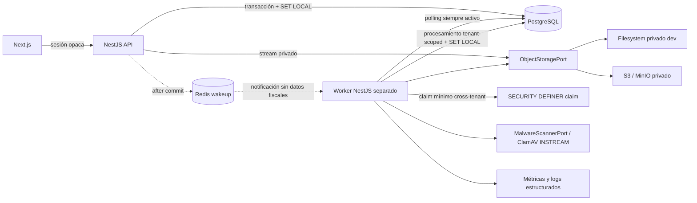
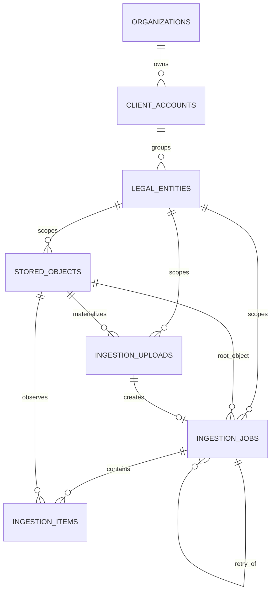
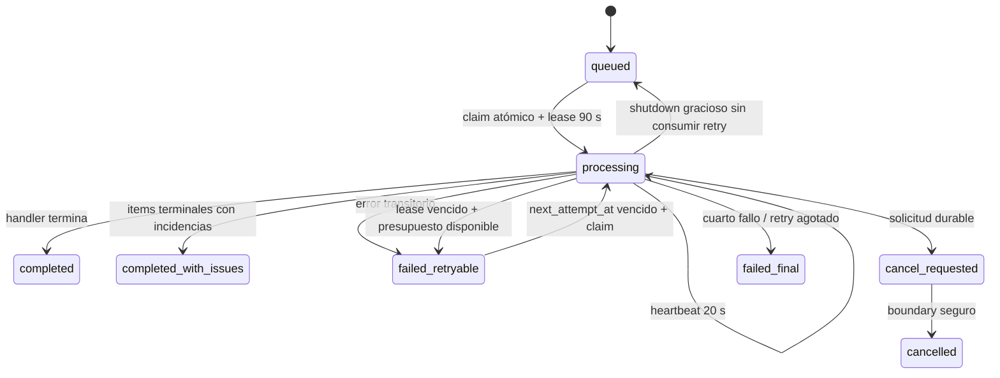
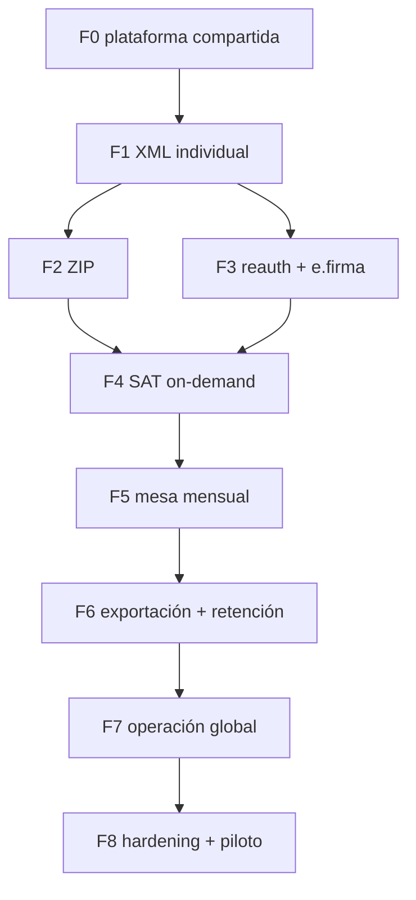

# Plan maestro de implementación CFDI P0

## Control del documento

| Campo               | Valor                                                                             |
| ------------------- | --------------------------------------------------------------------------------- |
| Programa            | Plataforma CFDI de Balanz                                                         |
| Fecha de corte      | 2026-09-03 (`America/Mexico_City`)                                                |
| Rama de trabajo     | `codex/cfdis`                                                                     |
| SHA base integrada  | `origin/develop` en `e3d4f432dca1df6bbd0877d86e60bd52d8c15325`                    |
| Autoridad operativa | Este plan, subordinado al prompt maestro y al override de alcance de la ejecución |
| Fase en ejecución   | `PHASE_0_SHARED_FISCAL_PLATFORM`                                                  |
| Estado de Fase 0    | `PHASE_0_BLOCKED`                                                                 |
| Estado de Fases 1–8 | `NOT_STARTED`                                                                     |
| Regla de cierre     | No declarar `DONE` sin evidencia ejecutada de toda la Definition of Done          |

Este archivo es la fuente de verdad operativa del programa CFDI. El override de
esta ejecución limita la implementación a la Fase 0. Toda referencia histórica
del prompt maestro que ordene iniciar o terminar la Fase 1 queda sustituida por:
**detenerse al cerrar y reportar Fase 0; Fase 1 permanece `NOT_STARTED`**.

## 1. Autoridad, contexto y límites

Orden de autoridad aplicado:

1. Prompt maestro y override explícito de Fase 0 de esta ejecución.
2. Código, migraciones, pruebas y configuración ejecutable del repositorio.
3. `control_mensual_cfdi` 3.3.
4. `docs/architecture/ARCHITECTURE.md`.
5. Este plan maestro.
6. `CORRECTED_POSTGRESQL_DATA_MODEL.md`, corregido por los ADR de este programa.
7. UI actual como contrato visual, nunca como prueba de capacidad.
8. Legacy sólo como inventario de campos y casos de prueba.

La base reutilizable ya incluye sesión opaca, MFA, organización activa,
membresías, permisos, asignaciones, cuentas cliente, entidades fiscales,
ejercicios, períodos, auditoría, correlación y Redis opcional para sesiones. Al
inicio de esta rama no existía una plataforma ejecutable de objetos, ingesta,
jobs, worker, RLS fiscal, storage S3/local ni scanner ClamAV.

### Exclusiones estrictas de esta ejecución

No se implementan ni se presentan como disponibles:

- endpoint de carga XML o ZIP;
- parser funcional de CFDI o validación XSD;
- tablas `cfdis`, conceptos, impuestos, relaciones, pagos o nómina;
- lista, detalle o descarga real de CFDI;
- cambios frontend de carga o consulta CFDI;
- custodia de e.firma, descarga SAT, mesa mensual o exportaciones.

La seguridad futura del parser sí se decide documentalmente en
`ADR-CFDI-005-XML-PARSER.md`, sin código de parsing en Fase 0.

## 2. Decisiones bloqueadas

| Tema              | Decisión                                                                                                                                                                                                                                                                       |
| ----------------- | ------------------------------------------------------------------------------------------------------------------------------------------------------------------------------------------------------------------------------------------------------------------------------ |
| Topología         | Monolito modular NestJS; worker como proceso separado del mismo monorepo y release.                                                                                                                                                                                            |
| Autoridad durable | PostgreSQL. Redis nunca contiene la verdad de un job.                                                                                                                                                                                                                          |
| Claim             | Operación atómica con `FOR UPDATE SKIP LOCKED` encapsulada en una función `SECURITY DEFINER` mínima.                                                                                                                                                                           |
| Lease             | 90 segundos; heartbeat cada 20 segundos.                                                                                                                                                                                                                                       |
| Retry             | `WORKER_MAX_RETRIES=3` concede tres reintentos automáticos reales: ejecución inicial + tres reejecuciones. Backoff 10/30/120 s con jitter. `attempt_count` registra claims y puede superar 4 por liberaciones graciosas; sólo `automatic_retry_count` gobierna el presupuesto. |
| Wakeup            | Redis pub/sub best-effort después del commit; polling PostgreSQL siempre activo.                                                                                                                                                                                               |
| Storage           | `ObjectStoragePort`, filesystem local privado sólo en desarrollo y adapter S3/MinIO privado para ambientes administrados.                                                                                                                                                      |
| Cifrado           | Objetos fiscales S3 con SSE-KMS configurable; filesystem prohibido en producción.                                                                                                                                                                                              |
| Malware           | `MalwareScannerPort` + ClamAV `INSTREAM`; producción fail-closed; bypass sólo en desarrollo y explícito.                                                                                                                                                                       |
| RLS               | `ENABLE` + `FORCE` desde toda tabla fiscal fundacional; API/worker sin `BYPASSRLS`.                                                                                                                                                                                            |
| Contexto RLS      | Únicamente `SET LOCAL app.organization_id` y, cuando aplique, `SET LOCAL app.membership_id` dentro de transacción; GUC ausente o inválida falla cerrado.                                                                                                                       |
| Roles RLS         | Grupos `NOLOGIN` `balanz_api`/`balanz_worker`; LOGINs dedicados aprovisionados por despliegue, sin migrator/owner/BYPASSRLS.                                                                                                                                                   |
| Integridad        | Scope completo y FKs compuestas `organization_id + client_account_id + legal_entity_id`.                                                                                                                                                                                       |
| Idempotencia      | Específica por operación, con key, fingerprint y replay; no ledger genérico.                                                                                                                                                                                                   |
| Progreso          | Polling en P0; Redis no es canal de datos ni mecanismo de progreso.                                                                                                                                                                                                            |
| Estado            | Job con estado canónico grueso y `current_stage`; item con estado técnico y resultado separado.                                                                                                                                                                                |
| Original          | Los bytes confirmados son inmutables; keys opacas; sin RFC, nombre o filename en el path físico.                                                                                                                                                                               |
| Observabilidad    | IDs técnicos y resultados; nunca RFC, UUID fiscal, nombre, XML, URLs firmadas o secretos como logs/labels.                                                                                                                                                                     |
| Parser            | Red, DTD y entidades externas prohibidas; límites y allowlist versionada antes de Fase 1.                                                                                                                                                                                      |

### 2.1 Decisión sobre la semántica de intentos

El contrato exige **tres reintentos automáticos**, además de la ejecución
inicial. `WORKER_MAX_ATTEMPTS=4` expresa las cuatro ejecuciones presupuestadas
del ciclo normal y `WORKER_MAX_RETRIES=3` es la autoridad durable que decide la
terminalidad. Los backoffs 10, 30 y 120 segundos, cada uno con jitter, preceden
a los reintentos 1, 2 y 3. Un cuarto fallo retryable queda `failed_final`.
`attempt_count` es evidencia monotónica de cada claim y puede superar 4 cuando
un shutdown gracioso libera y vuelve a encolar trabajo; esas liberaciones no
incrementan `automatic_retry_count`. Un lease vencido sí consume un reintento.
Esta semántica no puede reinterpretarse por ambiente.

## 3. Arquitectura objetivo



### Límites de módulos

| Módulo            | Responsabilidad                                                                     | No debe hacer                                                 |
| ----------------- | ----------------------------------------------------------------------------------- | ------------------------------------------------------------- |
| `object-storage`  | streams, hash/tamaño, key opaca, privacidad, signed URL, borrado/lifecycle          | interpretar XML o decidir períodos                            |
| `malware-scanner` | escaneo `INSTREAM`, timeout y health                                                | construir comandos shell o decidir retry del job              |
| `ingestion`       | objetos/uploads/jobs/items, idempotencia, state machine y reconciliación            | parsear CFDI en Fase 0 o conocer SOAP SAT                     |
| worker entrypoint | claim, lease, heartbeat, concurrencia, shutdown y ejecución de handlers registrados | ser otra autoridad o inventar jobs de producción para pruebas |
| `redis` wakeup    | publicación/suscripción best-effort y prefijo por ambiente                          | almacenar payload fiscal, secretos o estado durable           |
| `health/metrics`  | probes, métricas y redacción de logs                                                | exponer IDs fiscales como labels                              |
| autorización/RLS  | sesión, permiso, asignación, contexto transaccional y fail-closed                   | confiar en tenant de body/query                               |

No se crea repositorio genérico, bus genérico, CQRS, microservicio ni una tabla
de jobs universal para dominios todavía inexistentes.

## 4. Modelo fundacional de datos



Todas las tablas nuevas conservan scope completo, versión positiva,
`created_at`/`updated_at` en `timestamptz`, candidate keys compuestas, checks de
estado y FKs compuestas. Fase 0 crea únicamente:

- `stored_objects`;
- `ingestion_uploads`;
- `ingestion_jobs`;
- `ingestion_items`;
- funciones/políticas/índices auxiliares estrictamente necesarios para RLS,
  claim, lease, heartbeat, retry, reconciliación, retención y procedencia.

No hay dependencia física indispensable que justifique una tabla CFDI en Fase 0. `ingestion_items.cfdi_id` y los resultados propios del parser
(`detected_version`, `parser_version`, candidatos de UUID o RFC) no se
introducen hasta la migración append-only de dominio de Fase 1; la observación
fundacional termina sin extraer ni enlazar un CFDI real.

### Estados canónicos

| Agregado          | Estados                                                                                                                                              |
| ----------------- | ---------------------------------------------------------------------------------------------------------------------------------------------------- |
| Objeto            | `pending_upload`, `uploaded`, `quarantined`, `available`, `rejected`, `deleted`                                                                      |
| Upload            | `pending`, `receiving`, `uploaded`, `confirmed`, `expired`, `failed`, `cancelled`                                                                    |
| Job               | `awaiting_upload`, `queued`, `processing`, `completed`, `completed_with_issues`, `failed_retryable`, `failed_final`, `cancel_requested`, `cancelled` |
| Etapa             | `scanning`, `extracting`, `parsing`, `persisting`                                                                                                    |
| Item técnico      | `pending`, `processing`, `terminal`                                                                                                                  |
| Resultado de item | `incorporated`, `duplicate`, `foreign`, `invalid`, `unsupported`, `internal_error`                                                                   |

En Fase 0 los handlers de prueba pueden producir resultados para comprobar la
maquinaria, pero ningún tipo de job ficticio queda registrado como capacidad de
producción. `extracting`, `parsing`, `persisting` y los resultados fiscales son
contrato reservado para fases posteriores.

## 5. Trabajo durable



Invariantes:

- sólo un worker posee un job durante un lease vigente;
- el claim devuelve exclusivamente IDs/scope/estado necesarios;
- el claim y las transiciones de lease se registran en auditoría en la misma
  operación durable, sin incluir payload fiscal;
- el procesamiento normal ocurre bajo RLS del tenant reclamado;
- perder lease impide publicar un resultado y produce `JOB_LEASE_LOST`;
- shutdown deja de reclamar, solicita cancelación de ejecución local, completa o
  libera de forma segura sin consumir el presupuesto automático y cierra
  dependencias;
- fairness evita que un tenant monopolice los slots disponibles;
- reconciliadores son idempotentes y no convierten Redis en autoridad.

## 6. Dependencias entre fases



## 7. Matrices y contratos transversales

- Durable jobs: [`../architecture/decisions/ADR-CFDI-001-DURABLE-JOBS.md`](../architecture/decisions/ADR-CFDI-001-DURABLE-JOBS.md).
- Object storage: [`../architecture/decisions/ADR-CFDI-002-OBJECT-STORAGE.md`](../architecture/decisions/ADR-CFDI-002-OBJECT-STORAGE.md).
- RLS: [`../architecture/decisions/ADR-CFDI-003-RLS.md`](../architecture/decisions/ADR-CFDI-003-RLS.md).
- Idempotencia/procedencia: [`../architecture/decisions/ADR-CFDI-004-IDEMPOTENCY-PROVENANCE.md`](../architecture/decisions/ADR-CFDI-004-IDEMPOTENCY-PROVENANCE.md).
- Seguridad del parser futuro: [`../architecture/decisions/ADR-CFDI-005-XML-PARSER.md`](../architecture/decisions/ADR-CFDI-005-XML-PARSER.md).
- Permisos: [`../security/CFDI_INGESTION_PERMISSION_MATRIX.md`](../security/CFDI_INGESTION_PERMISSION_MATRIX.md).
- Configuración: [`../operations/CFDI_INGESTION_CONFIGURATION_MATRIX.md`](../operations/CFDI_INGESTION_CONFIGURATION_MATRIX.md).
- Errores: [`../contracts/CFDI_INGESTION_ERROR_CATALOG.md`](../contracts/CFDI_INGESTION_ERROR_CATALOG.md).
- Contrato técnico: [`../contracts/CFDI_INGESTION_API.md`](../contracts/CFDI_INGESTION_API.md).
- Threat model: [`../security/CFDI_INGESTION_THREAT_MODEL.md`](../security/CFDI_INGESTION_THREAT_MODEL.md).
- Operación: [`../operations/CFDI_WORKER_RUNBOOK.md`](../operations/CFDI_WORKER_RUNBOOK.md).

### Matriz MFA/reauth resumida

| Acción                           | Permiso                                | MFA | Reauth                     | Fase                |
| -------------------------------- | -------------------------------------- | --- | -------------------------- | ------------------- |
| consultar ingestas asignadas     | `ingestion.view`                       | No  | No                         | catálogo F0; uso F1 |
| crear carga manual               | `ingestion.create`                     | No  | No                         | 1                   |
| retry/cancel propios y asignados | `ingestion.retry` / `ingestion.cancel` | No  | No                         | 1                   |
| consultar procesos               | `processes.view`                       | No  | No                         | catálogo F0; uso F1 |
| retry/cancel de proceso          | `processes.retry` / `processes.cancel` | No  | No por defecto             | 1+                  |
| consultar CFDI                   | `cfdi.view`                            | No  | No                         | 1                   |
| descargar XML                    | `cfdi.download`                        | Sí  | No en P0                   | 1                   |
| incidentes                       | `incidents.view/manage`                | No  | No                         | 1                   |
| e.firma/SAT                      | permisos de Fase 3/4                   | Sí  | grant purpose-bound 10 min | 3/4                 |
| exportación masiva               | permisos de Fase 6                     | Sí  | Sí                         | 6                   |

## 8. Migraciones y despliegue de Fase 0

Secuencia obligatoria:

1. Capturar rama, SHA, `git status --short`, diff y archivos no rastreados.
2. Confirmar `synchronize=false` y que la base es de desarrollo.
3. Crear `pg_dump --schema-only` o documentar exactamente su indisponibilidad.
4. Ejecutar `migration:show` y preflight de tablas/FKs/datos incompatibles.
5. Aplicar migraciones append-only; nunca editar una aplicada.
6. Ejecutar seeds dos veces y comparar conteos/relaciones.
7. Inspeccionar columnas, defaults, checks, FKs, uniques, índices, RLS,
   policies, propietarios, grants y función de claim.
8. Ejecutar la suite real aislada con PostgreSQL/Redis/MinIO/ClamAV.
9. No usar `DROP DATABASE`, `TRUNCATE` general ni `migration:revert` sobre datos
   que deban preservarse.

Mientras exista cualquier migración de Fase 0 pendiente, preflight y
`migration:run` exigen la credencial **superuser/migrator efímera**. PostgreSQL
16 requiere esa autoridad para crear los roles fijos, transferir ownership de
funciones y retirar todas las membresías/`CREATE` dentro de la misma transacción
`all`. La credencial sólo existe durante `release:prepare`, se elimina antes de
activar runtimes y nunca puede reutilizarse por API o worker. Una vez aplicadas
060/061/062/063, la inspección read-only no exige elevación.

Al corte de este plan, la rama ya integra la base vigente de `origin/develop`.
Las migraciones externas 030/050 quedaron reconciliadas mediante ese merge y
las migraciones de plataforma fiscal 060/061/062/063 fueron aplicadas e
inspeccionadas en desarrollo. No existe una divergencia pendiente de migración
entre la base integrada y la secuencia append-only de Fase 0.

Rollback preferido: volver a una versión de aplicación compatible y conservar
las migraciones aditivas. Si no existe tráfico ni datos y el ambiente es una
base inequívocamente efímera, el runner de QA puede limpiar su propio recurso.

El despliegue aprovisiona LOGINs dedicados —por ejemplo `balanz_api_login` y
`balanz_worker_login`— y les concede únicamente los grupos `NOLOGIN`
`balanz_api` y `balanz_worker`, respectivamente. La credencial migrator no es un
fallback de runtime y ningún LOGIN de API/worker puede heredar un owner o rol
con `BYPASSRLS`.

## 9. APIs y frontend por fase

Fase 0 no expone carga XML/ZIP ni una API CFDI. Puede exponer probes operativos
y métricas según la convención del repositorio; el worker no es controlable por
un endpoint público. Los contratos de upload/consulta que aparecen en el
contrato técnico están etiquetados `FUTURE / PHASE_1` o posterior y no habilitan
una ruta.

No hay trabajo frontend en Fase 0. La UI demo no se conecta, no se presenta un
botón de carga funcional y no se crea fallback silencioso.

## 10. Observabilidad y operación

Métricas canónicas mínimas desde Fase 0, con los nombres exactos del contrato
maestro:

```text
ingestion_jobs_created_total
ingestion_jobs_completed_total
ingestion_jobs_failed_total
ingestion_jobs_recovered_total
ingestion_items_total
ingestion_items_by_result
ingestion_duration_seconds
ingestion_queue_age_seconds
ingestion_upload_bytes_total
ingestion_hash_conflicts_total
ingestion_cross_tenant_denials_total
ingestion_scanner_failures_total
ingestion_parser_failures_total
worker_active_jobs
worker_heartbeat_lag_seconds
worker_lease_reclaims_total
object_storage_failures_total
redis_wakeup_failures_total
```

Las métricas de items/resultados/parser/hash conflict pueden existir como series
vacías o comenzar cuando la fase funcional las use, pero nunca con un handler
ficticio productivo. Se permiten métricas operativas adicionales de duración,
reconciliación o shutdown siempre que no sustituyan ni renombren esta lista.
Labels emitidas por la aplicación: `source`, `status`, `stage`, `result`,
`provider` y `outcome`; el ambiente se agrega como metadata
del target de scrape, no desde payload. Ninguna incluye tenant, RFC, UUID
fiscal, nombre, filename, ID técnico de alta cardinalidad u object key.

Health:

- API liveness: proceso responde.
- API readiness: PostgreSQL y dependencias necesarias para aceptar trabajo.
- Worker liveness: event loop/proceso y loop de supervisión activos.
- Worker readiness: PostgreSQL, storage y scanner requeridos; Redis sólo se
  reporta como degradado y no hace fallar readiness.

## 11. Estrategia de pruebas de Fase 0

Las pruebas que dependen de semántica de infraestructura usan servicios reales,
no mocks:

| Área              | Evidencia obligatoria                                                                              |
| ----------------- | -------------------------------------------------------------------------------------------------- |
| Migraciones/seeds | apply, inspección, seed doble idempotente                                                          |
| Integridad        | FKs compuestas y constraints negativos                                                             |
| RLS               | tenant A/B, sin GUC, GUC inválida, table owner, API, worker                                        |
| Claim             | dos workers concurrentes, un ganador, fairness y scope mínimo                                      |
| Lease             | heartbeat, vencimiento, recuperación, pérdida de lease                                             |
| Retry             | inicial + 3 reintentos; backoff 10/30/120+jitter; cuarto fallo terminal; shutdown no consume retry |
| Redis             | wakeup rápido con Redis y continuidad con Redis apagado                                            |
| Local storage     | streaming, hash/tamaño, traversal, permisos y cleanup                                              |
| S3                | MinIO real, bucket privado, stream, signed URL corta y SSE config                                  |
| Scanner           | limpio, EICAR controlado, timeout/no disponible y política por ambiente                            |
| Idempotencia      | misma key concurrente y fingerprint distinto                                                       |
| Reconciliación    | uploads expirados, objetos/jobs huérfanos, lease y lifecycle                                       |
| Observabilidad    | logs redactados, métricas sin PII, probes y degradación Redis                                      |
| Shutdown          | SIGTERM durante idle y trabajo; no doble ejecución/pérdida                                         |

### Evidencia de infraestructura al corte

Docker Desktop y Docker Compose están accesibles. Corridas aisladas previas de
la validación E2E comprobaron con servicios reales PostgreSQL, Redis, MinIO,
ClamAV y Vault; no se sustituyó su semántica por mocks. Redis compartido de
desarrollo también fue encontrado en Vault y validado tanto en línea —incluido
pub/sub— como con Redis apagado, manteniendo polling PostgreSQL como fallback.

El único control externo pendiente es el aprovisionamiento de los secretos
canónicos de runtime `database/postgres-api` y `database/postgres-worker` en
Vault. Ambos están `NOT_FOUND` y el AppRole disponible responde
`ACCESS_DENIED` para crearlos. Por ello no puede completarse todavía la prueba
de login de API/worker contra la base compartida de desarrollo. Ambos secretos
deben apuntar a la misma base existente `accounting_dev`, con LOGINs distintos
y permisos de `balanz_api` o `balanz_worker`, respectivamente. `TD-004` no
requiere crear otra base de datos. La ejecución final de cierre no se declara
`PASS` en este plan; su resultado y evidencia pertenecen al reporte QA.

## 12. Riesgos del programa

| ID    | Riesgo                                        | Fase  | Mitigación/Gate                                                      |
| ----- | --------------------------------------------- | ----- | -------------------------------------------------------------------- |
| R-001 | fuga cross-tenant por query, pool o rol owner | 0+    | RLS FORCE, `SET LOCAL`, roles sin BYPASSRLS, FKs y pruebas negativas |
| R-002 | job perdido/duplicado tras reinicio           | 0+    | PostgreSQL authority, claim atómico, lease, heartbeat, idempotencia  |
| R-003 | Redis tratado como cola                       | 0+    | polling permanente, mensajes sin payload, pruebas Redis apagado      |
| R-004 | bytes fiscales expuestos                      | 0+    | storage privado, keys opacas, SSE-KMS, redacción y URLs cortas       |
| R-005 | scanner no disponible                         | 0+    | fail-closed producción; bypass explícito sólo dev; readiness         |
| R-006 | XML/ZIP hostil                                | 1/2   | ADR parser, cuarentena, límites y corpus sintético                   |
| R-007 | UUID/hash reemplaza original                  | 1+    | no reemplazo, lock/dedupe, incidente y procedencia                   |
| R-008 | SAT/e.firma compromete secretos               | 3/4   | reauth, KMS/Vault, one-time TTL, auditoría, pentest                  |
| R-009 | límites insuficientes o costosos              | 0+    | hard caps configurados y capacidad medida antes de elevarlos         |
| R-010 | drift documentación/código                    | todas | actualizar plan, ADR, contrato y reporte en el mismo cambio          |

## 13. Registro de fases

### Fase 0 — Plataforma fiscal compartida

| Campo                | Definición                                                                                                                                                                                                                                                                |
| -------------------- | ------------------------------------------------------------------------------------------------------------------------------------------------------------------------------------------------------------------------------------------------------------------------- |
| ID                   | `PHASE_0_SHARED_FISCAL_PLATFORM`                                                                                                                                                                                                                                          |
| Objetivo             | Proveer fundaciones durables y seguras reutilizables por XML, ZIP, SAT y exportaciones.                                                                                                                                                                                   |
| Valor de producto    | Los procesos fiscales futuros sobreviven reinicios, aíslan tenants y conservan originales sin rediseño.                                                                                                                                                                   |
| Dependencias         | Identidad, sesión, MFA, tenant, asignación, clientes/RFC, PostgreSQL, secretos y Redis opcional existentes.                                                                                                                                                               |
| Alcance              | ADR, threat model, contratos, permisos, configuración, cuatro tablas, RLS, worker, storage local/S3, ClamAV, Redis wakeup, reconciliadores, lifecycle, health, métricas, infra y validación real.                                                                         |
| Fuera de alcance     | Toda capacidad listada en la sección 1; en especial upload XML, parser y dominio CFDI.                                                                                                                                                                                    |
| Tablas/migraciones   | `stored_objects`, `ingestion_uploads`, `ingestion_jobs`, `ingestion_items`, policies/functions/índices auxiliares.                                                                                                                                                        |
| Backend              | Ports/adapters, configuración, servicios de plataforma, health/métricas; sin controller de upload.                                                                                                                                                                        |
| Worker               | Entrypoint separado, claim/lease/heartbeat/retry/fairness/shutdown/reconciliación.                                                                                                                                                                                        |
| Frontend             | Sin cambios funcionales.                                                                                                                                                                                                                                                  |
| Seguridad            | FORCE RLS, función claim mínima, roles sin BYPASSRLS, storage privado, scanner fail-closed, redacción.                                                                                                                                                                    |
| Operación            | Compose reproducible para PostgreSQL, Redis, MinIO y ClamAV; runbook y probes.                                                                                                                                                                                            |
| Configuración        | Matriz validada por ambiente, sin defaults inseguros en producción.                                                                                                                                                                                                       |
| Métricas             | Jobs, queue age, leases/recovery, storage, scanner, Redis y worker.                                                                                                                                                                                                       |
| Pruebas              | Toda la matriz de la sección 11 con infraestructura real cuando determina comportamiento.                                                                                                                                                                                 |
| Datos de QA          | Dos tenants sintéticos, cuentas/RFC/asignaciones sintéticas, jobs/objetos no fiscales y EICAR oficial de prueba.                                                                                                                                                          |
| Entregables          | Código/migraciones/seeds/config/infra, este paquete documental y `docs/qa/CFDI_PHASE_0_VALIDATION_REPORT.md`.                                                                                                                                                             |
| Criterios de entrada | Decisiones bloqueadas, base dev autorizada, servicios reproducibles y baseline Git registrado.                                                                                                                                                                            |
| Criterios de salida  | Definition of Done completa, migraciones/seeds ejecutados, pruebas reales verdes, cero defectos/deuda y reporte con evidencia.                                                                                                                                            |
| Riesgos              | R-001 a R-005, R-009 y R-010.                                                                                                                                                                                                                                             |
| Rollback             | Aplicación compatible hacia atrás; conservar tablas aditivas; limpieza destructiva sólo en DB de QA inequívocamente aislada.                                                                                                                                              |
| Estado               | `PHASE_0_BLOCKED`                                                                                                                                                                                                                                                         |
| Evidencia            | `docs/qa/CFDI_PHASE_0_VALIDATION_REPORT.md`: migraciones 030/050 reconciliadas, 060/061/062/063 aplicadas, stack aislado real y Redis compartido validados; bloquean exclusivamente los secretos Vault canónicos y logins runtime de API/worker en desarrollo compartido. |

### Fase 1 — XML individual end-to-end

| Campo                | Definición                                                                                                                     |
| -------------------- | ------------------------------------------------------------------------------------------------------------------------------ |
| ID                   | `PHASE_1_XML`                                                                                                                  |
| Objetivo             | Cargar un XML individual, escanearlo, parsearlo, persistir el dominio y consultarlo de extremo a extremo.                      |
| Valor de producto    | Primera vertical fiscal real y recuperable.                                                                                    |
| Dependencias         | Fase 0 `DONE`; corpus/XSD oficiales versionados.                                                                               |
| Alcance              | multipart streaming 5 MiB, parser CFDI 4.0/TFD 1.1/Pagos 2.0/Nómina 1.2, I/E/T/N/P, dedupe, períodos, incidentes, API/UI real. |
| Fuera de alcance     | ZIP, e.firma, SAT, mesa completa y exportaciones.                                                                              |
| Tablas/migraciones   | `cfdis`, conceptos, impuestos, relaciones, pagos, nómina core, procedencia, participaciones e incidentes.                      |
| Backend              | Upload/202/polling, consulta/detail y acceso XML autorizado.                                                                   |
| Worker               | Handler XML real sobre la plataforma de Fase 0.                                                                                |
| Frontend             | Cargar XML, progreso, recuperación, lista/detalle sin fallback demo.                                                           |
| Seguridad            | Parser endurecido, MFA para descarga, assignment, RLS y hash conflict.                                                         |
| Operación            | Corpus, schemas manifest, dashboards y runbook de parser.                                                                      |
| Configuración        | Límites XML/parser/versiones.                                                                                                  |
| Métricas             | Items/resultados/parser/hash conflicts.                                                                                        |
| Pruebas              | XML válido/hostil, tipos/complementos, dedupe, periods, cross-tenant, restart y E2E UI.                                        |
| Datos de QA          | XML sintéticos sin PII real y fuentes oficiales versionadas.                                                                   |
| Entregables          | Vertical completa y reporte Fase 1.                                                                                            |
| Criterios de entrada | Fase 0 `DONE`, XSD/catálogos oficiales con SHA-256 y cero bloqueos de parser.                                                  |
| Criterios de salida  | Definition of Done de Fase 1 completa y cero fallback demo/deuda.                                                              |
| Riesgos              | R-006 y R-007.                                                                                                                 |
| Rollback             | Deshabilitar rutas/UI y conservar dominio/objetos; forward-fix de migraciones.                                                 |
| Estado               | `NOT_STARTED`                                                                                                                  |
| Evidencia            | Ninguna; no crear reporte de Fase 1 en esta ejecución.                                                                         |

### Fase 2 — ZIP y éxito parcial

| Campo                | Definición                                                                                    |
| -------------------- | --------------------------------------------------------------------------------------------- |
| ID                   | `PHASE_2_ZIP`                                                                                 |
| Objetivo             | Ingestar ZIP de hasta 2,000 entradas con éxito parcial sobre el mismo pipeline.               |
| Valor de producto    | Carga masiva manual segura y recuperable.                                                     |
| Dependencias         | Fases 0 y 1 `DONE`.                                                                           |
| Alcance              | init/signed URL/confirm, extracción segura, limits, item por entrada, cancel/retry/UI.        |
| Fuera de alcance     | SAT y e.firma.                                                                                |
| Tablas/migraciones   | Sólo extensiones compatibles a uploads/items/lifecycle si son necesarias; no segundo dominio. |
| Backend              | Contrato de ZIP y resultados paginados.                                                       |
| Worker               | Etapa `extracting`, límites y cleanup.                                                        |
| Frontend             | Flujo ZIP diferenciado.                                                                       |
| Seguridad            | Bomb/traversal/nested/encrypted/link prohibidos.                                              |
| Operación            | Métricas de expansión/entries y cleanup.                                                      |
| Configuración        | 50 MiB/250 MiB/2,000/50:1/depth 2/path 240.                                                   |
| Métricas             | Entries, ratio, partial results y cleanup failures.                                           |
| Pruebas              | Corpus ZIP hostil y reinicio/cancelación parcial.                                             |
| Datos de QA          | ZIP sintéticos mixtos.                                                                        |
| Entregables          | Upload firmado, extractor, UI y runbook ZIP.                                                  |
| Criterios de entrada | Parser/dominio Fase 1 estables.                                                               |
| Criterios de salida  | Éxito parcial probado sin modificar parser/dominio.                                           |
| Riesgos              | DoS, archivos hostiles, costo y cardinalidad.                                                 |
| Rollback             | Deshabilitar ZIP y conservar XML individual.                                                  |
| Estado               | `NOT_STARTED`                                                                                 |
| Evidencia            | Ninguna.                                                                                      |

### Fase 3 — Reautenticación y custodia de e.firma

| Campo                | Definición                                                                                   |
| -------------------- | -------------------------------------------------------------------------------------------- |
| ID                   | `PHASE_3_REAUTH_AND_EFIRMA`                                                                  |
| Objetivo             | Proveer step-up purpose-bound y custodia segura para solicitudes SAT.                        |
| Valor de producto    | Autorizar uso puntual de e.firma sin conservar password.                                     |
| Dependencias         | Fase 0 `DONE`; revisión seguridad/legal.                                                     |
| Alcance              | reauth 10 min, .cer/.key, KMS/envelope, Vault wrapping/TTL one-time, rotación/revocación/UI. |
| Fuera de alcance     | Descarga SAT.                                                                                |
| Tablas/migraciones   | metadata/versiones de credencial y grant de reauth; nunca password/llave clara.              |
| Backend              | Endpoints de reauth/credencial y autorización.                                               |
| Worker               | Acceso one-time ligado a job futuro.                                                         |
| Frontend             | Gestión de credencial y step-up.                                                             |
| Seguridad            | MFA+reauth, KMS, Vault, destrucción y auditoría.                                             |
| Operación            | Rotación, revocación e incidente de credencial.                                              |
| Configuración        | KMS/Vault/TTL/purpose.                                                                       |
| Métricas             | Uso, expiración y fallos sin labels sensibles.                                               |
| Pruebas              | RFC/par/vigencia, ausencia de secretos, TTL, one-time y revocación.                          |
| Datos de QA          | Certificados sintéticos/controlados.                                                         |
| Entregables          | Custodia aprobada y runbooks.                                                                |
| Criterios de entrada | Revisión de seguridad/legal aprobada.                                                        |
| Criterios de salida  | Cero material privado en DB/Redis/logs/backups.                                              |
| Riesgos              | R-008.                                                                                       |
| Rollback             | Revocar credenciales/grants, cancelar usos y conservar evidencia.                            |
| Estado               | `NOT_STARTED`                                                                                |
| Evidencia            | Ninguna.                                                                                     |

### Fase 4 — Descarga SAT on-demand

| Campo                | Definición                                                                                                       |
| -------------------- | ---------------------------------------------------------------------------------------------------------------- |
| ID                   | `PHASE_4_SAT_ON_DEMAND`                                                                                          |
| Objetivo             | Solicitar, verificar y descargar paquetes SAT on-demand de forma durable.                                        |
| Valor de producto    | Recuperar CFDI oficiales sin mantener el navegador abierto.                                                      |
| Dependencias         | Fases 0, 1, 2 y 3 `DONE`; especificación oficial congelada.                                                      |
| Alcance              | auth/firma, request/poll/packages, estados oficiales separados, backoff, metadata, cutoff y entrega al pipeline. |
| Fuera de alcance     | SAT programado/desatendido.                                                                                      |
| Tablas/migraciones   | Jobs/paquetes SAT específicos y referencias a objetos/ingestas.                                                  |
| Backend              | Solicitud/consulta/retry/cancel autorizados.                                                                     |
| Worker               | Adapter SAT, expiración de paquetes y recuperación.                                                              |
| Frontend             | Centro de procesos SAT.                                                                                          |
| Seguridad            | MFA+reauth, secreto temporal y códigos redactados.                                                               |
| Operación            | Contract snapshots, rate limit y runbook SAT.                                                                    |
| Configuración        | endpoints/timeouts/backoff oficiales.                                                                            |
| Métricas             | Request/poll/package por códigos acotados.                                                                       |
| Pruebas              | Contracts, reinicio, duplicados, paquetes y expiración.                                                          |
| Datos de QA          | Sandbox/fixtures contractuales autorizados.                                                                      |
| Entregables          | SAT real on-demand convergente.                                                                                  |
| Criterios de entrada | e.firma segura y especificación vigente.                                                                         |
| Criterios de salida  | Todos los paquetes recuperables e idempotentes.                                                                  |
| Riesgos              | Disponibilidad/cambio SAT, credenciales y vencimiento.                                                           |
| Rollback             | Pausar nuevas solicitudes, conservar jobs/folios y carga manual.                                                 |
| Estado               | `NOT_STARTED`                                                                                                    |
| Evidencia            | Ninguna.                                                                                                         |

### Fase 5 — Mesa mensual y decisiones

| Campo                | Definición                                                                                        |
| -------------------- | ------------------------------------------------------------------------------------------------- |
| ID                   | `PHASE_5_MONTHLY_WORKSPACE`                                                                       |
| Objetivo             | Revisar CFDI por período y cerrar internamente con decisiones versionadas.                        |
| Valor de producto    | Flujo mensual trazable dentro de Balanz.                                                          |
| Dependencias         | Fases 1 y 4 `DONE`.                                                                               |
| Alcance              | vistas por tipo, decisiones, masivas, incidentes, checklist, lease, cierre, novedades/reapertura. |
| Fuera de alcance     | determinación fiscal definitiva y presentación.                                                   |
| Tablas/migraciones   | participaciones, decisiones, checklist, lease, cierres y reaperturas.                             |
| Backend              | APIs de mesa/cierre.                                                                              |
| Worker               | Reconciliación/novedades; sin nueva cola.                                                         |
| Frontend             | Mesa mensual real.                                                                                |
| Seguridad            | nómina separada, asignación, permisos y reauth de cierre.                                         |
| Operación            | Runbook de conflictos/novedades.                                                                  |
| Configuración        | timezone/policy version/lease de edición.                                                         |
| Métricas             | avance, conflictos y cierres sin PII.                                                             |
| Pruebas              | concurrencia, multi-período, cierre/reapertura y revocación.                                      |
| Datos de QA          | Casos sintéticos mensuales.                                                                       |
| Entregables          | Mesa/cierre versionado.                                                                           |
| Criterios de entrada | CFDI y cutoff confiables.                                                                         |
| Criterios de salida  | Cierre reproducible sin modificar original.                                                       |
| Riesgos              | criterio fiscal incorrecto y concurrencia.                                                        |
| Rollback             | Deshabilitar mutaciones y preservar versiones.                                                    |
| Estado               | `NOT_STARTED`                                                                                     |
| Evidencia            | Ninguna.                                                                                          |

### Fase 6 — Exportación, portabilidad y retención

| Campo                | Definición                                                                   |
| -------------------- | ---------------------------------------------------------------------------- |
| ID                   | `PHASE_6_EXPORT_AND_RETENTION`                                               |
| Objetivo             | Exportar datos/XML y ejecutar políticas comerciales de lifecycle/purga.      |
| Valor de producto    | Portabilidad sin recaptura y salida segura al cancelar.                      |
| Dependencias         | Fase 5 `DONE`; política legal/comercial aprobada.                            |
| Alcance              | Excel/CSV/ZIP, jobs, URLs, 5 ejercicios, ventana 45 días, purga verificable. |
| Fuera de alcance     | integraciones contables específicas no validadas.                            |
| Tablas/migraciones   | export jobs/files y evidencia de lifecycle.                                  |
| Backend              | creación/consulta/descarga/revocación.                                       |
| Worker               | generación y purga durable.                                                  |
| Frontend             | Exportaciones e historial.                                                   |
| Seguridad            | alcance explícito, MFA/reauth y URLs breves.                                 |
| Operación            | Retención/purga/restore.                                                     |
| Configuración        | TTL y clases de retención.                                                   |
| Métricas             | generación, bytes, expiración y purga.                                       |
| Pruebas              | alcance, enlace expirado/revocado y purga/restore.                           |
| Datos de QA          | Cierres sintéticos.                                                          |
| Entregables          | Portabilidad y lifecycle completo.                                           |
| Criterios de entrada | Políticas contractuales aprobadas.                                           |
| Criterios de salida  | Exportación útil y purga verificable.                                        |
| Riesgos              | fuga por exportación y retención incorrecta.                                 |
| Rollback             | Revocar enlaces/jobs; nunca borrar evidencia sin policy.                     |
| Estado               | `NOT_STARTED`                                                                |
| Evidencia            | Ninguna.                                                                     |

### Fase 7 — Operación integral y producto global

| Campo                | Definición                                                                            |
| -------------------- | ------------------------------------------------------------------------------------- |
| ID                   | `PHASE_7_GLOBAL_OPERATIONS`                                                           |
| Objetivo             | Operar el producto a escala con centro global, alertas, fairness y soporte JIT.       |
| Valor de producto    | Visibilidad y soporte para múltiples clientes/procesos.                               |
| Dependencias         | Fases 0–6 `DONE` y telemetría representativa.                                         |
| Alcance              | procesos globales, notificaciones, dashboards, alertas, capacidad, SLO y soporte JIT. |
| Fuera de alcance     | Introducir Redis wakeup: ya existe desde Fase 0.                                      |
| Tablas/migraciones   | read models/notificaciones/grants sólo si se justifican.                              |
| Backend              | consultas operativas globales.                                                        |
| Worker               | tuning de fairness/reconciliación.                                                    |
| Frontend             | Centro global y dashboards reales.                                                    |
| Seguridad            | Soporte temporal de mínimo alcance.                                                   |
| Operación            | Alertas/SLO/capacity/runbooks.                                                        |
| Configuración        | umbrales medidos.                                                                     |
| Métricas             | técnicas y de negocio.                                                                |
| Pruebas              | carga, alertas, soporte JIT y degradación.                                            |
| Datos de QA          | Volumen sintético representativo.                                                     |
| Entregables          | Operación integral.                                                                   |
| Criterios de entrada | Métricas y patrones reales.                                                           |
| Criterios de salida  | Operación observable sin acceso fiscal implícito.                                     |
| Riesgos              | ruido de alertas y soporte con privilegio excesivo.                                   |
| Rollback             | Deshabilitar read models/notifications, preservar autoridad específica.               |
| Estado               | `NOT_STARTED`                                                                         |
| Evidencia            | Ninguna.                                                                              |

### Fase 8 — Hardening, piloto y producción

| Campo                | Definición                                                                                       |
| -------------------- | ------------------------------------------------------------------------------------------------ |
| ID                   | `PHASE_8_HARDENING_AND_PILOT`                                                                    |
| Objetivo             | Demostrar capacidad, recuperación y seguridad antes de producción/piloto.                        |
| Valor de producto    | MVP operable y confiable con casos representativos.                                              |
| Dependencias         | Fases 0–7 `DONE`.                                                                                |
| Alcance              | capacidad, fault injection, backup/restore, DR, restart, pentest, dependency audit, SLO, piloto. |
| Fuera de alcance     | Nuevas capacidades funcionales durante hardening.                                                |
| Tablas/migraciones   | Sólo fixes aditivos necesarios; sin features.                                                    |
| Backend              | Correcciones de liberación.                                                                      |
| Worker               | soak/restart/fault tests.                                                                        |
| Frontend             | QA accesible y recorridos completos.                                                             |
| Seguridad            | pentest y cero críticos.                                                                         |
| Operación            | DR, alertas y runbooks de incidente.                                                             |
| Configuración        | valores productivos aprobados.                                                                   |
| Métricas             | SLI/SLO y capacidad.                                                                             |
| Pruebas              | Matriz completa y piloto con datos anonimizados/sintéticos.                                      |
| Datos de QA          | Dos despachos piloto y casos obligatorios autorizados.                                           |
| Entregables          | Gate MVP y reporte de piloto.                                                                    |
| Criterios de entrada | Fases 0–7 cerradas, telemetría representativa y piloto autorizado.                               |
| Criterios de salida  | Cero críticos, restore/restart probado y piloto aceptado.                                        |
| Riesgos              | defecto tardío, capacidad o recuperación insuficiente.                                           |
| Rollback             | No liberar; conservar ambiente previo estable.                                                   |
| Estado               | `NOT_STARTED`                                                                                    |
| Evidencia            | Ninguna.                                                                                         |

## 14. Capacidades posteriores a P0

| ID                                   | Capacidad                          | Dependencia/condición de entrada                       | Fase futura    |
| ------------------------------------ | ---------------------------------- | ------------------------------------------------------ | -------------- |
| `POST_P0_SAT_SCHEDULED`              | SAT programado/desatendido         | SAT on-demand estable, legal/security y demanda medida | Posterior a F8 |
| `POST_P0_PERSISTENT_SIGNATURE_VAULT` | Bóveda persistente de firma        | Aprobación independiente legal/security                | Posterior a F8 |
| `POST_P0_CFDI_33_HISTORY`            | CFDI 3.3/histórico                 | Corpus/versiones oficiales y necesidad piloto          | Posterior a F8 |
| `POST_P0_PDF_ATTACHMENTS`            | PDF/anexos                         | Valor y retención aprobados                            | Posterior a F8 |
| `POST_P0_RECURRING_RULES`            | Reglas recurrentes                 | Decisiones humanas suficientes y explicabilidad        | Posterior a F8 |
| `POST_P0_SAVED_VIEWS`                | Vistas guardadas                   | Uso/filtros medidos                                    | Posterior a F8 |
| `POST_P0_ENRICHED_DOSSIER`           | Expediente enriquecido             | Manifest/retención aprobado                            | Posterior a F8 |
| `POST_P0_SPECIFIC_EXPORTERS`         | Exportadores contables específicos | Piloto valida formato/sistema                          | Posterior a F8 |

## 15. Registro de deuda y evidencia de cierre

No se acepta deuda deliberada. Fase 0 cierra esta ejecución como
`PHASE_0_BLOCKED`: el
registro detallado vive en el reporte QA y mantiene un único control externo
pendiente como deuda de validación: aprovisionar en Vault las credenciales
canónicas de los LOGINs runtime de API y worker para validar ambos contra la
base compartida de desarrollo. Para cambiar el estado a `DONE`, el reporte
debe declarar con evidencia:

El siguiente bloque no describe el estado actual; es el gate objetivo para una
futura transición a `DONE`. El estado actual es `TECHNICAL_DEBT: 1` y
`KNOWN_DEFECTS: 0`.

```text
TECHNICAL_DEBT: 0
KNOWN_DEFECTS: 0
DEFERRED_PRODUCT_CAPABILITIES:
  - PHASE_1_XML
  - PHASE_2_ZIP
  - PHASE_3_REAUTH_AND_EFIRMA
  - PHASE_4_SAT_ON_DEMAND
  - PHASE_5_MONTHLY_WORKSPACE
  - PHASE_6_EXPORT_AND_RETENTION
  - PHASE_7_GLOBAL_OPERATIONS
  - PHASE_8_HARDENING_AND_PILOT
```

Evidencia mínima para `PHASE_0_DONE`:

- archivos y SHA exactos;
- migraciones aplicadas e inspeccionadas;
- seeds dos veces;
- permisos/RLS/grants/roles/functions verificados;
- worker y todos los adapters iniciados contra servicios reales;
- resultados de cada prueba de la sección 11;
- defectos encontrados y correcciones con test de regresión;
- `git diff --check`, build, lint y tests verdes;
- `docs/qa/CFDI_PHASE_0_VALIDATION_REPORT.md` completo;
- Fase 1 aún `NOT_STARTED`.
