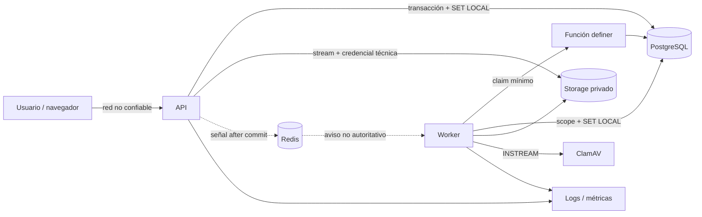

# Threat model de la plataforma de ingesta CFDI

- Versión: 1.1
- Fecha: 2026-09-03
- Fase evaluada: `PHASE_1_XML` — `IN_PROGRESS`
- Estado base: Fase 0 desarrollo `ACCEPTED`; release `BLOCKED`
- Próxima revisión: antes de Fase 2 y ante cambios de trust boundary

## 1. Alcance y supuesto de seguridad

Este modelo cubre la plataforma fundacional de Fase 0 y la vertical XML
individual de Fase 1: navegador/API, multipart streaming, worker, parser
endurecido, dominio/consulta/descarga CFDI, PostgreSQL/RLS, Redis wakeup,
storage privado, ClamAV, health, métricas, logs y reconciliadores. No afirma que
existan ZIP, e.firma, SAT, mesa mensual completa ni exportaciones.

Supuesto central: toda entrada, referencia de storage, mensaje wakeup, fila
durable y respuesta de dependencia puede ser maliciosa, corrupta, repetida o
obsoleta. Ningún control aislado —incluidos auth, RLS, scanner o hash— basta por
sí solo.

## 2. Activos y objetivos

| Activo                      | Objetivo principal                                        | Impacto si falla                          |
| --------------------------- | --------------------------------------------------------- | ----------------------------------------- |
| Bytes originales            | confidencialidad, integridad, procedencia e inmutabilidad | fuga fiscal, evidencia inválida           |
| Scope tenant/cuenta/entidad | integridad y aislamiento                                  | acceso cruzado o imputación incorrecta    |
| Jobs/items/uploads          | exclusión, orden y trazabilidad                           | doble proceso, pérdida o resultado falso  |
| Idempotencia/fingerprint    | integridad y no revelación                                | duplicados, confusión o enumeración       |
| Roles, sesión y MFA         | autenticidad y mínimo privilegio                          | suplantación/escalamiento                 |
| Configuración/secretos      | confidencialidad e integridad                             | acceso a DB, bucket, Redis o KMS          |
| Logs/auditoría/métricas     | integridad, disponibilidad y redacción                    | investigación imposible o fuga secundaria |
| Disponibilidad/capacidad    | resiliencia y fairness                                    | bloqueo global o starvation por tenant    |

## 3. Actores

- Usuario autenticado autorizado para una organización y, cuando aplica, una
  cuenta/entidad asignada.
- Usuario autenticado pero no autorizado para el recurso solicitado.
- Atacante externo sin sesión o con sesión robada.
- Tenant malicioso que intenta agotar capacidad o inferir existencia ajena.
- Operador/soporte con acceso técnico, sin acceso fiscal implícito.
- Worker/API comprometido o con defecto lógico.
- Dependencia degradada o comprometida: PostgreSQL, Redis, S3/MinIO, ClamAV,
  KMS/DNS/red.
- Archivo hostil; en Fases 1+ incluye XML/ZIP especialmente construido.

## 4. Trust boundaries y flujo

Boundaries:

1. Navegador–API: datos controlados por usuario; sesión no implica permiso.
2. Runtime–PostgreSQL: grupos `NOLOGIN` `balanz_api`/`balanz_worker`, LOGINs
   dedicados sin migrator/owner/BYPASSRLS; tenant sólo por contexto validado.
3. Runtime–storage: key y respuesta no son confiables hasta validar alcance,
   hash y tamaño.
4. API/worker–Redis: canal no durable, repetible, falsificable y prescindible.
5. Worker–ClamAV: servicio de red con timeout; clean no valida XML.
6. Plataforma–telemetría: sólo datos técnicos redactados y cardinalidad acotada.
7. Build/config–runtime: producción debe fallar rápido ante configuración
   insegura o ausente.

## 5. Amenazas STRIDE y controles

| ID   | Categoría              | Amenaza                                        | Controles obligatorios                                                                            | Verificación                            |
| ---- | ---------------------- | ---------------------------------------------- | ------------------------------------------------------------------------------------------------- | --------------------------------------- |
| T-01 | Spoofing               | Sesión robada o tenant recibido por body/query | sesión opaca, organización activa server-side, permiso y asignación; MFA donde corresponda        | auth/tenant A-B/MFA                     |
| T-02 | Spoofing               | Worker falso reclama jobs                      | LOGIN dedicado miembro sólo de `balanz_worker` `NOLOGIN`, `worker_id` validado, grants explícitos | inspección roles y claim negativo       |
| T-03 | Tampering              | Cambiar scope de una fila                      | FKs compuestas, checks, RLS `WITH CHECK`, contexto `SET LOCAL`                                    | inserts/updates cross-tenant            |
| T-04 | Tampering              | Modificar bytes confirmados o engañar hash     | original inmutable, hash+tamaño por stream, verificación antes de available                       | mismatch y replay                       |
| T-05 | Tampering              | Completar sin poseer lease                     | owner/version/lease en transición atómica; `JOB_LEASE_LOST`                                       | lease expirado/concurrente              |
| T-06 | Tampering              | Redis crea trabajo inexistente                 | Redis sólo despierta; claim siempre consulta PostgreSQL                                           | mensaje falso/duplicado y Redis down    |
| T-07 | Repudiation            | No poder atribuir transición                   | claim+audit atómicos; correlation/job/object IDs, actor/worker, before/after seguro               | lifecycle/auditoría                     |
| T-08 | Repudiation            | Reintento borra procedencia                    | retry_of/origin, attempt y timestamps inmutables                                                  | retry/reconciliación                    |
| T-09 | Information disclosure | Query cruza organización                       | ENABLE+FORCE RLS, roles sin BYPASSRLS, GUC fail-closed                                            | A/B, sin/inválida GUC, owner/API/worker |
| T-10 | Information disclosure | Path/key revela RFC/nombre/filename            | key opaca aleatoria, raíz privada, metadata redactada                                             | inspección keys/logs                    |
| T-11 | Information disclosure | URL firmada/secretos en logs                   | redacción estructurada, allowlist de campos, URLs breves                                          | captura de logs                         |
| T-12 | Information disclosure | Métrica expone PII o UUID fiscal               | labels técnicos y acotados; prohibición explícita                                                 | scrape/test de labels                   |
| T-13 | Information disclosure | Error permite enumerar recurso ajeno           | `RESOURCE_NOT_FOUND`/respuesta estable y auditoría interna                                        | comparación respuestas cross-tenant     |
| T-14 | DoS                    | Archivo/stream sin límite                      | hard caps, streaming, timeout y concurrencia                                                      | límites/tamaño/slow stream              |
| T-15 | DoS                    | Tenant monopoliza workers                      | concurrencia global, fairness y límites por scope                                                 | carga multi-tenant                      |
| T-16 | DoS                    | Leases/heartbeats causan tormenta DB           | índices selectivos, batch acotado, jitter y métricas                                              | concurrencia/EXPLAIN/capacidad          |
| T-17 | DoS                    | Redis/ClamAV/S3 caen                           | Redis degradable; storage/scanner errores estables; backoff; scanner prod fail-closed             | dependencias apagadas                   |
| T-18 | Elevation              | API/worker con superuser/BYPASSRLS             | roles separados, no owner, grants mínimos                                                         | catálogo PostgreSQL                     |
| T-19 | Elevation              | Abuso de SECURITY DEFINER/search_path          | owner no-login, path fijo, sin SQL dinámico, PUBLIC revoke, retorno mínimo                        | revisión función y grants               |
| T-20 | Elevation              | Traversal/symlink en filesystem local          | key opaca, resolución bajo raíz, no seguir escape, permisos mínimos                               | corpus traversal/symlink                |
| T-21 | Supply chain           | SDK/scanner/schema alterado                    | lockfile, audit, imágenes fijadas, manifests y hashes                                             | CI/inventario                           |
| T-22 | XML Fase 1             | XXE/SSRF/entity expansion/DoS                  | ADR-005: sin red/DTD/entities, límites, esquemas locales allowlisted                               | corpus hostil sintético                 |
| T-23 | ZIP futuro             | bomb/traversal/nested/encrypted                | límites de expansión/entries/depth/path; extracción segura                                        | corpus Fase 2                           |
| T-24 | Secrets futuro         | e.firma/password persiste o se registra        | KMS/Vault, TTL one-time, reauth/MFA, redacción                                                    | Fase 3                                  |

## 6. Casos de abuso prioritarios

### 6.1 Cruce de tenant por contexto ausente o residual

Un request obtiene una conexión que conserva el tenant anterior o ejecuta una
query antes de configurar el contexto. La mitigación es una transacción por
unidad fiscal, `SET LOCAL`, función de parseo estricto de GUC y FORCE RLS. El
test reutiliza conexiones, hace commit/rollback y comprueba cero filas sin
contexto.

### 6.2 Claim cross-tenant convertido en lectura global

Un caller intenta pasar organization ID, aumentar ilimitadamente el batch o
invocar una función definer para explorar jobs. La función no acepta tenant
elegido, limita filas, retorna scope mínimo, fija `search_path` y concede
`EXECUTE` sólo al worker. Todo acceso posterior vuelve a RLS.

### 6.3 Carrera de idempotencia

Dos requests simultáneos usan la misma key. Un `SELECT` previo permitiría dos
jobs; por eso decide una constraint/insert atómico. Si fingerprints difieren,
ninguno debe sobrescribir al otro ni revelar el original.

### 6.4 Split-brain entre base y storage

El proceso cae después de escribir bytes pero antes de confirmar la fila, o
viceversa. Estados explícitos y reconciliadores con edad mínima verifican
`head`, hash, referencias y retención antes de reparar o eliminar. Nunca borran
un objeto que pudiera estar en una operación aún viva.

### 6.5 Doble ejecución por lease vencido

Worker A se pausa, vence su lease y worker B reclama. A despierta y trata de
completar. Cada heartbeat/transición compara owner, versión y lease vigente;
A recibe `JOB_LEASE_LOST`, descarta el resultado no publicado y no muta estado.
Si el lease sigue vigente pero existe una cancelación durable, heartbeat devuelve
`cancel_requested`, el runner dispara aborto cooperativo y sólo confirma
`cancelled` en un boundary seguro.

### 6.6 Malware o scanner evadido

ClamAV no está disponible o un archivo retorna estado ambiguo. Producción no
permite bypass y el archivo queda en cuarentena/error retryable conforme al
catálogo. Desarrollo sólo puede omitir scanning mediante una opción explícita,
visible y prohibida por validación en producción.

### 6.7 Telemetría como exfiltración

Errores, XML, filenames, RFC, razón social, UUID fiscal, signed URL,
idempotency key o secretos podrían entrar a logs o labels. Se registra una
allowlist: correlation/job/object ID, etapa, duración, resultado/código y datos
técnicos acotados. Se prueba la salida capturada con canarios sintéticos.

## 7. Controles por componente

### PostgreSQL y RLS

- TLS/secretos según ambiente; `balanz_api`/`balanz_worker` son grupos
  `NOLOGIN`; LOGINs dedicados de despliegue heredan sólo el grupo esperado y
  nunca migrator/owner/BYPASSRLS.
- Migraciones append-only, constraints, índices, `timestamptz` y versiones.
- Preflight y runner exigen superuser/migrator efímero mientras haya 060/061/062/063
  pendiente; el secreto se inyecta sólo durante la transacción de release, se
  limpia de forma verificada y nunca llega a API/worker.
- La migración 063 sustituye el CRUD general y los grants sobre secuencias por
  permisos exactos por operación; el LOGIN `NOINHERIT` selecciona su único
  grupo mediante una opción PostgreSQL fija por perfil y no recibe ACL directo.
  El guard comprueba `session_user`/`current_user`; las tablas fiscales conservan
  RLS forzado y contexto transaccional.
- `ENABLE` + `FORCE`, policies de select/insert/update/delete y `WITH CHECK`.
- GUC exactas `app.organization_id` y `app.membership_id` únicamente mediante
  `SET LOCAL`; ausencia o invalidez falla cerrado.
- Función definer de claim mínima, auditada y no reutilizable como query.

### Worker y Redis

- PostgreSQL siempre es autoridad; Redis sólo publica ID técnico/evento vacío
  con prefijo por ambiente, nunca payload fiscal ni secreto.
- Polling continúa aunque subscriber esté caído; Redis no afecta readiness.
- Lease 90 s y heartbeat 20 s; `WORKER_MAX_RETRIES=3` permite tres reintentos
  tras la ejecución inicial, con backoff 10/30/120+jitter. La cuarta ejecución
  fallida es terminal. Shutdown no consume retry; lease vencido sí.
- Concurrencia/fairness configuradas, shutdown acotado y reconciliadores
  idempotentes.

### Object storage

- Privado, keys opacas, streaming, hash/tamaño, no ACL pública.
- Local fuera de `public`, no producción, raíz canónica y permisos mínimos.
- S3/MinIO con mínimo privilegio, SSE-KMS configurable y URLs firmadas breves.
- Objetos originales inmutables; lifecycle y reconciliación auditables.

### Malware scanner

- ClamAV por `INSTREAM`; no comandos shell ni paths controlados por usuario.
- Timeout, tamaño máximo y health; producción fail-closed.
- Fixture EICAR sólo en entorno de test controlado y limpieza posterior.

### Observabilidad

- Logs estructurados y redacción por allowlist (incluido organization ID
  técnico cuando sea necesario para respuesta a incidentes), no serialización
  cruda de request/error/config.
- Métricas de baja cardinalidad; health sin secretos ni contenido fiscal.
- Audit trail para transiciones relevantes, retry/cancel/recovery/lifecycle.

## 8. Matriz de pruebas de seguridad de Fase 0

| Control        | Prueba real requerida                                  | Resultado de falla           |
| -------------- | ------------------------------------------------------ | ---------------------------- |
| RLS            | tenant A/B; GUC ausente/inválida; owner; API; worker   | bloqueo de salida            |
| Claim          | dos workers, fairness, función/grants/search_path      | bloqueo de salida            |
| Lease          | heartbeat, expiración, recuperación, stale owner       | bloqueo de salida            |
| Idempotencia   | carrera misma key/fingerprint y fingerprint distinto   | bloqueo de salida            |
| Storage local  | traversal, permissions, stream/hash/cleanup            | bloqueo de salida            |
| S3/MinIO       | privacidad, round-trip, signed URL, failure            | bloqueo de salida            |
| Scanner        | clean, EICAR, timeout/down/bypass prod                 | bloqueo de salida            |
| Redis          | wakeup y apagado total con polling                     | degradación sólo de latencia |
| Reconciliación | objetos/uploads/jobs huérfanos, expiración, repetición | bloqueo de salida            |
| Logs/métricas  | canarios de secreto/PII, labels acotados               | bloqueo de salida            |
| Health         | API/worker; DB/storage/scanner; Redis no readiness     | bloqueo de salida            |
| XML Fase 1     | MIME falso, DTD/XXE, expansión, límites y namespaces  | bloqueo de salida            |
| Descarga Fase 1| permisos, MFA, scope y grant temporal de un solo uso   | bloqueo de salida            |

## 9. Riesgos residuales y aceptación

| Riesgo residual                                     | Tratamiento actual                                    | Gate posterior                |
| --------------------------------------------------- | ----------------------------------------------------- | ----------------------------- |
| Vulnerabilidad desconocida de SDK/storage/scanner   | versiones fijadas, audit y defensa en profundidad     | auditoría continua/F8         |
| DoS distribuido antes de límites de aplicación      | límites app y concurrencia                            | rate limiting/capacidad F7–F8 |
| Error de operador con privilegio de infraestructura | mínimo privilegio, auditoría y runbook                | IAM/pentest F8                |
| Cambio futuro de schemas/catálogos SAT               | manifest versionado, SHA-256 y sin descarga runtime   | revisión explícita del parser  |
| Política legal de retención por confirmar           | clases configurables, no purga irreversible implícita | aprobación antes F6           |

Ningún riesgo residual autoriza declarar listo un control ausente. Un hallazgo
de Fase 0 se registra como defecto/deuda hasta corregirse o bloquea el resultado;
no puede etiquetarse como capacidad futura.

## 10. Respuesta a incidentes

Ante sospecha de cruce tenant, modificación de original, malware no contenido o
exposición de secreto: detener nuevos claims si es seguro, preservar DB/logs y
objetos, revocar credenciales/URLs, registrar correlation/job/object IDs sin
copiar contenido fiscal, determinar organizaciones afectadas, corregir con
migración/forward-fix y ejecutar pruebas de regresión. No borrar evidencia ni
usar `TRUNCATE`, `DROP DATABASE` o reversión destructiva sobre desarrollo.

## 11. Referencias normativas internas

- `docs/roadmaps/CFDI_P0_MASTER_IMPLEMENTATION_PLAN.md`
- `docs/architecture/decisions/ADR-CFDI-001-DURABLE-JOBS.md`
- `docs/architecture/decisions/ADR-CFDI-002-OBJECT-STORAGE.md`
- `docs/architecture/decisions/ADR-CFDI-003-RLS.md`
- `docs/architecture/decisions/ADR-CFDI-004-IDEMPOTENCY-PROVENANCE.md`
- `docs/architecture/decisions/ADR-CFDI-005-XML-PARSER.md`
- `docs/security/CFDI_INGESTION_PERMISSION_MATRIX.md`
- `docs/contracts/CFDI_INGESTION_ERROR_CATALOG.md`
